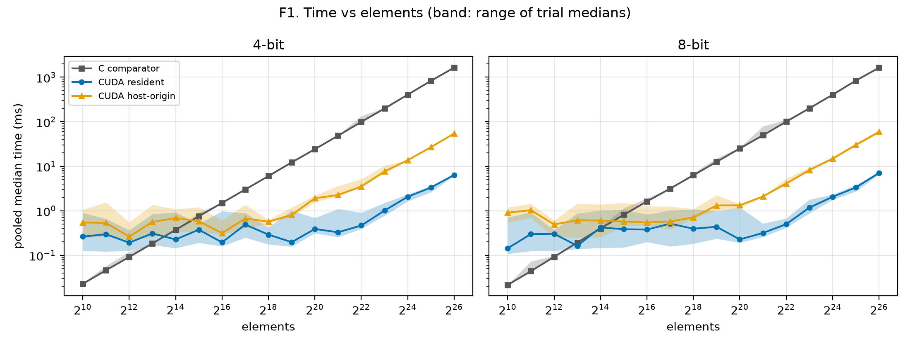
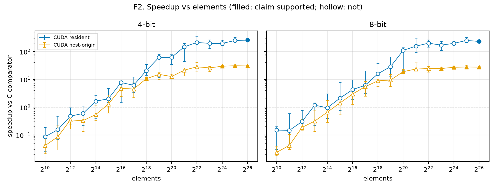
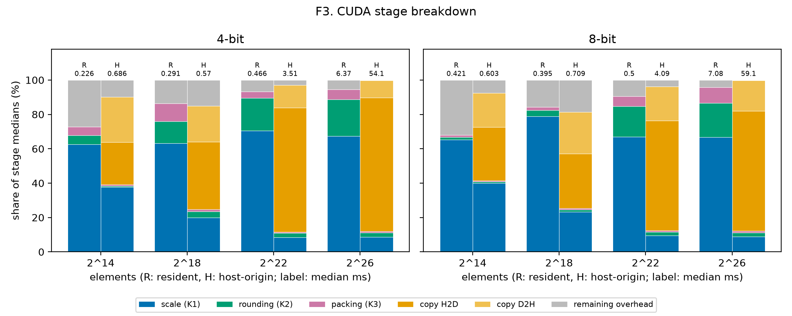

# Size sweep report (2026-09-25-674bd5b)

Generated by `bench_report.py` from snapshot revision `674bd5b`, 102 cases, all passed: True.

## Crossover

- CUDA resident, 4-bit: not resolved (largest supported slower size: none; smallest supported faster size: 2^26).
- CUDA host-origin, 4-bit: not resolved (largest supported slower size: none; smallest supported faster size: 2^18).
- CUDA resident, 8-bit: not resolved (largest supported slower size: none; smallest supported faster size: 2^26).
- CUDA host-origin, 8-bit: not resolved (largest supported slower size: none; smallest supported faster size: 2^20).

## T1. Summary

Times are pooled medians. Speedup is C median over CUDA median, with the trial-median range in brackets. † marks a verdict without claim support.

| Elements | Bits | C (ms) | Resident (ms) | Resident speedup | Host-origin (ms) | Host-origin speedup |
|---|---|---|---|---|---|---|
| 2^10 | 4 | 0.0228 | 0.2624 | 0.0869× [0.0252, 0.19] slower † | 0.5464 | 0.0417× [0.0214, 0.0988] slower † |
| 2^10 | 8 | 0.0216 | 0.1436 | 0.15× [0.0303, 0.201] slower † | 0.9066 | 0.0238× [0.0182, 0.0399] slower † |
| 2^11 | 4 | 0.046 | 0.2964 | 0.155× [0.0692, 0.475] slower † | 0.5327 | 0.0864× [0.0295, 0.213] slower † |
| 2^11 | 8 | 0.0438 | 0.2989 | 0.147× [0.0471, 0.586] slower † | 1.03 | 0.0425× [0.0304, 0.105] slower † |
| 2^12 | 4 | 0.0914 | 0.1919 | 0.476× [0.249, 0.951] slower † | 0.2624 | 0.348× [0.166, 0.539] slower † |
| 2^12 | 8 | 0.0922 | 0.304 | 0.303× [0.252, 0.77] slower † | 0.4925 | 0.187× [0.151, 0.371] slower † |
| 2^13 | 4 | 0.1848 | 0.3099 | 0.596× [0.219, 1.1] inconclusive † | 0.5612 | 0.329× [0.135, 0.73] slower † |
| 2^13 | 8 | 0.1931 | 0.1634 | 1.18× [0.221, 1.44] inconclusive † | 0.6118 | 0.316× [0.134, 0.797] slower † |
| 2^14 | 4 | 0.373 | 0.2263 | 1.65× [0.403, 2.58] inconclusive † | 0.6865 | 0.543× [0.343, 1.13] inconclusive † |
| 2^14 | 8 | 0.4006 | 0.4213 | 0.951× [0.392, 3.02] inconclusive † | 0.6026 | 0.665× [0.288, 1.73] inconclusive † |
| 2^15 | 4 | 0.7506 | 0.3752 | 2× [1.46, 4.83] faster † | 0.5817 | 1.29× [0.619, 2.74] inconclusive † |
| 2^15 | 8 | 0.8117 | 0.3848 | 2.11× [0.764, 7.66] inconclusive † | 0.5723 | 1.42× [0.539, 2.55] inconclusive † |
| 2^16 | 4 | 1.5 | 0.1948 | 7.7× [1.52, 9.54] faster † | 0.3162 | 4.74× [2.48, 5.28] faster † |
| 2^16 | 8 | 1.621 | 0.3782 | 4.29× [1.94, 9.59] faster † | 0.5458 | 2.97× [1.28, 4.03] faster † |
| 2^17 | 4 | 3.002 | 0.4887 | 6.14× [3.36, 12.1] faster † | 0.6674 | 4.5× [2.18, 7.5] faster † |
| 2^17 | 8 | 3.15 | 0.5131 | 6.14× [3.08, 20.2] faster † | 0.5742 | 5.49× [2.51, 8.43] faster † |
| 2^18 | 4 | 6.017 | 0.2914 | 20.6× [14.1, 34.7] faster † | 0.5701 | 10.6× [9.62, 11.9] faster |
| 2^18 | 8 | 6.274 | 0.3951 | 15.9× [5.77, 38.4] faster † | 0.7094 | 8.85× [5.65, 10.3] faster † |
| 2^19 | 4 | 12.19 | 0.1972 | 61.8× [12.1, 80.8] faster † | 0.8053 | 15.1× [10.2, 17.5] faster † |
| 2^19 | 8 | 12.53 | 0.4359 | 28.8× [12.5, 64] faster † | 1.319 | 9.5× [5.5, 15] faster † |
| 2^20 | 4 | 24.18 | 0.3901 | 62× [34.7, 77.8] faster † | 1.913 | 12.6× [10.9, 15.5] faster † |
| 2^20 | 8 | 25.06 | 0.2273 | 110× [20.6, 138] faster † | 1.325 | 18.9× [17.3, 22.9] faster |
| 2^21 | 4 | 48.54 | 0.3285 | 148× [43.8, 196] faster † | 2.26 | 21.5× [13.4, 23.8] faster † |
| 2^21 | 8 | 49.52 | 0.3168 | 156× [94.4, 305] faster † | 2.104 | 23.5× [22.5, 39.4] faster † |
| 2^22 | 4 | 99.15 | 0.4664 | 213× [107, 342] faster † | 3.51 | 28.2× [18.7, 40.1] faster † |
| 2^22 | 8 | 100 | 0.5001 | 200× [145, 265] faster † | 4.092 | 24.4× [18.6, 29.2] faster † |
| 2^23 | 4 | 197.8 | 1.01 | 196× [129, 262] faster † | 7.639 | 25.9× [19, 29.2] faster † |
| 2^23 | 8 | 200.4 | 1.178 | 170× [111, 235] faster † | 8.181 | 24.5× [21, 26.2] faster |
| 2^24 | 4 | 404.8 | 2.064 | 196× [170, 257] faster † | 13.65 | 29.7× [28.5, 31.5] faster |
| 2^24 | 8 | 404.3 | 2.054 | 197× [172, 232] faster † | 14.87 | 27.2× [25.8, 29.6] faster |
| 2^25 | 4 | 828.7 | 3.326 | 249× [226, 325] faster † | 26.89 | 30.8× [29.1, 33.1] faster |
| 2^25 | 8 | 838.9 | 3.338 | 251× [213, 319] faster † | 29.99 | 28× [24.2, 30.8] faster |
| 2^26 | 4 | 1639 | 6.374 | 257× [240, 275] faster | 54.12 | 30.3× [29.7, 31.9] faster |
| 2^26 | 8 | 1630 | 7.076 | 230× [217, 252] faster | 59.06 | 27.6× [25.3, 29.8] faster |

## Figures

- 
- 
- 
