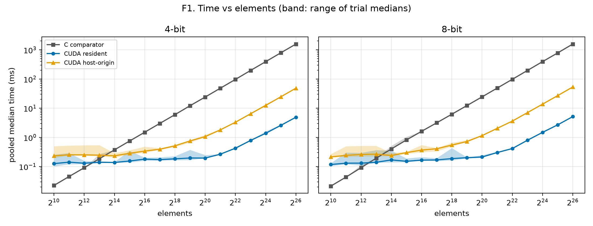
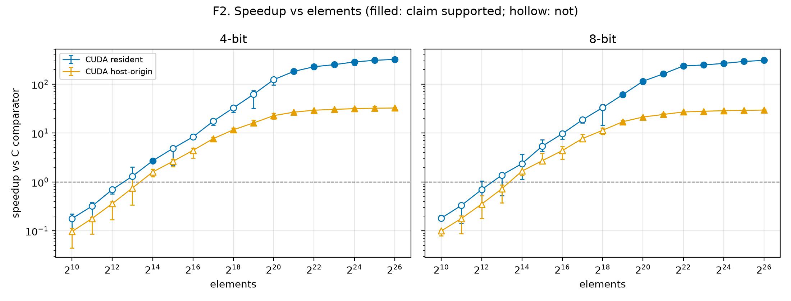
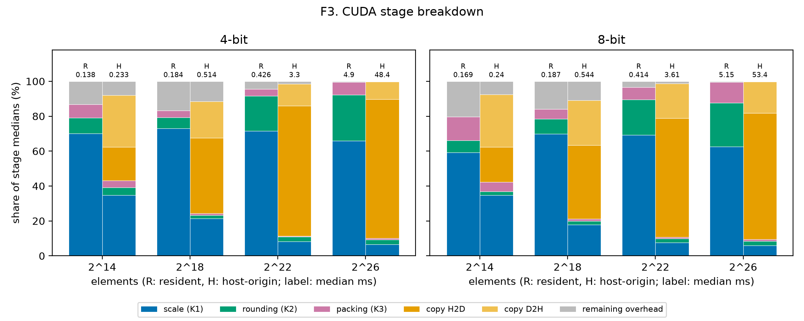

# Size sweep report (2026-09-26-2c190af)

Generated by `bench_report.py` from snapshot revision `2c190af`, 102 cases, all passed: True.

## Crossover

- CUDA resident, 4-bit: not resolved (largest supported slower size: none; smallest supported faster size: 2^14).
- CUDA host-origin, 4-bit: not resolved (largest supported slower size: none; smallest supported faster size: 2^17).
- CUDA resident, 8-bit: not resolved (largest supported slower size: none; smallest supported faster size: 2^19).
- CUDA host-origin, 8-bit: not resolved (largest supported slower size: none; smallest supported faster size: 2^19).

## T1. Summary

Times are pooled medians. Speedup is C median over CUDA median, with the trial-median range in brackets. † marks a verdict without claim support.

| Elements | Bits | C (ms) | Resident (ms) | Resident speedup | Host-origin (ms) | Host-origin speedup |
|---|---|---|---|---|---|---|
| 2^10 | 4 | 0.0225 | 0.1261 | 0.178× [0.0873, 0.224] slower † | 0.2326 | 0.0967× [0.045, 0.114] slower † |
| 2^10 | 8 | 0.0214 | 0.1175 | 0.182× [0.164, 0.208] slower † | 0.214 | 0.1× [0.0799, 0.104] slower † |
| 2^11 | 4 | 0.0455 | 0.1414 | 0.322× [0.156, 0.379] slower † | 0.2531 | 0.18× [0.0869, 0.192] slower † |
| 2^11 | 8 | 0.0434 | 0.1305 | 0.333× [0.144, 0.36] slower † | 0.242 | 0.179× [0.0872, 0.203] slower † |
| 2^12 | 4 | 0.091 | 0.13 | 0.7× [0.573, 0.755] slower † | 0.2518 | 0.361× [0.169, 0.391] slower † |
| 2^12 | 8 | 0.0915 | 0.131 | 0.698× [0.309, 1.06] inconclusive † | 0.2591 | 0.353× [0.178, 0.523] slower † |
| 2^13 | 4 | 0.185 | 0.1411 | 1.31× [1.26, 2.04] faster † | 0.2455 | 0.754× [0.34, 1.18] inconclusive † |
| 2^13 | 8 | 0.1932 | 0.14 | 1.38× [0.525, 1.45] inconclusive † | 0.2661 | 0.726× [0.377, 0.876] slower † |
| 2^14 | 4 | 0.3725 | 0.1379 | 2.7× [2.57, 2.76] faster | 0.2334 | 1.6× [1.29, 1.83] faster † |
| 2^14 | 8 | 0.3999 | 0.1687 | 2.37× [1.14, 3.67] faster † | 0.2397 | 1.67× [1.36, 2.27] faster † |
| 2^15 | 4 | 0.7488 | 0.1547 | 4.84× [2.15, 5.4] faster † | 0.2847 | 2.63× [2.06, 2.93] faster † |
| 2^15 | 8 | 0.8151 | 0.1516 | 5.38× [4.26, 7.32] faster † | 0.3004 | 2.71× [2.53, 3.82] faster † |
| 2^16 | 4 | 1.497 | 0.1795 | 8.34× [7.39, 9.48] faster † | 0.3388 | 4.42× [3.1, 4.98] faster † |
| 2^16 | 8 | 1.61 | 0.1659 | 9.7× [7.6, 10.2] faster † | 0.3667 | 4.39× [2.94, 5.26] faster † |
| 2^17 | 4 | 3.004 | 0.1725 | 17.4× [14.5, 19.1] faster † | 0.3918 | 7.67× [7.01, 8.23] faster |
| 2^17 | 8 | 3.149 | 0.1687 | 18.7× [16.2, 20.6] faster † | 0.4079 | 7.72× [7.32, 9.43] faster † |
| 2^18 | 4 | 5.995 | 0.1838 | 32.6× [26.4, 36.6] faster † | 0.5145 | 11.7× [11.1, 12.8] faster |
| 2^18 | 8 | 6.205 | 0.187 | 33.2× [14.4, 38.2] faster † | 0.5444 | 11.4× [9.46, 12.8] faster † |
| 2^19 | 4 | 12.15 | 0.1963 | 61.9× [32.2, 73.3] faster † | 0.7551 | 16.1× [15, 18.5] faster |
| 2^19 | 8 | 12.29 | 0.2012 | 61.1× [59.1, 66] faster | 0.7204 | 17.1× [15.2, 18] faster |
| 2^20 | 4 | 24.08 | 0.1952 | 123× [96.6, 133] faster † | 1.061 | 22.7× [19.5, 25.5] faster |
| 2^20 | 8 | 24.4 | 0.2126 | 115× [99.3, 122] faster | 1.148 | 21.3× [20, 21.8] faster |
| 2^21 | 4 | 48.24 | 0.2648 | 182× [179, 185] faster | 1.806 | 26.7× [25.2, 27] faster |
| 2^21 | 8 | 48.76 | 0.3017 | 162× [151, 165] faster | 2.035 | 24× [23, 25.2] faster |
| 2^22 | 4 | 96.69 | 0.426 | 227× [219, 238] faster | 3.3 | 29.3× [28.1, 29.7] faster |
| 2^22 | 8 | 97.45 | 0.4142 | 235× [225, 239] faster | 3.61 | 27× [26.7, 27.3] faster |
| 2^23 | 4 | 195.9 | 0.7836 | 250× [242, 263] faster | 6.428 | 30.5× [29.4, 31] faster |
| 2^23 | 8 | 195.9 | 0.7963 | 246× [240, 247] faster | 7.037 | 27.8× [27.5, 28.3] faster |
| 2^24 | 4 | 392.1 | 1.379 | 284× [242, 294] faster | 12.44 | 31.5× [27.6, 32.5] faster |
| 2^24 | 8 | 393.7 | 1.483 | 265× [256, 270] faster | 13.75 | 28.6× [28.1, 28.9] faster |
| 2^25 | 4 | 788.1 | 2.572 | 306× [282, 335] faster | 24.49 | 32.2× [31.9, 35] faster |
| 2^25 | 8 | 781.3 | 2.686 | 291× [285, 299] faster | 26.92 | 29× [28.4, 29.5] faster |
| 2^26 | 4 | 1573 | 4.901 | 321× [315, 326] faster | 48.43 | 32.5× [31.9, 33.1] faster |
| 2^26 | 8 | 1577 | 5.153 | 306× [300, 310] faster | 53.41 | 29.5× [29.1, 30] faster |

## Figures

- 
- 
- 
