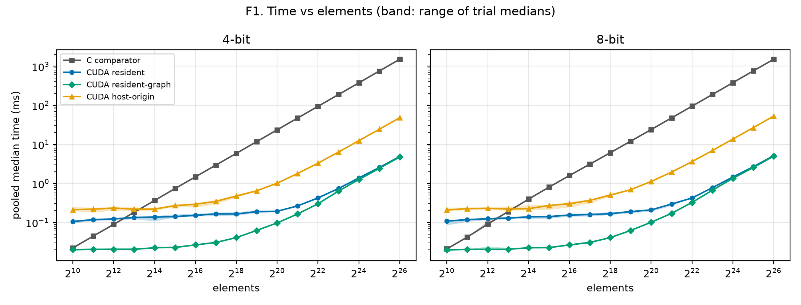
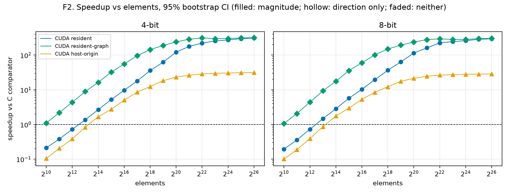
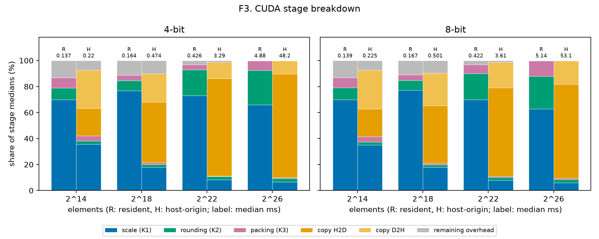
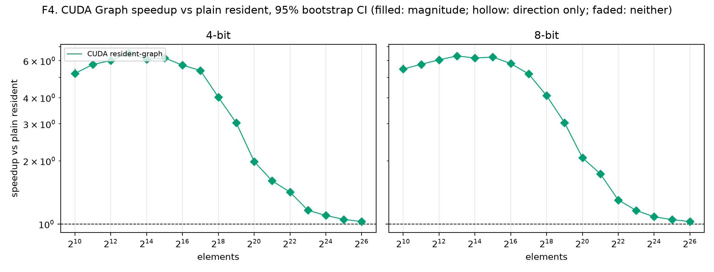

# Size sweep report (2026-09-26-a1d2439)

Generated by `bench_report.py` from snapshot revision `a1d2439`, 136 cases, all passed: True.

## Crossover

Located from the direction claim on both sides of the flip.

- CUDA resident, 4-bit: resolved between 2^12 and 2^13 elements (slower to faster).
- CUDA resident-graph, 4-bit: not resolved (largest supported slower size: none; smallest supported faster size: 2^10).
- CUDA host-origin, 4-bit: resolved between 2^13 and 2^14 elements (slower to faster).
- CUDA resident, 8-bit: resolved between 2^12 and 2^13 elements (slower to faster).
- CUDA resident-graph, 8-bit: not resolved (largest supported slower size: none; smallest supported faster size: 2^10).
- CUDA host-origin, 8-bit: resolved between 2^13 and 2^14 elements (slower to faster).

### Revision 2 crossover

Located from the unchanged revision 2 claim, for comparison.

- CUDA resident, 4-bit: resolved between 2^12 and 2^13 elements (slower to faster).
- CUDA resident-graph, 4-bit: not resolved (largest supported slower size: none; smallest supported faster size: 2^10).
- CUDA host-origin, 4-bit: resolved between 2^13 and 2^14 elements (slower to faster).
- CUDA resident, 8-bit: resolved between 2^12 and 2^13 elements (slower to faster).
- CUDA resident-graph, 8-bit: not resolved (largest supported slower size: none; smallest supported faster size: 2^10).
- CUDA host-origin, 8-bit: not resolved (largest supported slower size: 2^12; smallest supported faster size: 2^18).

## T1. Summary

Times are pooled medians. Speedup is C median over CUDA median. The trial range decides the verdict; the 95% CI is the bootstrap interval over trial medians, so a speedup can lie outside its CI. Direction, magnitude and revision 2 are the claim rules recorded in the manifest; — marks a field the snapshot predates.

| Elements | Bits | Path | C (ms) | CUDA (ms) | Speedup | Trial range | 95% CI | Verdict | Direction | Magnitude | Rev 2 |
|---|---|---|---|---|---|---|---|---|---|---|---|
| 2^10 | 4 | CUDA resident | 0.0222 | 0.1054 | 0.211× | [0.191, 0.236] | [0.203, 0.215] | slower | yes | yes | yes |
| 2^10 | 4 | CUDA resident-graph | 0.0222 | 0.0202 | 1.1× | [1.08, 1.22] | [1.08, 1.13] | faster | yes | yes | yes |
| 2^10 | 4 | CUDA host-origin | 0.0222 | 0.2121 | 0.105× | [0.0888, 0.112] | [0.0959, 0.107] | slower | yes | yes | yes |
| 2^10 | 8 | CUDA resident | 0.021 | 0.1081 | 0.194× | [0.176, 0.25] | [0.189, 0.2] | slower | yes | yes | no |
| 2^10 | 8 | CUDA resident-graph | 0.021 | 0.01975 | 1.06× | [1.02, 1.15] | [1.04, 1.1] | faster | yes | yes | yes |
| 2^10 | 8 | CUDA host-origin | 0.021 | 0.2084 | 0.101× | [0.0863, 0.109] | [0.0988, 0.102] | slower | yes | yes | yes |
| 2^11 | 4 | CUDA resident | 0.0448 | 0.118 | 0.38× | [0.358, 0.409] | [0.374, 0.385] | slower | yes | yes | yes |
| 2^11 | 4 | CUDA resident-graph | 0.0448 | 0.0205 | 2.19× | [2.18, 2.22] | [2.18, 2.18] | faster | yes | yes | yes |
| 2^11 | 4 | CUDA host-origin | 0.0448 | 0.219 | 0.205× | [0.185, 0.253] | [0.193, 0.209] | slower | yes | yes | no |
| 2^11 | 8 | CUDA resident | 0.0423 | 0.1182 | 0.358× | [0.345, 0.409] | [0.353, 0.364] | slower | yes | yes | yes |
| 2^11 | 8 | CUDA resident-graph | 0.0423 | 0.0205 | 2.06× | [2.06, 2.1] | [2.06, 2.07] | faster | yes | yes | yes |
| 2^11 | 8 | CUDA host-origin | 0.0423 | 0.2258 | 0.187× | [0.174, 0.206] | [0.179, 0.194] | slower | yes | yes | yes |
| 2^12 | 4 | CUDA resident | 0.0894 | 0.1232 | 0.726× | [0.699, 0.79] | [0.723, 0.743] | slower | yes | yes | yes |
| 2^12 | 4 | CUDA resident-graph | 0.0894 | 0.0205 | 4.36× | [3.97, 4.44] | [4.36, 4.36] | faster | yes | yes | yes |
| 2^12 | 4 | CUDA host-origin | 0.0894 | 0.2336 | 0.383× | [0.358, 0.442] | [0.372, 0.392] | slower | yes | yes | yes |
| 2^12 | 8 | CUDA resident | 0.0902 | 0.1242 | 0.726× | [0.69, 0.952] | [0.717, 0.749] | slower | yes | yes | yes |
| 2^12 | 8 | CUDA resident-graph | 0.0902 | 0.0205 | 4.4× | [3.66, 5.42] | [4.37, 4.43] | faster | yes | yes | yes |
| 2^12 | 8 | CUDA host-origin | 0.0902 | 0.2298 | 0.392× | [0.357, 0.533] | [0.381, 0.41] | slower | yes | yes | yes |
| 2^13 | 4 | CUDA resident | 0.1816 | 0.1336 | 1.36× | [1.26, 1.5] | [1.34, 1.39] | faster | yes | yes | yes |
| 2^13 | 4 | CUDA resident-graph | 0.1816 | 0.0205 | 8.86× | [8.06, 8.97] | [8.73, 8.85] | faster | yes | yes | yes |
| 2^13 | 4 | CUDA host-origin | 0.1816 | 0.2185 | 0.831× | [0.744, 0.942] | [0.813, 0.893] | slower | yes | yes | yes |
| 2^13 | 8 | CUDA resident | 0.1902 | 0.1296 | 1.47× | [1.34, 1.59] | [1.46, 1.49] | faster | yes | yes | yes |
| 2^13 | 8 | CUDA resident-graph | 0.1902 | 0.0205 | 9.28× | [8.46, 9.42] | [9.27, 9.28] | faster | yes | yes | yes |
| 2^13 | 8 | CUDA host-origin | 0.1902 | 0.2213 | 0.86× | [0.742, 0.944] | [0.855, 0.881] | slower | yes | yes | no |
| 2^14 | 4 | CUDA resident | 0.366 | 0.137 | 2.67× | [2.48, 3.37] | [2.63, 2.71] | faster | yes | yes | no |
| 2^14 | 4 | CUDA resident-graph | 0.366 | 0.0225 | 16.3× | [16.3, 16.3] | [16.3, 16.3] | faster | yes | yes | yes |
| 2^14 | 4 | CUDA host-origin | 0.366 | 0.2198 | 1.66× | [1.54, 1.8] | [1.64, 1.75] | faster | yes | yes | yes |
| 2^14 | 8 | CUDA resident | 0.3949 | 0.1391 | 2.84× | [2.78, 3.17] | [2.82, 2.86] | faster | yes | yes | yes |
| 2^14 | 8 | CUDA resident-graph | 0.3949 | 0.0225 | 17.6× | [17.5, 17.8] | [17.5, 17.5] | faster | yes | yes | yes |
| 2^14 | 8 | CUDA host-origin | 0.3949 | 0.2254 | 1.75× | [1.41, 1.95] | [1.72, 1.86] | faster | yes | yes | no |
| 2^15 | 4 | CUDA resident | 0.7354 | 0.1414 | 5.2× | [4.58, 5.52] | [5.14, 5.28] | faster | yes | yes | yes |
| 2^15 | 4 | CUDA resident-graph | 0.7354 | 0.02285 | 32.2× | [30, 33.1] | [31.3, 32.5] | faster | yes | yes | yes |
| 2^15 | 4 | CUDA host-origin | 0.7354 | 0.2698 | 2.73× | [2.56, 2.96] | [2.67, 2.78] | faster | yes | yes | yes |
| 2^15 | 8 | CUDA resident | 0.8023 | 0.1411 | 5.68× | [5.44, 6.47] | [5.62, 5.71] | faster | yes | yes | yes |
| 2^15 | 8 | CUDA resident-graph | 0.8023 | 0.0226 | 35.5× | [32.7, 36.1] | [34.9, 35.5] | faster | yes | yes | yes |
| 2^15 | 8 | CUDA host-origin | 0.8023 | 0.2723 | 2.95× | [2.8, 3.81] | [2.88, 2.98] | faster | yes | yes | no |
| 2^16 | 4 | CUDA resident | 1.471 | 0.152 | 9.68× | [8.75, 10.4] | [9.39, 9.87] | faster | yes | yes | yes |
| 2^16 | 4 | CUDA resident-graph | 1.471 | 0.0266 | 55.3× | [53.2, 56] | [55.3, 55.9] | faster | yes | yes | yes |
| 2^16 | 4 | CUDA host-origin | 1.471 | 0.2922 | 5.03× | [4.62, 6.16] | [4.78, 5.14] | faster | yes | yes | no |
| 2^16 | 8 | CUDA resident | 1.592 | 0.1547 | 10.3× | [9.6, 11.3] | [10, 10.5] | faster | yes | yes | yes |
| 2^16 | 8 | CUDA resident-graph | 1.592 | 0.0266 | 59.9× | [57.6, 60.5] | [59.8, 60.4] | faster | yes | yes | yes |
| 2^16 | 8 | CUDA host-origin | 1.592 | 0.301 | 5.29× | [4.72, 6.53] | [5.13, 5.38] | faster | yes | yes | no |
| 2^17 | 4 | CUDA resident | 2.942 | 0.1654 | 17.8× | [16.3, 20] | [17.4, 18.3] | faster | yes | yes | yes |
| 2^17 | 4 | CUDA resident-graph | 2.942 | 0.0307 | 95.8× | [91.1, 97.3] | [95.8, 96] | faster | yes | yes | yes |
| 2^17 | 4 | CUDA host-origin | 2.942 | 0.3455 | 8.51× | [7.77, 10.1] | [8.09, 9.06] | faster | yes | yes | no |
| 2^17 | 8 | CUDA resident | 3.107 | 0.1592 | 19.5× | [17.8, 21.9] | [18.9, 20.2] | faster | yes | yes | yes |
| 2^17 | 8 | CUDA resident-graph | 3.107 | 0.0307 | 101× | [92.6, 102] | [101, 101] | faster | yes | yes | yes |
| 2^17 | 8 | CUDA host-origin | 3.107 | 0.3679 | 8.45× | [7.96, 10.3] | [8.21, 8.73] | faster | yes | yes | no |
| 2^18 | 4 | CUDA resident | 5.881 | 0.1644 | 35.8× | [32.1, 39.1] | [35.1, 36.7] | faster | yes | yes | yes |
| 2^18 | 4 | CUDA resident-graph | 5.881 | 0.0409 | 144× | [143, 149] | [144, 144] | faster | yes | yes | yes |
| 2^18 | 4 | CUDA host-origin | 5.881 | 0.4744 | 12.4× | [11.3, 13.7] | [12.1, 12.6] | faster | yes | yes | yes |
| 2^18 | 8 | CUDA resident | 6.113 | 0.1673 | 36.5× | [33.3, 39.3] | [35.7, 37.2] | faster | yes | yes | yes |
| 2^18 | 8 | CUDA resident-graph | 6.113 | 0.0409 | 149× | [149, 151] | [149, 150] | faster | yes | yes | yes |
| 2^18 | 8 | CUDA host-origin | 6.113 | 0.501 | 12.2× | [11.2, 13.1] | [11.9, 12.5] | faster | yes | yes | yes |
| 2^19 | 4 | CUDA resident | 11.77 | 0.1894 | 62.1× | [57.2, 68.6] | [60.3, 64.4] | faster | yes | yes | yes |
| 2^19 | 4 | CUDA resident-graph | 11.77 | 0.0624 | 189× | [188, 191] | [188, 189] | faster | yes | yes | yes |
| 2^19 | 4 | CUDA host-origin | 11.77 | 0.6458 | 18.2× | [17.3, 19.2] | [18, 18.4] | faster | yes | yes | yes |
| 2^19 | 8 | CUDA resident | 12.08 | 0.1898 | 63.7× | [60.5, 70.6] | [62.1, 64.5] | faster | yes | yes | yes |
| 2^19 | 8 | CUDA resident-graph | 12.08 | 0.0624 | 194× | [193, 197] | [194, 194] | faster | yes | yes | yes |
| 2^19 | 8 | CUDA host-origin | 12.08 | 0.6898 | 17.5× | [17.1, 18.3] | [17.4, 17.7] | faster | yes | yes | yes |
| 2^20 | 4 | CUDA resident | 23.5 | 0.1932 | 122× | [120, 125] | [121, 122] | faster | yes | yes | yes |
| 2^20 | 4 | CUDA resident-graph | 23.5 | 0.0973 | 242× | [241, 242] | [241, 242] | faster | yes | yes | yes |
| 2^20 | 4 | CUDA host-origin | 23.5 | 1.013 | 23.2× | [22.9, 23.3] | [23.1, 23.2] | faster | yes | yes | yes |
| 2^20 | 8 | CUDA resident | 23.97 | 0.2096 | 114× | [108, 125] | [113, 116] | faster | yes | yes | yes |
| 2^20 | 8 | CUDA resident-graph | 23.97 | 0.1013 | 237× | [236, 237] | [237, 237] | faster | yes | yes | yes |
| 2^20 | 8 | CUDA host-origin | 23.97 | 1.124 | 21.3× | [20.9, 21.6] | [21.2, 21.4] | faster | yes | yes | yes |
| 2^21 | 4 | CUDA resident | 47.03 | 0.2646 | 178× | [172, 183] | [177, 179] | faster | yes | yes | yes |
| 2^21 | 4 | CUDA resident-graph | 47.03 | 0.1648 | 285× | [285, 287] | [285, 285] | faster | yes | yes | yes |
| 2^21 | 4 | CUDA host-origin | 47.03 | 1.794 | 26.2× | [25.6, 26.5] | [26.2, 26.2] | faster | yes | yes | yes |
| 2^21 | 8 | CUDA resident | 47.69 | 0.2964 | 161× | [155, 177] | [160, 163] | faster | yes | yes | yes |
| 2^21 | 8 | CUDA resident-graph | 47.69 | 0.171 | 279× | [279, 279] | [279, 279] | faster | yes | yes | yes |
| 2^21 | 8 | CUDA host-origin | 47.69 | 1.944 | 24.5× | [22.4, 24.7] | [24.5, 24.6] | faster | yes | yes | yes |
| 2^22 | 4 | CUDA resident | 94.12 | 0.4256 | 221× | [219, 235] | [221, 221] | faster | yes | yes | yes |
| 2^22 | 4 | CUDA resident-graph | 94.12 | 0.3 | 314× | [313, 314] | [314, 314] | faster | yes | yes | yes |
| 2^22 | 4 | CUDA host-origin | 94.12 | 3.289 | 28.6× | [28, 28.9] | [28.5, 28.7] | faster | yes | yes | yes |
| 2^22 | 8 | CUDA resident | 95.08 | 0.4224 | 225× | [223, 227] | [225, 226] | faster | yes | yes | yes |
| 2^22 | 8 | CUDA resident-graph | 95.08 | 0.3246 | 293× | [293, 293] | [293, 293] | faster | yes | yes | yes |
| 2^22 | 8 | CUDA host-origin | 95.08 | 3.605 | 26.4× | [25.2, 26.5] | [26.4, 26.4] | faster | yes | yes | yes |
| 2^23 | 4 | CUDA resident | 188.3 | 0.7388 | 255× | [253, 256] | [255, 255] | faster | yes | yes | yes |
| 2^23 | 4 | CUDA resident-graph | 188.3 | 0.6358 | 296× | [296, 298] | [296, 297] | faster | yes | yes | yes |
| 2^23 | 4 | CUDA host-origin | 188.3 | 6.34 | 29.7× | [28.9, 29.9] | [29.7, 29.8] | faster | yes | yes | yes |
| 2^23 | 8 | CUDA resident | 189.6 | 0.7779 | 244× | [238, 246] | [239, 245] | faster | yes | yes | yes |
| 2^23 | 8 | CUDA resident-graph | 189.6 | 0.6707 | 283× | [281, 283] | [282, 283] | faster | yes | yes | yes |
| 2^23 | 8 | CUDA host-origin | 189.6 | 6.962 | 27.2× | [27, 27.3] | [27.1, 27.2] | faster | yes | yes | yes |
| 2^24 | 4 | CUDA resident | 376.5 | 1.38 | 273× | [271, 277] | [273, 273] | faster | yes | yes | yes |
| 2^24 | 4 | CUDA resident-graph | 376.5 | 1.256 | 300× | [299, 301] | [299, 300] | faster | yes | yes | yes |
| 2^24 | 4 | CUDA host-origin | 376.5 | 12.39 | 30.4× | [30.2, 30.6] | [30.3, 30.4] | faster | yes | yes | yes |
| 2^24 | 8 | CUDA resident | 379.7 | 1.46 | 260× | [258, 263] | [259, 261] | faster | yes | yes | yes |
| 2^24 | 8 | CUDA resident-graph | 379.7 | 1.349 | 282× | [281, 283] | [281, 282] | faster | yes | yes | yes |
| 2^24 | 8 | CUDA host-origin | 379.7 | 13.65 | 27.8× | [27.7, 28] | [27.8, 27.9] | faster | yes | yes | yes |
| 2^25 | 4 | CUDA resident | 755.2 | 2.55 | 296× | [295, 299] | [296, 296] | faster | yes | yes | yes |
| 2^25 | 4 | CUDA resident-graph | 755.2 | 2.425 | 311× | [311, 312] | [311, 312] | faster | yes | yes | yes |
| 2^25 | 4 | CUDA host-origin | 755.2 | 24.34 | 31× | [30.9, 31.2] | [31, 31.1] | faster | yes | yes | yes |
| 2^25 | 8 | CUDA resident | 758.8 | 2.673 | 284× | [282, 287] | [284, 284] | faster | yes | yes | yes |
| 2^25 | 8 | CUDA resident-graph | 758.8 | 2.548 | 298× | [297, 299] | [298, 298] | faster | yes | yes | yes |
| 2^25 | 8 | CUDA host-origin | 758.8 | 26.81 | 28.3× | [28.2, 28.4] | [28.3, 28.3] | faster | yes | yes | yes |
| 2^26 | 4 | CUDA resident | 1507 | 4.88 | 309× | [308, 310] | [309, 309] | faster | yes | yes | yes |
| 2^26 | 4 | CUDA resident-graph | 1507 | 4.751 | 317× | [316, 319] | [317, 317] | faster | yes | yes | yes |
| 2^26 | 4 | CUDA host-origin | 1507 | 48.18 | 31.3× | [31.2, 31.4] | [31.3, 31.3] | faster | yes | yes | yes |
| 2^26 | 8 | CUDA resident | 1513 | 5.136 | 295× | [294, 296] | [294, 295] | faster | yes | yes | yes |
| 2^26 | 8 | CUDA resident-graph | 1513 | 5.003 | 302× | [302, 304] | [302, 303] | faster | yes | yes | yes |
| 2^26 | 8 | CUDA host-origin | 1513 | 53.14 | 28.5× | [28.4, 28.5] | [28.5, 28.5] | faster | yes | yes | yes |

## Figures

- 
- 
- 
- 
