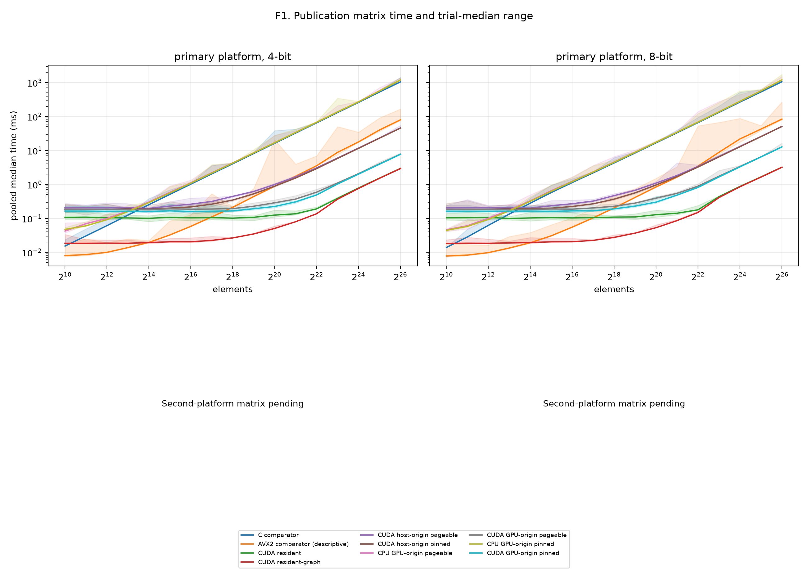
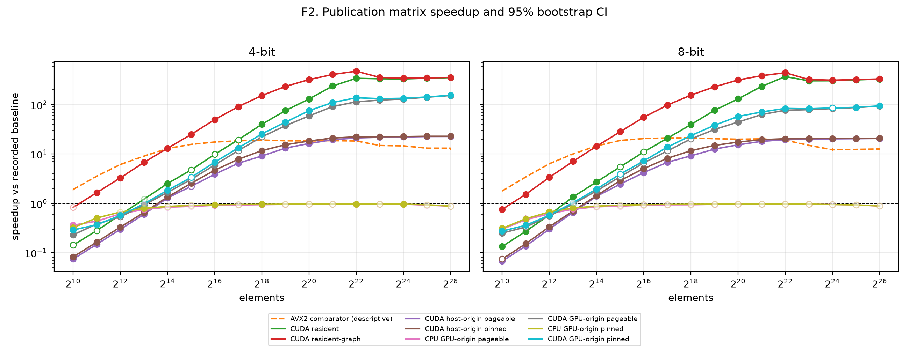
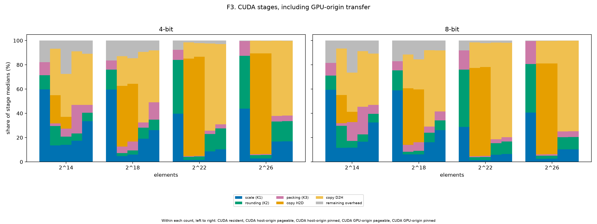
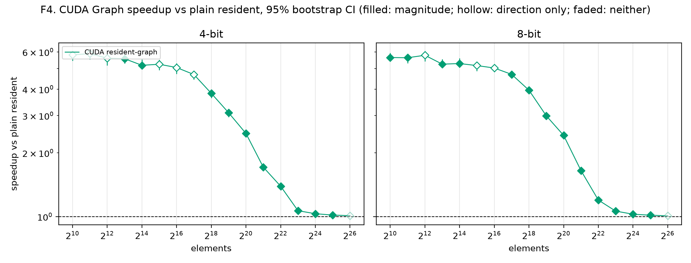
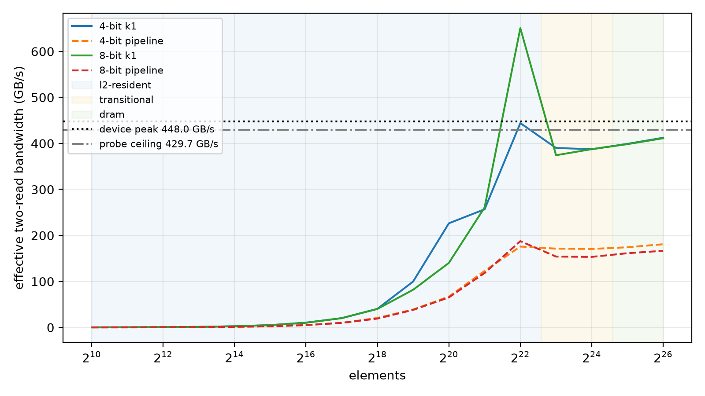

# Publication matrix report (dense)

Revision `ec31947`; 340 cases; all passed: True.

## Input family

| Family | Inputs | Cells | Distinct counts |
|---|---:|---:|---:|
| dense | 17 | 340 | 17 |

### Input provenance

| Input | Elements | Source detail |
|---|---:|---|
| n1024 | 1024 | numpy.random.default_rng([count, seed]) |
| n1048576 | 1048576 | numpy.random.default_rng([count, seed]) |
| n131072 | 131072 | numpy.random.default_rng([count, seed]) |
| n16384 | 16384 | numpy.random.default_rng([count, seed]) |
| n16777216 | 16777216 | numpy.random.default_rng([count, seed]) |
| n2048 | 2048 | numpy.random.default_rng([count, seed]) |
| n2097152 | 2097152 | numpy.random.default_rng([count, seed]) |
| n262144 | 262144 | numpy.random.default_rng([count, seed]) |
| n32768 | 32768 | numpy.random.default_rng([count, seed]) |
| n33554432 | 33554432 | numpy.random.default_rng([count, seed]) |
| n4096 | 4096 | numpy.random.default_rng([count, seed]) |
| n4194304 | 4194304 | numpy.random.default_rng([count, seed]) |
| n524288 | 524288 | numpy.random.default_rng([count, seed]) |
| n65536 | 65536 | numpy.random.default_rng([count, seed]) |
| n67108864 | 67108864 | numpy.random.default_rng([count, seed]) |
| n8192 | 8192 | numpy.random.default_rng([count, seed]) |
| n8388608 | 8388608 | numpy.random.default_rng([count, seed]) |

## Path comparisons

GPU-origin CUDA uses the policy-matched CPU GPU-origin baseline. Other CUDA paths use the scalar C comparator. AVX2 and cross-boundary GPU-origin comparisons are descriptive.

| Input | Elements | Bits | Path | Policy | Baseline | Median ms | Speedup and CI | Inversion |
|---|---:|---:|---|---|---|---:|---|---|
| n1024 | 1024 | 4 | cpu-avx2-optimized | none | cpu-comparator | 0.008 | 1.91× [1.81, 1.97]; inconclusive; direction=False; magnitude=False | False |
| n1024 | 1024 | 4 | cpu-comparator | none | — | 0.0153 | 1× [1, 1]; comparator; direction=False; magnitude=False | False |
| n1024 | 1024 | 4 | cpu-gpu-origin | pageable | cpu-comparator | 0.0423 | 0.362× [0.364, 0.402]; slower; direction=True; magnitude=True | False |
| n1024 | 1024 | 4 | cpu-gpu-origin-pinned | pinned | cpu-comparator | 0.0474 | 0.323× [0.32, 0.325]; slower; direction=True; magnitude=True | False |
| n1024 | 1024 | 4 | cuda-gpu-origin | pageable | cpu-gpu-origin | 0.1835 | 0.231× [0.208, 0.232]; slower; direction=True; magnitude=True | False |
| n1024 | 1024 | 4 | cuda-gpu-origin-pinned | pinned | cpu-gpu-origin-pinned | 0.1641 | 0.289× [0.284, 0.3]; slower; direction=True; magnitude=True | False |
| n1024 | 1024 | 4 | cuda-host-origin | pageable | cpu-comparator | 0.2058 | 0.0743× [0.0728, 0.076]; slower; direction=True; magnitude=True | False |
| n1024 | 1024 | 4 | cuda-host-origin-pinned | pinned | cpu-comparator | 0.1864 | 0.0821× [0.0819, 0.0834]; slower; direction=True; magnitude=True | False |
| n1024 | 1024 | 4 | cuda-resident | none | cpu-comparator | 0.1074 | 0.142× [0.137, 0.152]; slower; direction=True; magnitude=False | False |
| n1024 | 1024 | 4 | cuda-resident-graph | none | cpu-comparator | 0.0185 | 0.827× [0.828, 0.832]; inconclusive; direction=False; magnitude=False | False |
| n1024 | 1024 | 8 | cpu-avx2-optimized | none | cpu-comparator | 0.0078 | 1.78× [1.77, 1.82]; inconclusive; direction=False; magnitude=False | False |
| n1024 | 1024 | 8 | cpu-comparator | none | — | 0.0139 | 1× [1, 1]; comparator; direction=False; magnitude=False | False |
| n1024 | 1024 | 8 | cpu-gpu-origin | pageable | cpu-comparator | 0.0464 | 0.3× [0.296, 0.317]; slower; direction=True; magnitude=True | False |
| n1024 | 1024 | 8 | cpu-gpu-origin-pinned | pinned | cpu-comparator | 0.0446 | 0.312× [0.31, 0.312]; slower; direction=True; magnitude=True | False |
| n1024 | 1024 | 8 | cuda-gpu-origin | pageable | cpu-gpu-origin | 0.1855 | 0.25× [0.234, 0.257]; slower; direction=True; magnitude=True | False |
| n1024 | 1024 | 8 | cuda-gpu-origin-pinned | pinned | cpu-gpu-origin-pinned | 0.1626 | 0.274× [0.269, 0.282]; slower; direction=True; magnitude=True | False |
| n1024 | 1024 | 8 | cuda-host-origin | pageable | cpu-comparator | 0.2059 | 0.0675× [0.0648, 0.0689]; slower; direction=True; magnitude=True | False |
| n1024 | 1024 | 8 | cuda-host-origin-pinned | pinned | cpu-comparator | 0.1868 | 0.0744× [0.0736, 0.0752]; slower; direction=True; magnitude=False | False |
| n1024 | 1024 | 8 | cuda-resident | none | cpu-comparator | 0.1038 | 0.134× [0.127, 0.139]; slower; direction=True; magnitude=True | False |
| n1024 | 1024 | 8 | cuda-resident-graph | none | cpu-comparator | 0.0184 | 0.755× [0.751, 0.755]; slower; direction=True; magnitude=True | False |
| n1048576 | 1048576 | 4 | cpu-avx2-optimized | none | cpu-comparator | 0.8851 | 18.4× [18.1, 18.6]; inconclusive; direction=False; magnitude=False | False |
| n1048576 | 1048576 | 4 | cpu-comparator | none | — | 16.28 | 1× [1, 1]; comparator; direction=False; magnitude=False | False |
| n1048576 | 1048576 | 4 | cpu-gpu-origin | pageable | cpu-comparator | 17 | 0.958× [0.956, 0.96]; inconclusive; direction=False; magnitude=False | False |
| n1048576 | 1048576 | 4 | cpu-gpu-origin-pinned | pinned | cpu-comparator | 16.92 | 0.962× [0.957, 0.964]; inconclusive; direction=False; magnitude=False | False |
| n1048576 | 1048576 | 4 | cuda-gpu-origin | pageable | cpu-gpu-origin | 0.2884 | 59× [58.5, 59.4]; faster; direction=True; magnitude=True | False |
| n1048576 | 1048576 | 4 | cuda-gpu-origin-pinned | pinned | cpu-gpu-origin-pinned | 0.2243 | 75.4× [72.9, 79.5]; faster; direction=True; magnitude=True | False |
| n1048576 | 1048576 | 4 | cuda-host-origin | pageable | cpu-comparator | 0.9982 | 16.3× [16.3, 16.4]; faster; direction=True; magnitude=True | False |
| n1048576 | 1048576 | 4 | cuda-host-origin-pinned | pinned | cpu-comparator | 0.8891 | 18.3× [18.2, 18.4]; faster; direction=True; magnitude=True | False |
| n1048576 | 1048576 | 4 | cuda-resident | none | cpu-comparator | 0.1252 | 130× [128, 132]; faster; direction=True; magnitude=True | False |
| n1048576 | 1048576 | 4 | cuda-resident-graph | none | cpu-comparator | 0.0507 | 321× [319, 331]; faster; direction=True; magnitude=True | False |
| n1048576 | 1048576 | 8 | cpu-avx2-optimized | none | cpu-comparator | 0.8433 | 19.9× [19.8, 20.1]; faster; direction=False; magnitude=False | False |
| n1048576 | 1048576 | 8 | cpu-comparator | none | — | 16.79 | 1× [1, 1]; comparator; direction=False; magnitude=False | False |
| n1048576 | 1048576 | 8 | cpu-gpu-origin | pageable | cpu-comparator | 17.49 | 0.96× [0.955, 0.968]; inconclusive; direction=False; magnitude=False | False |
| n1048576 | 1048576 | 8 | cpu-gpu-origin-pinned | pinned | cpu-comparator | 17.39 | 0.966× [0.962, 0.973]; inconclusive; direction=False; magnitude=False | False |
| n1048576 | 1048576 | 8 | cuda-gpu-origin | pageable | cpu-gpu-origin | 0.3945 | 44.3× [43.7, 44.8]; faster; direction=True; magnitude=True | False |
| n1048576 | 1048576 | 8 | cuda-gpu-origin-pinned | pinned | cpu-gpu-origin-pinned | 0.3018 | 57.6× [56.5, 59.8]; faster; direction=True; magnitude=True | False |
| n1048576 | 1048576 | 8 | cuda-host-origin | pageable | cpu-comparator | 1.095 | 15.3× [15.2, 15.5]; faster; direction=True; magnitude=True | False |
| n1048576 | 1048576 | 8 | cuda-host-origin-pinned | pinned | cpu-comparator | 0.964 | 17.4× [17.3, 17.5]; faster; direction=True; magnitude=True | False |
| n1048576 | 1048576 | 8 | cuda-resident | none | cpu-comparator | 0.1286 | 131× [130, 133]; faster; direction=True; magnitude=True | False |
| n1048576 | 1048576 | 8 | cuda-resident-graph | none | cpu-comparator | 0.0532 | 316× [314, 318]; faster; direction=True; magnitude=True | False |
| n131072 | 131072 | 4 | cpu-avx2-optimized | none | cpu-comparator | 0.1108 | 18.5× [12.8, 18.7]; faster; direction=False; magnitude=False | False |
| n131072 | 131072 | 4 | cpu-comparator | none | — | 2.047 | 1× [1, 1]; comparator; direction=False; magnitude=False | False |
| n131072 | 131072 | 4 | cpu-gpu-origin | pageable | cpu-comparator | 2.206 | 0.928× [0.918, 0.935]; inconclusive; direction=False; magnitude=False | False |
| n131072 | 131072 | 4 | cpu-gpu-origin-pinned | pinned | cpu-comparator | 2.155 | 0.95× [0.934, 0.957]; inconclusive; direction=False; magnitude=False | False |
| n131072 | 131072 | 4 | cuda-gpu-origin | pageable | cpu-gpu-origin | 0.1886 | 11.7× [11, 12.4]; faster; direction=True; magnitude=False | False |
| n131072 | 131072 | 4 | cuda-gpu-origin-pinned | pinned | cpu-gpu-origin-pinned | 0.1624 | 13.3× [12.8, 13.8]; faster; direction=True; magnitude=True | False |
| n131072 | 131072 | 4 | cuda-host-origin | pageable | cpu-comparator | 0.3156 | 6.49× [6.51, 6.74]; faster; direction=True; magnitude=True | False |
| n131072 | 131072 | 4 | cuda-host-origin-pinned | pinned | cpu-comparator | 0.2623 | 7.8× [7.64, 8.07]; faster; direction=True; magnitude=True | False |
| n131072 | 131072 | 4 | cuda-resident | none | cpu-comparator | 0.1054 | 19.4× [19, 20.5]; faster; direction=True; magnitude=False | False |
| n131072 | 131072 | 4 | cuda-resident-graph | none | cpu-comparator | 0.0225 | 91× [90.5, 91.3]; faster; direction=True; magnitude=True | False |
| n131072 | 131072 | 8 | cpu-avx2-optimized | none | cpu-comparator | 0.1039 | 21.2× [20.9, 21.3]; faster; direction=False; magnitude=False | False |
| n131072 | 131072 | 8 | cpu-comparator | none | — | 2.198 | 1× [1, 1]; comparator; direction=False; magnitude=False | False |
| n131072 | 131072 | 8 | cpu-gpu-origin | pageable | cpu-comparator | 2.349 | 0.936× [0.935, 0.937]; inconclusive; direction=False; magnitude=False | False |
| n131072 | 131072 | 8 | cpu-gpu-origin-pinned | pinned | cpu-comparator | 2.31 | 0.952× [0.95, 0.954]; inconclusive; direction=False; magnitude=False | False |
| n131072 | 131072 | 8 | cuda-gpu-origin | pageable | cpu-gpu-origin | 0.2034 | 11.6× [11.2, 13.2]; faster; direction=True; magnitude=False | False |
| n131072 | 131072 | 8 | cuda-gpu-origin-pinned | pinned | cpu-gpu-origin-pinned | 0.1674 | 13.8× [13.6, 14.1]; faster; direction=True; magnitude=True | False |
| n131072 | 131072 | 8 | cuda-host-origin | pageable | cpu-comparator | 0.3237 | 6.79× [6.76, 6.87]; faster; direction=True; magnitude=True | False |
| n131072 | 131072 | 8 | cuda-host-origin-pinned | pinned | cpu-comparator | 0.269 | 8.17× [8.1, 8.34]; faster; direction=True; magnitude=True | False |
| n131072 | 131072 | 8 | cuda-resident | none | cpu-comparator | 0.1056 | 20.8× [20.5, 21.5]; faster; direction=True; magnitude=True | False |
| n131072 | 131072 | 8 | cuda-resident-graph | none | cpu-comparator | 0.0225 | 97.7× [97.6, 97.7]; faster; direction=True; magnitude=True | False |
| n16384 | 16384 | 4 | cpu-avx2-optimized | none | cpu-comparator | 0.0196 | 12.9× [12.9, 13]; faster; direction=False; magnitude=False | False |
| n16384 | 16384 | 4 | cpu-comparator | none | — | 0.2532 | 1× [1, 1]; comparator; direction=False; magnitude=False | False |
| n16384 | 16384 | 4 | cpu-gpu-origin | pageable | cpu-comparator | 0.3022 | 0.838× [0.837, 0.838]; inconclusive; direction=False; magnitude=False | False |
| n16384 | 16384 | 4 | cpu-gpu-origin-pinned | pinned | cpu-comparator | 0.2925 | 0.866× [0.865, 0.866]; inconclusive; direction=False; magnitude=False | False |
| n16384 | 16384 | 4 | cuda-gpu-origin | pageable | cpu-gpu-origin | 0.1812 | 1.67× [1.63, 1.71]; faster; direction=True; magnitude=True | False |
| n16384 | 16384 | 4 | cuda-gpu-origin-pinned | pinned | cpu-gpu-origin-pinned | 0.1592 | 1.84× [1.8, 1.88]; faster; direction=True; magnitude=True | False |
| n16384 | 16384 | 4 | cuda-host-origin | pageable | cpu-comparator | 0.1967 | 1.29× [1.27, 1.3]; faster; direction=True; magnitude=True | False |
| n16384 | 16384 | 4 | cuda-host-origin-pinned | pinned | cpu-comparator | 0.1881 | 1.35× [1.33, 1.37]; faster; direction=True; magnitude=True | False |
| n16384 | 16384 | 4 | cuda-resident | none | cpu-comparator | 0.1006 | 2.52× [2.45, 2.6]; faster; direction=True; magnitude=True | False |
| n16384 | 16384 | 4 | cuda-resident-graph | none | cpu-comparator | 0.0194 | 13.1× [13, 13.6]; faster; direction=True; magnitude=True | False |
| n16384 | 16384 | 8 | cpu-avx2-optimized | none | cpu-comparator | 0.0192 | 14.6× [14.4, 14.8]; faster; direction=False; magnitude=False | False |
| n16384 | 16384 | 8 | cpu-comparator | none | — | 0.28 | 1× [1, 1]; comparator; direction=False; magnitude=False | False |
| n16384 | 16384 | 8 | cpu-gpu-origin | pageable | cpu-comparator | 0.3291 | 0.851× [0.85, 0.852]; inconclusive; direction=False; magnitude=False | False |
| n16384 | 16384 | 8 | cpu-gpu-origin-pinned | pinned | cpu-comparator | 0.3192 | 0.877× [0.877, 0.878]; inconclusive; direction=False; magnitude=False | False |
| n16384 | 16384 | 8 | cuda-gpu-origin | pageable | cpu-gpu-origin | 0.184 | 1.79× [1.76, 1.83]; faster; direction=True; magnitude=True | False |
| n16384 | 16384 | 8 | cuda-gpu-origin-pinned | pinned | cpu-gpu-origin-pinned | 0.1638 | 1.95× [1.91, 2.02]; faster; direction=True; magnitude=True | False |
| n16384 | 16384 | 8 | cuda-host-origin | pageable | cpu-comparator | 0.2013 | 1.39× [1.35, 1.43]; faster; direction=True; magnitude=True | False |
| n16384 | 16384 | 8 | cuda-host-origin-pinned | pinned | cpu-comparator | 0.1953 | 1.43× [1.41, 1.48]; faster; direction=True; magnitude=True | False |
| n16384 | 16384 | 8 | cuda-resident | none | cpu-comparator | 0.103 | 2.72× [2.58, 2.86]; faster; direction=True; magnitude=True | False |
| n16384 | 16384 | 8 | cuda-resident-graph | none | cpu-comparator | 0.0195 | 14.4× [14.4, 14.8]; faster; direction=True; magnitude=True | False |
| n16777216 | 16777216 | 4 | cpu-avx2-optimized | none | cpu-comparator | 17.88 | 14.6× [14.6, 14.8]; faster; direction=False; magnitude=False | False |
| n16777216 | 16777216 | 4 | cpu-comparator | none | — | 260.9 | 1× [1, 1]; comparator; direction=False; magnitude=False | False |
| n16777216 | 16777216 | 4 | cpu-gpu-origin | pageable | cpu-comparator | 271.2 | 0.962× [0.961, 0.964]; slower; direction=True; magnitude=True | False |
| n16777216 | 16777216 | 4 | cpu-gpu-origin-pinned | pinned | cpu-comparator | 270.7 | 0.964× [0.962, 0.965]; slower; direction=True; magnitude=True | False |
| n16777216 | 16777216 | 4 | cuda-gpu-origin | pageable | cpu-gpu-origin | 2.086 | 130× [130, 130]; faster; direction=True; magnitude=True | False |
| n16777216 | 16777216 | 4 | cuda-gpu-origin-pinned | pinned | cpu-gpu-origin-pinned | 2.011 | 135× [134, 135]; faster; direction=True; magnitude=True | False |
| n16777216 | 16777216 | 4 | cuda-host-origin | pageable | cpu-comparator | 11.79 | 22.1× [22.1, 22.2]; faster; direction=True; magnitude=True | False |
| n16777216 | 16777216 | 4 | cuda-host-origin-pinned | pinned | cpu-comparator | 11.58 | 22.5× [22.5, 22.5]; faster; direction=True; magnitude=True | False |
| n16777216 | 16777216 | 4 | cuda-resident | none | cpu-comparator | 0.7868 | 332× [331, 332]; faster; direction=True; magnitude=True | False |
| n16777216 | 16777216 | 4 | cuda-resident-graph | none | cpu-comparator | 0.7628 | 342× [342, 343]; faster; direction=True; magnitude=True | False |
| n16777216 | 16777216 | 8 | cpu-avx2-optimized | none | cpu-comparator | 21.87 | 12.2× [11.4, 12.9]; faster; direction=False; magnitude=False | False |
| n16777216 | 16777216 | 8 | cpu-comparator | none | — | 266.5 | 1× [1, 1]; comparator; direction=False; magnitude=False | False |
| n16777216 | 16777216 | 8 | cpu-gpu-origin | pageable | cpu-comparator | 280.4 | 0.951× [0.941, 0.975]; inconclusive; direction=False; magnitude=False | False |
| n16777216 | 16777216 | 8 | cpu-gpu-origin-pinned | pinned | cpu-comparator | 281.6 | 0.946× [0.93, 0.97]; inconclusive; direction=False; magnitude=False | False |
| n16777216 | 16777216 | 8 | cuda-gpu-origin | pageable | cpu-gpu-origin | 3.366 | 83.3× [81.7, 84.1]; faster; direction=True; magnitude=True | False |
| n16777216 | 16777216 | 8 | cuda-gpu-origin-pinned | pinned | cpu-gpu-origin-pinned | 3.284 | 85.7× [84.1, 86.9]; faster; direction=True; magnitude=False | False |
| n16777216 | 16777216 | 8 | cuda-host-origin | pageable | cpu-comparator | 13.14 | 20.3× [20.1, 20.6]; faster; direction=True; magnitude=True | False |
| n16777216 | 16777216 | 8 | cuda-host-origin-pinned | pinned | cpu-comparator | 12.9 | 20.7× [20.5, 21]; faster; direction=True; magnitude=True | False |
| n16777216 | 16777216 | 8 | cuda-resident | none | cpu-comparator | 0.8752 | 305× [302, 309]; faster; direction=True; magnitude=True | False |
| n16777216 | 16777216 | 8 | cuda-resident-graph | none | cpu-comparator | 0.8531 | 312× [310, 317]; faster; direction=True; magnitude=True | False |
| n2048 | 2048 | 4 | cpu-avx2-optimized | none | cpu-comparator | 0.0086 | 3.55× [3.48, 3.65]; faster; direction=False; magnitude=False | False |
| n2048 | 2048 | 4 | cpu-comparator | none | — | 0.0305 | 1× [1, 1]; comparator; direction=False; magnitude=False | False |
| n2048 | 2048 | 4 | cpu-gpu-origin | pageable | cpu-comparator | 0.06995 | 0.436× [0.432, 0.439]; slower; direction=True; magnitude=True | False |
| n2048 | 2048 | 4 | cpu-gpu-origin-pinned | pinned | cpu-comparator | 0.0603 | 0.506× [0.505, 0.507]; slower; direction=True; magnitude=True | False |
| n2048 | 2048 | 4 | cuda-gpu-origin | pageable | cpu-gpu-origin | 0.1835 | 0.381× [0.366, 0.396]; slower; direction=True; magnitude=True | False |
| n2048 | 2048 | 4 | cuda-gpu-origin-pinned | pinned | cpu-gpu-origin-pinned | 0.1634 | 0.369× [0.364, 0.374]; slower; direction=True; magnitude=True | False |
| n2048 | 2048 | 4 | cuda-host-origin | pageable | cpu-comparator | 0.2061 | 0.148× [0.146, 0.15]; slower; direction=True; magnitude=True | False |
| n2048 | 2048 | 4 | cuda-host-origin-pinned | pinned | cpu-comparator | 0.1858 | 0.164× [0.163, 0.165]; slower; direction=True; magnitude=True | False |
| n2048 | 2048 | 4 | cuda-resident | none | cpu-comparator | 0.1088 | 0.28× [0.28, 0.299]; slower; direction=True; magnitude=False | False |
| n2048 | 2048 | 4 | cuda-resident-graph | none | cpu-comparator | 0.0185 | 1.65× [1.64, 1.65]; faster; direction=True; magnitude=True | False |
| n2048 | 2048 | 8 | cpu-avx2-optimized | none | cpu-comparator | 0.0083 | 3.42× [3.43, 3.51]; faster; direction=False; magnitude=False | False |
| n2048 | 2048 | 8 | cpu-comparator | none | — | 0.0284 | 1× [1, 1]; comparator; direction=False; magnitude=False | False |
| n2048 | 2048 | 8 | cpu-gpu-origin | pageable | cpu-comparator | 0.0609 | 0.466× [0.435, 0.568]; slower; direction=True; magnitude=False | False |
| n2048 | 2048 | 8 | cpu-gpu-origin-pinned | pinned | cpu-comparator | 0.0582 | 0.488× [0.485, 0.49]; slower; direction=True; magnitude=True | False |
| n2048 | 2048 | 8 | cuda-gpu-origin | pageable | cpu-gpu-origin | 0.1835 | 0.332× [0.271, 0.361]; slower; direction=True; magnitude=False | False |
| n2048 | 2048 | 8 | cuda-gpu-origin-pinned | pinned | cpu-gpu-origin-pinned | 0.1618 | 0.36× [0.352, 0.371]; slower; direction=True; magnitude=True | False |
| n2048 | 2048 | 8 | cuda-host-origin | pageable | cpu-comparator | 0.2071 | 0.137× [0.136, 0.139]; slower; direction=True; magnitude=True | False |
| n2048 | 2048 | 8 | cuda-host-origin-pinned | pinned | cpu-comparator | 0.1862 | 0.152× [0.152, 0.154]; slower; direction=True; magnitude=True | False |
| n2048 | 2048 | 8 | cuda-resident | none | cpu-comparator | 0.1046 | 0.271× [0.265, 0.283]; slower; direction=True; magnitude=True | False |
| n2048 | 2048 | 8 | cuda-resident-graph | none | cpu-comparator | 0.0186 | 1.53× [1.47, 1.54]; faster; direction=True; magnitude=True | False |
| n2097152 | 2097152 | 4 | cpu-avx2-optimized | none | cpu-comparator | 1.749 | 18.6× [18.6, 18.7]; faster; direction=False; magnitude=False | False |
| n2097152 | 2097152 | 4 | cpu-comparator | none | — | 32.57 | 1× [1, 1]; comparator; direction=False; magnitude=False | False |
| n2097152 | 2097152 | 4 | cpu-gpu-origin | pageable | cpu-comparator | 33.88 | 0.961× [0.96, 0.963]; inconclusive; direction=False; magnitude=False | False |
| n2097152 | 2097152 | 4 | cpu-gpu-origin-pinned | pinned | cpu-comparator | 33.83 | 0.963× [0.959, 0.965]; inconclusive; direction=False; magnitude=False | False |
| n2097152 | 2097152 | 4 | cuda-gpu-origin | pageable | cpu-gpu-origin | 0.3709 | 91.4× [88.3, 92.4]; faster; direction=True; magnitude=True | False |
| n2097152 | 2097152 | 4 | cuda-gpu-origin-pinned | pinned | cpu-gpu-origin-pinned | 0.3066 | 110× [108, 111]; faster; direction=True; magnitude=True | False |
| n2097152 | 2097152 | 4 | cuda-host-origin | pageable | cpu-comparator | 1.676 | 19.4× [19.3, 19.6]; faster; direction=True; magnitude=True | False |
| n2097152 | 2097152 | 4 | cuda-host-origin-pinned | pinned | cpu-comparator | 1.548 | 21× [20.9, 21.2]; faster; direction=True; magnitude=True | False |
| n2097152 | 2097152 | 4 | cuda-resident | none | cpu-comparator | 0.1366 | 239× [231, 242]; faster; direction=True; magnitude=True | False |
| n2097152 | 2097152 | 4 | cuda-resident-graph | none | cpu-comparator | 0.0798 | 408× [408, 408]; faster; direction=True; magnitude=True | False |
| n2097152 | 2097152 | 8 | cpu-avx2-optimized | none | cpu-comparator | 1.643 | 20.2× [20.2, 20.4]; faster; direction=False; magnitude=False | False |
| n2097152 | 2097152 | 8 | cpu-comparator | none | — | 33.23 | 1× [1, 1]; comparator; direction=False; magnitude=False | False |
| n2097152 | 2097152 | 8 | cpu-gpu-origin | pageable | cpu-comparator | 34.53 | 0.962× [0.958, 0.964]; inconclusive; direction=False; magnitude=False | False |
| n2097152 | 2097152 | 8 | cpu-gpu-origin-pinned | pinned | cpu-comparator | 34.41 | 0.965× [0.964, 0.966]; inconclusive; direction=False; magnitude=False | False |
| n2097152 | 2097152 | 8 | cuda-gpu-origin | pageable | cpu-gpu-origin | 0.5478 | 63× [62.6, 63.4]; faster; direction=True; magnitude=True | False |
| n2097152 | 2097152 | 8 | cuda-gpu-origin-pinned | pinned | cpu-gpu-origin-pinned | 0.4848 | 71× [70.5, 71.8]; faster; direction=True; magnitude=True | False |
| n2097152 | 2097152 | 8 | cuda-host-origin | pageable | cpu-comparator | 1.84 | 18.1× [18, 18.2]; faster; direction=True; magnitude=True | False |
| n2097152 | 2097152 | 8 | cuda-host-origin-pinned | pinned | cpu-comparator | 1.7 | 19.5× [19.5, 19.6]; faster; direction=True; magnitude=True | False |
| n2097152 | 2097152 | 8 | cuda-resident | none | cpu-comparator | 0.1418 | 234× [232, 235]; faster; direction=True; magnitude=True | False |
| n2097152 | 2097152 | 8 | cuda-resident-graph | none | cpu-comparator | 0.086 | 386× [386, 387]; faster; direction=True; magnitude=True | False |
| n262144 | 262144 | 4 | cpu-avx2-optimized | none | cpu-comparator | 0.2119 | 19.2× [19.1, 19.2]; faster; direction=False; magnitude=False | False |
| n262144 | 262144 | 4 | cpu-comparator | none | — | 4.065 | 1× [1, 1]; comparator; direction=False; magnitude=False | False |
| n262144 | 262144 | 4 | cpu-gpu-origin | pageable | cpu-comparator | 4.321 | 0.941× [0.941, 0.942]; slower; direction=True; magnitude=True | False |
| n262144 | 262144 | 4 | cpu-gpu-origin-pinned | pinned | cpu-comparator | 4.252 | 0.956× [0.956, 0.957]; slower; direction=True; magnitude=True | False |
| n262144 | 262144 | 4 | cuda-gpu-origin | pageable | cpu-gpu-origin | 0.1943 | 22.2× [21.3, 24.4]; faster; direction=True; magnitude=False | False |
| n262144 | 262144 | 4 | cuda-gpu-origin-pinned | pinned | cpu-gpu-origin-pinned | 0.1663 | 25.6× [24.5, 26.6]; faster; direction=True; magnitude=True | False |
| n262144 | 262144 | 4 | cuda-host-origin | pageable | cpu-comparator | 0.4456 | 9.12× [9.02, 9.23]; faster; direction=True; magnitude=True | False |
| n262144 | 262144 | 4 | cuda-host-origin-pinned | pinned | cpu-comparator | 0.3468 | 11.7× [11.6, 11.8]; faster; direction=True; magnitude=True | False |
| n262144 | 262144 | 4 | cuda-resident | none | cpu-comparator | 0.1016 | 40× [38.6, 42.1]; faster; direction=True; magnitude=True | False |
| n262144 | 262144 | 4 | cuda-resident-graph | none | cpu-comparator | 0.0266 | 153× [153, 153]; faster; direction=True; magnitude=True | False |
| n262144 | 262144 | 8 | cpu-avx2-optimized | none | cpu-comparator | 0.2028 | 21.2× [21.1, 21.3]; faster; direction=False; magnitude=False | False |
| n262144 | 262144 | 8 | cpu-comparator | none | — | 4.299 | 1× [1, 1]; comparator; direction=False; magnitude=False | False |
| n262144 | 262144 | 8 | cpu-gpu-origin | pageable | cpu-comparator | 4.584 | 0.938× [0.926, 0.944]; inconclusive; direction=False; magnitude=False | False |
| n262144 | 262144 | 8 | cpu-gpu-origin-pinned | pinned | cpu-comparator | 4.48 | 0.96× [0.958, 0.961]; inconclusive; direction=False; magnitude=False | False |
| n262144 | 262144 | 8 | cuda-gpu-origin | pageable | cpu-gpu-origin | 0.2274 | 20.2× [19.8, 21.5]; faster; direction=True; magnitude=False | False |
| n262144 | 262144 | 8 | cuda-gpu-origin-pinned | pinned | cpu-gpu-origin-pinned | 0.1908 | 23.5× [22.9, 24.8]; faster; direction=True; magnitude=True | False |
| n262144 | 262144 | 8 | cuda-host-origin | pageable | cpu-comparator | 0.4687 | 9.17× [9.14, 9.3]; faster; direction=True; magnitude=True | False |
| n262144 | 262144 | 8 | cuda-host-origin-pinned | pinned | cpu-comparator | 0.3684 | 11.7× [11.5, 11.8]; faster; direction=True; magnitude=True | False |
| n262144 | 262144 | 8 | cuda-resident | none | cpu-comparator | 0.1091 | 39.4× [38.5, 40.2]; faster; direction=True; magnitude=True | False |
| n262144 | 262144 | 8 | cuda-resident-graph | none | cpu-comparator | 0.0276 | 156× [153, 161]; faster; direction=True; magnitude=True | False |
| n32768 | 32768 | 4 | cpu-avx2-optimized | none | cpu-comparator | 0.0325 | 15.7× [15.6, 15.8]; faster; direction=False; magnitude=False | False |
| n32768 | 32768 | 4 | cpu-comparator | none | — | 0.5093 | 1× [1, 1]; comparator; direction=False; magnitude=False | False |
| n32768 | 32768 | 4 | cpu-gpu-origin | pageable | cpu-comparator | 0.5871 | 0.867× [0.865, 0.868]; inconclusive; direction=False; magnitude=False | False |
| n32768 | 32768 | 4 | cpu-gpu-origin-pinned | pinned | cpu-comparator | 0.5597 | 0.91× [0.906, 0.912]; inconclusive; direction=False; magnitude=False | False |
| n32768 | 32768 | 4 | cuda-gpu-origin | pageable | cpu-gpu-origin | 0.1924 | 3.05× [2.94, 3.16]; faster; direction=True; magnitude=False | False |
| n32768 | 32768 | 4 | cuda-gpu-origin-pinned | pinned | cpu-gpu-origin-pinned | 0.167 | 3.35× [3.24, 3.42]; faster; direction=True; magnitude=False | False |
| n32768 | 32768 | 4 | cuda-host-origin | pageable | cpu-comparator | 0.2305 | 2.21× [2.19, 2.3]; faster; direction=True; magnitude=False | False |
| n32768 | 32768 | 4 | cuda-host-origin-pinned | pinned | cpu-comparator | 0.2005 | 2.54× [2.5, 2.59]; faster; direction=True; magnitude=True | False |
| n32768 | 32768 | 4 | cuda-resident | none | cpu-comparator | 0.1074 | 4.74× [4.54, 5.06]; faster; direction=True; magnitude=False | False |
| n32768 | 32768 | 4 | cuda-resident-graph | none | cpu-comparator | 0.0205 | 24.8× [24.8, 25]; faster; direction=True; magnitude=True | False |
| n32768 | 32768 | 8 | cpu-avx2-optimized | none | cpu-comparator | 0.0307 | 18.8× [18.8, 18.9]; faster; direction=False; magnitude=False | False |
| n32768 | 32768 | 8 | cpu-comparator | none | — | 0.5768 | 1× [1, 1]; comparator; direction=False; magnitude=False | False |
| n32768 | 32768 | 8 | cpu-gpu-origin | pageable | cpu-comparator | 0.6553 | 0.88× [0.88, 0.881]; inconclusive; direction=False; magnitude=False | False |
| n32768 | 32768 | 8 | cpu-gpu-origin-pinned | pinned | cpu-comparator | 0.6261 | 0.921× [0.921, 0.922]; inconclusive; direction=False; magnitude=False | False |
| n32768 | 32768 | 8 | cuda-gpu-origin | pageable | cpu-gpu-origin | 0.1894 | 3.46× [3.37, 3.64]; faster; direction=True; magnitude=False | False |
| n32768 | 32768 | 8 | cuda-gpu-origin-pinned | pinned | cpu-gpu-origin-pinned | 0.1603 | 3.91× [3.68, 4.21]; faster; direction=True; magnitude=False | False |
| n32768 | 32768 | 8 | cuda-host-origin | pageable | cpu-comparator | 0.2358 | 2.45× [2.43, 2.52]; faster; direction=True; magnitude=True | False |
| n32768 | 32768 | 8 | cuda-host-origin-pinned | pinned | cpu-comparator | 0.1993 | 2.89× [2.86, 2.94]; faster; direction=True; magnitude=True | False |
| n32768 | 32768 | 8 | cuda-resident | none | cpu-comparator | 0.1054 | 5.47× [5.32, 5.8]; faster; direction=True; magnitude=False | False |
| n32768 | 32768 | 8 | cuda-resident-graph | none | cpu-comparator | 0.0204 | 28.3× [28.1, 28.3]; faster; direction=True; magnitude=True | False |
| n33554432 | 33554432 | 4 | cpu-avx2-optimized | none | cpu-comparator | 40.21 | 13.1× [12.6, 13.8]; faster; direction=False; magnitude=False | False |
| n33554432 | 33554432 | 4 | cpu-comparator | none | — | 527.5 | 1× [1, 1]; comparator; direction=False; magnitude=False | False |
| n33554432 | 33554432 | 4 | cpu-gpu-origin | pageable | cpu-comparator | 573 | 0.921× [0.883, 0.939]; inconclusive; direction=False; magnitude=False | False |
| n33554432 | 33554432 | 4 | cpu-gpu-origin-pinned | pinned | cpu-comparator | 563.5 | 0.936× [0.914, 0.943]; inconclusive; direction=False; magnitude=False | False |
| n33554432 | 33554432 | 4 | cuda-gpu-origin | pageable | cpu-gpu-origin | 4.05 | 141× [139, 148]; faster; direction=True; magnitude=True | False |
| n33554432 | 33554432 | 4 | cuda-gpu-origin-pinned | pinned | cpu-gpu-origin-pinned | 3.943 | 143× [142, 146]; faster; direction=True; magnitude=True | False |
| n33554432 | 33554432 | 4 | cuda-host-origin | pageable | cpu-comparator | 23.36 | 22.6× [22.5, 22.7]; faster; direction=True; magnitude=True | False |
| n33554432 | 33554432 | 4 | cuda-host-origin-pinned | pinned | cpu-comparator | 23.06 | 22.9× [22.8, 23]; faster; direction=True; magnitude=True | False |
| n33554432 | 33554432 | 4 | cuda-resident | none | cpu-comparator | 1.54 | 342× [341, 344]; faster; direction=True; magnitude=True | False |
| n33554432 | 33554432 | 4 | cuda-resident-graph | none | cpu-comparator | 1.516 | 348× [347, 350]; faster; direction=True; magnitude=True | False |
| n33554432 | 33554432 | 8 | cpu-avx2-optimized | none | cpu-comparator | 42.56 | 12.4× [12.1, 12.8]; faster; direction=False; magnitude=False | False |
| n33554432 | 33554432 | 8 | cpu-comparator | none | — | 527.9 | 1× [1, 1]; comparator; direction=False; magnitude=False | False |
| n33554432 | 33554432 | 8 | cpu-gpu-origin | pageable | cpu-comparator | 569.2 | 0.927× [0.88, 0.94]; inconclusive; direction=False; magnitude=False | False |
| n33554432 | 33554432 | 8 | cpu-gpu-origin-pinned | pinned | cpu-comparator | 566.9 | 0.931× [0.883, 0.94]; inconclusive; direction=False; magnitude=False | False |
| n33554432 | 33554432 | 8 | cuda-gpu-origin | pageable | cpu-gpu-origin | 6.512 | 87.4× [85.9, 91.9]; faster; direction=True; magnitude=True | False |
| n33554432 | 33554432 | 8 | cuda-gpu-origin-pinned | pinned | cpu-gpu-origin-pinned | 6.423 | 88.3× [87.3, 92.9]; faster; direction=True; magnitude=True | False |
| n33554432 | 33554432 | 8 | cuda-host-origin | pageable | cpu-comparator | 25.84 | 20.4× [20.3, 20.5]; faster; direction=True; magnitude=True | False |
| n33554432 | 33554432 | 8 | cuda-host-origin-pinned | pinned | cpu-comparator | 25.55 | 20.7× [20.6, 20.7]; faster; direction=True; magnitude=True | False |
| n33554432 | 33554432 | 8 | cuda-resident | none | cpu-comparator | 1.664 | 317× [316, 318]; faster; direction=True; magnitude=True | False |
| n33554432 | 33554432 | 8 | cuda-resident-graph | none | cpu-comparator | 1.639 | 322× [321, 323]; faster; direction=True; magnitude=True | False |
| n4096 | 4096 | 4 | cpu-avx2-optimized | none | cpu-comparator | 0.01 | 6.12× [6.02, 6.16]; faster; direction=False; magnitude=False | False |
| n4096 | 4096 | 4 | cpu-comparator | none | — | 0.0612 | 1× [1, 1]; comparator; direction=False; magnitude=False | False |
| n4096 | 4096 | 4 | cpu-gpu-origin | pageable | cpu-comparator | 0.0999 | 0.613× [0.611, 0.613]; inconclusive; direction=False; magnitude=False | False |
| n4096 | 4096 | 4 | cpu-gpu-origin-pinned | pinned | cpu-comparator | 0.0919 | 0.666× [0.664, 0.667]; inconclusive; direction=False; magnitude=False | False |
| n4096 | 4096 | 4 | cuda-gpu-origin | pageable | cpu-gpu-origin | 0.1874 | 0.533× [0.515, 0.557]; slower; direction=True; magnitude=False | False |
| n4096 | 4096 | 4 | cuda-gpu-origin-pinned | pinned | cpu-gpu-origin-pinned | 0.1612 | 0.57× [0.555, 0.586]; slower; direction=True; magnitude=True | False |
| n4096 | 4096 | 4 | cuda-host-origin | pageable | cpu-comparator | 0.2057 | 0.297× [0.295, 0.303]; slower; direction=True; magnitude=True | False |
| n4096 | 4096 | 4 | cuda-host-origin-pinned | pinned | cpu-comparator | 0.1851 | 0.331× [0.328, 0.335]; slower; direction=True; magnitude=True | False |
| n4096 | 4096 | 4 | cuda-resident | none | cpu-comparator | 0.1045 | 0.586× [0.574, 0.625]; inconclusive; direction=False; magnitude=False | False |
| n4096 | 4096 | 4 | cuda-resident-graph | none | cpu-comparator | 0.01865 | 3.28× [3.21, 3.3]; faster; direction=True; magnitude=True | False |
| n4096 | 4096 | 8 | cpu-avx2-optimized | none | cpu-comparator | 0.0098 | 6.36× [6.35, 6.46]; faster; direction=False; magnitude=False | False |
| n4096 | 4096 | 8 | cpu-comparator | none | — | 0.0623 | 1× [1, 1]; comparator; direction=False; magnitude=False | False |
| n4096 | 4096 | 8 | cpu-gpu-origin | pageable | cpu-comparator | 0.1012 | 0.616× [0.614, 0.616]; slower; direction=True; magnitude=True | False |
| n4096 | 4096 | 8 | cpu-gpu-origin-pinned | pinned | cpu-comparator | 0.0931 | 0.669× [0.667, 0.669]; slower; direction=True; magnitude=True | False |
| n4096 | 4096 | 8 | cuda-gpu-origin | pageable | cpu-gpu-origin | 0.1825 | 0.555× [0.552, 0.567]; slower; direction=True; magnitude=True | False |
| n4096 | 4096 | 8 | cuda-gpu-origin-pinned | pinned | cpu-gpu-origin-pinned | 0.1618 | 0.575× [0.561, 0.59]; slower; direction=True; magnitude=True | False |
| n4096 | 4096 | 8 | cuda-host-origin | pageable | cpu-comparator | 0.2071 | 0.301× [0.296, 0.306]; slower; direction=True; magnitude=True | False |
| n4096 | 4096 | 8 | cuda-host-origin-pinned | pinned | cpu-comparator | 0.1856 | 0.336× [0.335, 0.338]; slower; direction=True; magnitude=True | False |
| n4096 | 4096 | 8 | cuda-resident | none | cpu-comparator | 0.1069 | 0.583× [0.556, 0.621]; inconclusive; direction=False; magnitude=False | False |
| n4096 | 4096 | 8 | cuda-resident-graph | none | cpu-comparator | 0.0185 | 3.37× [3.35, 3.37]; faster; direction=True; magnitude=True | False |
| n4194304 | 4194304 | 4 | cpu-avx2-optimized | none | cpu-comparator | 3.553 | 18.4× [18.3, 18.5]; faster; direction=False; magnitude=False | False |
| n4194304 | 4194304 | 4 | cpu-comparator | none | — | 65.2 | 1× [1, 1]; comparator; direction=False; magnitude=False | False |
| n4194304 | 4194304 | 4 | cpu-gpu-origin | pageable | cpu-comparator | 67.76 | 0.962× [0.96, 0.965]; slower; direction=True; magnitude=True | False |
| n4194304 | 4194304 | 4 | cpu-gpu-origin-pinned | pinned | cpu-comparator | 67.56 | 0.965× [0.964, 0.967]; slower; direction=True; magnitude=True | False |
| n4194304 | 4194304 | 4 | cuda-gpu-origin | pageable | cpu-gpu-origin | 0.5936 | 114× [113, 117]; faster; direction=True; magnitude=True | False |
| n4194304 | 4194304 | 4 | cuda-gpu-origin-pinned | pinned | cpu-gpu-origin-pinned | 0.4897 | 138× [136, 139]; faster; direction=True; magnitude=True | False |
| n4194304 | 4194304 | 4 | cuda-host-origin | pageable | cpu-comparator | 3.084 | 21.1× [21.1, 21.2]; faster; direction=True; magnitude=True | False |
| n4194304 | 4194304 | 4 | cuda-host-origin-pinned | pinned | cpu-comparator | 2.923 | 22.3× [22.3, 22.4]; faster; direction=True; magnitude=True | False |
| n4194304 | 4194304 | 4 | cuda-resident | none | cpu-comparator | 0.1908 | 342× [340, 343]; faster; direction=True; magnitude=True | False |
| n4194304 | 4194304 | 4 | cuda-resident-graph | none | cpu-comparator | 0.1372 | 475× [475, 476]; faster; direction=True; magnitude=True | False |
| n4194304 | 4194304 | 8 | cpu-avx2-optimized | none | cpu-comparator | 3.468 | 19.1× [18.9, 19.9]; faster; direction=False; magnitude=False | False |
| n4194304 | 4194304 | 8 | cpu-comparator | none | — | 66.2 | 1× [1, 1]; comparator; direction=False; magnitude=False | False |
| n4194304 | 4194304 | 8 | cpu-gpu-origin | pageable | cpu-comparator | 68.68 | 0.964× [0.959, 0.971]; inconclusive; direction=False; magnitude=False | False |
| n4194304 | 4194304 | 8 | cpu-gpu-origin-pinned | pinned | cpu-comparator | 68.49 | 0.967× [0.964, 0.974]; inconclusive; direction=False; magnitude=False | False |
| n4194304 | 4194304 | 8 | cuda-gpu-origin | pageable | cpu-gpu-origin | 0.8919 | 77× [76.4, 77.7]; faster; direction=True; magnitude=True | False |
| n4194304 | 4194304 | 8 | cuda-gpu-origin-pinned | pinned | cpu-gpu-origin-pinned | 0.816 | 83.9× [83.6, 84.6]; faster; direction=True; magnitude=True | False |
| n4194304 | 4194304 | 8 | cuda-host-origin | pageable | cpu-comparator | 3.407 | 19.4× [19.3, 19.6]; faster; direction=True; magnitude=True | False |
| n4194304 | 4194304 | 8 | cuda-host-origin-pinned | pinned | cpu-comparator | 3.253 | 20.4× [20.3, 20.5]; faster; direction=True; magnitude=True | False |
| n4194304 | 4194304 | 8 | cuda-resident | none | cpu-comparator | 0.1789 | 370× [367, 373]; faster; direction=True; magnitude=True | False |
| n4194304 | 4194304 | 8 | cuda-resident-graph | none | cpu-comparator | 0.1495 | 443× [440, 446]; faster; direction=True; magnitude=True | False |
| n524288 | 524288 | 4 | cpu-avx2-optimized | none | cpu-comparator | 0.4398 | 18.5× [18.3, 18.6]; faster; direction=False; magnitude=False | False |
| n524288 | 524288 | 4 | cpu-comparator | none | — | 8.143 | 1× [1, 1]; comparator; direction=False; magnitude=False | False |
| n524288 | 524288 | 4 | cpu-gpu-origin | pageable | cpu-comparator | 8.548 | 0.953× [0.95, 0.954]; inconclusive; direction=False; magnitude=False | False |
| n524288 | 524288 | 4 | cpu-gpu-origin-pinned | pinned | cpu-comparator | 8.469 | 0.962× [0.961, 0.963]; inconclusive; direction=False; magnitude=False | False |
| n524288 | 524288 | 4 | cuda-gpu-origin | pageable | cpu-gpu-origin | 0.2283 | 37.4× [37.1, 38.6]; faster; direction=True; magnitude=True | False |
| n524288 | 524288 | 4 | cuda-gpu-origin-pinned | pinned | cpu-gpu-origin-pinned | 0.1921 | 44.1× [43.4, 45.1]; faster; direction=True; magnitude=True | False |
| n524288 | 524288 | 4 | cuda-host-origin | pageable | cpu-comparator | 0.6195 | 13.1× [13, 13.4]; faster; direction=True; magnitude=True | False |
| n524288 | 524288 | 4 | cuda-host-origin-pinned | pinned | cpu-comparator | 0.5285 | 15.4× [15.2, 15.7]; faster; direction=True; magnitude=True | False |
| n524288 | 524288 | 4 | cuda-resident | none | cpu-comparator | 0.1076 | 75.6× [74.6, 79.3]; faster; direction=True; magnitude=True | False |
| n524288 | 524288 | 4 | cuda-resident-graph | none | cpu-comparator | 0.0348 | 234× [234, 234]; faster; direction=True; magnitude=True | False |
| n524288 | 524288 | 8 | cpu-avx2-optimized | none | cpu-comparator | 0.4142 | 20.4× [20.3, 20.6]; faster; direction=False; magnitude=False | False |
| n524288 | 524288 | 8 | cpu-comparator | none | — | 8.452 | 1× [1, 1]; comparator; direction=False; magnitude=False | False |
| n524288 | 524288 | 8 | cpu-gpu-origin | pageable | cpu-comparator | 8.858 | 0.954× [0.953, 0.955]; inconclusive; direction=False; magnitude=False | False |
| n524288 | 524288 | 8 | cpu-gpu-origin-pinned | pinned | cpu-comparator | 8.783 | 0.962× [0.962, 0.963]; inconclusive; direction=False; magnitude=False | False |
| n524288 | 524288 | 8 | cuda-gpu-origin | pageable | cpu-gpu-origin | 0.2821 | 31.4× [31.2, 32.1]; faster; direction=True; magnitude=True | False |
| n524288 | 524288 | 8 | cuda-gpu-origin-pinned | pinned | cpu-gpu-origin-pinned | 0.2295 | 38.3× [37.9, 39.3]; faster; direction=True; magnitude=True | False |
| n524288 | 524288 | 8 | cuda-host-origin | pageable | cpu-comparator | 0.6725 | 12.6× [12.5, 12.8]; faster; direction=True; magnitude=True | False |
| n524288 | 524288 | 8 | cuda-host-origin-pinned | pinned | cpu-comparator | 0.5654 | 14.9× [14.8, 15.2]; faster; direction=True; magnitude=True | False |
| n524288 | 524288 | 8 | cuda-resident | none | cpu-comparator | 0.1101 | 76.8× [74.8, 78.8]; faster; direction=True; magnitude=True | False |
| n524288 | 524288 | 8 | cuda-resident-graph | none | cpu-comparator | 0.0368 | 230× [230, 230]; faster; direction=True; magnitude=True | False |
| n65536 | 65536 | 4 | cpu-avx2-optimized | none | cpu-comparator | 0.0583 | 17.5× [17.3, 17.7]; faster; direction=False; magnitude=False | False |
| n65536 | 65536 | 4 | cpu-comparator | none | — | 1.019 | 1× [1, 1]; comparator; direction=False; magnitude=False | False |
| n65536 | 65536 | 4 | cpu-gpu-origin | pageable | cpu-comparator | 1.118 | 0.911× [0.91, 0.913]; slower; direction=True; magnitude=True | False |
| n65536 | 65536 | 4 | cpu-gpu-origin-pinned | pinned | cpu-comparator | 1.087 | 0.937× [0.937, 0.939]; slower; direction=True; magnitude=True | False |
| n65536 | 65536 | 4 | cuda-gpu-origin | pageable | cpu-gpu-origin | 0.1865 | 6× [5.8, 6.07]; faster; direction=True; magnitude=True | False |
| n65536 | 65536 | 4 | cuda-gpu-origin-pinned | pinned | cpu-gpu-origin-pinned | 0.1593 | 6.82× [6.7, 7.03]; faster; direction=True; magnitude=True | False |
| n65536 | 65536 | 4 | cuda-host-origin | pageable | cpu-comparator | 0.2624 | 3.88× [3.87, 3.99]; faster; direction=True; magnitude=True | False |
| n65536 | 65536 | 4 | cuda-host-origin-pinned | pinned | cpu-comparator | 0.2173 | 4.69× [4.62, 4.84]; faster; direction=True; magnitude=True | False |
| n65536 | 65536 | 4 | cuda-resident | none | cpu-comparator | 0.1037 | 9.83× [9.37, 10.5]; faster; direction=True; magnitude=False | False |
| n65536 | 65536 | 4 | cuda-resident-graph | none | cpu-comparator | 0.0205 | 49.7× [49.7, 49.8]; faster; direction=True; magnitude=True | False |
| n65536 | 65536 | 8 | cpu-avx2-optimized | none | cpu-comparator | 0.0553 | 20.5× [20, 20.7]; faster; direction=False; magnitude=False | False |
| n65536 | 65536 | 8 | cpu-comparator | none | — | 1.135 | 1× [1, 1]; comparator; direction=False; magnitude=False | False |
| n65536 | 65536 | 8 | cpu-gpu-origin | pageable | cpu-comparator | 1.237 | 0.918× [0.915, 0.92]; inconclusive; direction=False; magnitude=False | False |
| n65536 | 65536 | 8 | cpu-gpu-origin-pinned | pinned | cpu-comparator | 1.207 | 0.941× [0.937, 0.943]; inconclusive; direction=False; magnitude=False | False |
| n65536 | 65536 | 8 | cuda-gpu-origin | pageable | cpu-gpu-origin | 0.1871 | 6.61× [6.31, 6.94]; faster; direction=True; magnitude=False | False |
| n65536 | 65536 | 8 | cuda-gpu-origin-pinned | pinned | cpu-gpu-origin-pinned | 0.1669 | 7.23× [6.98, 7.63]; faster; direction=True; magnitude=True | False |
| n65536 | 65536 | 8 | cuda-host-origin | pageable | cpu-comparator | 0.2703 | 4.2× [4.18, 4.33]; faster; direction=True; magnitude=True | False |
| n65536 | 65536 | 8 | cuda-host-origin-pinned | pinned | cpu-comparator | 0.2241 | 5.07× [4.97, 5.17]; faster; direction=True; magnitude=True | False |
| n65536 | 65536 | 8 | cuda-resident | none | cpu-comparator | 0.1031 | 11× [10.6, 11.5]; faster; direction=True; magnitude=False | False |
| n65536 | 65536 | 8 | cuda-resident-graph | none | cpu-comparator | 0.0205 | 55.4× [55.3, 55.5]; faster; direction=True; magnitude=True | False |
| n67108864 | 67108864 | 4 | cpu-avx2-optimized | none | cpu-comparator | 79.98 | 13.1× [12, 13.4]; faster; direction=False; magnitude=False | False |
| n67108864 | 67108864 | 4 | cpu-comparator | none | — | 1048 | 1× [1, 1]; comparator; direction=False; magnitude=False | False |
| n67108864 | 67108864 | 4 | cpu-gpu-origin | pageable | cpu-comparator | 1194 | 0.877× [0.874, 0.881]; inconclusive; direction=False; magnitude=False | False |
| n67108864 | 67108864 | 4 | cpu-gpu-origin-pinned | pinned | cpu-comparator | 1193 | 0.878× [0.875, 0.881]; inconclusive; direction=False; magnitude=False | False |
| n67108864 | 67108864 | 4 | cuda-gpu-origin | pageable | cpu-gpu-origin | 7.801 | 153× [153, 153]; faster; direction=True; magnitude=True | False |
| n67108864 | 67108864 | 4 | cuda-gpu-origin-pinned | pinned | cpu-gpu-origin-pinned | 7.716 | 155× [154, 155]; faster; direction=True; magnitude=True | False |
| n67108864 | 67108864 | 4 | cuda-host-origin | pageable | cpu-comparator | 46.29 | 22.6× [22.6, 22.7]; faster; direction=True; magnitude=True | False |
| n67108864 | 67108864 | 4 | cuda-host-origin-pinned | pinned | cpu-comparator | 45.82 | 22.9× [22.8, 22.9]; faster; direction=True; magnitude=True | False |
| n67108864 | 67108864 | 4 | cuda-resident | none | cpu-comparator | 2.969 | 353× [352, 354]; faster; direction=True; magnitude=True | False |
| n67108864 | 67108864 | 4 | cuda-resident-graph | none | cpu-comparator | 2.941 | 356× [355, 357]; faster; direction=True; magnitude=True | False |
| n67108864 | 67108864 | 8 | cpu-avx2-optimized | none | cpu-comparator | 83.75 | 12.6× [11.9, 13]; faster; direction=False; magnitude=False | False |
| n67108864 | 67108864 | 8 | cpu-comparator | none | — | 1057 | 1× [1, 1]; comparator; direction=False; magnitude=False | False |
| n67108864 | 67108864 | 8 | cpu-gpu-origin | pageable | cpu-comparator | 1196 | 0.884× [0.878, 0.917]; inconclusive; direction=False; magnitude=False | False |
| n67108864 | 67108864 | 8 | cpu-gpu-origin-pinned | pinned | cpu-comparator | 1196 | 0.884× [0.878, 0.891]; inconclusive; direction=False; magnitude=False | False |
| n67108864 | 67108864 | 8 | cuda-gpu-origin | pageable | cpu-gpu-origin | 12.81 | 93.4× [90.2, 93.8]; faster; direction=True; magnitude=True | False |
| n67108864 | 67108864 | 8 | cuda-gpu-origin-pinned | pinned | cpu-gpu-origin-pinned | 12.67 | 94.4× [94, 94.4]; faster; direction=True; magnitude=True | False |
| n67108864 | 67108864 | 8 | cuda-host-origin | pageable | cpu-comparator | 51.26 | 20.6× [20.5, 20.7]; faster; direction=True; magnitude=True | False |
| n67108864 | 67108864 | 8 | cuda-host-origin-pinned | pinned | cpu-comparator | 50.8 | 20.8× [20.7, 20.9]; faster; direction=True; magnitude=True | False |
| n67108864 | 67108864 | 8 | cuda-resident | none | cpu-comparator | 3.223 | 328× [326, 330]; faster; direction=True; magnitude=True | False |
| n67108864 | 67108864 | 8 | cuda-resident-graph | none | cpu-comparator | 3.198 | 331× [329, 332]; faster; direction=True; magnitude=True | False |
| n8192 | 8192 | 4 | cpu-avx2-optimized | none | cpu-comparator | 0.0138 | 9.04× [8.99, 9.15]; faster; direction=False; magnitude=False | False |
| n8192 | 8192 | 4 | cpu-comparator | none | — | 0.1248 | 1× [1, 1]; comparator; direction=False; magnitude=False | False |
| n8192 | 8192 | 4 | cpu-gpu-origin | pageable | cpu-comparator | 0.1668 | 0.748× [0.746, 0.749]; slower; direction=True; magnitude=True | False |
| n8192 | 8192 | 4 | cpu-gpu-origin-pinned | pinned | cpu-comparator | 0.1579 | 0.79× [0.789, 0.791]; slower; direction=True; magnitude=True | False |
| n8192 | 8192 | 4 | cuda-gpu-origin | pageable | cpu-gpu-origin | 0.1809 | 0.922× [0.909, 0.937]; slower; direction=True; magnitude=True | False |
| n8192 | 8192 | 4 | cuda-gpu-origin-pinned | pinned | cpu-gpu-origin-pinned | 0.1618 | 0.976× [0.964, 1]; inconclusive; direction=False; magnitude=False | False |
| n8192 | 8192 | 4 | cuda-host-origin | pageable | cpu-comparator | 0.2085 | 0.599× [0.588, 0.611]; slower; direction=True; magnitude=True | False |
| n8192 | 8192 | 4 | cuda-host-origin-pinned | pinned | cpu-comparator | 0.1915 | 0.652× [0.645, 0.661]; slower; direction=True; magnitude=True | False |
| n8192 | 8192 | 4 | cuda-resident | none | cpu-comparator | 0.103 | 1.21× [1.15, 1.27]; inconclusive; direction=False; magnitude=False | False |
| n8192 | 8192 | 4 | cuda-resident-graph | none | cpu-comparator | 0.0185 | 6.75× [6.64, 6.75]; faster; direction=True; magnitude=True | False |
| n8192 | 8192 | 8 | cpu-avx2-optimized | none | cpu-comparator | 0.0134 | 10× [10.1, 10.2]; faster; direction=False; magnitude=False | False |
| n8192 | 8192 | 8 | cpu-comparator | none | — | 0.1341 | 1× [1, 1]; comparator; direction=False; magnitude=False | False |
| n8192 | 8192 | 8 | cpu-gpu-origin | pageable | cpu-comparator | 0.1762 | 0.761× [0.761, 0.762]; slower; direction=True; magnitude=True | False |
| n8192 | 8192 | 8 | cpu-gpu-origin-pinned | pinned | cpu-comparator | 0.1671 | 0.803× [0.802, 0.803]; slower; direction=True; magnitude=True | False |
| n8192 | 8192 | 8 | cuda-gpu-origin | pageable | cpu-gpu-origin | 0.1822 | 0.967× [0.959, 1]; inconclusive; direction=False; magnitude=False | False |
| n8192 | 8192 | 8 | cuda-gpu-origin-pinned | pinned | cpu-gpu-origin-pinned | 0.1624 | 1.03× [1.01, 1.06]; inconclusive; direction=False; magnitude=False | False |
| n8192 | 8192 | 8 | cuda-host-origin | pageable | cpu-comparator | 0.2046 | 0.655× [0.649, 0.673]; slower; direction=True; magnitude=True | False |
| n8192 | 8192 | 8 | cuda-host-origin-pinned | pinned | cpu-comparator | 0.1921 | 0.698× [0.692, 0.703]; slower; direction=True; magnitude=True | False |
| n8192 | 8192 | 8 | cuda-resident | none | cpu-comparator | 0.09945 | 1.35× [1.3, 1.38]; faster; direction=True; magnitude=True | False |
| n8192 | 8192 | 8 | cuda-resident-graph | none | cpu-comparator | 0.01895 | 7.08× [7.04, 7.25]; faster; direction=True; magnitude=True | False |
| n8388608 | 8388608 | 4 | cpu-avx2-optimized | none | cpu-comparator | 8.803 | 14.9× [13.6, 16.3]; faster; direction=False; magnitude=False | False |
| n8388608 | 8388608 | 4 | cpu-comparator | none | — | 131 | 1× [1, 1]; comparator; direction=False; magnitude=False | False |
| n8388608 | 8388608 | 4 | cpu-gpu-origin | pageable | cpu-comparator | 136.3 | 0.961× [0.956, 0.966]; inconclusive; direction=False; magnitude=False | False |
| n8388608 | 8388608 | 4 | cpu-gpu-origin-pinned | pinned | cpu-comparator | 136.2 | 0.962× [0.954, 0.967]; inconclusive; direction=False; magnitude=False | False |
| n8388608 | 8388608 | 4 | cuda-gpu-origin | pageable | cpu-gpu-origin | 1.104 | 123× [123, 124]; faster; direction=True; magnitude=True | False |
| n8388608 | 8388608 | 4 | cuda-gpu-origin-pinned | pinned | cpu-gpu-origin-pinned | 1.029 | 132× [132, 134]; faster; direction=True; magnitude=True | False |
| n8388608 | 8388608 | 4 | cuda-host-origin | pageable | cpu-comparator | 6.01 | 21.8× [21.7, 21.9]; faster; direction=True; magnitude=True | False |
| n8388608 | 8388608 | 4 | cuda-host-origin-pinned | pinned | cpu-comparator | 5.847 | 22.4× [22.3, 22.5]; faster; direction=True; magnitude=True | False |
| n8388608 | 8388608 | 4 | cuda-resident | none | cpu-comparator | 0.3918 | 334× [334, 336]; faster; direction=True; magnitude=True | False |
| n8388608 | 8388608 | 4 | cuda-resident-graph | none | cpu-comparator | 0.3676 | 356× [356, 359]; faster; direction=True; magnitude=True | False |
| n8388608 | 8388608 | 8 | cpu-avx2-optimized | none | cpu-comparator | 8.848 | 15× [13.5, 15.9]; faster; direction=False; magnitude=False | False |
| n8388608 | 8388608 | 8 | cpu-comparator | none | — | 132.3 | 1× [1, 1]; comparator; direction=False; magnitude=False | False |
| n8388608 | 8388608 | 8 | cpu-gpu-origin | pageable | cpu-comparator | 137.9 | 0.959× [0.923, 0.97]; inconclusive; direction=False; magnitude=False | False |
| n8388608 | 8388608 | 8 | cpu-gpu-origin-pinned | pinned | cpu-comparator | 137.1 | 0.965× [0.957, 0.974]; inconclusive; direction=False; magnitude=False | False |
| n8388608 | 8388608 | 8 | cuda-gpu-origin | pageable | cpu-gpu-origin | 1.744 | 79.1× [78.1, 82.2]; faster; direction=True; magnitude=True | False |
| n8388608 | 8388608 | 8 | cuda-gpu-origin-pinned | pinned | cpu-gpu-origin-pinned | 1.657 | 82.7× [82.5, 83.3]; faster; direction=True; magnitude=True | False |
| n8388608 | 8388608 | 8 | cuda-host-origin | pageable | cpu-comparator | 6.644 | 19.9× [19.8, 20.1]; faster; direction=True; magnitude=True | False |
| n8388608 | 8388608 | 8 | cuda-host-origin-pinned | pinned | cpu-comparator | 6.472 | 20.4× [20.4, 20.6]; faster; direction=True; magnitude=True | False |
| n8388608 | 8388608 | 8 | cuda-resident | none | cpu-comparator | 0.4357 | 304× [303, 306]; faster; direction=True; magnitude=True | False |
| n8388608 | 8388608 | 8 | cuda-resident-graph | none | cpu-comparator | 0.4106 | 322× [321, 325]; faster; direction=True; magnitude=True | False |

## Transfer policy

Pinned is compared with its pageable twin under the recorded claim rule.

| Input | Bits | Path | Pinned vs pageable |
|---|---:|---|---|
| n1024 | 4 | cuda-host-origin-pinned | 1.1× [1.08, 1.14]; inconclusive; direction=False; magnitude=False |
| n1024 | 4 | cpu-gpu-origin-pinned | 0.892× [0.799, 0.884]; inconclusive; direction=False; magnitude=False |
| n1024 | 4 | cuda-gpu-origin-pinned | 1.12× [1.08, 1.15]; inconclusive; direction=False; magnitude=False |
| n1024 | 8 | cuda-host-origin-pinned | 1.1× [1.08, 1.16]; inconclusive; direction=False; magnitude=False |
| n1024 | 8 | cpu-gpu-origin-pinned | 1.04× [0.981, 1.05]; inconclusive; direction=False; magnitude=False |
| n1024 | 8 | cuda-gpu-origin-pinned | 1.14× [1.1, 1.18]; inconclusive; direction=False; magnitude=False |
| n1048576 | 4 | cuda-host-origin-pinned | 1.12× [1.11, 1.13]; faster; direction=True; magnitude=True |
| n1048576 | 4 | cpu-gpu-origin-pinned | 1× [0.999, 1.01]; inconclusive; direction=False; magnitude=False |
| n1048576 | 4 | cuda-gpu-origin-pinned | 1.29× [1.24, 1.36]; inconclusive; direction=False; magnitude=False |
| n1048576 | 8 | cuda-host-origin-pinned | 1.14× [1.12, 1.14]; faster; direction=True; magnitude=True |
| n1048576 | 8 | cpu-gpu-origin-pinned | 1.01× [1, 1.01]; inconclusive; direction=False; magnitude=False |
| n1048576 | 8 | cuda-gpu-origin-pinned | 1.31× [1.28, 1.36]; inconclusive; direction=False; magnitude=False |
| n131072 | 4 | cuda-host-origin-pinned | 1.2× [1.15, 1.23]; inconclusive; direction=False; magnitude=False |
| n131072 | 4 | cpu-gpu-origin-pinned | 1.02× [1.01, 1.04]; inconclusive; direction=False; magnitude=False |
| n131072 | 4 | cuda-gpu-origin-pinned | 1.16× [1.09, 1.26]; inconclusive; direction=False; magnitude=False |
| n131072 | 8 | cuda-host-origin-pinned | 1.2× [1.19, 1.23]; inconclusive; direction=False; magnitude=False |
| n131072 | 8 | cpu-gpu-origin-pinned | 1.02× [1.02, 1.02]; inconclusive; direction=False; magnitude=False |
| n131072 | 8 | cuda-gpu-origin-pinned | 1.21× [1.07, 1.27]; inconclusive; direction=False; magnitude=False |
| n16384 | 4 | cuda-host-origin-pinned | 1.05× [1.03, 1.07]; inconclusive; direction=False; magnitude=False |
| n16384 | 4 | cpu-gpu-origin-pinned | 1.03× [1.03, 1.03]; inconclusive; direction=False; magnitude=False |
| n16384 | 4 | cuda-gpu-origin-pinned | 1.14× [1.1, 1.18]; inconclusive; direction=False; magnitude=False |
| n16384 | 8 | cuda-host-origin-pinned | 1.03× [1, 1.08]; inconclusive; direction=False; magnitude=False |
| n16384 | 8 | cpu-gpu-origin-pinned | 1.03× [1.03, 1.03]; inconclusive; direction=False; magnitude=False |
| n16384 | 8 | cuda-gpu-origin-pinned | 1.12× [1.09, 1.17]; inconclusive; direction=False; magnitude=False |
| n16777216 | 4 | cuda-host-origin-pinned | 1.02× [1.02, 1.02]; faster; direction=True; magnitude=True |
| n16777216 | 4 | cpu-gpu-origin-pinned | 1× [1, 1]; inconclusive; direction=False; magnitude=False |
| n16777216 | 4 | cuda-gpu-origin-pinned | 1.04× [1.03, 1.04]; faster; direction=True; magnitude=True |
| n16777216 | 8 | cuda-host-origin-pinned | 1.02× [1.02, 1.02]; inconclusive; direction=False; magnitude=False |
| n16777216 | 8 | cpu-gpu-origin-pinned | 0.996× [0.971, 1.01]; inconclusive; direction=False; magnitude=False |
| n16777216 | 8 | cuda-gpu-origin-pinned | 1.03× [1.02, 1.03]; faster; direction=True; magnitude=True |
| n2048 | 4 | cuda-host-origin-pinned | 1.11× [1.09, 1.12]; inconclusive; direction=False; magnitude=False |
| n2048 | 4 | cpu-gpu-origin-pinned | 1.16× [1.15, 1.17]; inconclusive; direction=False; magnitude=False |
| n2048 | 4 | cuda-gpu-origin-pinned | 1.12× [1.08, 1.18]; inconclusive; direction=False; magnitude=False |
| n2048 | 8 | cuda-host-origin-pinned | 1.11× [1.1, 1.13]; inconclusive; direction=False; magnitude=False |
| n2048 | 8 | cpu-gpu-origin-pinned | 1.05× [0.86, 1.12]; inconclusive; direction=False; magnitude=False |
| n2048 | 8 | cuda-gpu-origin-pinned | 1.13× [1.09, 1.17]; inconclusive; direction=False; magnitude=False |
| n2097152 | 4 | cuda-host-origin-pinned | 1.08× [1.07, 1.1]; faster; direction=True; magnitude=True |
| n2097152 | 4 | cpu-gpu-origin-pinned | 1× [0.997, 1]; inconclusive; direction=False; magnitude=False |
| n2097152 | 4 | cuda-gpu-origin-pinned | 1.21× [1.17, 1.25]; faster; direction=True; magnitude=True |
| n2097152 | 8 | cuda-host-origin-pinned | 1.08× [1.08, 1.09]; faster; direction=True; magnitude=True |
| n2097152 | 8 | cpu-gpu-origin-pinned | 1× [1, 1.01]; inconclusive; direction=False; magnitude=False |
| n2097152 | 8 | cuda-gpu-origin-pinned | 1.13× [1.12, 1.14]; faster; direction=True; magnitude=True |
| n262144 | 4 | cuda-host-origin-pinned | 1.28× [1.26, 1.3]; faster; direction=True; magnitude=True |
| n262144 | 4 | cpu-gpu-origin-pinned | 1.02× [1.02, 1.02]; faster; direction=True; magnitude=True |
| n262144 | 4 | cuda-gpu-origin-pinned | 1.17× [1.06, 1.25]; inconclusive; direction=False; magnitude=False |
| n262144 | 8 | cuda-host-origin-pinned | 1.27× [1.25, 1.29]; faster; direction=True; magnitude=True |
| n262144 | 8 | cpu-gpu-origin-pinned | 1.02× [1.02, 1.04]; inconclusive; direction=False; magnitude=False |
| n262144 | 8 | cuda-gpu-origin-pinned | 1.19× [1.1, 1.24]; inconclusive; direction=False; magnitude=False |
| n32768 | 4 | cuda-host-origin-pinned | 1.15× [1.1, 1.18]; inconclusive; direction=False; magnitude=False |
| n32768 | 4 | cpu-gpu-origin-pinned | 1.05× [1.05, 1.05]; inconclusive; direction=False; magnitude=False |
| n32768 | 4 | cuda-gpu-origin-pinned | 1.15× [1.09, 1.2]; inconclusive; direction=False; magnitude=False |
| n32768 | 8 | cuda-host-origin-pinned | 1.18× [1.14, 1.2]; inconclusive; direction=False; magnitude=False |
| n32768 | 8 | cpu-gpu-origin-pinned | 1.05× [1.05, 1.05]; inconclusive; direction=False; magnitude=False |
| n32768 | 8 | cuda-gpu-origin-pinned | 1.18× [1.09, 1.29]; inconclusive; direction=False; magnitude=False |
| n33554432 | 4 | cuda-host-origin-pinned | 1.01× [1.01, 1.02]; inconclusive; direction=False; magnitude=False |
| n33554432 | 4 | cpu-gpu-origin-pinned | 1.02× [0.99, 1.06]; inconclusive; direction=False; magnitude=False |
| n33554432 | 4 | cuda-gpu-origin-pinned | 1.03× [1.02, 1.03]; faster; direction=True; magnitude=True |
| n33554432 | 8 | cuda-host-origin-pinned | 1.01× [1.01, 1.01]; faster; direction=True; magnitude=True |
| n33554432 | 8 | cpu-gpu-origin-pinned | 1× [0.955, 1.06]; inconclusive; direction=False; magnitude=False |
| n33554432 | 8 | cuda-gpu-origin-pinned | 1.01× [1.01, 1.02]; faster; direction=True; magnitude=True |
| n4096 | 4 | cuda-host-origin-pinned | 1.11× [1.09, 1.13]; inconclusive; direction=False; magnitude=False |
| n4096 | 4 | cpu-gpu-origin-pinned | 1.09× [1.09, 1.09]; inconclusive; direction=False; magnitude=False |
| n4096 | 4 | cuda-gpu-origin-pinned | 1.16× [1.1, 1.22]; inconclusive; direction=False; magnitude=False |
| n4096 | 8 | cuda-host-origin-pinned | 1.12× [1.1, 1.14]; inconclusive; direction=False; magnitude=False |
| n4096 | 8 | cpu-gpu-origin-pinned | 1.09× [1.09, 1.09]; inconclusive; direction=False; magnitude=False |
| n4096 | 8 | cuda-gpu-origin-pinned | 1.13× [1.08, 1.15]; inconclusive; direction=False; magnitude=False |
| n4194304 | 4 | cuda-host-origin-pinned | 1.06× [1.05, 1.06]; faster; direction=True; magnitude=True |
| n4194304 | 4 | cpu-gpu-origin-pinned | 1× [1, 1.01]; inconclusive; direction=False; magnitude=False |
| n4194304 | 4 | cuda-gpu-origin-pinned | 1.21× [1.18, 1.23]; faster; direction=True; magnitude=True |
| n4194304 | 8 | cuda-host-origin-pinned | 1.05× [1.04, 1.05]; inconclusive; direction=False; magnitude=False |
| n4194304 | 8 | cpu-gpu-origin-pinned | 1× [1, 1.01]; inconclusive; direction=False; magnitude=False |
| n4194304 | 8 | cuda-gpu-origin-pinned | 1.09× [1.08, 1.1]; faster; direction=True; magnitude=True |
| n524288 | 4 | cuda-host-origin-pinned | 1.17× [1.15, 1.2]; faster; direction=True; magnitude=True |
| n524288 | 4 | cpu-gpu-origin-pinned | 1.01× [1.01, 1.01]; inconclusive; direction=False; magnitude=False |
| n524288 | 4 | cuda-gpu-origin-pinned | 1.19× [1.14, 1.21]; inconclusive; direction=False; magnitude=False |
| n524288 | 8 | cuda-host-origin-pinned | 1.19× [1.17, 1.2]; faster; direction=True; magnitude=True |
| n524288 | 8 | cpu-gpu-origin-pinned | 1.01× [1.01, 1.01]; inconclusive; direction=False; magnitude=False |
| n524288 | 8 | cuda-gpu-origin-pinned | 1.23× [1.2, 1.26]; inconclusive; direction=False; magnitude=False |
| n65536 | 4 | cuda-host-origin-pinned | 1.21× [1.16, 1.23]; inconclusive; direction=False; magnitude=False |
| n65536 | 4 | cpu-gpu-origin-pinned | 1.03× [1.03, 1.03]; inconclusive; direction=False; magnitude=False |
| n65536 | 4 | cuda-gpu-origin-pinned | 1.17× [1.15, 1.24]; inconclusive; direction=False; magnitude=False |
| n65536 | 8 | cuda-host-origin-pinned | 1.21× [1.16, 1.23]; inconclusive; direction=False; magnitude=False |
| n65536 | 8 | cpu-gpu-origin-pinned | 1.02× [1.02, 1.03]; inconclusive; direction=False; magnitude=False |
| n65536 | 8 | cuda-gpu-origin-pinned | 1.12× [1.06, 1.22]; inconclusive; direction=False; magnitude=False |
| n67108864 | 4 | cuda-host-origin-pinned | 1.01× [1.01, 1.01]; faster; direction=True; magnitude=True |
| n67108864 | 4 | cpu-gpu-origin-pinned | 1× [0.999, 1]; inconclusive; direction=False; magnitude=False |
| n67108864 | 4 | cuda-gpu-origin-pinned | 1.01× [1.01, 1.01]; inconclusive; direction=False; magnitude=False |
| n67108864 | 8 | cuda-host-origin-pinned | 1.01× [1.01, 1.01]; faster; direction=True; magnitude=True |
| n67108864 | 8 | cpu-gpu-origin-pinned | 1× [0.966, 1]; inconclusive; direction=False; magnitude=False |
| n67108864 | 8 | cuda-gpu-origin-pinned | 1.01× [1.01, 1.02]; inconclusive; direction=False; magnitude=False |
| n8192 | 4 | cuda-host-origin-pinned | 1.09× [1.06, 1.11]; inconclusive; direction=False; magnitude=False |
| n8192 | 4 | cpu-gpu-origin-pinned | 1.06× [1.06, 1.06]; inconclusive; direction=False; magnitude=False |
| n8192 | 4 | cuda-gpu-origin-pinned | 1.12× [1.09, 1.15]; inconclusive; direction=False; magnitude=False |
| n8192 | 8 | cuda-host-origin-pinned | 1.06× [1.03, 1.08]; inconclusive; direction=False; magnitude=False |
| n8192 | 8 | cpu-gpu-origin-pinned | 1.05× [1.05, 1.05]; faster; direction=True; magnitude=True |
| n8192 | 8 | cuda-gpu-origin-pinned | 1.12× [1.08, 1.15]; inconclusive; direction=False; magnitude=False |
| n8388608 | 4 | cuda-host-origin-pinned | 1.03× [1.03, 1.03]; faster; direction=True; magnitude=True |
| n8388608 | 4 | cpu-gpu-origin-pinned | 1× [0.993, 1.01]; inconclusive; direction=False; magnitude=False |
| n8388608 | 4 | cuda-gpu-origin-pinned | 1.07× [1.07, 1.08]; inconclusive; direction=False; magnitude=False |
| n8388608 | 8 | cuda-host-origin-pinned | 1.03× [1.02, 1.03]; inconclusive; direction=False; magnitude=False |
| n8388608 | 8 | cpu-gpu-origin-pinned | 1.01× [0.996, 1.05]; inconclusive; direction=False; magnitude=False |
| n8388608 | 8 | cuda-gpu-origin-pinned | 1.05× [1.04, 1.06]; faster; direction=True; magnitude=True |

## Boundary inversions

None recorded.

## Direction-based crossovers

- cuda-resident, 4-bit: not resolved.
- cuda-host-origin, 4-bit: 2^13 to 2^14.
- cuda-host-origin-pinned, 4-bit: 2^13 to 2^14.
- cuda-gpu-origin, 4-bit: 2^13 to 2^14.
- cuda-gpu-origin-pinned, 4-bit: not resolved.
- cuda-resident, 8-bit: not resolved.
- cuda-host-origin, 8-bit: 2^13 to 2^14.
- cuda-host-origin-pinned, 8-bit: 2^13 to 2^14.
- cuda-gpu-origin, 8-bit: not resolved.
- cuda-gpu-origin-pinned, 8-bit: not resolved.

## Figures

- 
- 
- 
- 
- 
