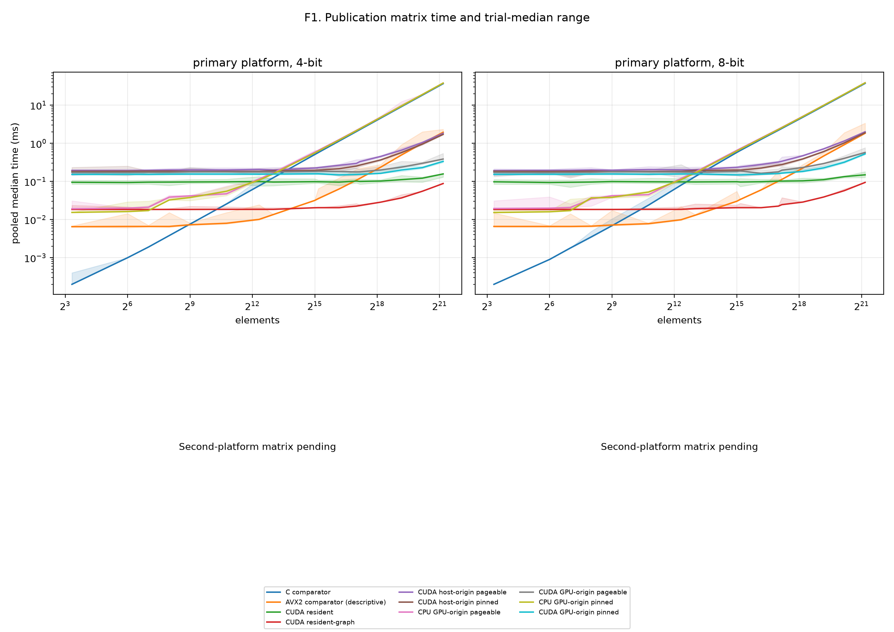
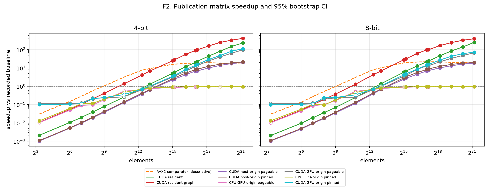
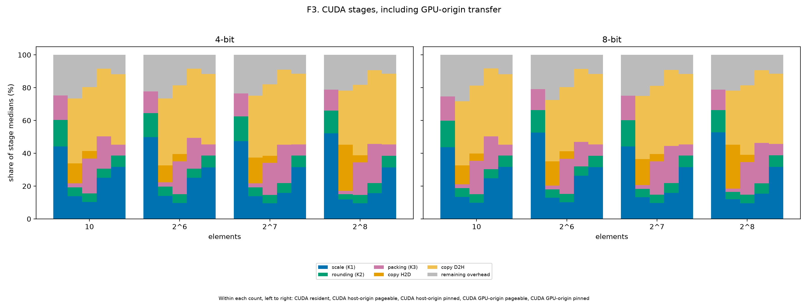
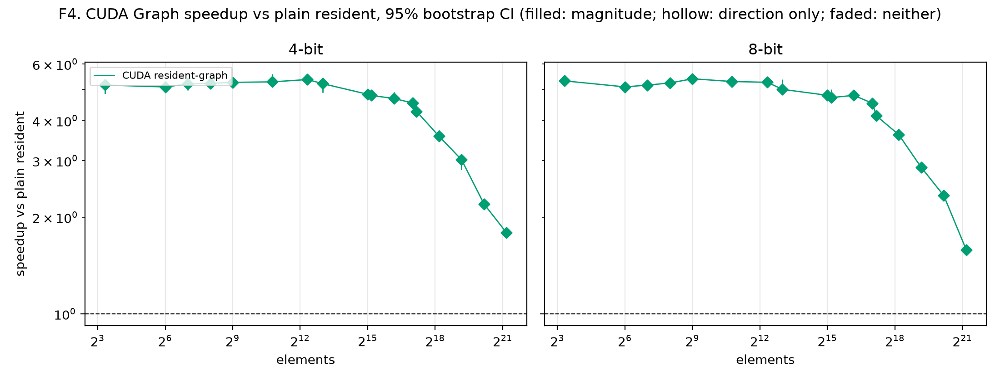
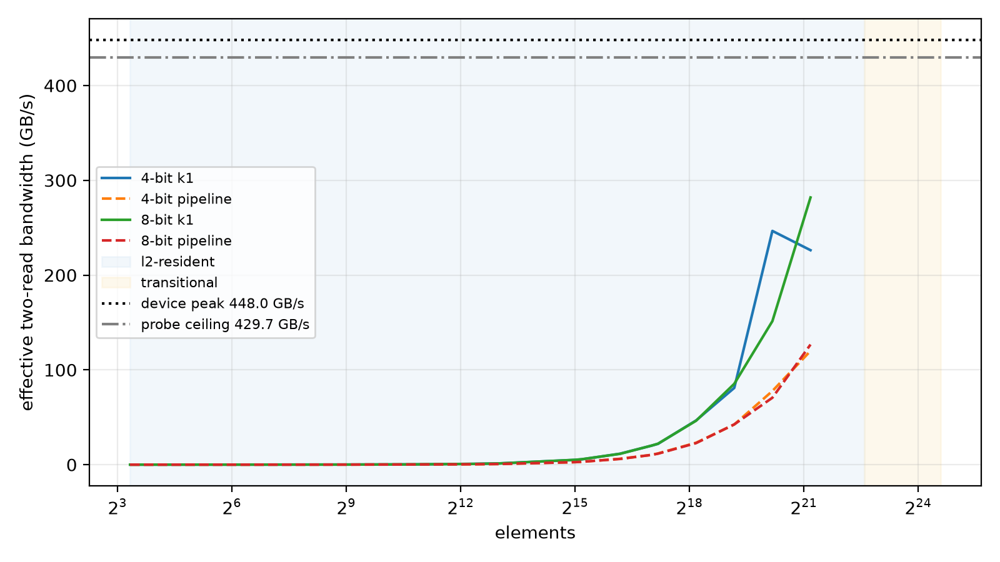

# Publication matrix report (model)

Revision `ec31947`; 340 cases; all passed: True.

## Input family

| Family | Inputs | Cells | Distinct counts |
|---|---:|---:|---:|
| model | 17 | 340 | 17 |

### Input provenance

| Input | Elements | Source detail |
|---|---:|---|
| model_bn1.weight | 64 | bn1.weight; shape [64]; bn |
| model_conv1.weight | 1728 | conv1.weight; shape [64, 3, 3, 3]; conv |
| model_layer1.0.conv1.weight | 36864 | layer1.0.conv1.weight; shape [64, 64, 3, 3]; conv |
| model_layer2.0.bn1.weight | 128 | layer2.0.bn1.weight; shape [128]; bn |
| model_layer2.0.conv1.weight | 73728 | layer2.0.conv1.weight; shape [128, 64, 3, 3]; conv |
| model_layer2.0.conv2.weight | 147456 | layer2.0.conv2.weight; shape [128, 128, 3, 3]; conv |
| model_layer2.0.shortcut.0.weight | 8192 | layer2.0.shortcut.0.weight; shape [128, 64, 1, 1]; conv |
| model_layer3.0.bn1.weight | 256 | layer3.0.bn1.weight; shape [256]; bn |
| model_layer3.0.conv1.weight | 294912 | layer3.0.conv1.weight; shape [256, 128, 3, 3]; conv |
| model_layer3.0.conv2.weight | 589824 | layer3.0.conv2.weight; shape [256, 256, 3, 3]; conv |
| model_layer3.0.shortcut.0.weight | 32768 | layer3.0.shortcut.0.weight; shape [256, 128, 1, 1]; conv |
| model_layer4.0.bn1.weight | 512 | layer4.0.bn1.weight; shape [512]; bn |
| model_layer4.0.conv1.weight | 1179648 | layer4.0.conv1.weight; shape [512, 256, 3, 3]; conv |
| model_layer4.0.conv2.weight | 2359296 | layer4.0.conv2.weight; shape [512, 512, 3, 3]; conv |
| model_layer4.0.shortcut.0.weight | 131072 | layer4.0.shortcut.0.weight; shape [512, 256, 1, 1]; conv |
| model_linear.bias | 10 | linear.bias; shape [10]; bias |
| model_linear.weight | 5120 | linear.weight; shape [10, 512]; linear |

## Path comparisons

GPU-origin CUDA uses the policy-matched CPU GPU-origin baseline. Other CUDA paths use the scalar C comparator. AVX2 and cross-boundary GPU-origin comparisons are descriptive.

| Input | Elements | Bits | Path | Policy | Baseline | Median ms | Speedup and CI | Inversion |
|---|---:|---:|---|---|---|---:|---|---|
| model_bn1.weight | 64 | 4 | cpu-avx2-optimized | none | cpu-comparator | 0.0066 | 0.152× [0.152, 0.155]; slower; direction=False; magnitude=False | False |
| model_bn1.weight | 64 | 4 | cpu-comparator | none | — | 0.001 | 1× [1, 1]; comparator; direction=False; magnitude=False | False |
| model_bn1.weight | 64 | 4 | cpu-gpu-origin | pageable | cpu-comparator | 0.02 | 0.05× [0.0498, 0.0502]; slower; direction=True; magnitude=True | False |
| model_bn1.weight | 64 | 4 | cpu-gpu-origin-pinned | pinned | cpu-comparator | 0.0162 | 0.0617× [0.0614, 0.0618]; slower; direction=True; magnitude=True | False |
| model_bn1.weight | 64 | 4 | cuda-gpu-origin | pageable | cpu-gpu-origin | 0.1722 | 0.116× [0.115, 0.117]; slower; direction=True; magnitude=True | False |
| model_bn1.weight | 64 | 4 | cuda-gpu-origin-pinned | pinned | cpu-gpu-origin-pinned | 0.1541 | 0.105× [0.104, 0.107]; slower; direction=True; magnitude=True | False |
| model_bn1.weight | 64 | 4 | cuda-host-origin | pageable | cpu-comparator | 0.1919 | 0.00521× [0.00518, 0.00524]; slower; direction=True; magnitude=True | False |
| model_bn1.weight | 64 | 4 | cuda-host-origin-pinned | pinned | cpu-comparator | 0.1851 | 0.0054× [0.00537, 0.00546]; slower; direction=True; magnitude=True | False |
| model_bn1.weight | 64 | 4 | cuda-resident | none | cpu-comparator | 0.0936 | 0.0107× [0.0104, 0.0109]; slower; direction=True; magnitude=True | False |
| model_bn1.weight | 64 | 4 | cuda-resident-graph | none | cpu-comparator | 0.0184 | 0.0543× [0.0543, 0.0543]; slower; direction=True; magnitude=True | False |
| model_bn1.weight | 64 | 8 | cpu-avx2-optimized | none | cpu-comparator | 0.0066 | 0.136× [0.136, 0.137]; slower; direction=False; magnitude=False | False |
| model_bn1.weight | 64 | 8 | cpu-comparator | none | — | 0.0009 | 1× [1, 1]; comparator; direction=False; magnitude=False | False |
| model_bn1.weight | 64 | 8 | cpu-gpu-origin | pageable | cpu-comparator | 0.0199 | 0.0452× [0.0451, 0.0453]; slower; direction=True; magnitude=True | False |
| model_bn1.weight | 64 | 8 | cpu-gpu-origin-pinned | pinned | cpu-comparator | 0.016 | 0.0563× [0.0559, 0.0563]; slower; direction=True; magnitude=True | False |
| model_bn1.weight | 64 | 8 | cuda-gpu-origin | pageable | cpu-gpu-origin | 0.1719 | 0.116× [0.114, 0.116]; slower; direction=True; magnitude=True | False |
| model_bn1.weight | 64 | 8 | cuda-gpu-origin-pinned | pinned | cpu-gpu-origin-pinned | 0.1542 | 0.104× [0.102, 0.106]; slower; direction=True; magnitude=True | False |
| model_bn1.weight | 64 | 8 | cuda-host-origin | pageable | cpu-comparator | 0.1951 | 0.00461× [0.00457, 0.00471]; slower; direction=True; magnitude=True | False |
| model_bn1.weight | 64 | 8 | cuda-host-origin-pinned | pinned | cpu-comparator | 0.1827 | 0.00493× [0.00485, 0.00501]; slower; direction=True; magnitude=True | False |
| model_bn1.weight | 64 | 8 | cuda-resident | none | cpu-comparator | 0.09365 | 0.00961× [0.00932, 0.0101]; slower; direction=True; magnitude=True | False |
| model_bn1.weight | 64 | 8 | cuda-resident-graph | none | cpu-comparator | 0.0184 | 0.0489× [0.0489, 0.0489]; slower; direction=True; magnitude=True | False |
| model_conv1.weight | 1728 | 4 | cpu-avx2-optimized | none | cpu-comparator | 0.008 | 3.2× [3.2, 3.24]; faster; direction=False; magnitude=False | False |
| model_conv1.weight | 1728 | 4 | cpu-comparator | none | — | 0.0256 | 1× [1, 1]; comparator; direction=False; magnitude=False | False |
| model_conv1.weight | 1728 | 4 | cpu-gpu-origin | pageable | cpu-comparator | 0.0474 | 0.54× [0.428, 0.544]; slower; direction=True; magnitude=False | False |
| model_conv1.weight | 1728 | 4 | cpu-gpu-origin-pinned | pinned | cpu-comparator | 0.0553 | 0.463× [0.462, 0.464]; slower; direction=True; magnitude=False | False |
| model_conv1.weight | 1728 | 4 | cuda-gpu-origin | pageable | cpu-gpu-origin | 0.1778 | 0.267× [0.256, 0.336]; slower; direction=True; magnitude=False | False |
| model_conv1.weight | 1728 | 4 | cuda-gpu-origin-pinned | pinned | cpu-gpu-origin-pinned | 0.1561 | 0.354× [0.347, 0.357]; slower; direction=True; magnitude=False | False |
| model_conv1.weight | 1728 | 4 | cuda-host-origin | pageable | cpu-comparator | 0.2001 | 0.128× [0.126, 0.129]; slower; direction=True; magnitude=True | False |
| model_conv1.weight | 1728 | 4 | cuda-host-origin-pinned | pinned | cpu-comparator | 0.1834 | 0.14× [0.139, 0.14]; slower; direction=True; magnitude=True | False |
| model_conv1.weight | 1728 | 4 | cuda-resident | none | cpu-comparator | 0.0976 | 0.262× [0.248, 0.27]; slower; direction=True; magnitude=True | False |
| model_conv1.weight | 1728 | 4 | cuda-resident-graph | none | cpu-comparator | 0.0185 | 1.38× [1.37, 1.38]; faster; direction=True; magnitude=True | False |
| model_conv1.weight | 1728 | 8 | cpu-avx2-optimized | none | cpu-comparator | 0.0078 | 3.06× [3.01, 3.07]; faster; direction=False; magnitude=False | False |
| model_conv1.weight | 1728 | 8 | cpu-comparator | none | — | 0.0239 | 1× [1, 1]; comparator; direction=False; magnitude=False | False |
| model_conv1.weight | 1728 | 8 | cpu-gpu-origin | pageable | cpu-comparator | 0.0449 | 0.532× [0.529, 0.532]; slower; direction=True; magnitude=True | False |
| model_conv1.weight | 1728 | 8 | cpu-gpu-origin-pinned | pinned | cpu-comparator | 0.0525 | 0.455× [0.435, 0.589]; slower; direction=True; magnitude=False | False |
| model_conv1.weight | 1728 | 8 | cuda-gpu-origin | pageable | cpu-gpu-origin | 0.1785 | 0.252× [0.24, 0.253]; slower; direction=True; magnitude=True | False |
| model_conv1.weight | 1728 | 8 | cuda-gpu-origin-pinned | pinned | cpu-gpu-origin-pinned | 0.1542 | 0.34× [0.263, 0.355]; slower; direction=True; magnitude=False | False |
| model_conv1.weight | 1728 | 8 | cuda-host-origin | pageable | cpu-comparator | 0.2051 | 0.117× [0.114, 0.118]; slower; direction=True; magnitude=True | False |
| model_conv1.weight | 1728 | 8 | cuda-host-origin-pinned | pinned | cpu-comparator | 0.1821 | 0.131× [0.13, 0.132]; slower; direction=True; magnitude=True | False |
| model_conv1.weight | 1728 | 8 | cuda-resident | none | cpu-comparator | 0.09785 | 0.244× [0.235, 0.25]; slower; direction=True; magnitude=True | False |
| model_conv1.weight | 1728 | 8 | cuda-resident-graph | none | cpu-comparator | 0.0185 | 1.29× [1.29, 1.3]; faster; direction=True; magnitude=True | False |
| model_layer1.0.conv1.weight | 36864 | 4 | cpu-avx2-optimized | none | cpu-comparator | 0.0355 | 16.1× [16.1, 16.2]; faster; direction=False; magnitude=False | False |
| model_layer1.0.conv1.weight | 36864 | 4 | cpu-comparator | none | — | 0.5725 | 1× [1, 1]; comparator; direction=False; magnitude=False | False |
| model_layer1.0.conv1.weight | 36864 | 4 | cpu-gpu-origin | pageable | cpu-comparator | 0.6533 | 0.876× [0.876, 0.876]; slower; direction=True; magnitude=True | False |
| model_layer1.0.conv1.weight | 36864 | 4 | cpu-gpu-origin-pinned | pinned | cpu-comparator | 0.624 | 0.917× [0.917, 0.918]; inconclusive; direction=False; magnitude=False | False |
| model_layer1.0.conv1.weight | 36864 | 4 | cuda-gpu-origin | pageable | cpu-gpu-origin | 0.1849 | 3.53× [3.53, 3.61]; faster; direction=True; magnitude=True | False |
| model_layer1.0.conv1.weight | 36864 | 4 | cuda-gpu-origin-pinned | pinned | cpu-gpu-origin-pinned | 0.1584 | 3.94× [3.91, 3.97]; faster; direction=True; magnitude=True | False |
| model_layer1.0.conv1.weight | 36864 | 4 | cuda-host-origin | pageable | cpu-comparator | 0.2303 | 2.49× [2.44, 2.51]; faster; direction=True; magnitude=True | False |
| model_layer1.0.conv1.weight | 36864 | 4 | cuda-host-origin-pinned | pinned | cpu-comparator | 0.197 | 2.91× [2.83, 2.94]; faster; direction=True; magnitude=True | False |
| model_layer1.0.conv1.weight | 36864 | 4 | cuda-resident | none | cpu-comparator | 0.0981 | 5.84× [5.66, 5.96]; faster; direction=True; magnitude=True | False |
| model_layer1.0.conv1.weight | 36864 | 4 | cuda-resident-graph | none | cpu-comparator | 0.0205 | 27.9× [27.9, 28.1]; faster; direction=True; magnitude=True | False |
| model_layer1.0.conv1.weight | 36864 | 8 | cpu-avx2-optimized | none | cpu-comparator | 0.0338 | 19.2× [19.1, 19.2]; faster; direction=False; magnitude=False | False |
| model_layer1.0.conv1.weight | 36864 | 8 | cpu-comparator | none | — | 0.648 | 1× [1, 1]; comparator; direction=False; magnitude=False | False |
| model_layer1.0.conv1.weight | 36864 | 8 | cpu-gpu-origin | pageable | cpu-comparator | 0.7284 | 0.89× [0.889, 0.889]; slower; direction=True; magnitude=True | False |
| model_layer1.0.conv1.weight | 36864 | 8 | cpu-gpu-origin-pinned | pinned | cpu-comparator | 0.6996 | 0.926× [0.926, 0.926]; slower; direction=True; magnitude=True | False |
| model_layer1.0.conv1.weight | 36864 | 8 | cuda-gpu-origin | pageable | cpu-gpu-origin | 0.1879 | 3.88× [3.7, 3.94]; faster; direction=True; magnitude=True | False |
| model_layer1.0.conv1.weight | 36864 | 8 | cuda-gpu-origin-pinned | pinned | cpu-gpu-origin-pinned | 0.1481 | 4.72× [4.68, 4.73]; faster; direction=True; magnitude=True | False |
| model_layer1.0.conv1.weight | 36864 | 8 | cuda-host-origin | pageable | cpu-comparator | 0.239 | 2.71× [2.66, 2.73]; faster; direction=True; magnitude=True | False |
| model_layer1.0.conv1.weight | 36864 | 8 | cuda-host-origin-pinned | pinned | cpu-comparator | 0.1978 | 3.28× [3.21, 3.32]; faster; direction=True; magnitude=True | False |
| model_layer1.0.conv1.weight | 36864 | 8 | cuda-resident | none | cpu-comparator | 0.0966 | 6.71× [6.33, 6.77]; faster; direction=True; magnitude=True | False |
| model_layer1.0.conv1.weight | 36864 | 8 | cuda-resident-graph | none | cpu-comparator | 0.0205 | 31.6× [31.6, 31.8]; faster; direction=True; magnitude=True | False |
| model_layer2.0.bn1.weight | 128 | 4 | cpu-avx2-optimized | none | cpu-comparator | 0.0066 | 0.288× [0.285, 0.29]; slower; direction=False; magnitude=False | False |
| model_layer2.0.bn1.weight | 128 | 4 | cpu-comparator | none | — | 0.0019 | 1× [1, 1]; comparator; direction=False; magnitude=False | False |
| model_layer2.0.bn1.weight | 128 | 4 | cpu-gpu-origin | pageable | cpu-comparator | 0.021 | 0.0905× [0.09, 0.0907]; slower; direction=True; magnitude=True | False |
| model_layer2.0.bn1.weight | 128 | 4 | cpu-gpu-origin-pinned | pinned | cpu-comparator | 0.0172 | 0.11× [0.108, 0.111]; slower; direction=True; magnitude=False | False |
| model_layer2.0.bn1.weight | 128 | 4 | cuda-gpu-origin | pageable | cpu-gpu-origin | 0.1736 | 0.121× [0.118, 0.122]; slower; direction=True; magnitude=True | False |
| model_layer2.0.bn1.weight | 128 | 4 | cuda-gpu-origin-pinned | pinned | cpu-gpu-origin-pinned | 0.1533 | 0.112× [0.112, 0.115]; slower; direction=True; magnitude=False | False |
| model_layer2.0.bn1.weight | 128 | 4 | cuda-host-origin | pageable | cpu-comparator | 0.1952 | 0.00973× [0.00962, 0.00988]; slower; direction=True; magnitude=True | False |
| model_layer2.0.bn1.weight | 128 | 4 | cuda-host-origin-pinned | pinned | cpu-comparator | 0.1859 | 0.0102× [0.0102, 0.0103]; slower; direction=True; magnitude=True | False |
| model_layer2.0.bn1.weight | 128 | 4 | cuda-resident | none | cpu-comparator | 0.0956 | 0.0199× [0.019, 0.0208]; slower; direction=True; magnitude=True | False |
| model_layer2.0.bn1.weight | 128 | 4 | cuda-resident-graph | none | cpu-comparator | 0.0184 | 0.103× [0.103, 0.103]; slower; direction=True; magnitude=True | False |
| model_layer2.0.bn1.weight | 128 | 8 | cpu-avx2-optimized | none | cpu-comparator | 0.0066 | 0.273× [0.271, 0.277]; slower; direction=False; magnitude=False | False |
| model_layer2.0.bn1.weight | 128 | 8 | cpu-comparator | none | — | 0.0018 | 1× [1, 1]; comparator; direction=False; magnitude=False | False |
| model_layer2.0.bn1.weight | 128 | 8 | cpu-gpu-origin | pageable | cpu-comparator | 0.0208 | 0.0865× [0.0863, 0.087]; slower; direction=True; magnitude=True | False |
| model_layer2.0.bn1.weight | 128 | 8 | cpu-gpu-origin-pinned | pinned | cpu-comparator | 0.0172 | 0.105× [0.0755, 0.105]; slower; direction=True; magnitude=False | False |
| model_layer2.0.bn1.weight | 128 | 8 | cuda-gpu-origin | pageable | cpu-gpu-origin | 0.1722 | 0.121× [0.119, 0.121]; slower; direction=True; magnitude=True | False |
| model_layer2.0.bn1.weight | 128 | 8 | cuda-gpu-origin-pinned | pinned | cpu-gpu-origin-pinned | 0.1546 | 0.111× [0.11, 0.156]; slower; direction=True; magnitude=False | False |
| model_layer2.0.bn1.weight | 128 | 8 | cuda-host-origin | pageable | cpu-comparator | 0.1957 | 0.0092× [0.00911, 0.00935]; slower; direction=True; magnitude=True | False |
| model_layer2.0.bn1.weight | 128 | 8 | cuda-host-origin-pinned | pinned | cpu-comparator | 0.184 | 0.00978× [0.00969, 0.00987]; slower; direction=True; magnitude=True | False |
| model_layer2.0.bn1.weight | 128 | 8 | cuda-resident | none | cpu-comparator | 0.09485 | 0.019× [0.0184, 0.0192]; slower; direction=True; magnitude=True | False |
| model_layer2.0.bn1.weight | 128 | 8 | cuda-resident-graph | none | cpu-comparator | 0.0184 | 0.0978× [0.0978, 0.0978]; slower; direction=True; magnitude=True | False |
| model_layer2.0.conv1.weight | 73728 | 4 | cpu-avx2-optimized | none | cpu-comparator | 0.0634 | 18.1× [18, 18.1]; faster; direction=False; magnitude=False | False |
| model_layer2.0.conv1.weight | 73728 | 4 | cpu-comparator | none | — | 1.145 | 1× [1, 1]; comparator; direction=False; magnitude=False | False |
| model_layer2.0.conv1.weight | 73728 | 4 | cpu-gpu-origin | pageable | cpu-comparator | 1.251 | 0.916× [0.915, 0.916]; slower; direction=True; magnitude=True | False |
| model_layer2.0.conv1.weight | 73728 | 4 | cpu-gpu-origin-pinned | pinned | cpu-comparator | 1.217 | 0.941× [0.941, 0.941]; slower; direction=True; magnitude=True | False |
| model_layer2.0.conv1.weight | 73728 | 4 | cuda-gpu-origin | pageable | cpu-gpu-origin | 0.182 | 6.88× [6.68, 7.58]; faster; direction=True; magnitude=False | False |
| model_layer2.0.conv1.weight | 73728 | 4 | cuda-gpu-origin-pinned | pinned | cpu-gpu-origin-pinned | 0.1484 | 8.2× [8.18, 8.3]; faster; direction=True; magnitude=True | False |
| model_layer2.0.conv1.weight | 73728 | 4 | cuda-host-origin | pageable | cpu-comparator | 0.2651 | 4.32× [4.28, 4.35]; faster; direction=True; magnitude=True | False |
| model_layer2.0.conv1.weight | 73728 | 4 | cuda-host-origin-pinned | pinned | cpu-comparator | 0.216 | 5.3× [5.12, 5.34]; faster; direction=True; magnitude=True | False |
| model_layer2.0.conv1.weight | 73728 | 4 | cuda-resident | none | cpu-comparator | 0.096 | 11.9× [11.4, 12.3]; faster; direction=True; magnitude=True | False |
| model_layer2.0.conv1.weight | 73728 | 4 | cuda-resident-graph | none | cpu-comparator | 0.0205 | 55.9× [55.9, 55.9]; faster; direction=True; magnitude=True | False |
| model_layer2.0.conv1.weight | 73728 | 8 | cpu-avx2-optimized | none | cpu-comparator | 0.0599 | 21.2× [21.1, 21.3]; faster; direction=False; magnitude=False | False |
| model_layer2.0.conv1.weight | 73728 | 8 | cpu-comparator | none | — | 1.27 | 1× [1, 1]; comparator; direction=False; magnitude=False | False |
| model_layer2.0.conv1.weight | 73728 | 8 | cpu-gpu-origin | pageable | cpu-comparator | 1.376 | 0.923× [0.922, 0.923]; slower; direction=True; magnitude=True | False |
| model_layer2.0.conv1.weight | 73728 | 8 | cpu-gpu-origin-pinned | pinned | cpu-comparator | 1.343 | 0.946× [0.945, 0.947]; slower; direction=True; magnitude=True | False |
| model_layer2.0.conv1.weight | 73728 | 8 | cuda-gpu-origin | pageable | cpu-gpu-origin | 0.1629 | 8.45× [7.98, 8.61]; faster; direction=True; magnitude=True | False |
| model_layer2.0.conv1.weight | 73728 | 8 | cuda-gpu-origin-pinned | pinned | cpu-gpu-origin-pinned | 0.1548 | 8.67× [8.33, 8.83]; faster; direction=True; magnitude=True | False |
| model_layer2.0.conv1.weight | 73728 | 8 | cuda-host-origin | pageable | cpu-comparator | 0.2782 | 4.57× [4.49, 4.65]; faster; direction=True; magnitude=True | False |
| model_layer2.0.conv1.weight | 73728 | 8 | cuda-host-origin-pinned | pinned | cpu-comparator | 0.2247 | 5.65× [5.55, 5.75]; faster; direction=True; magnitude=True | False |
| model_layer2.0.conv1.weight | 73728 | 8 | cuda-resident | none | cpu-comparator | 0.0982 | 12.9× [12.6, 13.4]; faster; direction=True; magnitude=True | False |
| model_layer2.0.conv1.weight | 73728 | 8 | cuda-resident-graph | none | cpu-comparator | 0.0205 | 62× [61.9, 62]; faster; direction=True; magnitude=True | False |
| model_layer2.0.conv2.weight | 147456 | 4 | cpu-avx2-optimized | none | cpu-comparator | 0.1208 | 19× [18.9, 19]; faster; direction=False; magnitude=False | False |
| model_layer2.0.conv2.weight | 147456 | 4 | cpu-comparator | none | — | 2.293 | 1× [1, 1]; comparator; direction=False; magnitude=False | False |
| model_layer2.0.conv2.weight | 147456 | 4 | cpu-gpu-origin | pageable | cpu-comparator | 2.451 | 0.936× [0.933, 0.938]; slower; direction=True; magnitude=True | False |
| model_layer2.0.conv2.weight | 147456 | 4 | cpu-gpu-origin-pinned | pinned | cpu-comparator | 2.405 | 0.954× [0.951, 0.956]; slower; direction=True; magnitude=True | False |
| model_layer2.0.conv2.weight | 147456 | 4 | cuda-gpu-origin | pageable | cpu-gpu-origin | 0.1785 | 13.7× [13.4, 14.2]; faster; direction=True; magnitude=False | False |
| model_layer2.0.conv2.weight | 147456 | 4 | cuda-gpu-origin-pinned | pinned | cpu-gpu-origin-pinned | 0.153 | 15.7× [15.5, 15.9]; faster; direction=True; magnitude=True | False |
| model_layer2.0.conv2.weight | 147456 | 4 | cuda-host-origin | pageable | cpu-comparator | 0.3306 | 6.93× [6.76, 7.06]; faster; direction=True; magnitude=True | False |
| model_layer2.0.conv2.weight | 147456 | 4 | cuda-host-origin-pinned | pinned | cpu-comparator | 0.2681 | 8.55× [8.4, 8.73]; faster; direction=True; magnitude=True | False |
| model_layer2.0.conv2.weight | 147456 | 4 | cuda-resident | none | cpu-comparator | 0.0999 | 23× [22, 23.8]; faster; direction=True; magnitude=True | False |
| model_layer2.0.conv2.weight | 147456 | 4 | cuda-resident-graph | none | cpu-comparator | 0.0234 | 98× [97.3, 101]; faster; direction=True; magnitude=True | False |
| model_layer2.0.conv2.weight | 147456 | 8 | cpu-avx2-optimized | none | cpu-comparator | 0.1133 | 21.7× [21.7, 21.8]; faster; direction=False; magnitude=False | False |
| model_layer2.0.conv2.weight | 147456 | 8 | cpu-comparator | none | — | 2.461 | 1× [1, 1]; comparator; direction=False; magnitude=False | False |
| model_layer2.0.conv2.weight | 147456 | 8 | cpu-gpu-origin | pageable | cpu-comparator | 2.621 | 0.939× [0.938, 0.939]; slower; direction=True; magnitude=True | False |
| model_layer2.0.conv2.weight | 147456 | 8 | cpu-gpu-origin-pinned | pinned | cpu-comparator | 2.576 | 0.956× [0.955, 0.956]; slower; direction=True; magnitude=True | False |
| model_layer2.0.conv2.weight | 147456 | 8 | cuda-gpu-origin | pageable | cpu-gpu-origin | 0.1972 | 13.3× [12.8, 14.5]; faster; direction=True; magnitude=True | False |
| model_layer2.0.conv2.weight | 147456 | 8 | cuda-gpu-origin-pinned | pinned | cpu-gpu-origin-pinned | 0.1655 | 15.6× [15.4, 15.9]; faster; direction=True; magnitude=True | False |
| model_layer2.0.conv2.weight | 147456 | 8 | cuda-host-origin | pageable | cpu-comparator | 0.3386 | 7.27× [7.15, 7.36]; faster; direction=True; magnitude=True | False |
| model_layer2.0.conv2.weight | 147456 | 8 | cuda-host-origin-pinned | pinned | cpu-comparator | 0.2765 | 8.9× [8.75, 8.99]; faster; direction=True; magnitude=True | False |
| model_layer2.0.conv2.weight | 147456 | 8 | cuda-resident | none | cpu-comparator | 0.1018 | 24.2× [23.8, 24.3]; faster; direction=True; magnitude=True | False |
| model_layer2.0.conv2.weight | 147456 | 8 | cuda-resident-graph | none | cpu-comparator | 0.0246 | 100× [100, 100]; faster; direction=True; magnitude=True | False |
| model_layer2.0.shortcut.0.weight | 8192 | 4 | cpu-avx2-optimized | none | cpu-comparator | 0.0135 | 9.24× [9.2, 9.31]; faster; direction=False; magnitude=False | False |
| model_layer2.0.shortcut.0.weight | 8192 | 4 | cpu-comparator | none | — | 0.1247 | 1× [1, 1]; comparator; direction=False; magnitude=False | False |
| model_layer2.0.shortcut.0.weight | 8192 | 4 | cpu-gpu-origin | pageable | cpu-comparator | 0.1667 | 0.748× [0.747, 0.748]; slower; direction=True; magnitude=True | False |
| model_layer2.0.shortcut.0.weight | 8192 | 4 | cpu-gpu-origin-pinned | pinned | cpu-comparator | 0.1579 | 0.79× [0.789, 0.79]; slower; direction=True; magnitude=True | False |
| model_layer2.0.shortcut.0.weight | 8192 | 4 | cuda-gpu-origin | pageable | cpu-gpu-origin | 0.1781 | 0.936× [0.908, 0.94]; inconclusive; direction=False; magnitude=False | False |
| model_layer2.0.shortcut.0.weight | 8192 | 4 | cuda-gpu-origin-pinned | pinned | cpu-gpu-origin-pinned | 0.1559 | 1.01× [0.974, 1.02]; inconclusive; direction=False; magnitude=False | False |
| model_layer2.0.shortcut.0.weight | 8192 | 4 | cuda-host-origin | pageable | cpu-comparator | 0.1991 | 0.626× [0.614, 0.632]; slower; direction=True; magnitude=True | False |
| model_layer2.0.shortcut.0.weight | 8192 | 4 | cuda-host-origin-pinned | pinned | cpu-comparator | 0.1895 | 0.658× [0.652, 0.664]; slower; direction=True; magnitude=True | False |
| model_layer2.0.shortcut.0.weight | 8192 | 4 | cuda-resident | none | cpu-comparator | 0.09635 | 1.29× [1.25, 1.33]; faster; direction=True; magnitude=True | False |
| model_layer2.0.shortcut.0.weight | 8192 | 4 | cuda-resident-graph | none | cpu-comparator | 0.0185 | 6.74× [6.43, 6.74]; faster; direction=True; magnitude=True | False |
| model_layer2.0.shortcut.0.weight | 8192 | 8 | cpu-avx2-optimized | none | cpu-comparator | 0.013 | 10.3× [10.2, 10.3]; faster; direction=False; magnitude=False | False |
| model_layer2.0.shortcut.0.weight | 8192 | 8 | cpu-comparator | none | — | 0.134 | 1× [1, 1]; comparator; direction=False; magnitude=False | False |
| model_layer2.0.shortcut.0.weight | 8192 | 8 | cpu-gpu-origin | pageable | cpu-comparator | 0.1759 | 0.762× [0.761, 0.762]; slower; direction=True; magnitude=True | False |
| model_layer2.0.shortcut.0.weight | 8192 | 8 | cpu-gpu-origin-pinned | pinned | cpu-comparator | 0.1672 | 0.801× [0.801, 0.802]; slower; direction=True; magnitude=True | False |
| model_layer2.0.shortcut.0.weight | 8192 | 8 | cuda-gpu-origin | pageable | cpu-gpu-origin | 0.1737 | 1.01× [0.996, 1.03]; inconclusive; direction=False; magnitude=False | False |
| model_layer2.0.shortcut.0.weight | 8192 | 8 | cuda-gpu-origin-pinned | pinned | cpu-gpu-origin-pinned | 0.1574 | 1.06× [1.03, 1.08]; inconclusive; direction=False; magnitude=False | False |
| model_layer2.0.shortcut.0.weight | 8192 | 8 | cuda-host-origin | pageable | cpu-comparator | 0.2022 | 0.663× [0.635, 0.676]; slower; direction=True; magnitude=True | False |
| model_layer2.0.shortcut.0.weight | 8192 | 8 | cuda-host-origin-pinned | pinned | cpu-comparator | 0.1933 | 0.693× [0.689, 0.7]; slower; direction=True; magnitude=True | False |
| model_layer2.0.shortcut.0.weight | 8192 | 8 | cuda-resident | none | cpu-comparator | 0.097 | 1.38× [1.34, 1.41]; faster; direction=True; magnitude=True | False |
| model_layer2.0.shortcut.0.weight | 8192 | 8 | cuda-resident-graph | none | cpu-comparator | 0.0194 | 6.91× [6.9, 7.24]; faster; direction=True; magnitude=True | False |
| model_layer3.0.bn1.weight | 256 | 4 | cpu-avx2-optimized | none | cpu-comparator | 0.0066 | 0.576× [0.571, 0.585]; slower; direction=False; magnitude=False | False |
| model_layer3.0.bn1.weight | 256 | 4 | cpu-comparator | none | — | 0.0038 | 1× [1, 1]; comparator; direction=False; magnitude=False | False |
| model_layer3.0.bn1.weight | 256 | 4 | cpu-gpu-origin | pageable | cpu-comparator | 0.0388 | 0.0979× [0.0954, 0.0984]; slower; direction=True; magnitude=True | False |
| model_layer3.0.bn1.weight | 256 | 4 | cpu-gpu-origin-pinned | pinned | cpu-comparator | 0.0326 | 0.117× [0.116, 0.117]; slower; direction=True; magnitude=True | False |
| model_layer3.0.bn1.weight | 256 | 4 | cuda-gpu-origin | pageable | cpu-gpu-origin | 0.1734 | 0.224× [0.222, 0.231]; slower; direction=True; magnitude=True | False |
| model_layer3.0.bn1.weight | 256 | 4 | cuda-gpu-origin-pinned | pinned | cpu-gpu-origin-pinned | 0.1548 | 0.211× [0.208, 0.213]; slower; direction=True; magnitude=True | False |
| model_layer3.0.bn1.weight | 256 | 4 | cuda-host-origin | pageable | cpu-comparator | 0.1994 | 0.0191× [0.0188, 0.0195]; slower; direction=True; magnitude=True | False |
| model_layer3.0.bn1.weight | 256 | 4 | cuda-host-origin-pinned | pinned | cpu-comparator | 0.186 | 0.0204× [0.0204, 0.0204]; slower; direction=True; magnitude=True | False |
| model_layer3.0.bn1.weight | 256 | 4 | cuda-resident | none | cpu-comparator | 0.096 | 0.0396× [0.0386, 0.0403]; slower; direction=True; magnitude=True | False |
| model_layer3.0.bn1.weight | 256 | 4 | cuda-resident-graph | none | cpu-comparator | 0.0184 | 0.207× [0.207, 0.207]; slower; direction=True; magnitude=True | False |
| model_layer3.0.bn1.weight | 256 | 8 | cpu-avx2-optimized | none | cpu-comparator | 0.0067 | 0.522× [0.522, 0.53]; slower; direction=False; magnitude=False | False |
| model_layer3.0.bn1.weight | 256 | 8 | cpu-comparator | none | — | 0.0035 | 1× [1, 1]; comparator; direction=False; magnitude=False | False |
| model_layer3.0.bn1.weight | 256 | 8 | cpu-gpu-origin | pageable | cpu-comparator | 0.03455 | 0.101× [0.0966, 0.11]; slower; direction=True; magnitude=False | False |
| model_layer3.0.bn1.weight | 256 | 8 | cpu-gpu-origin-pinned | pinned | cpu-comparator | 0.0371 | 0.0943× [0.0943, 0.0946]; slower; direction=True; magnitude=True | False |
| model_layer3.0.bn1.weight | 256 | 8 | cuda-gpu-origin | pageable | cpu-gpu-origin | 0.1742 | 0.198× [0.18, 0.207]; slower; direction=True; magnitude=False | False |
| model_layer3.0.bn1.weight | 256 | 8 | cuda-gpu-origin-pinned | pinned | cpu-gpu-origin-pinned | 0.1558 | 0.238× [0.233, 0.241]; slower; direction=True; magnitude=True | False |
| model_layer3.0.bn1.weight | 256 | 8 | cuda-host-origin | pageable | cpu-comparator | 0.2001 | 0.0175× [0.0174, 0.0177]; slower; direction=True; magnitude=True | False |
| model_layer3.0.bn1.weight | 256 | 8 | cuda-host-origin-pinned | pinned | cpu-comparator | 0.1859 | 0.0188× [0.0188, 0.0189]; slower; direction=True; magnitude=True | False |
| model_layer3.0.bn1.weight | 256 | 8 | cuda-resident | none | cpu-comparator | 0.0963 | 0.0363× [0.0349, 0.0377]; slower; direction=True; magnitude=True | False |
| model_layer3.0.bn1.weight | 256 | 8 | cuda-resident-graph | none | cpu-comparator | 0.0184 | 0.19× [0.19, 0.19]; slower; direction=True; magnitude=True | False |
| model_layer3.0.conv1.weight | 294912 | 4 | cpu-avx2-optimized | none | cpu-comparator | 0.237 | 19.3× [19.2, 19.4]; faster; direction=False; magnitude=False | False |
| model_layer3.0.conv1.weight | 294912 | 4 | cpu-comparator | none | — | 4.576 | 1× [1, 1]; comparator; direction=False; magnitude=False | False |
| model_layer3.0.conv1.weight | 294912 | 4 | cpu-gpu-origin | pageable | cpu-comparator | 4.848 | 0.944× [0.944, 0.945]; slower; direction=True; magnitude=True | False |
| model_layer3.0.conv1.weight | 294912 | 4 | cpu-gpu-origin-pinned | pinned | cpu-comparator | 4.779 | 0.958× [0.957, 0.958]; slower; direction=True; magnitude=True | False |
| model_layer3.0.conv1.weight | 294912 | 4 | cuda-gpu-origin | pageable | cpu-gpu-origin | 0.1996 | 24.3× [23.8, 24.8]; faster; direction=True; magnitude=True | False |
| model_layer3.0.conv1.weight | 294912 | 4 | cuda-gpu-origin-pinned | pinned | cpu-gpu-origin-pinned | 0.1628 | 29.4× [28.7, 29.6]; faster; direction=True; magnitude=True | False |
| model_layer3.0.conv1.weight | 294912 | 4 | cuda-host-origin | pageable | cpu-comparator | 0.4528 | 10.1× [10, 10.2]; faster; direction=True; magnitude=True | False |
| model_layer3.0.conv1.weight | 294912 | 4 | cuda-host-origin-pinned | pinned | cpu-comparator | 0.3666 | 12.5× [12.4, 12.6]; faster; direction=True; magnitude=True | False |
| model_layer3.0.conv1.weight | 294912 | 4 | cuda-resident | none | cpu-comparator | 0.1021 | 44.8× [42.9, 46.1]; faster; direction=True; magnitude=True | False |
| model_layer3.0.conv1.weight | 294912 | 4 | cuda-resident-graph | none | cpu-comparator | 0.0286 | 160× [160, 160]; faster; direction=True; magnitude=True | False |
| model_layer3.0.conv1.weight | 294912 | 8 | cpu-avx2-optimized | none | cpu-comparator | 0.2224 | 21.6× [21.6, 21.7]; faster; direction=False; magnitude=False | False |
| model_layer3.0.conv1.weight | 294912 | 8 | cpu-comparator | none | — | 4.809 | 1× [1, 1]; comparator; direction=False; magnitude=False | False |
| model_layer3.0.conv1.weight | 294912 | 8 | cpu-gpu-origin | pageable | cpu-comparator | 5.077 | 0.947× [0.947, 0.948]; slower; direction=True; magnitude=True | False |
| model_layer3.0.conv1.weight | 294912 | 8 | cpu-gpu-origin-pinned | pinned | cpu-comparator | 5.009 | 0.96× [0.96, 0.96]; slower; direction=True; magnitude=True | False |
| model_layer3.0.conv1.weight | 294912 | 8 | cuda-gpu-origin | pageable | cpu-gpu-origin | 0.2317 | 21.9× [21.7, 23.4]; faster; direction=True; magnitude=True | False |
| model_layer3.0.conv1.weight | 294912 | 8 | cuda-gpu-origin-pinned | pinned | cpu-gpu-origin-pinned | 0.1825 | 27.4× [27.3, 27.7]; faster; direction=True; magnitude=True | False |
| model_layer3.0.conv1.weight | 294912 | 8 | cuda-host-origin | pageable | cpu-comparator | 0.4713 | 10.2× [10.1, 10.3]; faster; direction=True; magnitude=True | False |
| model_layer3.0.conv1.weight | 294912 | 8 | cuda-host-origin-pinned | pinned | cpu-comparator | 0.3883 | 12.4× [12.3, 12.4]; faster; direction=True; magnitude=True | False |
| model_layer3.0.conv1.weight | 294912 | 8 | cuda-resident | none | cpu-comparator | 0.1036 | 46.4× [45.8, 48.3]; faster; direction=True; magnitude=True | False |
| model_layer3.0.conv1.weight | 294912 | 8 | cuda-resident-graph | none | cpu-comparator | 0.0287 | 168× [168, 168]; faster; direction=True; magnitude=True | False |
| model_layer3.0.conv2.weight | 589824 | 4 | cpu-avx2-optimized | none | cpu-comparator | 0.495 | 18.5× [18.4, 18.6]; faster; direction=False; magnitude=False | False |
| model_layer3.0.conv2.weight | 589824 | 4 | cpu-comparator | none | — | 9.163 | 1× [1, 1]; comparator; direction=False; magnitude=False | False |
| model_layer3.0.conv2.weight | 589824 | 4 | cpu-gpu-origin | pageable | cpu-comparator | 9.596 | 0.955× [0.952, 0.956]; inconclusive; direction=False; magnitude=False | False |
| model_layer3.0.conv2.weight | 589824 | 4 | cpu-gpu-origin-pinned | pinned | cpu-comparator | 9.525 | 0.962× [0.961, 0.963]; inconclusive; direction=False; magnitude=False | False |
| model_layer3.0.conv2.weight | 589824 | 4 | cuda-gpu-origin | pageable | cpu-gpu-origin | 0.2377 | 40.4× [40.2, 41.1]; faster; direction=True; magnitude=True | False |
| model_layer3.0.conv2.weight | 589824 | 4 | cuda-gpu-origin-pinned | pinned | cpu-gpu-origin-pinned | 0.1997 | 47.7× [46.2, 51.1]; faster; direction=True; magnitude=True | False |
| model_layer3.0.conv2.weight | 589824 | 4 | cuda-host-origin | pageable | cpu-comparator | 0.6613 | 13.9× [13.8, 14]; faster; direction=True; magnitude=True | False |
| model_layer3.0.conv2.weight | 589824 | 4 | cuda-host-origin-pinned | pinned | cpu-comparator | 0.5715 | 16× [15.8, 16.1]; faster; direction=True; magnitude=True | False |
| model_layer3.0.conv2.weight | 589824 | 4 | cuda-resident | none | cpu-comparator | 0.1114 | 82.3× [81, 88.4]; faster; direction=True; magnitude=True | False |
| model_layer3.0.conv2.weight | 589824 | 4 | cuda-resident-graph | none | cpu-comparator | 0.0369 | 248× [248, 249]; faster; direction=True; magnitude=True | False |
| model_layer3.0.conv2.weight | 589824 | 8 | cpu-avx2-optimized | none | cpu-comparator | 0.4619 | 20.5× [20.5, 20.6]; faster; direction=False; magnitude=False | False |
| model_layer3.0.conv2.weight | 589824 | 8 | cpu-comparator | none | — | 9.48 | 1× [1, 1]; comparator; direction=False; magnitude=False | False |
| model_layer3.0.conv2.weight | 589824 | 8 | cpu-gpu-origin | pageable | cpu-comparator | 9.907 | 0.957× [0.956, 0.957]; slower; direction=True; magnitude=True | False |
| model_layer3.0.conv2.weight | 589824 | 8 | cpu-gpu-origin-pinned | pinned | cpu-comparator | 9.848 | 0.963× [0.962, 0.963]; slower; direction=True; magnitude=True | False |
| model_layer3.0.conv2.weight | 589824 | 8 | cuda-gpu-origin | pageable | cpu-gpu-origin | 0.2941 | 33.7× [33.5, 33.9]; faster; direction=True; magnitude=True | False |
| model_layer3.0.conv2.weight | 589824 | 8 | cuda-gpu-origin-pinned | pinned | cpu-gpu-origin-pinned | 0.2261 | 43.6× [43.3, 43.8]; faster; direction=True; magnitude=True | False |
| model_layer3.0.conv2.weight | 589824 | 8 | cuda-host-origin | pageable | cpu-comparator | 0.7131 | 13.3× [13.2, 13.5]; faster; direction=True; magnitude=True | False |
| model_layer3.0.conv2.weight | 589824 | 8 | cuda-host-origin-pinned | pinned | cpu-comparator | 0.6053 | 15.7× [15.6, 15.9]; faster; direction=True; magnitude=True | False |
| model_layer3.0.conv2.weight | 589824 | 8 | cuda-resident | none | cpu-comparator | 0.111 | 85.4× [82.4, 86.5]; faster; direction=True; magnitude=True | False |
| model_layer3.0.conv2.weight | 589824 | 8 | cuda-resident-graph | none | cpu-comparator | 0.0389 | 244× [244, 244]; faster; direction=True; magnitude=True | False |
| model_layer3.0.shortcut.0.weight | 32768 | 4 | cpu-avx2-optimized | none | cpu-comparator | 0.0318 | 16× [15.9, 16]; faster; direction=False; magnitude=False | False |
| model_layer3.0.shortcut.0.weight | 32768 | 4 | cpu-comparator | none | — | 0.5081 | 1× [1, 1]; comparator; direction=False; magnitude=False | False |
| model_layer3.0.shortcut.0.weight | 32768 | 4 | cpu-gpu-origin | pageable | cpu-comparator | 0.5855 | 0.868× [0.867, 0.868]; slower; direction=True; magnitude=True | False |
| model_layer3.0.shortcut.0.weight | 32768 | 4 | cpu-gpu-origin-pinned | pinned | cpu-comparator | 0.5571 | 0.912× [0.912, 0.913]; slower; direction=True; magnitude=True | False |
| model_layer3.0.shortcut.0.weight | 32768 | 4 | cuda-gpu-origin | pageable | cpu-gpu-origin | 0.1837 | 3.19× [3.16, 3.26]; faster; direction=True; magnitude=True | False |
| model_layer3.0.shortcut.0.weight | 32768 | 4 | cuda-gpu-origin-pinned | pinned | cpu-gpu-origin-pinned | 0.1586 | 3.51× [3.49, 3.55]; faster; direction=True; magnitude=True | False |
| model_layer3.0.shortcut.0.weight | 32768 | 4 | cuda-host-origin | pageable | cpu-comparator | 0.2245 | 2.26× [2.2, 2.31]; faster; direction=True; magnitude=True | False |
| model_layer3.0.shortcut.0.weight | 32768 | 4 | cuda-host-origin-pinned | pinned | cpu-comparator | 0.1948 | 2.61× [2.55, 2.65]; faster; direction=True; magnitude=True | False |
| model_layer3.0.shortcut.0.weight | 32768 | 4 | cuda-resident | none | cpu-comparator | 0.09845 | 5.16× [5.04, 5.33]; faster; direction=True; magnitude=True | False |
| model_layer3.0.shortcut.0.weight | 32768 | 4 | cuda-resident-graph | none | cpu-comparator | 0.0204 | 24.9× [24.8, 24.9]; faster; direction=True; magnitude=True | False |
| model_layer3.0.shortcut.0.weight | 32768 | 8 | cpu-avx2-optimized | none | cpu-comparator | 0.0302 | 19.1× [19, 19.1]; faster; direction=False; magnitude=False | False |
| model_layer3.0.shortcut.0.weight | 32768 | 8 | cpu-comparator | none | — | 0.5759 | 1× [1, 1]; comparator; direction=False; magnitude=False | False |
| model_layer3.0.shortcut.0.weight | 32768 | 8 | cpu-gpu-origin | pageable | cpu-comparator | 0.6541 | 0.88× [0.88, 0.88]; inconclusive; direction=False; magnitude=False | False |
| model_layer3.0.shortcut.0.weight | 32768 | 8 | cpu-gpu-origin-pinned | pinned | cpu-comparator | 0.6252 | 0.921× [0.921, 0.921]; inconclusive; direction=False; magnitude=False | False |
| model_layer3.0.shortcut.0.weight | 32768 | 8 | cuda-gpu-origin | pageable | cpu-gpu-origin | 0.1824 | 3.59× [3.48, 3.67]; faster; direction=True; magnitude=False | False |
| model_layer3.0.shortcut.0.weight | 32768 | 8 | cuda-gpu-origin-pinned | pinned | cpu-gpu-origin-pinned | 0.1485 | 4.21× [4.19, 4.26]; faster; direction=True; magnitude=True | False |
| model_layer3.0.shortcut.0.weight | 32768 | 8 | cuda-host-origin | pageable | cpu-comparator | 0.2353 | 2.45× [2.42, 2.51]; faster; direction=True; magnitude=True | False |
| model_layer3.0.shortcut.0.weight | 32768 | 8 | cuda-host-origin-pinned | pinned | cpu-comparator | 0.1987 | 2.9× [2.86, 2.91]; faster; direction=True; magnitude=True | False |
| model_layer3.0.shortcut.0.weight | 32768 | 8 | cuda-resident | none | cpu-comparator | 0.0982 | 5.86× [5.73, 5.91]; faster; direction=True; magnitude=True | False |
| model_layer3.0.shortcut.0.weight | 32768 | 8 | cuda-resident-graph | none | cpu-comparator | 0.0205 | 28.1× [28.1, 28.2]; faster; direction=True; magnitude=True | False |
| model_layer4.0.bn1.weight | 512 | 4 | cpu-avx2-optimized | none | cpu-comparator | 0.0073 | 1.04× [1.04, 1.05]; inconclusive; direction=False; magnitude=False | False |
| model_layer4.0.bn1.weight | 512 | 4 | cpu-comparator | none | — | 0.0076 | 1× [1, 1]; comparator; direction=False; magnitude=False | False |
| model_layer4.0.bn1.weight | 512 | 4 | cpu-gpu-origin | pageable | cpu-comparator | 0.0419 | 0.181× [0.181, 0.182]; slower; direction=True; magnitude=True | False |
| model_layer4.0.bn1.weight | 512 | 4 | cpu-gpu-origin-pinned | pinned | cpu-comparator | 0.0378 | 0.201× [0.198, 0.202]; slower; direction=True; magnitude=True | False |
| model_layer4.0.bn1.weight | 512 | 4 | cuda-gpu-origin | pageable | cpu-gpu-origin | 0.1801 | 0.233× [0.221, 0.237]; slower; direction=True; magnitude=True | False |
| model_layer4.0.bn1.weight | 512 | 4 | cuda-gpu-origin-pinned | pinned | cpu-gpu-origin-pinned | 0.156 | 0.242× [0.237, 0.249]; slower; direction=True; magnitude=True | False |
| model_layer4.0.bn1.weight | 512 | 4 | cuda-host-origin | pageable | cpu-comparator | 0.2005 | 0.0379× [0.0375, 0.0386]; slower; direction=True; magnitude=True | False |
| model_layer4.0.bn1.weight | 512 | 4 | cuda-host-origin-pinned | pinned | cpu-comparator | 0.1832 | 0.0415× [0.0413, 0.0417]; slower; direction=True; magnitude=True | False |
| model_layer4.0.bn1.weight | 512 | 4 | cuda-resident | none | cpu-comparator | 0.09675 | 0.0786× [0.0759, 0.0806]; slower; direction=True; magnitude=True | False |
| model_layer4.0.bn1.weight | 512 | 4 | cuda-resident-graph | none | cpu-comparator | 0.0184 | 0.413× [0.413, 0.413]; slower; direction=True; magnitude=True | False |
| model_layer4.0.bn1.weight | 512 | 8 | cpu-avx2-optimized | none | cpu-comparator | 0.0072 | 0.958× [0.936, 0.972]; inconclusive; direction=False; magnitude=False | False |
| model_layer4.0.bn1.weight | 512 | 8 | cpu-comparator | none | — | 0.0069 | 1× [1, 1]; comparator; direction=False; magnitude=False | False |
| model_layer4.0.bn1.weight | 512 | 8 | cpu-gpu-origin | pageable | cpu-comparator | 0.0423 | 0.163× [0.163, 0.163]; slower; direction=True; magnitude=True | False |
| model_layer4.0.bn1.weight | 512 | 8 | cpu-gpu-origin-pinned | pinned | cpu-comparator | 0.03825 | 0.18× [0.169, 0.183]; slower; direction=True; magnitude=True | False |
| model_layer4.0.bn1.weight | 512 | 8 | cuda-gpu-origin | pageable | cpu-gpu-origin | 0.1817 | 0.233× [0.224, 0.237]; slower; direction=True; magnitude=True | False |
| model_layer4.0.bn1.weight | 512 | 8 | cuda-gpu-origin-pinned | pinned | cpu-gpu-origin-pinned | 0.1565 | 0.244× [0.241, 0.263]; slower; direction=True; magnitude=True | False |
| model_layer4.0.bn1.weight | 512 | 8 | cuda-host-origin | pageable | cpu-comparator | 0.1969 | 0.035× [0.0346, 0.0357]; slower; direction=True; magnitude=True | False |
| model_layer4.0.bn1.weight | 512 | 8 | cuda-host-origin-pinned | pinned | cpu-comparator | 0.1822 | 0.0379× [0.0377, 0.038]; slower; direction=True; magnitude=True | False |
| model_layer4.0.bn1.weight | 512 | 8 | cuda-resident | none | cpu-comparator | 0.09925 | 0.0695× [0.0672, 0.0712]; slower; direction=True; magnitude=True | False |
| model_layer4.0.bn1.weight | 512 | 8 | cuda-resident-graph | none | cpu-comparator | 0.0184 | 0.375× [0.375, 0.375]; slower; direction=True; magnitude=True | False |
| model_layer4.0.conv1.weight | 1179648 | 4 | cpu-avx2-optimized | none | cpu-comparator | 0.9974 | 18.4× [18.2, 18.4]; faster; direction=False; magnitude=False | False |
| model_layer4.0.conv1.weight | 1179648 | 4 | cpu-comparator | none | — | 18.3 | 1× [1, 1]; comparator; direction=False; magnitude=False | False |
| model_layer4.0.conv1.weight | 1179648 | 4 | cpu-gpu-origin | pageable | cpu-comparator | 19.06 | 0.96× [0.959, 0.961]; slower; direction=True; magnitude=True | False |
| model_layer4.0.conv1.weight | 1179648 | 4 | cpu-gpu-origin-pinned | pinned | cpu-comparator | 19 | 0.963× [0.963, 0.963]; slower; direction=True; magnitude=True | False |
| model_layer4.0.conv1.weight | 1179648 | 4 | cuda-gpu-origin | pageable | cpu-gpu-origin | 0.2989 | 63.8× [63.1, 64.3]; faster; direction=True; magnitude=True | False |
| model_layer4.0.conv1.weight | 1179648 | 4 | cuda-gpu-origin-pinned | pinned | cpu-gpu-origin-pinned | 0.2302 | 82.5× [80, 84.9]; faster; direction=True; magnitude=True | False |
| model_layer4.0.conv1.weight | 1179648 | 4 | cuda-host-origin | pageable | cpu-comparator | 1.048 | 17.5× [17.4, 17.5]; faster; direction=True; magnitude=True | False |
| model_layer4.0.conv1.weight | 1179648 | 4 | cuda-host-origin-pinned | pinned | cpu-comparator | 0.9493 | 19.3× [19, 19.5]; faster; direction=True; magnitude=True | False |
| model_layer4.0.conv1.weight | 1179648 | 4 | cuda-resident | none | cpu-comparator | 0.1215 | 151× [150, 153]; faster; direction=True; magnitude=True | False |
| model_layer4.0.conv1.weight | 1179648 | 4 | cuda-resident-graph | none | cpu-comparator | 0.0553 | 331× [331, 331]; faster; direction=True; magnitude=True | False |
| model_layer4.0.conv1.weight | 1179648 | 8 | cpu-avx2-optimized | none | cpu-comparator | 0.9189 | 20.4× [20.3, 20.5]; faster; direction=False; magnitude=False | False |
| model_layer4.0.conv1.weight | 1179648 | 8 | cpu-comparator | none | — | 18.77 | 1× [1, 1]; comparator; direction=False; magnitude=False | False |
| model_layer4.0.conv1.weight | 1179648 | 8 | cpu-gpu-origin | pageable | cpu-comparator | 19.51 | 0.962× [0.962, 0.963]; slower; direction=True; magnitude=True | False |
| model_layer4.0.conv1.weight | 1179648 | 8 | cpu-gpu-origin-pinned | pinned | cpu-comparator | 19.46 | 0.964× [0.964, 0.965]; slower; direction=True; magnitude=True | False |
| model_layer4.0.conv1.weight | 1179648 | 8 | cuda-gpu-origin | pageable | cpu-gpu-origin | 0.4034 | 48.4× [47.1, 48.8]; faster; direction=True; magnitude=True | False |
| model_layer4.0.conv1.weight | 1179648 | 8 | cuda-gpu-origin-pinned | pinned | cpu-gpu-origin-pinned | 0.319 | 61× [60.6, 63.1]; faster; direction=True; magnitude=True | False |
| model_layer4.0.conv1.weight | 1179648 | 8 | cuda-host-origin | pageable | cpu-comparator | 1.15 | 16.3× [16.2, 16.4]; faster; direction=True; magnitude=True | False |
| model_layer4.0.conv1.weight | 1179648 | 8 | cuda-host-origin-pinned | pinned | cpu-comparator | 1.024 | 18.3× [18.2, 18.3]; faster; direction=True; magnitude=True | False |
| model_layer4.0.conv1.weight | 1179648 | 8 | cuda-resident | none | cpu-comparator | 0.1337 | 140× [140, 141]; faster; direction=True; magnitude=True | False |
| model_layer4.0.conv1.weight | 1179648 | 8 | cuda-resident-graph | none | cpu-comparator | 0.0573 | 328× [327, 328]; faster; direction=True; magnitude=True | False |
| model_layer4.0.conv2.weight | 2359296 | 4 | cpu-avx2-optimized | none | cpu-comparator | 1.946 | 18.8× [18.8, 18.9]; faster; direction=False; magnitude=False | False |
| model_layer4.0.conv2.weight | 2359296 | 4 | cpu-comparator | none | — | 36.6 | 1× [1, 1]; comparator; direction=False; magnitude=False | False |
| model_layer4.0.conv2.weight | 2359296 | 4 | cpu-gpu-origin | pageable | cpu-comparator | 38.04 | 0.962× [0.962, 0.963]; slower; direction=True; magnitude=True | False |
| model_layer4.0.conv2.weight | 2359296 | 4 | cpu-gpu-origin-pinned | pinned | cpu-comparator | 37.96 | 0.964× [0.964, 0.964]; slower; direction=True; magnitude=True | False |
| model_layer4.0.conv2.weight | 2359296 | 4 | cuda-gpu-origin | pageable | cpu-gpu-origin | 0.3858 | 98.6× [98.2, 98.9]; faster; direction=True; magnitude=True | False |
| model_layer4.0.conv2.weight | 2359296 | 4 | cuda-gpu-origin-pinned | pinned | cpu-gpu-origin-pinned | 0.3355 | 113× [113, 115]; faster; direction=True; magnitude=True | False |
| model_layer4.0.conv2.weight | 2359296 | 4 | cuda-host-origin | pageable | cpu-comparator | 1.826 | 20× [20, 20.1]; faster; direction=True; magnitude=True | False |
| model_layer4.0.conv2.weight | 2359296 | 4 | cuda-host-origin-pinned | pinned | cpu-comparator | 1.709 | 21.4× [21.4, 21.5]; faster; direction=True; magnitude=True | False |
| model_layer4.0.conv2.weight | 2359296 | 4 | cuda-resident | none | cpu-comparator | 0.1573 | 233× [232, 233]; faster; direction=True; magnitude=True | False |
| model_layer4.0.conv2.weight | 2359296 | 4 | cuda-resident-graph | none | cpu-comparator | 0.088 | 416× [416, 416]; faster; direction=True; magnitude=True | False |
| model_layer4.0.conv2.weight | 2359296 | 8 | cpu-avx2-optimized | none | cpu-comparator | 1.834 | 20.3× [20.3, 20.4]; faster; direction=False; magnitude=False | False |
| model_layer4.0.conv2.weight | 2359296 | 8 | cpu-comparator | none | — | 37.26 | 1× [1, 1]; comparator; direction=False; magnitude=False | False |
| model_layer4.0.conv2.weight | 2359296 | 8 | cpu-gpu-origin | pageable | cpu-comparator | 38.69 | 0.963× [0.963, 0.963]; slower; direction=True; magnitude=True | False |
| model_layer4.0.conv2.weight | 2359296 | 8 | cpu-gpu-origin-pinned | pinned | cpu-comparator | 38.62 | 0.965× [0.965, 0.965]; slower; direction=True; magnitude=True | False |
| model_layer4.0.conv2.weight | 2359296 | 8 | cuda-gpu-origin | pageable | cpu-gpu-origin | 0.5746 | 67.3× [67.2, 67.4]; faster; direction=True; magnitude=True | False |
| model_layer4.0.conv2.weight | 2359296 | 8 | cuda-gpu-origin-pinned | pinned | cpu-gpu-origin-pinned | 0.5291 | 73× [72.9, 73.3]; faster; direction=True; magnitude=True | False |
| model_layer4.0.conv2.weight | 2359296 | 8 | cuda-host-origin | pageable | cpu-comparator | 2.005 | 18.6× [18.5, 18.6]; faster; direction=True; magnitude=True | False |
| model_layer4.0.conv2.weight | 2359296 | 8 | cuda-host-origin-pinned | pinned | cpu-comparator | 1.896 | 19.7× [19.6, 19.7]; faster; direction=True; magnitude=True | False |
| model_layer4.0.conv2.weight | 2359296 | 8 | cuda-resident | none | cpu-comparator | 0.1489 | 250× [250, 256]; faster; direction=True; magnitude=True | False |
| model_layer4.0.conv2.weight | 2359296 | 8 | cuda-resident-graph | none | cpu-comparator | 0.0942 | 396× [395, 396]; faster; direction=True; magnitude=True | False |
| model_layer4.0.shortcut.0.weight | 131072 | 4 | cpu-avx2-optimized | none | cpu-comparator | 0.1079 | 18.9× [18.8, 19]; faster; direction=False; magnitude=False | False |
| model_layer4.0.shortcut.0.weight | 131072 | 4 | cpu-comparator | none | — | 2.035 | 1× [1, 1]; comparator; direction=False; magnitude=False | False |
| model_layer4.0.shortcut.0.weight | 131072 | 4 | cpu-gpu-origin | pageable | cpu-comparator | 2.184 | 0.932× [0.931, 0.932]; slower; direction=True; magnitude=True | False |
| model_layer4.0.shortcut.0.weight | 131072 | 4 | cpu-gpu-origin-pinned | pinned | cpu-comparator | 2.14 | 0.951× [0.951, 0.951]; inconclusive; direction=False; magnitude=False | False |
| model_layer4.0.shortcut.0.weight | 131072 | 4 | cuda-gpu-origin | pageable | cpu-gpu-origin | 0.1777 | 12.3× [12.2, 13.2]; faster; direction=True; magnitude=False | False |
| model_layer4.0.shortcut.0.weight | 131072 | 4 | cuda-gpu-origin-pinned | pinned | cpu-gpu-origin-pinned | 0.1518 | 14.1× [13.9, 14.3]; faster; direction=True; magnitude=True | False |
| model_layer4.0.shortcut.0.weight | 131072 | 4 | cuda-host-origin | pageable | cpu-comparator | 0.297 | 6.85× [6.76, 6.93]; faster; direction=True; magnitude=True | False |
| model_layer4.0.shortcut.0.weight | 131072 | 4 | cuda-host-origin-pinned | pinned | cpu-comparator | 0.2523 | 8.06× [7.87, 8.25]; faster; direction=True; magnitude=True | False |
| model_layer4.0.shortcut.0.weight | 131072 | 4 | cuda-resident | none | cpu-comparator | 0.102 | 19.9× [19.7, 20.2]; faster; direction=True; magnitude=True | False |
| model_layer4.0.shortcut.0.weight | 131072 | 4 | cuda-resident-graph | none | cpu-comparator | 0.0225 | 90.4× [90.4, 90.4]; faster; direction=True; magnitude=True | False |
| model_layer4.0.shortcut.0.weight | 131072 | 8 | cpu-avx2-optimized | none | cpu-comparator | 0.1014 | 21.7× [21.7, 21.7]; faster; direction=False; magnitude=False | False |
| model_layer4.0.shortcut.0.weight | 131072 | 8 | cpu-comparator | none | — | 2.198 | 1× [1, 1]; comparator; direction=False; magnitude=False | False |
| model_layer4.0.shortcut.0.weight | 131072 | 8 | cpu-gpu-origin | pageable | cpu-comparator | 2.346 | 0.937× [0.936, 0.937]; slower; direction=True; magnitude=True | False |
| model_layer4.0.shortcut.0.weight | 131072 | 8 | cpu-gpu-origin-pinned | pinned | cpu-comparator | 2.302 | 0.954× [0.954, 0.955]; slower; direction=True; magnitude=True | False |
| model_layer4.0.shortcut.0.weight | 131072 | 8 | cuda-gpu-origin | pageable | cpu-gpu-origin | 0.1787 | 13.1× [12.1, 14.2]; faster; direction=True; magnitude=False | False |
| model_layer4.0.shortcut.0.weight | 131072 | 8 | cuda-gpu-origin-pinned | pinned | cpu-gpu-origin-pinned | 0.1606 | 14.3× [14.3, 14.4]; faster; direction=True; magnitude=True | False |
| model_layer4.0.shortcut.0.weight | 131072 | 8 | cuda-host-origin | pageable | cpu-comparator | 0.3216 | 6.83× [6.76, 6.99]; faster; direction=True; magnitude=True | False |
| model_layer4.0.shortcut.0.weight | 131072 | 8 | cuda-host-origin-pinned | pinned | cpu-comparator | 0.2672 | 8.22× [8.13, 8.3]; faster; direction=True; magnitude=True | False |
| model_layer4.0.shortcut.0.weight | 131072 | 8 | cuda-resident | none | cpu-comparator | 0.1018 | 21.6× [20.8, 22.1]; faster; direction=True; magnitude=True | False |
| model_layer4.0.shortcut.0.weight | 131072 | 8 | cuda-resident-graph | none | cpu-comparator | 0.0225 | 97.7× [97.7, 97.7]; faster; direction=True; magnitude=True | False |
| model_linear.bias | 10 | 4 | cpu-avx2-optimized | none | cpu-comparator | 0.0065 | 0.0308× [0.0303, 0.0308]; slower; direction=False; magnitude=False | False |
| model_linear.bias | 10 | 4 | cpu-comparator | none | — | 0.0002 | 1× [1, 1]; comparator; direction=False; magnitude=False | False |
| model_linear.bias | 10 | 4 | cpu-gpu-origin | pageable | cpu-comparator | 0.0192 | 0.0104× [0.0104, 0.0104]; slower; direction=True; magnitude=False | False |
| model_linear.bias | 10 | 4 | cpu-gpu-origin-pinned | pinned | cpu-comparator | 0.0154 | 0.013× [0.0129, 0.0131]; slower; direction=True; magnitude=True | False |
| model_linear.bias | 10 | 4 | cuda-gpu-origin | pageable | cpu-gpu-origin | 0.1726 | 0.111× [0.11, 0.113]; slower; direction=True; magnitude=False | False |
| model_linear.bias | 10 | 4 | cuda-gpu-origin-pinned | pinned | cpu-gpu-origin-pinned | 0.1526 | 0.101× [0.1, 0.102]; slower; direction=True; magnitude=True | False |
| model_linear.bias | 10 | 4 | cuda-host-origin | pageable | cpu-comparator | 0.1945 | 0.00103× [0.00101, 0.00104]; slower; direction=True; magnitude=True | False |
| model_linear.bias | 10 | 4 | cuda-host-origin-pinned | pinned | cpu-comparator | 0.1834 | 0.00109× [0.00108, 0.0011]; slower; direction=True; magnitude=True | False |
| model_linear.bias | 10 | 4 | cuda-resident | none | cpu-comparator | 0.0949 | 0.00211× [0.00207, 0.00225]; slower; direction=True; magnitude=True | False |
| model_linear.bias | 10 | 4 | cuda-resident-graph | none | cpu-comparator | 0.0184 | 0.0109× [0.0109, 0.0109]; slower; direction=True; magnitude=True | False |
| model_linear.bias | 10 | 8 | cpu-avx2-optimized | none | cpu-comparator | 0.0066 | 0.0303× [0.0301, 0.0305]; slower; direction=False; magnitude=False | False |
| model_linear.bias | 10 | 8 | cpu-comparator | none | — | 0.0002 | 1× [1, 1]; comparator; direction=False; magnitude=False | False |
| model_linear.bias | 10 | 8 | cpu-gpu-origin | pageable | cpu-comparator | 0.0195 | 0.0103× [0.00991, 0.0104]; slower; direction=True; magnitude=False | False |
| model_linear.bias | 10 | 8 | cpu-gpu-origin-pinned | pinned | cpu-comparator | 0.0153 | 0.0131× [0.013, 0.0131]; slower; direction=True; magnitude=True | False |
| model_linear.bias | 10 | 8 | cuda-gpu-origin | pageable | cpu-gpu-origin | 0.1729 | 0.113× [0.11, 0.117]; slower; direction=True; magnitude=False | False |
| model_linear.bias | 10 | 8 | cuda-gpu-origin-pinned | pinned | cpu-gpu-origin-pinned | 0.1534 | 0.0997× [0.0985, 0.102]; slower; direction=True; magnitude=True | False |
| model_linear.bias | 10 | 8 | cuda-host-origin | pageable | cpu-comparator | 0.1925 | 0.00104× [0.00102, 0.00106]; slower; direction=True; magnitude=True | False |
| model_linear.bias | 10 | 8 | cuda-host-origin-pinned | pinned | cpu-comparator | 0.1844 | 0.00108× [0.00107, 0.00111]; slower; direction=True; magnitude=True | False |
| model_linear.bias | 10 | 8 | cuda-resident | none | cpu-comparator | 0.09775 | 0.00205× [0.002, 0.00212]; slower; direction=True; magnitude=True | False |
| model_linear.bias | 10 | 8 | cuda-resident-graph | none | cpu-comparator | 0.0184 | 0.0109× [0.0109, 0.0109]; slower; direction=True; magnitude=True | False |
| model_linear.weight | 5120 | 4 | cpu-avx2-optimized | none | cpu-comparator | 0.0101 | 7.6× [7.6, 7.64]; faster; direction=False; magnitude=False | False |
| model_linear.weight | 5120 | 4 | cpu-comparator | none | — | 0.0768 | 1× [1, 1]; comparator; direction=False; magnitude=False | False |
| model_linear.weight | 5120 | 4 | cpu-gpu-origin | pageable | cpu-comparator | 0.1165 | 0.659× [0.658, 0.659]; inconclusive; direction=False; magnitude=False | False |
| model_linear.weight | 5120 | 4 | cpu-gpu-origin-pinned | pinned | cpu-comparator | 0.1082 | 0.71× [0.71, 0.71]; inconclusive; direction=False; magnitude=False | False |
| model_linear.weight | 5120 | 4 | cuda-gpu-origin | pageable | cpu-gpu-origin | 0.1774 | 0.657× [0.654, 0.663]; slower; direction=True; magnitude=True | False |
| model_linear.weight | 5120 | 4 | cuda-gpu-origin-pinned | pinned | cpu-gpu-origin-pinned | 0.1552 | 0.697× [0.684, 0.701]; slower; direction=True; magnitude=True | False |
| model_linear.weight | 5120 | 4 | cuda-host-origin | pageable | cpu-comparator | 0.2059 | 0.373× [0.369, 0.378]; slower; direction=True; magnitude=True | False |
| model_linear.weight | 5120 | 4 | cuda-host-origin-pinned | pinned | cpu-comparator | 0.1828 | 0.42× [0.418, 0.422]; slower; direction=True; magnitude=True | False |
| model_linear.weight | 5120 | 4 | cuda-resident | none | cpu-comparator | 0.09925 | 0.774× [0.753, 0.8]; inconclusive; direction=False; magnitude=False | False |
| model_linear.weight | 5120 | 4 | cuda-resident-graph | none | cpu-comparator | 0.0185 | 4.15× [4.12, 4.15]; faster; direction=True; magnitude=True | False |
| model_linear.weight | 5120 | 8 | cpu-avx2-optimized | none | cpu-comparator | 0.0099 | 8.08× [8.04, 8.14]; faster; direction=False; magnitude=False | False |
| model_linear.weight | 5120 | 8 | cpu-comparator | none | — | 0.08 | 1× [1, 1]; comparator; direction=False; magnitude=False | False |
| model_linear.weight | 5120 | 8 | cpu-gpu-origin | pageable | cpu-comparator | 0.1198 | 0.668× [0.667, 0.668]; slower; direction=True; magnitude=True | False |
| model_linear.weight | 5120 | 8 | cpu-gpu-origin-pinned | pinned | cpu-comparator | 0.1114 | 0.718× [0.717, 0.718]; inconclusive; direction=False; magnitude=False | False |
| model_linear.weight | 5120 | 8 | cuda-gpu-origin | pageable | cpu-gpu-origin | 0.1773 | 0.676× [0.672, 0.685]; inconclusive; direction=False; magnitude=False | False |
| model_linear.weight | 5120 | 8 | cuda-gpu-origin-pinned | pinned | cpu-gpu-origin-pinned | 0.1569 | 0.71× [0.688, 0.72]; slower; direction=True; magnitude=True | False |
| model_linear.weight | 5120 | 8 | cuda-host-origin | pageable | cpu-comparator | 0.2023 | 0.395× [0.39, 0.399]; slower; direction=True; magnitude=True | False |
| model_linear.weight | 5120 | 8 | cuda-host-origin-pinned | pinned | cpu-comparator | 0.1839 | 0.435× [0.434, 0.437]; slower; direction=True; magnitude=True | False |
| model_linear.weight | 5120 | 8 | cuda-resident | none | cpu-comparator | 0.0973 | 0.822× [0.817, 0.843]; inconclusive; direction=False; magnitude=False | False |
| model_linear.weight | 5120 | 8 | cuda-resident-graph | none | cpu-comparator | 0.0185 | 4.32× [4.22, 4.32]; faster; direction=True; magnitude=True | False |

## Transfer policy

Pinned is compared with its pageable twin under the recorded claim rule.

| Input | Bits | Path | Pinned vs pageable |
|---|---:|---|---|
| model_bn1.weight | 4 | cuda-host-origin-pinned | 1.04× [1.03, 1.05]; inconclusive; direction=False; magnitude=False |
| model_bn1.weight | 4 | cpu-gpu-origin-pinned | 1.23× [1.23, 1.24]; inconclusive; direction=False; magnitude=False |
| model_bn1.weight | 4 | cuda-gpu-origin-pinned | 1.12× [1.11, 1.14]; inconclusive; direction=False; magnitude=False |
| model_bn1.weight | 8 | cuda-host-origin-pinned | 1.07× [1.04, 1.09]; inconclusive; direction=False; magnitude=False |
| model_bn1.weight | 8 | cpu-gpu-origin-pinned | 1.24× [1.24, 1.25]; faster; direction=True; magnitude=True |
| model_bn1.weight | 8 | cuda-gpu-origin-pinned | 1.12× [1.1, 1.14]; faster; direction=True; magnitude=True |
| model_conv1.weight | 4 | cuda-host-origin-pinned | 1.09× [1.08, 1.11]; inconclusive; direction=False; magnitude=False |
| model_conv1.weight | 4 | cpu-gpu-origin-pinned | 0.857× [0.851, 1.08]; inconclusive; direction=False; magnitude=False |
| model_conv1.weight | 4 | cuda-gpu-origin-pinned | 1.14× [1.12, 1.2]; inconclusive; direction=False; magnitude=False |
| model_conv1.weight | 8 | cuda-host-origin-pinned | 1.13× [1.11, 1.14]; faster; direction=True; magnitude=True |
| model_conv1.weight | 8 | cpu-gpu-origin-pinned | 0.855× [0.821, 1.11]; inconclusive; direction=False; magnitude=False |
| model_conv1.weight | 8 | cuda-gpu-origin-pinned | 1.16× [1.15, 1.22]; inconclusive; direction=False; magnitude=False |
| model_layer1.0.conv1.weight | 4 | cuda-host-origin-pinned | 1.17× [1.14, 1.2]; faster; direction=True; magnitude=True |
| model_layer1.0.conv1.weight | 4 | cpu-gpu-origin-pinned | 1.05× [1.05, 1.05]; faster; direction=True; magnitude=True |
| model_layer1.0.conv1.weight | 4 | cuda-gpu-origin-pinned | 1.17× [1.14, 1.18]; faster; direction=True; magnitude=True |
| model_layer1.0.conv1.weight | 8 | cuda-host-origin-pinned | 1.21× [1.18, 1.24]; faster; direction=True; magnitude=True |
| model_layer1.0.conv1.weight | 8 | cpu-gpu-origin-pinned | 1.04× [1.04, 1.04]; faster; direction=True; magnitude=True |
| model_layer1.0.conv1.weight | 8 | cuda-gpu-origin-pinned | 1.27× [1.24, 1.33]; inconclusive; direction=False; magnitude=False |
| model_layer2.0.bn1.weight | 4 | cuda-host-origin-pinned | 1.05× [1.03, 1.06]; faster; direction=True; magnitude=True |
| model_layer2.0.bn1.weight | 4 | cpu-gpu-origin-pinned | 1.22× [1.19, 1.23]; inconclusive; direction=False; magnitude=False |
| model_layer2.0.bn1.weight | 4 | cuda-gpu-origin-pinned | 1.13× [1.12, 1.16]; faster; direction=True; magnitude=True |
| model_layer2.0.bn1.weight | 8 | cuda-host-origin-pinned | 1.06× [1.04, 1.08]; faster; direction=True; magnitude=True |
| model_layer2.0.bn1.weight | 8 | cpu-gpu-origin-pinned | 1.21× [0.872, 1.22]; inconclusive; direction=False; magnitude=False |
| model_layer2.0.bn1.weight | 8 | cuda-gpu-origin-pinned | 1.11× [1.11, 1.15]; inconclusive; direction=False; magnitude=False |
| model_layer2.0.conv1.weight | 4 | cuda-host-origin-pinned | 1.23× [1.19, 1.24]; inconclusive; direction=False; magnitude=False |
| model_layer2.0.conv1.weight | 4 | cpu-gpu-origin-pinned | 1.03× [1.03, 1.03]; faster; direction=True; magnitude=True |
| model_layer2.0.conv1.weight | 4 | cuda-gpu-origin-pinned | 1.23× [1.11, 1.27]; inconclusive; direction=False; magnitude=False |
| model_layer2.0.conv1.weight | 8 | cuda-host-origin-pinned | 1.24× [1.2, 1.27]; inconclusive; direction=False; magnitude=False |
| model_layer2.0.conv1.weight | 8 | cpu-gpu-origin-pinned | 1.02× [1.02, 1.03]; faster; direction=True; magnitude=True |
| model_layer2.0.conv1.weight | 8 | cuda-gpu-origin-pinned | 1.05× [1.01, 1.12]; inconclusive; direction=False; magnitude=False |
| model_layer2.0.conv2.weight | 4 | cuda-host-origin-pinned | 1.23× [1.2, 1.27]; faster; direction=True; magnitude=True |
| model_layer2.0.conv2.weight | 4 | cpu-gpu-origin-pinned | 1.02× [1.02, 1.02]; faster; direction=True; magnitude=True |
| model_layer2.0.conv2.weight | 4 | cuda-gpu-origin-pinned | 1.17× [1.13, 1.21]; inconclusive; direction=False; magnitude=False |
| model_layer2.0.conv2.weight | 8 | cuda-host-origin-pinned | 1.22× [1.2, 1.24]; faster; direction=True; magnitude=True |
| model_layer2.0.conv2.weight | 8 | cpu-gpu-origin-pinned | 1.02× [1.02, 1.02]; inconclusive; direction=False; magnitude=False |
| model_layer2.0.conv2.weight | 8 | cuda-gpu-origin-pinned | 1.19× [1.1, 1.25]; inconclusive; direction=False; magnitude=False |
| model_layer2.0.shortcut.0.weight | 4 | cuda-host-origin-pinned | 1.05× [1.04, 1.07]; inconclusive; direction=False; magnitude=False |
| model_layer2.0.shortcut.0.weight | 4 | cpu-gpu-origin-pinned | 1.06× [1.06, 1.06]; faster; direction=True; magnitude=True |
| model_layer2.0.shortcut.0.weight | 4 | cuda-gpu-origin-pinned | 1.14× [1.1, 1.19]; faster; direction=True; magnitude=True |
| model_layer2.0.shortcut.0.weight | 8 | cuda-host-origin-pinned | 1.05× [1.03, 1.1]; inconclusive; direction=False; magnitude=False |
| model_layer2.0.shortcut.0.weight | 8 | cpu-gpu-origin-pinned | 1.05× [1.05, 1.05]; faster; direction=True; magnitude=True |
| model_layer2.0.shortcut.0.weight | 8 | cuda-gpu-origin-pinned | 1.1× [1.06, 1.13]; inconclusive; direction=False; magnitude=False |
| model_layer3.0.bn1.weight | 4 | cuda-host-origin-pinned | 1.07× [1.05, 1.09]; inconclusive; direction=False; magnitude=False |
| model_layer3.0.bn1.weight | 4 | cpu-gpu-origin-pinned | 1.19× [1.18, 1.22]; faster; direction=True; magnitude=True |
| model_layer3.0.bn1.weight | 4 | cuda-gpu-origin-pinned | 1.12× [1.1, 1.13]; inconclusive; direction=False; magnitude=False |
| model_layer3.0.bn1.weight | 8 | cuda-host-origin-pinned | 1.08× [1.06, 1.08]; inconclusive; direction=False; magnitude=False |
| model_layer3.0.bn1.weight | 8 | cpu-gpu-origin-pinned | 0.931× [0.857, 0.977]; inconclusive; direction=False; magnitude=False |
| model_layer3.0.bn1.weight | 8 | cuda-gpu-origin-pinned | 1.12× [1.09, 1.15]; faster; direction=True; magnitude=True |
| model_layer3.0.conv1.weight | 4 | cuda-host-origin-pinned | 1.24× [1.22, 1.25]; faster; direction=True; magnitude=True |
| model_layer3.0.conv1.weight | 4 | cpu-gpu-origin-pinned | 1.01× [1.01, 1.01]; faster; direction=True; magnitude=True |
| model_layer3.0.conv1.weight | 4 | cuda-gpu-origin-pinned | 1.23× [1.18, 1.26]; inconclusive; direction=False; magnitude=False |
| model_layer3.0.conv1.weight | 8 | cuda-host-origin-pinned | 1.21× [1.2, 1.23]; faster; direction=True; magnitude=True |
| model_layer3.0.conv1.weight | 8 | cpu-gpu-origin-pinned | 1.01× [1.01, 1.01]; faster; direction=True; magnitude=True |
| model_layer3.0.conv1.weight | 8 | cuda-gpu-origin-pinned | 1.27× [1.19, 1.29]; inconclusive; direction=False; magnitude=False |
| model_layer3.0.conv2.weight | 4 | cuda-host-origin-pinned | 1.16× [1.14, 1.17]; faster; direction=True; magnitude=True |
| model_layer3.0.conv2.weight | 4 | cpu-gpu-origin-pinned | 1.01× [1.01, 1.01]; inconclusive; direction=False; magnitude=False |
| model_layer3.0.conv2.weight | 4 | cuda-gpu-origin-pinned | 1.19× [1.15, 1.27]; inconclusive; direction=False; magnitude=False |
| model_layer3.0.conv2.weight | 8 | cuda-host-origin-pinned | 1.18× [1.17, 1.2]; faster; direction=True; magnitude=True |
| model_layer3.0.conv2.weight | 8 | cpu-gpu-origin-pinned | 1.01× [1.01, 1.01]; inconclusive; direction=False; magnitude=False |
| model_layer3.0.conv2.weight | 8 | cuda-gpu-origin-pinned | 1.3× [1.29, 1.31]; faster; direction=True; magnitude=True |
| model_layer3.0.shortcut.0.weight | 4 | cuda-host-origin-pinned | 1.15× [1.12, 1.19]; inconclusive; direction=False; magnitude=False |
| model_layer3.0.shortcut.0.weight | 4 | cpu-gpu-origin-pinned | 1.05× [1.05, 1.05]; inconclusive; direction=False; magnitude=False |
| model_layer3.0.shortcut.0.weight | 4 | cuda-gpu-origin-pinned | 1.16× [1.13, 1.18]; inconclusive; direction=False; magnitude=False |
| model_layer3.0.shortcut.0.weight | 8 | cuda-host-origin-pinned | 1.18× [1.14, 1.2]; inconclusive; direction=False; magnitude=False |
| model_layer3.0.shortcut.0.weight | 8 | cpu-gpu-origin-pinned | 1.05× [1.05, 1.05]; faster; direction=True; magnitude=True |
| model_layer3.0.shortcut.0.weight | 8 | cuda-gpu-origin-pinned | 1.23× [1.21, 1.28]; inconclusive; direction=False; magnitude=False |
| model_layer4.0.bn1.weight | 4 | cuda-host-origin-pinned | 1.09× [1.07, 1.11]; inconclusive; direction=False; magnitude=False |
| model_layer4.0.bn1.weight | 4 | cpu-gpu-origin-pinned | 1.11× [1.09, 1.11]; inconclusive; direction=False; magnitude=False |
| model_layer4.0.bn1.weight | 4 | cuda-gpu-origin-pinned | 1.15× [1.12, 1.22]; inconclusive; direction=False; magnitude=False |
| model_layer4.0.bn1.weight | 8 | cuda-host-origin-pinned | 1.08× [1.06, 1.09]; faster; direction=True; magnitude=True |
| model_layer4.0.bn1.weight | 8 | cpu-gpu-origin-pinned | 1.11× [1.04, 1.12]; inconclusive; direction=False; magnitude=False |
| model_layer4.0.bn1.weight | 8 | cuda-gpu-origin-pinned | 1.16× [1.14, 1.22]; faster; direction=True; magnitude=True |
| model_layer4.0.conv1.weight | 4 | cuda-host-origin-pinned | 1.1× [1.09, 1.12]; faster; direction=True; magnitude=True |
| model_layer4.0.conv1.weight | 4 | cpu-gpu-origin-pinned | 1× [1, 1]; inconclusive; direction=False; magnitude=False |
| model_layer4.0.conv1.weight | 4 | cuda-gpu-origin-pinned | 1.3× [1.25, 1.34]; faster; direction=True; magnitude=True |
| model_layer4.0.conv1.weight | 8 | cuda-host-origin-pinned | 1.12× [1.11, 1.13]; faster; direction=True; magnitude=True |
| model_layer4.0.conv1.weight | 8 | cpu-gpu-origin-pinned | 1× [1, 1]; inconclusive; direction=False; magnitude=False |
| model_layer4.0.conv1.weight | 8 | cuda-gpu-origin-pinned | 1.26× [1.25, 1.33]; faster; direction=True; magnitude=True |
| model_layer4.0.conv2.weight | 4 | cuda-host-origin-pinned | 1.07× [1.07, 1.07]; faster; direction=True; magnitude=True |
| model_layer4.0.conv2.weight | 4 | cpu-gpu-origin-pinned | 1× [1, 1]; inconclusive; direction=False; magnitude=False |
| model_layer4.0.conv2.weight | 4 | cuda-gpu-origin-pinned | 1.15× [1.15, 1.17]; faster; direction=True; magnitude=True |
| model_layer4.0.conv2.weight | 8 | cuda-host-origin-pinned | 1.06× [1.05, 1.06]; faster; direction=True; magnitude=True |
| model_layer4.0.conv2.weight | 8 | cpu-gpu-origin-pinned | 1× [1, 1]; inconclusive; direction=False; magnitude=False |
| model_layer4.0.conv2.weight | 8 | cuda-gpu-origin-pinned | 1.09× [1.08, 1.09]; faster; direction=True; magnitude=True |
| model_layer4.0.shortcut.0.weight | 4 | cuda-host-origin-pinned | 1.18× [1.14, 1.2]; inconclusive; direction=False; magnitude=False |
| model_layer4.0.shortcut.0.weight | 4 | cpu-gpu-origin-pinned | 1.02× [1.02, 1.02]; faster; direction=True; magnitude=True |
| model_layer4.0.shortcut.0.weight | 4 | cuda-gpu-origin-pinned | 1.17× [1.1, 1.19]; inconclusive; direction=False; magnitude=False |
| model_layer4.0.shortcut.0.weight | 8 | cuda-host-origin-pinned | 1.2× [1.17, 1.22]; inconclusive; direction=False; magnitude=False |
| model_layer4.0.shortcut.0.weight | 8 | cpu-gpu-origin-pinned | 1.02× [1.02, 1.02]; faster; direction=True; magnitude=True |
| model_layer4.0.shortcut.0.weight | 8 | cuda-gpu-origin-pinned | 1.11× [1.03, 1.21]; inconclusive; direction=False; magnitude=False |
| model_linear.bias | 4 | cuda-host-origin-pinned | 1.06× [1.04, 1.08]; inconclusive; direction=False; magnitude=False |
| model_linear.bias | 4 | cpu-gpu-origin-pinned | 1.25× [1.24, 1.26]; faster; direction=True; magnitude=False |
| model_linear.bias | 4 | cuda-gpu-origin-pinned | 1.13× [1.12, 1.15]; inconclusive; direction=False; magnitude=False |
| model_linear.bias | 8 | cuda-host-origin-pinned | 1.04× [1.02, 1.08]; inconclusive; direction=False; magnitude=False |
| model_linear.bias | 8 | cpu-gpu-origin-pinned | 1.27× [1.25, 1.32]; faster; direction=True; magnitude=False |
| model_linear.bias | 8 | cuda-gpu-origin-pinned | 1.13× [1.11, 1.16]; inconclusive; direction=False; magnitude=False |
| model_linear.weight | 4 | cuda-host-origin-pinned | 1.13× [1.11, 1.14]; inconclusive; direction=False; magnitude=False |
| model_linear.weight | 4 | cpu-gpu-origin-pinned | 1.08× [1.08, 1.08]; faster; direction=True; magnitude=True |
| model_linear.weight | 4 | cuda-gpu-origin-pinned | 1.14× [1.12, 1.15]; faster; direction=True; magnitude=True |
| model_linear.weight | 8 | cuda-host-origin-pinned | 1.1× [1.09, 1.12]; inconclusive; direction=False; magnitude=False |
| model_linear.weight | 8 | cpu-gpu-origin-pinned | 1.08× [1.07, 1.08]; faster; direction=True; magnitude=True |
| model_linear.weight | 8 | cuda-gpu-origin-pinned | 1.13× [1.09, 1.15]; inconclusive; direction=False; magnitude=False |

## Boundary inversions

None recorded.

## Figures

- 
- 
- 
- 
- 
