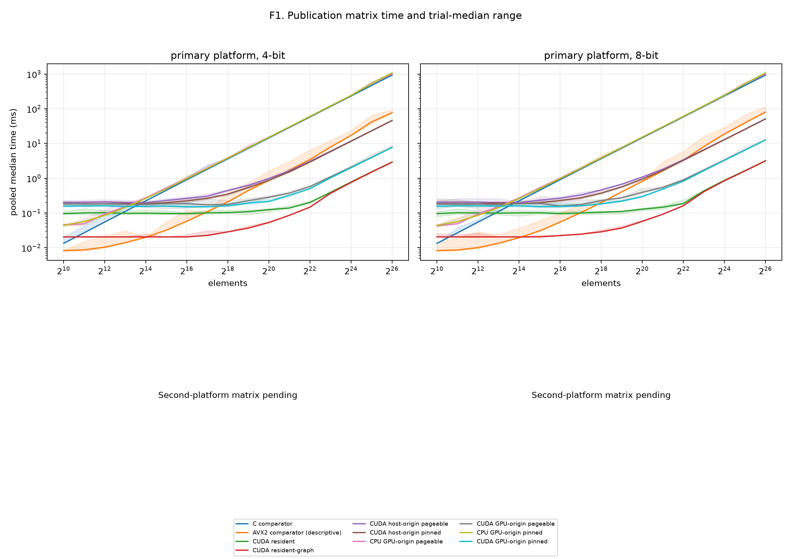
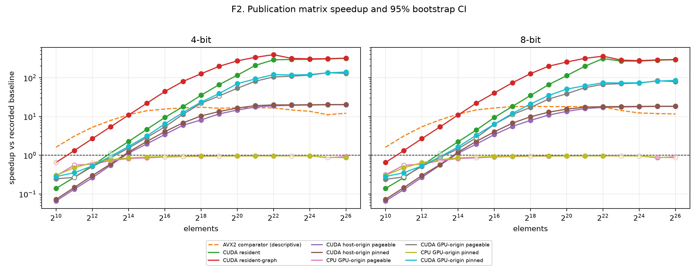
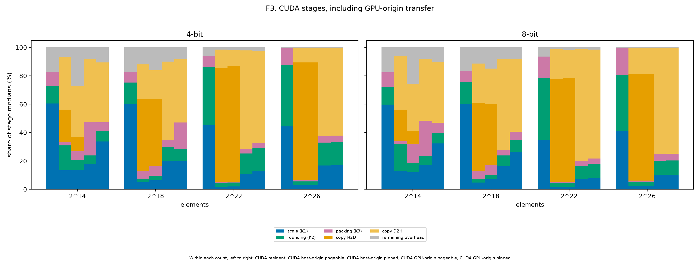
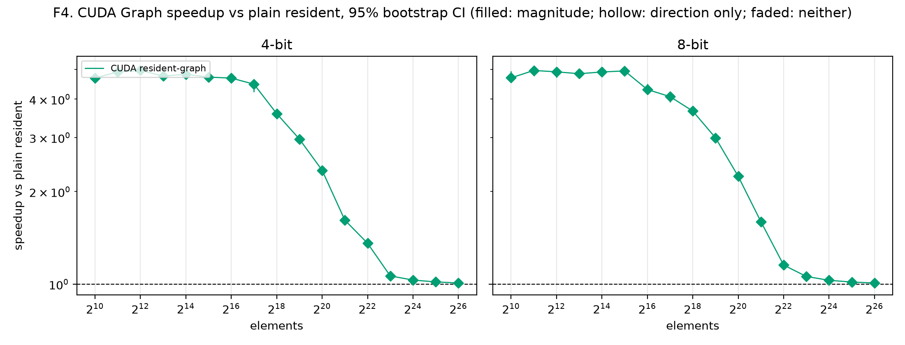
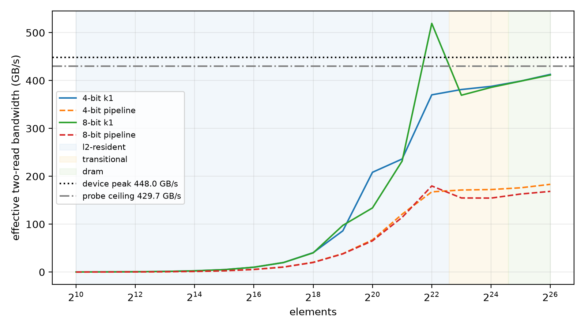

# Publication matrix report (sparse)

Revision `ec31947`; 340 cases; all passed: True.

## Input family

| Family | Inputs | Cells | Distinct counts |
|---|---:|---:|---:|
| sparse | 17 | 340 | 17 |

### Input provenance

| Input | Elements | Source detail |
|---|---:|---|
| sparse_n1024 | 1024 | zero target 0.9; realised 0.90234375 |
| sparse_n1048576 | 1048576 | zero target 0.9; realised 0.8996858596801758 |
| sparse_n131072 | 131072 | zero target 0.9; realised 0.8989639282226562 |
| sparse_n16384 | 16384 | zero target 0.9; realised 0.90057373046875 |
| sparse_n16777216 | 16777216 | zero target 0.9; realised 0.899998128414154 |
| sparse_n2048 | 2048 | zero target 0.9; realised 0.89697265625 |
| sparse_n2097152 | 2097152 | zero target 0.9; realised 0.8999919891357422 |
| sparse_n262144 | 262144 | zero target 0.9; realised 0.8994369506835938 |
| sparse_n32768 | 32768 | zero target 0.9; realised 0.89886474609375 |
| sparse_n33554432 | 33554432 | zero target 0.9; realised 0.9000427722930908 |
| sparse_n4096 | 4096 | zero target 0.9; realised 0.8994140625 |
| sparse_n4194304 | 4194304 | zero target 0.9; realised 0.8999440670013428 |
| sparse_n524288 | 524288 | zero target 0.9; realised 0.8998355865478516 |
| sparse_n65536 | 65536 | zero target 0.9; realised 0.898193359375 |
| sparse_n67108864 | 67108864 | zero target 0.9; realised 0.9000426977872849 |
| sparse_n8192 | 8192 | zero target 0.9; realised 0.9029541015625 |
| sparse_n8388608 | 8388608 | zero target 0.9; realised 0.9000654220581055 |

## Path comparisons

GPU-origin CUDA uses the policy-matched CPU GPU-origin baseline. Other CUDA paths use the scalar C comparator. AVX2 and cross-boundary GPU-origin comparisons are descriptive.

| Input | Elements | Bits | Path | Policy | Baseline | Median ms | Speedup and CI | Inversion |
|---|---:|---:|---|---|---|---:|---|---|
| sparse_n1024 | 1024 | 4 | cpu-avx2-optimized | none | cpu-comparator | 0.0083 | 1.61× [1.59, 1.61]; faster; direction=False; magnitude=False | False |
| sparse_n1024 | 1024 | 4 | cpu-comparator | none | — | 0.0134 | 1× [1, 1]; comparator; direction=False; magnitude=False | False |
| sparse_n1024 | 1024 | 4 | cpu-gpu-origin | pageable | cpu-comparator | 0.0457 | 0.293× [0.288, 0.317]; slower; direction=True; magnitude=True | False |
| sparse_n1024 | 1024 | 4 | cpu-gpu-origin-pinned | pinned | cpu-comparator | 0.0442 | 0.303× [0.302, 0.303]; slower; direction=True; magnitude=True | False |
| sparse_n1024 | 1024 | 4 | cuda-gpu-origin | pageable | cpu-gpu-origin | 0.1854 | 0.246× [0.228, 0.26]; slower; direction=True; magnitude=True | False |
| sparse_n1024 | 1024 | 4 | cuda-gpu-origin-pinned | pinned | cpu-gpu-origin-pinned | 0.1569 | 0.282× [0.273, 0.287]; slower; direction=True; magnitude=True | False |
| sparse_n1024 | 1024 | 4 | cuda-host-origin | pageable | cpu-comparator | 0.2025 | 0.0662× [0.0657, 0.0671]; slower; direction=True; magnitude=True | False |
| sparse_n1024 | 1024 | 4 | cuda-host-origin-pinned | pinned | cpu-comparator | 0.1838 | 0.0729× [0.0726, 0.0733]; slower; direction=True; magnitude=True | False |
| sparse_n1024 | 1024 | 4 | cuda-resident | none | cpu-comparator | 0.09605 | 0.14× [0.136, 0.141]; slower; direction=True; magnitude=True | False |
| sparse_n1024 | 1024 | 4 | cuda-resident-graph | none | cpu-comparator | 0.0205 | 0.654× [0.654, 0.654]; inconclusive; direction=False; magnitude=False | False |
| sparse_n1024 | 1024 | 8 | cpu-avx2-optimized | none | cpu-comparator | 0.0083 | 1.61× [1.6, 1.62]; inconclusive; direction=False; magnitude=False | False |
| sparse_n1024 | 1024 | 8 | cpu-comparator | none | — | 0.0134 | 1× [1, 1]; comparator; direction=False; magnitude=False | False |
| sparse_n1024 | 1024 | 8 | cpu-gpu-origin | pageable | cpu-comparator | 0.0428 | 0.313× [0.289, 0.318]; slower; direction=True; magnitude=True | False |
| sparse_n1024 | 1024 | 8 | cpu-gpu-origin-pinned | pinned | cpu-comparator | 0.0442 | 0.303× [0.302, 0.303]; slower; direction=True; magnitude=True | False |
| sparse_n1024 | 1024 | 8 | cuda-gpu-origin | pageable | cpu-gpu-origin | 0.1792 | 0.239× [0.225, 0.259]; slower; direction=True; magnitude=True | False |
| sparse_n1024 | 1024 | 8 | cuda-gpu-origin-pinned | pinned | cpu-gpu-origin-pinned | 0.1565 | 0.282× [0.275, 0.285]; slower; direction=True; magnitude=True | False |
| sparse_n1024 | 1024 | 8 | cuda-host-origin | pageable | cpu-comparator | 0.2024 | 0.0662× [0.0651, 0.0677]; slower; direction=True; magnitude=True | False |
| sparse_n1024 | 1024 | 8 | cuda-host-origin-pinned | pinned | cpu-comparator | 0.1835 | 0.073× [0.0729, 0.0733]; slower; direction=True; magnitude=True | False |
| sparse_n1024 | 1024 | 8 | cuda-resident | none | cpu-comparator | 0.0962 | 0.139× [0.132, 0.141]; slower; direction=True; magnitude=True | False |
| sparse_n1024 | 1024 | 8 | cuda-resident-graph | none | cpu-comparator | 0.0205 | 0.654× [0.654, 0.654]; slower; direction=True; magnitude=True | False |
| sparse_n1048576 | 1048576 | 4 | cpu-avx2-optimized | none | cpu-comparator | 0.8671 | 16.7× [16.7, 16.8]; faster; direction=False; magnitude=False | False |
| sparse_n1048576 | 1048576 | 4 | cpu-comparator | none | — | 14.49 | 1× [1, 1]; comparator; direction=False; magnitude=False | False |
| sparse_n1048576 | 1048576 | 4 | cpu-gpu-origin | pageable | cpu-comparator | 15.19 | 0.954× [0.954, 0.954]; slower; direction=True; magnitude=True | False |
| sparse_n1048576 | 1048576 | 4 | cpu-gpu-origin-pinned | pinned | cpu-comparator | 15.12 | 0.958× [0.958, 0.959]; slower; direction=True; magnitude=True | False |
| sparse_n1048576 | 1048576 | 4 | cuda-gpu-origin | pageable | cpu-gpu-origin | 0.2842 | 53.5× [53, 54.1]; faster; direction=True; magnitude=True | False |
| sparse_n1048576 | 1048576 | 4 | cuda-gpu-origin-pinned | pinned | cpu-gpu-origin-pinned | 0.2158 | 70.1× [69.5, 71.9]; faster; direction=True; magnitude=True | False |
| sparse_n1048576 | 1048576 | 4 | cuda-host-origin | pageable | cpu-comparator | 0.9891 | 14.7× [14.6, 14.7]; faster; direction=True; magnitude=True | False |
| sparse_n1048576 | 1048576 | 4 | cuda-host-origin-pinned | pinned | cpu-comparator | 0.8778 | 16.5× [16.4, 16.5]; faster; direction=True; magnitude=True | False |
| sparse_n1048576 | 1048576 | 4 | cuda-resident | none | cpu-comparator | 0.1248 | 116× [115, 117]; faster; direction=True; magnitude=True | False |
| sparse_n1048576 | 1048576 | 4 | cuda-resident-graph | none | cpu-comparator | 0.0532 | 272× [272, 272]; faster; direction=True; magnitude=True | False |
| sparse_n1048576 | 1048576 | 8 | cpu-avx2-optimized | none | cpu-comparator | 0.8123 | 18× [18, 18]; faster; direction=False; magnitude=False | False |
| sparse_n1048576 | 1048576 | 8 | cpu-comparator | none | — | 14.61 | 1× [1, 1]; comparator; direction=False; magnitude=False | False |
| sparse_n1048576 | 1048576 | 8 | cpu-gpu-origin | pageable | cpu-comparator | 15.3 | 0.955× [0.954, 0.955]; slower; direction=True; magnitude=True | False |
| sparse_n1048576 | 1048576 | 8 | cpu-gpu-origin-pinned | pinned | cpu-comparator | 15.24 | 0.959× [0.959, 0.959]; slower; direction=True; magnitude=True | False |
| sparse_n1048576 | 1048576 | 8 | cuda-gpu-origin | pageable | cpu-gpu-origin | 0.3952 | 38.7× [38.4, 39.6]; faster; direction=True; magnitude=True | False |
| sparse_n1048576 | 1048576 | 8 | cuda-gpu-origin-pinned | pinned | cpu-gpu-origin-pinned | 0.2994 | 50.9× [50.1, 52.3]; faster; direction=True; magnitude=True | False |
| sparse_n1048576 | 1048576 | 8 | cuda-host-origin | pageable | cpu-comparator | 1.08 | 13.5× [13.4, 14]; faster; direction=True; magnitude=True | False |
| sparse_n1048576 | 1048576 | 8 | cuda-host-origin-pinned | pinned | cpu-comparator | 0.9452 | 15.5× [15.3, 15.7]; faster; direction=True; magnitude=True | False |
| sparse_n1048576 | 1048576 | 8 | cuda-resident | none | cpu-comparator | 0.1285 | 114× [113, 115]; faster; direction=True; magnitude=True | False |
| sparse_n1048576 | 1048576 | 8 | cuda-resident-graph | none | cpu-comparator | 0.0573 | 255× [255, 255]; faster; direction=True; magnitude=True | False |
| sparse_n131072 | 131072 | 4 | cpu-avx2-optimized | none | cpu-comparator | 0.1087 | 16.7× [16.6, 16.7]; faster; direction=False; magnitude=False | False |
| sparse_n131072 | 131072 | 4 | cpu-comparator | none | — | 1.811 | 1× [1, 1]; comparator; direction=False; magnitude=False | False |
| sparse_n131072 | 131072 | 4 | cpu-gpu-origin | pageable | cpu-comparator | 1.959 | 0.924× [0.924, 0.925]; inconclusive; direction=False; magnitude=False | False |
| sparse_n131072 | 131072 | 4 | cpu-gpu-origin-pinned | pinned | cpu-comparator | 1.916 | 0.945× [0.945, 0.945]; inconclusive; direction=False; magnitude=False | False |
| sparse_n131072 | 131072 | 4 | cuda-gpu-origin | pageable | cpu-gpu-origin | 0.1723 | 11.4× [11.1, 12.3]; faster; direction=True; magnitude=True | False |
| sparse_n131072 | 131072 | 4 | cuda-gpu-origin-pinned | pinned | cpu-gpu-origin-pinned | 0.1513 | 12.7× [12.6, 12.8]; faster; direction=True; magnitude=True | False |
| sparse_n131072 | 131072 | 4 | cuda-host-origin | pageable | cpu-comparator | 0.3044 | 5.95× [5.87, 6.08]; faster; direction=True; magnitude=True | False |
| sparse_n131072 | 131072 | 4 | cuda-host-origin-pinned | pinned | cpu-comparator | 0.2651 | 6.83× [6.65, 6.93]; faster; direction=True; magnitude=True | False |
| sparse_n131072 | 131072 | 4 | cuda-resident | none | cpu-comparator | 0.1011 | 17.9× [17.6, 18.7]; faster; direction=True; magnitude=True | False |
| sparse_n131072 | 131072 | 4 | cuda-resident-graph | none | cpu-comparator | 0.0226 | 80.1× [77, 80.1]; faster; direction=True; magnitude=True | False |
| sparse_n131072 | 131072 | 8 | cpu-avx2-optimized | none | cpu-comparator | 0.1017 | 18× [17.9, 18]; faster; direction=False; magnitude=False | False |
| sparse_n131072 | 131072 | 8 | cpu-comparator | none | — | 1.826 | 1× [1, 1]; comparator; direction=False; magnitude=False | False |
| sparse_n131072 | 131072 | 8 | cpu-gpu-origin | pageable | cpu-comparator | 1.975 | 0.924× [0.924, 0.925]; slower; direction=True; magnitude=True | False |
| sparse_n131072 | 131072 | 8 | cpu-gpu-origin-pinned | pinned | cpu-comparator | 1.931 | 0.945× [0.945, 0.946]; slower; direction=True; magnitude=True | False |
| sparse_n131072 | 131072 | 8 | cuda-gpu-origin | pageable | cpu-gpu-origin | 0.1752 | 11.3× [10.7, 11.8]; faster; direction=True; magnitude=False | False |
| sparse_n131072 | 131072 | 8 | cuda-gpu-origin-pinned | pinned | cpu-gpu-origin-pinned | 0.1613 | 12× [11.8, 12.1]; faster; direction=True; magnitude=True | False |
| sparse_n131072 | 131072 | 8 | cuda-host-origin | pageable | cpu-comparator | 0.329 | 5.55× [5.47, 5.62]; faster; direction=True; magnitude=True | False |
| sparse_n131072 | 131072 | 8 | cuda-host-origin-pinned | pinned | cpu-comparator | 0.2712 | 6.73× [6.64, 6.81]; faster; direction=True; magnitude=True | False |
| sparse_n131072 | 131072 | 8 | cuda-resident | none | cpu-comparator | 0.1003 | 18.2× [17.9, 19]; faster; direction=True; magnitude=True | False |
| sparse_n131072 | 131072 | 8 | cuda-resident-graph | none | cpu-comparator | 0.0246 | 74.2× [74.2, 74.3]; faster; direction=True; magnitude=True | False |
| sparse_n16384 | 16384 | 4 | cpu-avx2-optimized | none | cpu-comparator | 0.02 | 11.2× [11.1, 11.2]; faster; direction=False; magnitude=False | False |
| sparse_n16384 | 16384 | 4 | cpu-comparator | none | — | 0.2232 | 1× [1, 1]; comparator; direction=False; magnitude=False | False |
| sparse_n16384 | 16384 | 4 | cpu-gpu-origin | pageable | cpu-comparator | 0.2722 | 0.82× [0.82, 0.821]; slower; direction=True; magnitude=True | False |
| sparse_n16384 | 16384 | 4 | cpu-gpu-origin-pinned | pinned | cpu-comparator | 0.2623 | 0.851× [0.851, 0.852]; slower; direction=True; magnitude=True | False |
| sparse_n16384 | 16384 | 4 | cuda-gpu-origin | pageable | cpu-gpu-origin | 0.1771 | 1.54× [1.52, 1.57]; faster; direction=True; magnitude=True | False |
| sparse_n16384 | 16384 | 4 | cuda-gpu-origin-pinned | pinned | cpu-gpu-origin-pinned | 0.1557 | 1.68× [1.66, 1.69]; faster; direction=True; magnitude=True | False |
| sparse_n16384 | 16384 | 4 | cuda-host-origin | pageable | cpu-comparator | 0.1961 | 1.14× [1.12, 1.16]; faster; direction=True; magnitude=True | False |
| sparse_n16384 | 16384 | 4 | cuda-host-origin-pinned | pinned | cpu-comparator | 0.184 | 1.21× [1.22, 1.24]; faster; direction=True; magnitude=True | False |
| sparse_n16384 | 16384 | 4 | cuda-resident | none | cpu-comparator | 0.09875 | 2.26× [2.24, 2.29]; faster; direction=True; magnitude=True | False |
| sparse_n16384 | 16384 | 4 | cuda-resident-graph | none | cpu-comparator | 0.0205 | 10.9× [10.9, 10.9]; faster; direction=True; magnitude=True | False |
| sparse_n16384 | 16384 | 8 | cpu-avx2-optimized | none | cpu-comparator | 0.0195 | 11.5× [11.4, 11.6]; faster; direction=False; magnitude=False | False |
| sparse_n16384 | 16384 | 8 | cpu-comparator | none | — | 0.2235 | 1× [1, 1]; comparator; direction=False; magnitude=False | False |
| sparse_n16384 | 16384 | 8 | cpu-gpu-origin | pageable | cpu-comparator | 0.2723 | 0.821× [0.82, 0.821]; slower; direction=True; magnitude=True | False |
| sparse_n16384 | 16384 | 8 | cpu-gpu-origin-pinned | pinned | cpu-comparator | 0.2626 | 0.851× [0.851, 0.852]; slower; direction=True; magnitude=True | False |
| sparse_n16384 | 16384 | 8 | cuda-gpu-origin | pageable | cpu-gpu-origin | 0.1856 | 1.47× [1.44, 1.47]; faster; direction=True; magnitude=True | False |
| sparse_n16384 | 16384 | 8 | cuda-gpu-origin-pinned | pinned | cpu-gpu-origin-pinned | 0.1603 | 1.64× [1.6, 1.66]; faster; direction=True; magnitude=True | False |
| sparse_n16384 | 16384 | 8 | cuda-host-origin | pageable | cpu-comparator | 0.1986 | 1.13× [1.12, 1.14]; faster; direction=True; magnitude=True | False |
| sparse_n16384 | 16384 | 8 | cuda-host-origin-pinned | pinned | cpu-comparator | 0.1857 | 1.2× [1.18, 1.22]; faster; direction=True; magnitude=True | False |
| sparse_n16384 | 16384 | 8 | cuda-resident | none | cpu-comparator | 0.1005 | 2.22× [2.18, 2.28]; faster; direction=True; magnitude=True | False |
| sparse_n16384 | 16384 | 8 | cuda-resident-graph | none | cpu-comparator | 0.0205 | 10.9× [10.9, 10.9]; faster; direction=True; magnitude=True | False |
| sparse_n16777216 | 16777216 | 4 | cpu-avx2-optimized | none | cpu-comparator | 17.09 | 13.6× [13.5, 13.7]; faster; direction=False; magnitude=False | False |
| sparse_n16777216 | 16777216 | 4 | cpu-comparator | none | — | 232.2 | 1× [1, 1]; comparator; direction=False; magnitude=False | False |
| sparse_n16777216 | 16777216 | 4 | cpu-gpu-origin | pageable | cpu-comparator | 241.9 | 0.96× [0.959, 0.961]; slower; direction=True; magnitude=True | False |
| sparse_n16777216 | 16777216 | 4 | cpu-gpu-origin-pinned | pinned | cpu-comparator | 241.7 | 0.961× [0.96, 0.961]; slower; direction=True; magnitude=True | False |
| sparse_n16777216 | 16777216 | 4 | cuda-gpu-origin | pageable | cpu-gpu-origin | 2.074 | 117× [117, 117]; faster; direction=True; magnitude=True | False |
| sparse_n16777216 | 16777216 | 4 | cuda-gpu-origin-pinned | pinned | cpu-gpu-origin-pinned | 2.003 | 121× [121, 121]; faster; direction=True; magnitude=True | False |
| sparse_n16777216 | 16777216 | 4 | cuda-host-origin | pageable | cpu-comparator | 11.76 | 19.7× [19.7, 19.8]; faster; direction=True; magnitude=True | False |
| sparse_n16777216 | 16777216 | 4 | cuda-host-origin-pinned | pinned | cpu-comparator | 11.56 | 20.1× [20.1, 20.1]; faster; direction=True; magnitude=True | False |
| sparse_n16777216 | 16777216 | 4 | cuda-resident | none | cpu-comparator | 0.7788 | 298× [298, 298]; faster; direction=True; magnitude=True | False |
| sparse_n16777216 | 16777216 | 4 | cuda-resident-graph | none | cpu-comparator | 0.7556 | 307× [307, 308]; faster; direction=True; magnitude=True | False |
| sparse_n16777216 | 16777216 | 8 | cpu-avx2-optimized | none | cpu-comparator | 18.91 | 12.3× [11.8, 13]; faster; direction=False; magnitude=False | False |
| sparse_n16777216 | 16777216 | 8 | cpu-comparator | none | — | 233 | 1× [1, 1]; comparator; direction=False; magnitude=False | False |
| sparse_n16777216 | 16777216 | 8 | cpu-gpu-origin | pageable | cpu-comparator | 243.1 | 0.958× [0.956, 0.962]; inconclusive; direction=False; magnitude=False | False |
| sparse_n16777216 | 16777216 | 8 | cpu-gpu-origin-pinned | pinned | cpu-comparator | 243 | 0.959× [0.957, 0.962]; inconclusive; direction=False; magnitude=False | False |
| sparse_n16777216 | 16777216 | 8 | cuda-gpu-origin | pageable | cpu-gpu-origin | 3.343 | 72.7× [72.5, 72.9]; faster; direction=True; magnitude=True | False |
| sparse_n16777216 | 16777216 | 8 | cuda-gpu-origin-pinned | pinned | cpu-gpu-origin-pinned | 3.267 | 74.4× [74.2, 74.5]; faster; direction=True; magnitude=True | False |
| sparse_n16777216 | 16777216 | 8 | cuda-host-origin | pageable | cpu-comparator | 13.03 | 17.9× [17.9, 17.9]; faster; direction=True; magnitude=True | False |
| sparse_n16777216 | 16777216 | 8 | cuda-host-origin-pinned | pinned | cpu-comparator | 12.83 | 18.2× [18.1, 18.2]; faster; direction=True; magnitude=True | False |
| sparse_n16777216 | 16777216 | 8 | cuda-resident | none | cpu-comparator | 0.8689 | 268× [268, 269]; faster; direction=True; magnitude=True | False |
| sparse_n16777216 | 16777216 | 8 | cuda-resident-graph | none | cpu-comparator | 0.8447 | 276× [276, 276]; faster; direction=True; magnitude=True | False |
| sparse_n2048 | 2048 | 4 | cpu-avx2-optimized | none | cpu-comparator | 0.0087 | 3.1× [3.09, 3.15]; faster; direction=False; magnitude=False | False |
| sparse_n2048 | 2048 | 4 | cpu-comparator | none | — | 0.027 | 1× [1, 1]; comparator; direction=False; magnitude=False | False |
| sparse_n2048 | 2048 | 4 | cpu-gpu-origin | pageable | cpu-comparator | 0.0486 | 0.556× [0.555, 0.558]; slower; direction=True; magnitude=False | False |
| sparse_n2048 | 2048 | 4 | cpu-gpu-origin-pinned | pinned | cpu-comparator | 0.0567 | 0.476× [0.475, 0.478]; slower; direction=True; magnitude=True | False |
| sparse_n2048 | 2048 | 4 | cuda-gpu-origin | pageable | cpu-gpu-origin | 0.1814 | 0.268× [0.259, 0.27]; slower; direction=True; magnitude=False | False |
| sparse_n2048 | 2048 | 4 | cuda-gpu-origin-pinned | pinned | cpu-gpu-origin-pinned | 0.1604 | 0.353× [0.349, 0.363]; slower; direction=True; magnitude=True | False |
| sparse_n2048 | 2048 | 4 | cuda-host-origin | pageable | cpu-comparator | 0.2032 | 0.133× [0.131, 0.135]; slower; direction=True; magnitude=True | False |
| sparse_n2048 | 2048 | 4 | cuda-host-origin-pinned | pinned | cpu-comparator | 0.1833 | 0.147× [0.147, 0.148]; slower; direction=True; magnitude=True | False |
| sparse_n2048 | 2048 | 4 | cuda-resident | none | cpu-comparator | 0.1006 | 0.269× [0.263, 0.277]; slower; direction=True; magnitude=True | False |
| sparse_n2048 | 2048 | 4 | cuda-resident-graph | none | cpu-comparator | 0.0205 | 1.32× [1.32, 1.32]; faster; direction=True; magnitude=True | False |
| sparse_n2048 | 2048 | 8 | cpu-avx2-optimized | none | cpu-comparator | 0.0086 | 3.13× [3.11, 3.18]; faster; direction=False; magnitude=False | False |
| sparse_n2048 | 2048 | 8 | cpu-comparator | none | — | 0.0269 | 1× [1, 1]; comparator; direction=False; magnitude=False | False |
| sparse_n2048 | 2048 | 8 | cpu-gpu-origin | pageable | cpu-comparator | 0.04895 | 0.55× [0.432, 0.556]; slower; direction=True; magnitude=False | False |
| sparse_n2048 | 2048 | 8 | cpu-gpu-origin-pinned | pinned | cpu-comparator | 0.0568 | 0.474× [0.472, 0.475]; slower; direction=True; magnitude=True | False |
| sparse_n2048 | 2048 | 8 | cuda-gpu-origin | pageable | cpu-gpu-origin | 0.1776 | 0.276× [0.267, 0.351]; slower; direction=True; magnitude=False | False |
| sparse_n2048 | 2048 | 8 | cuda-gpu-origin-pinned | pinned | cpu-gpu-origin-pinned | 0.1609 | 0.353× [0.342, 0.364]; slower; direction=True; magnitude=True | False |
| sparse_n2048 | 2048 | 8 | cuda-host-origin | pageable | cpu-comparator | 0.2068 | 0.13× [0.128, 0.132]; slower; direction=True; magnitude=True | False |
| sparse_n2048 | 2048 | 8 | cuda-host-origin-pinned | pinned | cpu-comparator | 0.1844 | 0.146× [0.146, 0.147]; slower; direction=True; magnitude=True | False |
| sparse_n2048 | 2048 | 8 | cuda-resident | none | cpu-comparator | 0.1016 | 0.265× [0.26, 0.276]; slower; direction=True; magnitude=True | False |
| sparse_n2048 | 2048 | 8 | cuda-resident-graph | none | cpu-comparator | 0.0205 | 1.31× [1.31, 1.32]; faster; direction=True; magnitude=True | False |
| sparse_n2097152 | 2097152 | 4 | cpu-avx2-optimized | none | cpu-comparator | 1.724 | 16.8× [16.8, 16.9]; faster; direction=False; magnitude=False | False |
| sparse_n2097152 | 2097152 | 4 | cpu-comparator | none | — | 28.98 | 1× [1, 1]; comparator; direction=False; magnitude=False | False |
| sparse_n2097152 | 2097152 | 4 | cpu-gpu-origin | pageable | cpu-comparator | 30.27 | 0.957× [0.957, 0.958]; slower; direction=True; magnitude=True | False |
| sparse_n2097152 | 2097152 | 4 | cpu-gpu-origin-pinned | pinned | cpu-comparator | 30.2 | 0.96× [0.959, 0.96]; slower; direction=True; magnitude=True | False |
| sparse_n2097152 | 2097152 | 4 | cuda-gpu-origin | pageable | cpu-gpu-origin | 0.3725 | 81.3× [81.1, 81.6]; faster; direction=True; magnitude=True | False |
| sparse_n2097152 | 2097152 | 4 | cuda-gpu-origin-pinned | pinned | cpu-gpu-origin-pinned | 0.3236 | 93.3× [92.6, 94.3]; faster; direction=True; magnitude=True | False |
| sparse_n2097152 | 2097152 | 4 | cuda-host-origin | pageable | cpu-comparator | 1.652 | 17.5× [17.5, 17.6]; faster; direction=True; magnitude=True | False |
| sparse_n2097152 | 2097152 | 4 | cuda-host-origin-pinned | pinned | cpu-comparator | 1.52 | 19.1× [19.1, 19.1]; faster; direction=True; magnitude=True | False |
| sparse_n2097152 | 2097152 | 4 | cuda-resident | none | cpu-comparator | 0.1389 | 209× [207, 209]; faster; direction=True; magnitude=True | False |
| sparse_n2097152 | 2097152 | 4 | cuda-resident-graph | none | cpu-comparator | 0.086 | 337× [337, 337]; faster; direction=True; magnitude=True | False |
| sparse_n2097152 | 2097152 | 8 | cpu-avx2-optimized | none | cpu-comparator | 1.623 | 18× [17.9, 18.1]; faster; direction=False; magnitude=False | False |
| sparse_n2097152 | 2097152 | 8 | cpu-comparator | none | — | 29.15 | 1× [1, 1]; comparator; direction=False; magnitude=False | False |
| sparse_n2097152 | 2097152 | 8 | cpu-gpu-origin | pageable | cpu-comparator | 30.43 | 0.958× [0.958, 0.958]; slower; direction=True; magnitude=True | False |
| sparse_n2097152 | 2097152 | 8 | cpu-gpu-origin-pinned | pinned | cpu-comparator | 30.36 | 0.96× [0.96, 0.96]; slower; direction=True; magnitude=True | False |
| sparse_n2097152 | 2097152 | 8 | cuda-gpu-origin | pageable | cpu-gpu-origin | 0.5488 | 55.5× [55.2, 56]; faster; direction=True; magnitude=True | False |
| sparse_n2097152 | 2097152 | 8 | cuda-gpu-origin-pinned | pinned | cpu-gpu-origin-pinned | 0.4892 | 62.1× [61.9, 62.1]; faster; direction=True; magnitude=True | False |
| sparse_n2097152 | 2097152 | 8 | cuda-host-origin | pageable | cpu-comparator | 1.82 | 16× [15.9, 16.2]; faster; direction=True; magnitude=True | False |
| sparse_n2097152 | 2097152 | 8 | cuda-host-origin-pinned | pinned | cpu-comparator | 1.679 | 17.4× [17.3, 17.5]; faster; direction=True; magnitude=True | False |
| sparse_n2097152 | 2097152 | 8 | cuda-resident | none | cpu-comparator | 0.147 | 198× [198, 199]; faster; direction=True; magnitude=True | False |
| sparse_n2097152 | 2097152 | 8 | cuda-resident-graph | none | cpu-comparator | 0.0921 | 316× [316, 316]; faster; direction=True; magnitude=True | False |
| sparse_n262144 | 262144 | 4 | cpu-avx2-optimized | none | cpu-comparator | 0.2091 | 17.3× [17.3, 17.4]; faster; direction=False; magnitude=False | False |
| sparse_n262144 | 262144 | 4 | cpu-comparator | none | — | 3.621 | 1× [1, 1]; comparator; direction=False; magnitude=False | False |
| sparse_n262144 | 262144 | 4 | cpu-gpu-origin | pageable | cpu-comparator | 3.875 | 0.934× [0.934, 0.935]; slower; direction=True; magnitude=True | False |
| sparse_n262144 | 262144 | 4 | cpu-gpu-origin-pinned | pinned | cpu-comparator | 3.805 | 0.952× [0.951, 0.952]; slower; direction=True; magnitude=True | False |
| sparse_n262144 | 262144 | 4 | cuda-gpu-origin | pageable | cpu-gpu-origin | 0.1768 | 21.9× [20.8, 22.7]; faster; direction=True; magnitude=False | False |
| sparse_n262144 | 262144 | 4 | cuda-gpu-origin-pinned | pinned | cpu-gpu-origin-pinned | 0.1619 | 23.5× [22.9, 23.8]; faster; direction=True; magnitude=True | False |
| sparse_n262144 | 262144 | 4 | cuda-host-origin | pageable | cpu-comparator | 0.4456 | 8.13× [8.03, 8.24]; faster; direction=True; magnitude=True | False |
| sparse_n262144 | 262144 | 4 | cuda-host-origin-pinned | pinned | cpu-comparator | 0.3503 | 10.3× [10.2, 10.5]; faster; direction=True; magnitude=True | False |
| sparse_n262144 | 262144 | 4 | cuda-resident | none | cpu-comparator | 0.1026 | 35.3× [34.8, 36.3]; faster; direction=True; magnitude=True | False |
| sparse_n262144 | 262144 | 4 | cuda-resident-graph | none | cpu-comparator | 0.0286 | 127× [127, 127]; faster; direction=True; magnitude=True | False |
| sparse_n262144 | 262144 | 8 | cpu-avx2-optimized | none | cpu-comparator | 0.1994 | 18.4× [18.3, 18.4]; faster; direction=False; magnitude=False | False |
| sparse_n262144 | 262144 | 8 | cpu-comparator | none | — | 3.662 | 1× [1, 1]; comparator; direction=False; magnitude=False | False |
| sparse_n262144 | 262144 | 8 | cpu-gpu-origin | pageable | cpu-comparator | 3.914 | 0.936× [0.935, 0.936]; inconclusive; direction=False; magnitude=False | False |
| sparse_n262144 | 262144 | 8 | cpu-gpu-origin-pinned | pinned | cpu-comparator | 3.845 | 0.952× [0.952, 0.953]; inconclusive; direction=False; magnitude=False | False |
| sparse_n262144 | 262144 | 8 | cuda-gpu-origin | pageable | cpu-gpu-origin | 0.2287 | 17.1× [16.9, 17.2]; faster; direction=True; magnitude=True | False |
| sparse_n262144 | 262144 | 8 | cuda-gpu-origin-pinned | pinned | cpu-gpu-origin-pinned | 0.1826 | 21.1× [20.8, 21.4]; faster; direction=True; magnitude=True | False |
| sparse_n262144 | 262144 | 8 | cuda-host-origin | pageable | cpu-comparator | 0.4617 | 7.93× [7.82, 7.99]; faster; direction=True; magnitude=True | False |
| sparse_n262144 | 262144 | 8 | cuda-host-origin-pinned | pinned | cpu-comparator | 0.3722 | 9.84× [9.8, 9.94]; faster; direction=True; magnitude=True | False |
| sparse_n262144 | 262144 | 8 | cuda-resident | none | cpu-comparator | 0.1049 | 34.9× [34.1, 36]; faster; direction=True; magnitude=True | False |
| sparse_n262144 | 262144 | 8 | cuda-resident-graph | none | cpu-comparator | 0.0287 | 128× [127, 128]; faster; direction=True; magnitude=True | False |
| sparse_n32768 | 32768 | 4 | cpu-avx2-optimized | none | cpu-comparator | 0.032 | 14.1× [14, 14.1]; faster; direction=False; magnitude=False | False |
| sparse_n32768 | 32768 | 4 | cpu-comparator | none | — | 0.4498 | 1× [1, 1]; comparator; direction=False; magnitude=False | False |
| sparse_n32768 | 32768 | 4 | cpu-gpu-origin | pageable | cpu-comparator | 0.527 | 0.854× [0.853, 0.854]; slower; direction=True; magnitude=True | False |
| sparse_n32768 | 32768 | 4 | cpu-gpu-origin-pinned | pinned | cpu-comparator | 0.4987 | 0.902× [0.902, 0.902]; slower; direction=True; magnitude=True | False |
| sparse_n32768 | 32768 | 4 | cuda-gpu-origin | pageable | cpu-gpu-origin | 0.184 | 2.86× [2.85, 2.92]; faster; direction=True; magnitude=True | False |
| sparse_n32768 | 32768 | 4 | cuda-gpu-origin-pinned | pinned | cpu-gpu-origin-pinned | 0.1589 | 3.14× [3.09, 3.17]; faster; direction=True; magnitude=True | False |
| sparse_n32768 | 32768 | 4 | cuda-host-origin | pageable | cpu-comparator | 0.2299 | 1.96× [1.94, 2]; faster; direction=True; magnitude=True | False |
| sparse_n32768 | 32768 | 4 | cuda-host-origin-pinned | pinned | cpu-comparator | 0.1989 | 2.26× [2.25, 2.28]; faster; direction=True; magnitude=True | False |
| sparse_n32768 | 32768 | 4 | cuda-resident | none | cpu-comparator | 0.0967 | 4.65× [4.51, 4.76]; faster; direction=True; magnitude=True | False |
| sparse_n32768 | 32768 | 4 | cuda-resident-graph | none | cpu-comparator | 0.0205 | 21.9× [21.9, 21.9]; faster; direction=True; magnitude=True | False |
| sparse_n32768 | 32768 | 8 | cpu-avx2-optimized | none | cpu-comparator | 0.0306 | 14.7× [14.7, 14.9]; faster; direction=False; magnitude=False | False |
| sparse_n32768 | 32768 | 8 | cpu-comparator | none | — | 0.4511 | 1× [1, 1]; comparator; direction=False; magnitude=False | False |
| sparse_n32768 | 32768 | 8 | cpu-gpu-origin | pageable | cpu-comparator | 0.5288 | 0.853× [0.853, 0.854]; inconclusive; direction=False; magnitude=False | False |
| sparse_n32768 | 32768 | 8 | cpu-gpu-origin-pinned | pinned | cpu-comparator | 0.5013 | 0.9× [0.897, 0.902]; inconclusive; direction=False; magnitude=False | False |
| sparse_n32768 | 32768 | 8 | cuda-gpu-origin | pageable | cpu-gpu-origin | 0.1883 | 2.81× [2.72, 2.9]; faster; direction=True; magnitude=False | False |
| sparse_n32768 | 32768 | 8 | cuda-gpu-origin-pinned | pinned | cpu-gpu-origin-pinned | 0.1532 | 3.27× [3.14, 3.36]; faster; direction=True; magnitude=True | False |
| sparse_n32768 | 32768 | 8 | cuda-host-origin | pageable | cpu-comparator | 0.2334 | 1.93× [1.91, 1.97]; faster; direction=True; magnitude=True | False |
| sparse_n32768 | 32768 | 8 | cuda-host-origin-pinned | pinned | cpu-comparator | 0.1985 | 2.27× [2.24, 2.3]; faster; direction=True; magnitude=True | False |
| sparse_n32768 | 32768 | 8 | cuda-resident | none | cpu-comparator | 0.1013 | 4.45× [4.35, 4.58]; faster; direction=True; magnitude=True | False |
| sparse_n32768 | 32768 | 8 | cuda-resident-graph | none | cpu-comparator | 0.0205 | 22× [22, 22]; faster; direction=True; magnitude=True | False |
| sparse_n33554432 | 33554432 | 4 | cpu-avx2-optimized | none | cpu-comparator | 41.94 | 11.1× [10.3, 11.5]; faster; direction=False; magnitude=False | False |
| sparse_n33554432 | 33554432 | 4 | cpu-comparator | none | — | 466.8 | 1× [1, 1]; comparator; direction=False; magnitude=False | False |
| sparse_n33554432 | 33554432 | 4 | cpu-gpu-origin | pageable | cpu-comparator | 539.8 | 0.865× [0.862, 0.872]; inconclusive; direction=False; magnitude=False | False |
| sparse_n33554432 | 33554432 | 4 | cpu-gpu-origin-pinned | pinned | cpu-comparator | 527.2 | 0.885× [0.866, 0.917]; inconclusive; direction=False; magnitude=False | False |
| sparse_n33554432 | 33554432 | 4 | cuda-gpu-origin | pageable | cpu-gpu-origin | 4.003 | 135× [134, 135]; faster; direction=True; magnitude=True | False |
| sparse_n33554432 | 33554432 | 4 | cuda-gpu-origin-pinned | pinned | cpu-gpu-origin-pinned | 3.926 | 134× [130, 137]; faster; direction=True; magnitude=True | False |
| sparse_n33554432 | 33554432 | 4 | cuda-host-origin | pageable | cpu-comparator | 23.29 | 20× [20, 20.1]; faster; direction=True; magnitude=True | False |
| sparse_n33554432 | 33554432 | 4 | cuda-host-origin-pinned | pinned | cpu-comparator | 23.03 | 20.3× [20.2, 20.4]; faster; direction=True; magnitude=True | False |
| sparse_n33554432 | 33554432 | 4 | cuda-resident | none | cpu-comparator | 1.525 | 306× [305, 307]; faster; direction=True; magnitude=True | False |
| sparse_n33554432 | 33554432 | 4 | cuda-resident-graph | none | cpu-comparator | 1.501 | 311× [310, 312]; faster; direction=True; magnitude=True | False |
| sparse_n33554432 | 33554432 | 8 | cpu-avx2-optimized | none | cpu-comparator | 39.22 | 11.9× [11, 12.2]; faster; direction=False; magnitude=False | False |
| sparse_n33554432 | 33554432 | 8 | cpu-comparator | none | — | 467.1 | 1× [1, 1]; comparator; direction=False; magnitude=False | False |
| sparse_n33554432 | 33554432 | 8 | cpu-gpu-origin | pageable | cpu-comparator | 540.8 | 0.864× [0.862, 0.925]; slower; direction=True; magnitude=True | False |
| sparse_n33554432 | 33554432 | 8 | cpu-gpu-origin-pinned | pinned | cpu-comparator | 524.4 | 0.891× [0.863, 0.924]; inconclusive; direction=False; magnitude=False | False |
| sparse_n33554432 | 33554432 | 8 | cuda-gpu-origin | pageable | cpu-gpu-origin | 6.473 | 83.5× [78, 83.7]; faster; direction=True; magnitude=True | False |
| sparse_n33554432 | 33554432 | 8 | cuda-gpu-origin-pinned | pinned | cpu-gpu-origin-pinned | 6.4 | 81.9× [78.9, 84.5]; faster; direction=True; magnitude=True | False |
| sparse_n33554432 | 33554432 | 8 | cuda-host-origin | pageable | cpu-comparator | 25.73 | 18.2× [18.1, 18.2]; faster; direction=True; magnitude=True | False |
| sparse_n33554432 | 33554432 | 8 | cuda-host-origin-pinned | pinned | cpu-comparator | 25.45 | 18.4× [18.3, 18.4]; faster; direction=True; magnitude=True | False |
| sparse_n33554432 | 33554432 | 8 | cuda-resident | none | cpu-comparator | 1.647 | 284× [283, 284]; faster; direction=True; magnitude=True | False |
| sparse_n33554432 | 33554432 | 8 | cuda-resident-graph | none | cpu-comparator | 1.622 | 288× [288, 288]; faster; direction=True; magnitude=True | False |
| sparse_n4096 | 4096 | 4 | cpu-avx2-optimized | none | cpu-comparator | 0.0104 | 5.28× [5.23, 5.41]; faster; direction=False; magnitude=False | False |
| sparse_n4096 | 4096 | 4 | cpu-comparator | none | — | 0.0549 | 1× [1, 1]; comparator; direction=False; magnitude=False | False |
| sparse_n4096 | 4096 | 4 | cpu-gpu-origin | pageable | cpu-comparator | 0.0936 | 0.587× [0.586, 0.588]; slower; direction=True; magnitude=True | False |
| sparse_n4096 | 4096 | 4 | cpu-gpu-origin-pinned | pinned | cpu-comparator | 0.0858 | 0.64× [0.64, 0.642]; inconclusive; direction=False; magnitude=False | False |
| sparse_n4096 | 4096 | 4 | cuda-gpu-origin | pageable | cpu-gpu-origin | 0.1827 | 0.512× [0.5, 0.517]; slower; direction=True; magnitude=True | False |
| sparse_n4096 | 4096 | 4 | cuda-gpu-origin-pinned | pinned | cpu-gpu-origin-pinned | 0.1613 | 0.532× [0.525, 0.538]; slower; direction=True; magnitude=True | False |
| sparse_n4096 | 4096 | 4 | cuda-host-origin | pageable | cpu-comparator | 0.2097 | 0.262× [0.257, 0.265]; slower; direction=True; magnitude=True | False |
| sparse_n4096 | 4096 | 4 | cuda-host-origin-pinned | pinned | cpu-comparator | 0.1839 | 0.299× [0.297, 0.302]; slower; direction=True; magnitude=True | False |
| sparse_n4096 | 4096 | 4 | cuda-resident | none | cpu-comparator | 0.1017 | 0.54× [0.526, 0.558]; inconclusive; direction=False; magnitude=False | False |
| sparse_n4096 | 4096 | 4 | cuda-resident-graph | none | cpu-comparator | 0.0205 | 2.68× [2.68, 2.68]; faster; direction=True; magnitude=True | False |
| sparse_n4096 | 4096 | 8 | cpu-avx2-optimized | none | cpu-comparator | 0.0101 | 5.43× [5.37, 5.44]; faster; direction=False; magnitude=False | False |
| sparse_n4096 | 4096 | 8 | cpu-comparator | none | — | 0.0548 | 1× [1, 1]; comparator; direction=False; magnitude=False | False |
| sparse_n4096 | 4096 | 8 | cpu-gpu-origin | pageable | cpu-comparator | 0.0934 | 0.587× [0.586, 0.588]; slower; direction=True; magnitude=True | False |
| sparse_n4096 | 4096 | 8 | cpu-gpu-origin-pinned | pinned | cpu-comparator | 0.0856 | 0.64× [0.638, 0.643]; slower; direction=True; magnitude=True | False |
| sparse_n4096 | 4096 | 8 | cuda-gpu-origin | pageable | cpu-gpu-origin | 0.1809 | 0.516× [0.503, 0.527]; slower; direction=True; magnitude=True | False |
| sparse_n4096 | 4096 | 8 | cuda-gpu-origin-pinned | pinned | cpu-gpu-origin-pinned | 0.1609 | 0.532× [0.524, 0.55]; slower; direction=True; magnitude=True | False |
| sparse_n4096 | 4096 | 8 | cuda-host-origin | pageable | cpu-comparator | 0.2049 | 0.267× [0.264, 0.272]; slower; direction=True; magnitude=True | False |
| sparse_n4096 | 4096 | 8 | cuda-host-origin-pinned | pinned | cpu-comparator | 0.1834 | 0.299× [0.298, 0.3]; slower; direction=True; magnitude=True | False |
| sparse_n4096 | 4096 | 8 | cuda-resident | none | cpu-comparator | 0.1006 | 0.545× [0.531, 0.569]; slower; direction=True; magnitude=True | False |
| sparse_n4096 | 4096 | 8 | cuda-resident-graph | none | cpu-comparator | 0.0205 | 2.67× [2.67, 2.68]; faster; direction=True; magnitude=True | False |
| sparse_n4194304 | 4194304 | 4 | cpu-avx2-optimized | none | cpu-comparator | 3.472 | 16.7× [16.7, 16.8]; faster; direction=False; magnitude=False | False |
| sparse_n4194304 | 4194304 | 4 | cpu-comparator | none | — | 58 | 1× [1, 1]; comparator; direction=False; magnitude=False | False |
| sparse_n4194304 | 4194304 | 4 | cpu-gpu-origin | pageable | cpu-comparator | 60.46 | 0.959× [0.959, 0.96]; slower; direction=True; magnitude=True | False |
| sparse_n4194304 | 4194304 | 4 | cpu-gpu-origin-pinned | pinned | cpu-comparator | 60.39 | 0.96× [0.96, 0.961]; slower; direction=True; magnitude=True | False |
| sparse_n4194304 | 4194304 | 4 | cuda-gpu-origin | pageable | cpu-gpu-origin | 0.5755 | 105× [105, 105]; faster; direction=True; magnitude=True | False |
| sparse_n4194304 | 4194304 | 4 | cuda-gpu-origin-pinned | pinned | cpu-gpu-origin-pinned | 0.501 | 121× [118, 121]; faster; direction=True; magnitude=True | False |
| sparse_n4194304 | 4194304 | 4 | cuda-host-origin | pageable | cpu-comparator | 3.075 | 18.9× [18.9, 19]; faster; direction=True; magnitude=True | False |
| sparse_n4194304 | 4194304 | 4 | cuda-host-origin-pinned | pinned | cpu-comparator | 2.919 | 19.9× [19.9, 19.9]; faster; direction=True; magnitude=True | False |
| sparse_n4194304 | 4194304 | 4 | cuda-resident | none | cpu-comparator | 0.2003 | 290× [289, 290]; faster; direction=True; magnitude=True | False |
| sparse_n4194304 | 4194304 | 4 | cuda-resident-graph | none | cpu-comparator | 0.1475 | 393× [391, 393]; faster; direction=True; magnitude=True | False |
| sparse_n4194304 | 4194304 | 8 | cpu-avx2-optimized | none | cpu-comparator | 3.323 | 17.5× [17.3, 17.7]; faster; direction=False; magnitude=False | False |
| sparse_n4194304 | 4194304 | 8 | cpu-comparator | none | — | 58.23 | 1× [1, 1]; comparator; direction=False; magnitude=False | False |
| sparse_n4194304 | 4194304 | 8 | cpu-gpu-origin | pageable | cpu-comparator | 60.7 | 0.959× [0.959, 0.96]; slower; direction=True; magnitude=True | False |
| sparse_n4194304 | 4194304 | 8 | cpu-gpu-origin-pinned | pinned | cpu-comparator | 60.62 | 0.961× [0.96, 0.961]; slower; direction=True; magnitude=True | False |
| sparse_n4194304 | 4194304 | 8 | cuda-gpu-origin | pageable | cpu-gpu-origin | 0.8974 | 67.6× [67.6, 67.7]; faster; direction=True; magnitude=True | False |
| sparse_n4194304 | 4194304 | 8 | cuda-gpu-origin-pinned | pinned | cpu-gpu-origin-pinned | 0.8197 | 74× [73.9, 74]; faster; direction=True; magnitude=True | False |
| sparse_n4194304 | 4194304 | 8 | cuda-host-origin | pageable | cpu-comparator | 3.401 | 17.1× [17.1, 17.1]; faster; direction=True; magnitude=True | False |
| sparse_n4194304 | 4194304 | 8 | cuda-host-origin-pinned | pinned | cpu-comparator | 3.256 | 17.9× [17.9, 17.9]; faster; direction=True; magnitude=True | False |
| sparse_n4194304 | 4194304 | 8 | cuda-resident | none | cpu-comparator | 0.1866 | 312× [312, 313]; faster; direction=True; magnitude=True | False |
| sparse_n4194304 | 4194304 | 8 | cuda-resident-graph | none | cpu-comparator | 0.1618 | 360× [359, 360]; faster; direction=True; magnitude=True | False |
| sparse_n524288 | 524288 | 4 | cpu-avx2-optimized | none | cpu-comparator | 0.4447 | 16.3× [16.1, 16.6]; faster; direction=False; magnitude=False | False |
| sparse_n524288 | 524288 | 4 | cpu-comparator | none | — | 7.26 | 1× [1, 1]; comparator; direction=False; magnitude=False | False |
| sparse_n524288 | 524288 | 4 | cpu-gpu-origin | pageable | cpu-comparator | 7.68 | 0.945× [0.941, 0.949]; inconclusive; direction=False; magnitude=False | False |
| sparse_n524288 | 524288 | 4 | cpu-gpu-origin-pinned | pinned | cpu-comparator | 7.593 | 0.956× [0.951, 0.959]; inconclusive; direction=False; magnitude=False | False |
| sparse_n524288 | 524288 | 4 | cuda-gpu-origin | pageable | cpu-gpu-origin | 0.2269 | 33.8× [33.2, 36.4]; faster; direction=True; magnitude=False | False |
| sparse_n524288 | 524288 | 4 | cuda-gpu-origin-pinned | pinned | cpu-gpu-origin-pinned | 0.1941 | 39.1× [38.9, 40.6]; faster; direction=True; magnitude=True | False |
| sparse_n524288 | 524288 | 4 | cuda-host-origin | pageable | cpu-comparator | 0.6221 | 11.7× [11.6, 11.8]; faster; direction=True; magnitude=True | False |
| sparse_n524288 | 524288 | 4 | cuda-host-origin-pinned | pinned | cpu-comparator | 0.5403 | 13.4× [13.1, 13.6]; faster; direction=True; magnitude=True | False |
| sparse_n524288 | 524288 | 4 | cuda-resident | none | cpu-comparator | 0.1091 | 66.5× [65, 67.4]; faster; direction=True; magnitude=True | False |
| sparse_n524288 | 524288 | 4 | cuda-resident-graph | none | cpu-comparator | 0.0368 | 197× [197, 198]; faster; direction=True; magnitude=True | False |
| sparse_n524288 | 524288 | 8 | cpu-avx2-optimized | none | cpu-comparator | 0.407 | 18× [17.9, 18]; faster; direction=False; magnitude=False | False |
| sparse_n524288 | 524288 | 8 | cpu-comparator | none | — | 7.319 | 1× [1, 1]; comparator; direction=False; magnitude=False | False |
| sparse_n524288 | 524288 | 8 | cpu-gpu-origin | pageable | cpu-comparator | 7.721 | 0.948× [0.947, 0.948]; slower; direction=True; magnitude=True | False |
| sparse_n524288 | 524288 | 8 | cpu-gpu-origin-pinned | pinned | cpu-comparator | 7.65 | 0.957× [0.956, 0.957]; slower; direction=True; magnitude=True | False |
| sparse_n524288 | 524288 | 8 | cuda-gpu-origin | pageable | cpu-gpu-origin | 0.2744 | 28.1× [27.9, 32.2]; faster; direction=True; magnitude=True | False |
| sparse_n524288 | 524288 | 8 | cuda-gpu-origin-pinned | pinned | cpu-gpu-origin-pinned | 0.2193 | 34.9× [34.5, 35.2]; faster; direction=True; magnitude=True | False |
| sparse_n524288 | 524288 | 8 | cuda-host-origin | pageable | cpu-comparator | 0.6725 | 10.9× [10.8, 10.9]; faster; direction=True; magnitude=True | False |
| sparse_n524288 | 524288 | 8 | cuda-host-origin-pinned | pinned | cpu-comparator | 0.5655 | 12.9× [12.9, 13.1]; faster; direction=True; magnitude=True | False |
| sparse_n524288 | 524288 | 8 | cuda-resident | none | cpu-comparator | 0.1104 | 66.3× [65.1, 68.2]; faster; direction=True; magnitude=True | False |
| sparse_n524288 | 524288 | 8 | cuda-resident-graph | none | cpu-comparator | 0.0369 | 198× [198, 198]; faster; direction=True; magnitude=True | False |
| sparse_n65536 | 65536 | 4 | cpu-avx2-optimized | none | cpu-comparator | 0.0583 | 15.5× [15.5, 15.6]; faster; direction=False; magnitude=False | False |
| sparse_n65536 | 65536 | 4 | cpu-comparator | none | — | 0.9057 | 1× [1, 1]; comparator; direction=False; magnitude=False | False |
| sparse_n65536 | 65536 | 4 | cpu-gpu-origin | pageable | cpu-comparator | 1.004 | 0.902× [0.901, 0.903]; inconclusive; direction=False; magnitude=False | False |
| sparse_n65536 | 65536 | 4 | cpu-gpu-origin-pinned | pinned | cpu-comparator | 0.9734 | 0.93× [0.93, 0.931]; inconclusive; direction=False; magnitude=False | False |
| sparse_n65536 | 65536 | 4 | cuda-gpu-origin | pageable | cpu-gpu-origin | 0.1859 | 5.4× [5.25, 5.54]; faster; direction=True; magnitude=True | False |
| sparse_n65536 | 65536 | 4 | cuda-gpu-origin-pinned | pinned | cpu-gpu-origin-pinned | 0.1514 | 6.43× [6.33, 6.59]; faster; direction=True; magnitude=True | False |
| sparse_n65536 | 65536 | 4 | cuda-host-origin | pageable | cpu-comparator | 0.2643 | 3.43× [3.35, 3.47]; faster; direction=True; magnitude=True | False |
| sparse_n65536 | 65536 | 4 | cuda-host-origin-pinned | pinned | cpu-comparator | 0.2232 | 4.06× [3.93, 4.11]; faster; direction=True; magnitude=True | False |
| sparse_n65536 | 65536 | 4 | cuda-resident | none | cpu-comparator | 0.096 | 9.43× [9.22, 9.62]; faster; direction=True; magnitude=True | False |
| sparse_n65536 | 65536 | 4 | cuda-resident-graph | none | cpu-comparator | 0.0205 | 44.2× [44.1, 44.2]; faster; direction=True; magnitude=True | False |
| sparse_n65536 | 65536 | 8 | cpu-avx2-optimized | none | cpu-comparator | 0.0549 | 16.6× [16.6, 16.6]; faster; direction=False; magnitude=False | False |
| sparse_n65536 | 65536 | 8 | cpu-comparator | none | — | 0.9104 | 1× [1, 1]; comparator; direction=False; magnitude=False | False |
| sparse_n65536 | 65536 | 8 | cpu-gpu-origin | pageable | cpu-comparator | 1.009 | 0.902× [0.901, 0.903]; slower; direction=True; magnitude=True | False |
| sparse_n65536 | 65536 | 8 | cpu-gpu-origin-pinned | pinned | cpu-comparator | 0.9777 | 0.931× [0.931, 0.932]; slower; direction=True; magnitude=True | False |
| sparse_n65536 | 65536 | 8 | cuda-gpu-origin | pageable | cpu-gpu-origin | 0.16 | 6.3× [5.81, 6.57]; faster; direction=True; magnitude=False | False |
| sparse_n65536 | 65536 | 8 | cuda-gpu-origin-pinned | pinned | cpu-gpu-origin-pinned | 0.1541 | 6.34× [6.21, 6.46]; faster; direction=True; magnitude=True | False |
| sparse_n65536 | 65536 | 8 | cuda-host-origin | pageable | cpu-comparator | 0.267 | 3.41× [3.31, 3.45]; faster; direction=True; magnitude=True | False |
| sparse_n65536 | 65536 | 8 | cuda-host-origin-pinned | pinned | cpu-comparator | 0.2275 | 4× [3.94, 4.04]; faster; direction=True; magnitude=True | False |
| sparse_n65536 | 65536 | 8 | cuda-resident | none | cpu-comparator | 0.0967 | 9.41× [9.01, 9.62]; faster; direction=True; magnitude=True | False |
| sparse_n65536 | 65536 | 8 | cuda-resident-graph | none | cpu-comparator | 0.0225 | 40.5× [40.5, 40.5]; faster; direction=True; magnitude=True | False |
| sparse_n67108864 | 67108864 | 4 | cpu-avx2-optimized | none | cpu-comparator | 76.69 | 12.1× [12, 12.2]; faster; direction=False; magnitude=False | False |
| sparse_n67108864 | 67108864 | 4 | cpu-comparator | none | — | 929 | 1× [1, 1]; comparator; direction=False; magnitude=False | False |
| sparse_n67108864 | 67108864 | 4 | cpu-gpu-origin | pageable | cpu-comparator | 1004 | 0.925× [0.922, 0.927]; slower; direction=True; magnitude=True | False |
| sparse_n67108864 | 67108864 | 4 | cpu-gpu-origin-pinned | pinned | cpu-comparator | 1077 | 0.863× [0.862, 0.919]; slower; direction=True; magnitude=True | False |
| sparse_n67108864 | 67108864 | 4 | cuda-gpu-origin | pageable | cpu-gpu-origin | 7.751 | 130× [129, 130]; faster; direction=True; magnitude=True | False |
| sparse_n67108864 | 67108864 | 4 | cuda-gpu-origin-pinned | pinned | cpu-gpu-origin-pinned | 7.676 | 140× [132, 140]; faster; direction=True; magnitude=True | False |
| sparse_n67108864 | 67108864 | 4 | cuda-host-origin | pageable | cpu-comparator | 46.18 | 20.1× [20.1, 20.1]; faster; direction=True; magnitude=True | False |
| sparse_n67108864 | 67108864 | 4 | cuda-host-origin-pinned | pinned | cpu-comparator | 45.73 | 20.3× [20.3, 20.3]; faster; direction=True; magnitude=True | False |
| sparse_n67108864 | 67108864 | 4 | cuda-resident | none | cpu-comparator | 2.93 | 317× [317, 317]; faster; direction=True; magnitude=True | False |
| sparse_n67108864 | 67108864 | 4 | cuda-resident-graph | none | cpu-comparator | 2.906 | 320× [320, 320]; faster; direction=True; magnitude=True | False |
| sparse_n67108864 | 67108864 | 8 | cpu-avx2-optimized | none | cpu-comparator | 80.22 | 11.6× [11.5, 11.7]; faster; direction=False; magnitude=False | False |
| sparse_n67108864 | 67108864 | 8 | cpu-comparator | none | — | 930.8 | 1× [1, 1]; comparator; direction=False; magnitude=False | False |
| sparse_n67108864 | 67108864 | 8 | cpu-gpu-origin | pageable | cpu-comparator | 1008 | 0.923× [0.889, 0.926]; inconclusive; direction=False; magnitude=False | False |
| sparse_n67108864 | 67108864 | 8 | cpu-gpu-origin-pinned | pinned | cpu-comparator | 1078 | 0.863× [0.863, 0.904]; inconclusive; direction=False; magnitude=False | False |
| sparse_n67108864 | 67108864 | 8 | cuda-gpu-origin | pageable | cpu-gpu-origin | 12.71 | 79.3× [79.1, 82.4]; faster; direction=True; magnitude=True | False |
| sparse_n67108864 | 67108864 | 8 | cuda-gpu-origin-pinned | pinned | cpu-gpu-origin-pinned | 12.63 | 85.4× [81.5, 85.4]; faster; direction=True; magnitude=True | False |
| sparse_n67108864 | 67108864 | 8 | cuda-host-origin | pageable | cpu-comparator | 51.16 | 18.2× [18.2, 18.2]; faster; direction=True; magnitude=True | False |
| sparse_n67108864 | 67108864 | 8 | cuda-host-origin-pinned | pinned | cpu-comparator | 50.7 | 18.4× [18.4, 18.4]; faster; direction=True; magnitude=True | False |
| sparse_n67108864 | 67108864 | 8 | cuda-resident | none | cpu-comparator | 3.186 | 292× [292, 292]; faster; direction=True; magnitude=True | False |
| sparse_n67108864 | 67108864 | 8 | cuda-resident-graph | none | cpu-comparator | 3.161 | 294× [294, 294]; faster; direction=True; magnitude=True | False |
| sparse_n8192 | 8192 | 4 | cpu-avx2-optimized | none | cpu-comparator | 0.014 | 7.91× [7.87, 7.98]; faster; direction=False; magnitude=False | False |
| sparse_n8192 | 8192 | 4 | cpu-comparator | none | — | 0.1108 | 1× [1, 1]; comparator; direction=False; magnitude=False | False |
| sparse_n8192 | 8192 | 4 | cpu-gpu-origin | pageable | cpu-comparator | 0.1527 | 0.726× [0.725, 0.727]; slower; direction=True; magnitude=True | False |
| sparse_n8192 | 8192 | 4 | cpu-gpu-origin-pinned | pinned | cpu-comparator | 0.1438 | 0.771× [0.771, 0.772]; slower; direction=True; magnitude=True | False |
| sparse_n8192 | 8192 | 4 | cuda-gpu-origin | pageable | cpu-gpu-origin | 0.178 | 0.858× [0.835, 0.86]; inconclusive; direction=False; magnitude=False | False |
| sparse_n8192 | 8192 | 4 | cuda-gpu-origin-pinned | pinned | cpu-gpu-origin-pinned | 0.1545 | 0.931× [0.925, 0.933]; inconclusive; direction=False; magnitude=False | False |
| sparse_n8192 | 8192 | 4 | cuda-host-origin | pageable | cpu-comparator | 0.2016 | 0.55× [0.52, 0.562]; slower; direction=True; magnitude=True | False |
| sparse_n8192 | 8192 | 4 | cuda-host-origin-pinned | pinned | cpu-comparator | 0.187 | 0.593× [0.589, 0.597]; slower; direction=True; magnitude=True | False |
| sparse_n8192 | 8192 | 4 | cuda-resident | none | cpu-comparator | 0.09755 | 1.14× [1.1, 1.15]; inconclusive; direction=False; magnitude=False | False |
| sparse_n8192 | 8192 | 4 | cuda-resident-graph | none | cpu-comparator | 0.0205 | 5.4× [5.4, 5.42]; faster; direction=True; magnitude=True | False |
| sparse_n8192 | 8192 | 8 | cpu-avx2-optimized | none | cpu-comparator | 0.0135 | 8.19× [8.14, 8.25]; faster; direction=False; magnitude=False | False |
| sparse_n8192 | 8192 | 8 | cpu-comparator | none | — | 0.1105 | 1× [1, 1]; comparator; direction=False; magnitude=False | False |
| sparse_n8192 | 8192 | 8 | cpu-gpu-origin | pageable | cpu-comparator | 0.1523 | 0.725× [0.725, 0.726]; inconclusive; direction=False; magnitude=False | False |
| sparse_n8192 | 8192 | 8 | cpu-gpu-origin-pinned | pinned | cpu-comparator | 0.1434 | 0.771× [0.77, 0.771]; inconclusive; direction=False; magnitude=False | False |
| sparse_n8192 | 8192 | 8 | cuda-gpu-origin | pageable | cpu-gpu-origin | 0.1747 | 0.872× [0.838, 0.883]; slower; direction=True; magnitude=True | False |
| sparse_n8192 | 8192 | 8 | cuda-gpu-origin-pinned | pinned | cpu-gpu-origin-pinned | 0.158 | 0.908× [0.881, 0.924]; inconclusive; direction=False; magnitude=False | False |
| sparse_n8192 | 8192 | 8 | cuda-host-origin | pageable | cpu-comparator | 0.2001 | 0.552× [0.537, 0.563]; inconclusive; direction=False; magnitude=False | False |
| sparse_n8192 | 8192 | 8 | cuda-host-origin-pinned | pinned | cpu-comparator | 0.194 | 0.57× [0.561, 0.58]; slower; direction=True; magnitude=True | False |
| sparse_n8192 | 8192 | 8 | cuda-resident | none | cpu-comparator | 0.0992 | 1.11× [1.1, 1.15]; inconclusive; direction=False; magnitude=False | False |
| sparse_n8192 | 8192 | 8 | cuda-resident-graph | none | cpu-comparator | 0.0205 | 5.39× [5.39, 5.41]; faster; direction=True; magnitude=True | False |
| sparse_n8388608 | 8388608 | 4 | cpu-avx2-optimized | none | cpu-comparator | 7.904 | 14.7× [14.8, 15]; faster; direction=False; magnitude=False | False |
| sparse_n8388608 | 8388608 | 4 | cpu-comparator | none | — | 116.2 | 1× [1, 1]; comparator; direction=False; magnitude=False | False |
| sparse_n8388608 | 8388608 | 4 | cpu-gpu-origin | pageable | cpu-comparator | 121 | 0.96× [0.958, 0.962]; inconclusive; direction=False; magnitude=False | False |
| sparse_n8388608 | 8388608 | 4 | cpu-gpu-origin-pinned | pinned | cpu-comparator | 120.8 | 0.961× [0.96, 0.963]; inconclusive; direction=False; magnitude=False | False |
| sparse_n8388608 | 8388608 | 4 | cuda-gpu-origin | pageable | cpu-gpu-origin | 1.101 | 110× [110, 110]; faster; direction=True; magnitude=True | False |
| sparse_n8388608 | 8388608 | 4 | cuda-gpu-origin-pinned | pinned | cpu-gpu-origin-pinned | 1.024 | 118× [118, 118]; faster; direction=True; magnitude=True | False |
| sparse_n8388608 | 8388608 | 4 | cuda-host-origin | pageable | cpu-comparator | 5.99 | 19.4× [19.4, 19.4]; faster; direction=True; magnitude=True | False |
| sparse_n8388608 | 8388608 | 4 | cuda-host-origin-pinned | pinned | cpu-comparator | 5.832 | 19.9× [19.9, 20]; faster; direction=True; magnitude=True | False |
| sparse_n8388608 | 8388608 | 4 | cuda-resident | none | cpu-comparator | 0.3917 | 297× [296, 297]; faster; direction=True; magnitude=True | False |
| sparse_n8388608 | 8388608 | 4 | cuda-resident-graph | none | cpu-comparator | 0.3685 | 315× [315, 316]; faster; direction=True; magnitude=True | False |
| sparse_n8388608 | 8388608 | 8 | cpu-avx2-optimized | none | cpu-comparator | 8.177 | 14.3× [14.4, 14.5]; faster; direction=False; magnitude=False | False |
| sparse_n8388608 | 8388608 | 8 | cpu-comparator | none | — | 116.7 | 1× [1, 1]; comparator; direction=False; magnitude=False | False |
| sparse_n8388608 | 8388608 | 8 | cpu-gpu-origin | pageable | cpu-comparator | 121.4 | 0.961× [0.959, 0.963]; inconclusive; direction=False; magnitude=False | False |
| sparse_n8388608 | 8388608 | 8 | cpu-gpu-origin-pinned | pinned | cpu-comparator | 121.2 | 0.962× [0.961, 0.965]; inconclusive; direction=False; magnitude=False | False |
| sparse_n8388608 | 8388608 | 8 | cuda-gpu-origin | pageable | cpu-gpu-origin | 1.728 | 70.3× [70.2, 70.4]; faster; direction=True; magnitude=True | False |
| sparse_n8388608 | 8388608 | 8 | cuda-gpu-origin-pinned | pinned | cpu-gpu-origin-pinned | 1.655 | 73.3× [73.2, 73.4]; faster; direction=True; magnitude=True | False |
| sparse_n8388608 | 8388608 | 8 | cuda-host-origin | pageable | cpu-comparator | 6.637 | 17.6× [17.6, 17.6]; faster; direction=True; magnitude=True | False |
| sparse_n8388608 | 8388608 | 8 | cuda-host-origin-pinned | pinned | cpu-comparator | 6.466 | 18× [18, 18.1]; faster; direction=True; magnitude=True | False |
| sparse_n8388608 | 8388608 | 8 | cuda-resident | none | cpu-comparator | 0.4337 | 269× [269, 270]; faster; direction=True; magnitude=True | False |
| sparse_n8388608 | 8388608 | 8 | cuda-resident-graph | none | cpu-comparator | 0.4096 | 285× [285, 285]; faster; direction=True; magnitude=True | False |

## Transfer policy

Pinned is compared with its pageable twin under the recorded claim rule.

| Input | Bits | Path | Pinned vs pageable |
|---|---:|---|---|
| sparse_n1024 | 4 | cuda-host-origin-pinned | 1.1× [1.09, 1.11]; inconclusive; direction=False; magnitude=False |
| sparse_n1024 | 4 | cpu-gpu-origin-pinned | 1.03× [0.955, 1.05]; inconclusive; direction=False; magnitude=False |
| sparse_n1024 | 4 | cuda-gpu-origin-pinned | 1.18× [1.12, 1.21]; inconclusive; direction=False; magnitude=False |
| sparse_n1024 | 8 | cuda-host-origin-pinned | 1.1× [1.08, 1.12]; inconclusive; direction=False; magnitude=False |
| sparse_n1024 | 8 | cpu-gpu-origin-pinned | 0.968× [0.953, 1.05]; inconclusive; direction=False; magnitude=False |
| sparse_n1024 | 8 | cuda-gpu-origin-pinned | 1.15× [1.12, 1.21]; inconclusive; direction=False; magnitude=False |
| sparse_n1048576 | 4 | cuda-host-origin-pinned | 1.13× [1.12, 1.13]; faster; direction=True; magnitude=True |
| sparse_n1048576 | 4 | cpu-gpu-origin-pinned | 1× [1, 1.01]; faster; direction=True; magnitude=True |
| sparse_n1048576 | 4 | cuda-gpu-origin-pinned | 1.32× [1.29, 1.36]; faster; direction=True; magnitude=True |
| sparse_n1048576 | 8 | cuda-host-origin-pinned | 1.14× [1.1, 1.17]; faster; direction=True; magnitude=True |
| sparse_n1048576 | 8 | cpu-gpu-origin-pinned | 1× [1, 1]; inconclusive; direction=False; magnitude=False |
| sparse_n1048576 | 8 | cuda-gpu-origin-pinned | 1.32× [1.28, 1.35]; faster; direction=True; magnitude=True |
| sparse_n131072 | 4 | cuda-host-origin-pinned | 1.15× [1.11, 1.17]; inconclusive; direction=False; magnitude=False |
| sparse_n131072 | 4 | cpu-gpu-origin-pinned | 1.02× [1.02, 1.02]; faster; direction=True; magnitude=True |
| sparse_n131072 | 4 | cuda-gpu-origin-pinned | 1.14× [1.05, 1.17]; inconclusive; direction=False; magnitude=False |
| sparse_n131072 | 8 | cuda-host-origin-pinned | 1.21× [1.19, 1.24]; inconclusive; direction=False; magnitude=False |
| sparse_n131072 | 8 | cpu-gpu-origin-pinned | 1.02× [1.02, 1.02]; inconclusive; direction=False; magnitude=False |
| sparse_n131072 | 8 | cuda-gpu-origin-pinned | 1.09× [1.03, 1.15]; inconclusive; direction=False; magnitude=False |
| sparse_n16384 | 4 | cuda-host-origin-pinned | 1.07× [1.06, 1.1]; inconclusive; direction=False; magnitude=False |
| sparse_n16384 | 4 | cpu-gpu-origin-pinned | 1.04× [1.04, 1.04]; inconclusive; direction=False; magnitude=False |
| sparse_n16384 | 4 | cuda-gpu-origin-pinned | 1.14× [1.1, 1.15]; inconclusive; direction=False; magnitude=False |
| sparse_n16384 | 8 | cuda-host-origin-pinned | 1.07× [1.04, 1.08]; inconclusive; direction=False; magnitude=False |
| sparse_n16384 | 8 | cpu-gpu-origin-pinned | 1.04× [1.04, 1.04]; faster; direction=True; magnitude=True |
| sparse_n16384 | 8 | cuda-gpu-origin-pinned | 1.16× [1.13, 1.19]; inconclusive; direction=False; magnitude=False |
| sparse_n16777216 | 4 | cuda-host-origin-pinned | 1.02× [1.02, 1.02]; faster; direction=True; magnitude=True |
| sparse_n16777216 | 4 | cpu-gpu-origin-pinned | 1× [1, 1]; inconclusive; direction=False; magnitude=False |
| sparse_n16777216 | 4 | cuda-gpu-origin-pinned | 1.04× [1.03, 1.04]; faster; direction=True; magnitude=True |
| sparse_n16777216 | 8 | cuda-host-origin-pinned | 1.02× [1.02, 1.02]; faster; direction=True; magnitude=True |
| sparse_n16777216 | 8 | cpu-gpu-origin-pinned | 1× [0.997, 1]; inconclusive; direction=False; magnitude=False |
| sparse_n16777216 | 8 | cuda-gpu-origin-pinned | 1.02× [1.02, 1.02]; faster; direction=True; magnitude=True |
| sparse_n2048 | 4 | cuda-host-origin-pinned | 1.11× [1.09, 1.12]; inconclusive; direction=False; magnitude=False |
| sparse_n2048 | 4 | cpu-gpu-origin-pinned | 0.857× [0.854, 0.86]; inconclusive; direction=False; magnitude=False |
| sparse_n2048 | 4 | cuda-gpu-origin-pinned | 1.13× [1.12, 1.19]; inconclusive; direction=False; magnitude=False |
| sparse_n2048 | 8 | cuda-host-origin-pinned | 1.12× [1.11, 1.14]; inconclusive; direction=False; magnitude=False |
| sparse_n2048 | 8 | cpu-gpu-origin-pinned | 0.862× [0.852, 1.1]; inconclusive; direction=False; magnitude=False |
| sparse_n2048 | 8 | cuda-gpu-origin-pinned | 1.1× [1.07, 1.15]; inconclusive; direction=False; magnitude=False |
| sparse_n2097152 | 4 | cuda-host-origin-pinned | 1.09× [1.09, 1.09]; faster; direction=True; magnitude=True |
| sparse_n2097152 | 4 | cpu-gpu-origin-pinned | 1× [1, 1]; inconclusive; direction=False; magnitude=False |
| sparse_n2097152 | 4 | cuda-gpu-origin-pinned | 1.15× [1.14, 1.16]; faster; direction=True; magnitude=True |
| sparse_n2097152 | 8 | cuda-host-origin-pinned | 1.08× [1.07, 1.1]; faster; direction=True; magnitude=True |
| sparse_n2097152 | 8 | cpu-gpu-origin-pinned | 1× [1, 1]; inconclusive; direction=False; magnitude=False |
| sparse_n2097152 | 8 | cuda-gpu-origin-pinned | 1.12× [1.11, 1.13]; faster; direction=True; magnitude=True |
| sparse_n262144 | 4 | cuda-host-origin-pinned | 1.27× [1.24, 1.3]; faster; direction=True; magnitude=True |
| sparse_n262144 | 4 | cpu-gpu-origin-pinned | 1.02× [1.02, 1.02]; faster; direction=True; magnitude=True |
| sparse_n262144 | 4 | cuda-gpu-origin-pinned | 1.09× [1.05, 1.16]; inconclusive; direction=False; magnitude=False |
| sparse_n262144 | 8 | cuda-host-origin-pinned | 1.24× [1.23, 1.27]; faster; direction=True; magnitude=True |
| sparse_n262144 | 8 | cpu-gpu-origin-pinned | 1.02× [1.02, 1.02]; inconclusive; direction=False; magnitude=False |
| sparse_n262144 | 8 | cuda-gpu-origin-pinned | 1.25× [1.25, 1.28]; inconclusive; direction=False; magnitude=False |
| sparse_n32768 | 4 | cuda-host-origin-pinned | 1.16× [1.13, 1.17]; inconclusive; direction=False; magnitude=False |
| sparse_n32768 | 4 | cpu-gpu-origin-pinned | 1.06× [1.06, 1.06]; faster; direction=True; magnitude=True |
| sparse_n32768 | 4 | cuda-gpu-origin-pinned | 1.16× [1.13, 1.17]; inconclusive; direction=False; magnitude=False |
| sparse_n32768 | 8 | cuda-host-origin-pinned | 1.18× [1.15, 1.2]; inconclusive; direction=False; magnitude=False |
| sparse_n32768 | 8 | cpu-gpu-origin-pinned | 1.05× [1.05, 1.06]; inconclusive; direction=False; magnitude=False |
| sparse_n32768 | 8 | cuda-gpu-origin-pinned | 1.23× [1.16, 1.28]; inconclusive; direction=False; magnitude=False |
| sparse_n33554432 | 4 | cuda-host-origin-pinned | 1.01× [1.01, 1.01]; inconclusive; direction=False; magnitude=False |
| sparse_n33554432 | 4 | cpu-gpu-origin-pinned | 1.02× [1, 1.06]; inconclusive; direction=False; magnitude=False |
| sparse_n33554432 | 4 | cuda-gpu-origin-pinned | 1.02× [1.02, 1.02]; inconclusive; direction=False; magnitude=False |
| sparse_n33554432 | 8 | cuda-host-origin-pinned | 1.01× [1.01, 1.01]; faster; direction=True; magnitude=True |
| sparse_n33554432 | 8 | cpu-gpu-origin-pinned | 1.03× [0.938, 1.07]; inconclusive; direction=False; magnitude=False |
| sparse_n33554432 | 8 | cuda-gpu-origin-pinned | 1.01× [1.01, 1.01]; faster; direction=True; magnitude=True |
| sparse_n4096 | 4 | cuda-host-origin-pinned | 1.14× [1.13, 1.17]; inconclusive; direction=False; magnitude=False |
| sparse_n4096 | 4 | cpu-gpu-origin-pinned | 1.09× [1.09, 1.09]; inconclusive; direction=False; magnitude=False |
| sparse_n4096 | 4 | cuda-gpu-origin-pinned | 1.13× [1.11, 1.17]; inconclusive; direction=False; magnitude=False |
| sparse_n4096 | 8 | cuda-host-origin-pinned | 1.12× [1.1, 1.14]; inconclusive; direction=False; magnitude=False |
| sparse_n4096 | 8 | cpu-gpu-origin-pinned | 1.09× [1.09, 1.1]; inconclusive; direction=False; magnitude=False |
| sparse_n4096 | 8 | cuda-gpu-origin-pinned | 1.12× [1.1, 1.17]; inconclusive; direction=False; magnitude=False |
| sparse_n4194304 | 4 | cuda-host-origin-pinned | 1.05× [1.05, 1.05]; faster; direction=True; magnitude=True |
| sparse_n4194304 | 4 | cpu-gpu-origin-pinned | 1× [1, 1]; inconclusive; direction=False; magnitude=False |
| sparse_n4194304 | 4 | cuda-gpu-origin-pinned | 1.15× [1.12, 1.16]; faster; direction=True; magnitude=True |
| sparse_n4194304 | 8 | cuda-host-origin-pinned | 1.04× [1.04, 1.05]; faster; direction=True; magnitude=True |
| sparse_n4194304 | 8 | cpu-gpu-origin-pinned | 1× [1, 1]; inconclusive; direction=False; magnitude=False |
| sparse_n4194304 | 8 | cuda-gpu-origin-pinned | 1.09× [1.09, 1.1]; faster; direction=True; magnitude=True |
| sparse_n524288 | 4 | cuda-host-origin-pinned | 1.15× [1.12, 1.17]; faster; direction=True; magnitude=True |
| sparse_n524288 | 4 | cpu-gpu-origin-pinned | 1.01× [1.01, 1.02]; inconclusive; direction=False; magnitude=False |
| sparse_n524288 | 4 | cuda-gpu-origin-pinned | 1.17× [1.1, 1.22]; inconclusive; direction=False; magnitude=False |
| sparse_n524288 | 8 | cuda-host-origin-pinned | 1.19× [1.18, 1.21]; faster; direction=True; magnitude=True |
| sparse_n524288 | 8 | cpu-gpu-origin-pinned | 1.01× [1.01, 1.01]; inconclusive; direction=False; magnitude=False |
| sparse_n524288 | 8 | cuda-gpu-origin-pinned | 1.25× [1.09, 1.26]; faster; direction=True; magnitude=True |
| sparse_n65536 | 4 | cuda-host-origin-pinned | 1.18× [1.14, 1.21]; inconclusive; direction=False; magnitude=False |
| sparse_n65536 | 4 | cpu-gpu-origin-pinned | 1.03× [1.03, 1.03]; inconclusive; direction=False; magnitude=False |
| sparse_n65536 | 4 | cuda-gpu-origin-pinned | 1.23× [1.2, 1.28]; inconclusive; direction=False; magnitude=False |
| sparse_n65536 | 8 | cuda-host-origin-pinned | 1.17× [1.15, 1.21]; inconclusive; direction=False; magnitude=False |
| sparse_n65536 | 8 | cpu-gpu-origin-pinned | 1.03× [1.03, 1.03]; faster; direction=True; magnitude=True |
| sparse_n65536 | 8 | cuda-gpu-origin-pinned | 1.04× [0.991, 1.13]; inconclusive; direction=False; magnitude=False |
| sparse_n67108864 | 4 | cuda-host-origin-pinned | 1.01× [1.01, 1.01]; faster; direction=True; magnitude=True |
| sparse_n67108864 | 4 | cpu-gpu-origin-pinned | 0.933× [0.932, 0.994]; inconclusive; direction=False; magnitude=False |
| sparse_n67108864 | 4 | cuda-gpu-origin-pinned | 1.01× [1.01, 1.01]; faster; direction=True; magnitude=True |
| sparse_n67108864 | 8 | cuda-host-origin-pinned | 1.01× [1.01, 1.01]; faster; direction=True; magnitude=True |
| sparse_n67108864 | 8 | cpu-gpu-origin-pinned | 0.935× [0.933, 0.991]; inconclusive; direction=False; magnitude=False |
| sparse_n67108864 | 8 | cuda-gpu-origin-pinned | 1.01× [1.01, 1.01]; faster; direction=True; magnitude=True |
| sparse_n8192 | 4 | cuda-host-origin-pinned | 1.08× [1.06, 1.14]; inconclusive; direction=False; magnitude=False |
| sparse_n8192 | 4 | cpu-gpu-origin-pinned | 1.06× [1.06, 1.06]; inconclusive; direction=False; magnitude=False |
| sparse_n8192 | 4 | cuda-gpu-origin-pinned | 1.15× [1.15, 1.18]; faster; direction=True; magnitude=True |
| sparse_n8192 | 8 | cuda-host-origin-pinned | 1.03× [1, 1.07]; inconclusive; direction=False; magnitude=False |
| sparse_n8192 | 8 | cpu-gpu-origin-pinned | 1.06× [1.06, 1.06]; inconclusive; direction=False; magnitude=False |
| sparse_n8192 | 8 | cuda-gpu-origin-pinned | 1.11× [1.08, 1.17]; inconclusive; direction=False; magnitude=False |
| sparse_n8388608 | 4 | cuda-host-origin-pinned | 1.03× [1.03, 1.03]; faster; direction=True; magnitude=True |
| sparse_n8388608 | 4 | cpu-gpu-origin-pinned | 1× [1, 1]; inconclusive; direction=False; magnitude=False |
| sparse_n8388608 | 4 | cuda-gpu-origin-pinned | 1.07× [1.07, 1.08]; faster; direction=True; magnitude=True |
| sparse_n8388608 | 8 | cuda-host-origin-pinned | 1.03× [1.02, 1.03]; faster; direction=True; magnitude=True |
| sparse_n8388608 | 8 | cpu-gpu-origin-pinned | 1× [1, 1]; inconclusive; direction=False; magnitude=False |
| sparse_n8388608 | 8 | cuda-gpu-origin-pinned | 1.04× [1.04, 1.05]; faster; direction=True; magnitude=True |

## Boundary inversions

None recorded.

## Direction-based crossovers

- cuda-resident, 4-bit: not resolved.
- cuda-host-origin, 4-bit: 2^13 to 2^14.
- cuda-host-origin-pinned, 4-bit: 2^13 to 2^14.
- cuda-gpu-origin, 4-bit: not resolved.
- cuda-gpu-origin-pinned, 4-bit: not resolved.
- cuda-resident, 8-bit: not resolved.
- cuda-host-origin, 8-bit: not resolved.
- cuda-host-origin-pinned, 8-bit: 2^13 to 2^14.
- cuda-gpu-origin, 8-bit: 2^13 to 2^14.
- cuda-gpu-origin-pinned, 8-bit: not resolved.

## Figures

- 
- 
- 
- 
- 
