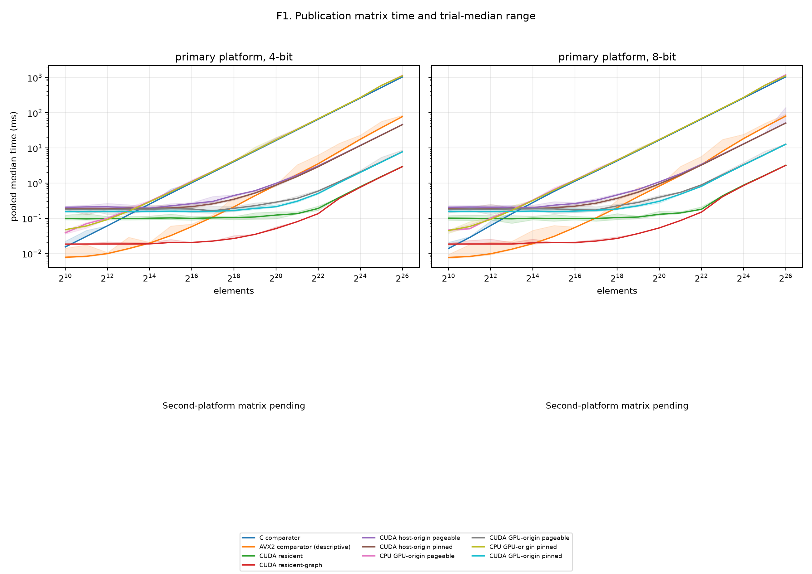
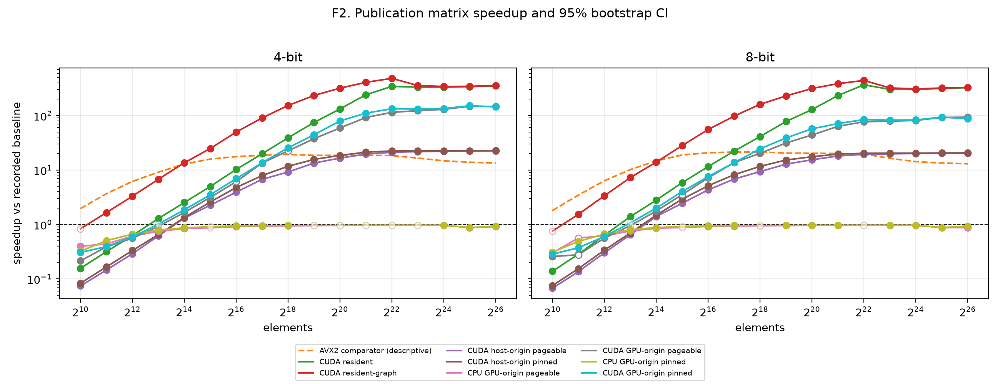
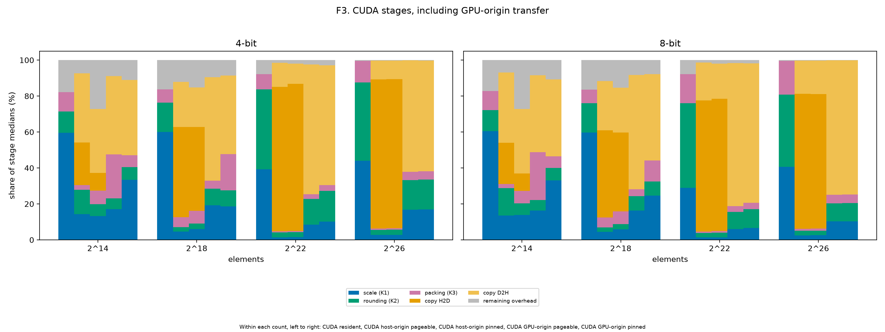
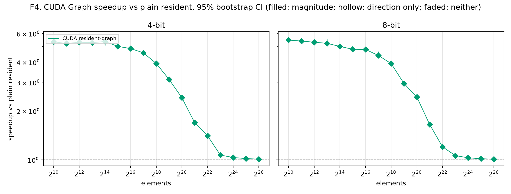
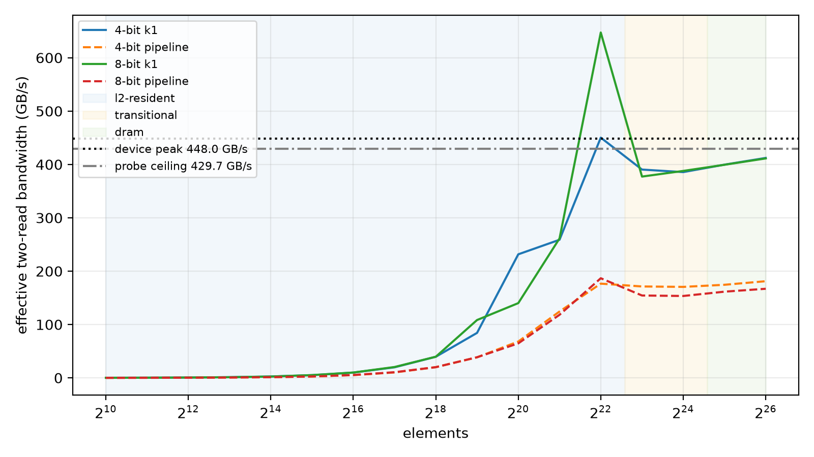

# Publication matrix report (dense)

Revision `46c1294`; 340 cases; all passed: True.

## Input family

| Family | Inputs | Cells | Distinct counts |
|---|---:|---:|---:|
| dense | 17 | 340 | 17 |

### Input provenance

| Input | Elements | Source detail |
|---|---:|---|
| n1024 | 1024 | numpy.random.default_rng([count, seed]) |
| n1048576 | 1048576 | numpy.random.default_rng([count, seed]) |
| n131072 | 131072 | numpy.random.default_rng([count, seed]) |
| n16384 | 16384 | numpy.random.default_rng([count, seed]) |
| n16777216 | 16777216 | numpy.random.default_rng([count, seed]) |
| n2048 | 2048 | numpy.random.default_rng([count, seed]) |
| n2097152 | 2097152 | numpy.random.default_rng([count, seed]) |
| n262144 | 262144 | numpy.random.default_rng([count, seed]) |
| n32768 | 32768 | numpy.random.default_rng([count, seed]) |
| n33554432 | 33554432 | numpy.random.default_rng([count, seed]) |
| n4096 | 4096 | numpy.random.default_rng([count, seed]) |
| n4194304 | 4194304 | numpy.random.default_rng([count, seed]) |
| n524288 | 524288 | numpy.random.default_rng([count, seed]) |
| n65536 | 65536 | numpy.random.default_rng([count, seed]) |
| n67108864 | 67108864 | numpy.random.default_rng([count, seed]) |
| n8192 | 8192 | numpy.random.default_rng([count, seed]) |
| n8388608 | 8388608 | numpy.random.default_rng([count, seed]) |

## Path comparisons

GPU-origin CUDA uses the policy-matched CPU GPU-origin baseline. Other CUDA paths use the scalar C comparator. AVX2 and cross-boundary GPU-origin comparisons are descriptive.

| Input | Elements | Bits | Path | Policy | Baseline | Median ms | Speedup and CI | Inversion |
|---|---:|---:|---|---|---|---:|---|---|
| n1024 | 1024 | 4 | cpu-avx2-optimized | none | cpu-comparator | 0.0078 | 1.96× [1.96, 2]; faster; direction=False; magnitude=False | False |
| n1024 | 1024 | 4 | cpu-comparator | none | — | 0.0153 | 1× [1, 1]; comparator; direction=False; magnitude=False | False |
| n1024 | 1024 | 4 | cpu-gpu-origin | pageable | cpu-comparator | 0.0385 | 0.397× [0.395, 0.404]; slower; direction=True; magnitude=True | False |
| n1024 | 1024 | 4 | cpu-gpu-origin-pinned | pinned | cpu-comparator | 0.0475 | 0.322× [0.319, 0.323]; slower; direction=True; magnitude=True | False |
| n1024 | 1024 | 4 | cuda-gpu-origin | pageable | cpu-gpu-origin | 0.18 | 0.214× [0.206, 0.215]; slower; direction=True; magnitude=True | False |
| n1024 | 1024 | 4 | cuda-gpu-origin-pinned | pinned | cpu-gpu-origin-pinned | 0.155 | 0.306× [0.301, 0.315]; slower; direction=True; magnitude=True | False |
| n1024 | 1024 | 4 | cuda-host-origin | pageable | cpu-comparator | 0.2052 | 0.0746× [0.0739, 0.0748]; slower; direction=True; magnitude=True | False |
| n1024 | 1024 | 4 | cuda-host-origin-pinned | pinned | cpu-comparator | 0.1841 | 0.0831× [0.0823, 0.0836]; slower; direction=True; magnitude=True | False |
| n1024 | 1024 | 4 | cuda-resident | none | cpu-comparator | 0.098 | 0.156× [0.15, 0.161]; slower; direction=True; magnitude=True | False |
| n1024 | 1024 | 4 | cuda-resident-graph | none | cpu-comparator | 0.0184 | 0.832× [0.827, 0.832]; inconclusive; direction=False; magnitude=False | False |
| n1024 | 1024 | 8 | cpu-avx2-optimized | none | cpu-comparator | 0.0077 | 1.81× [1.79, 1.83]; faster; direction=False; magnitude=False | False |
| n1024 | 1024 | 8 | cpu-comparator | none | — | 0.0139 | 1× [1, 1]; comparator; direction=False; magnitude=False | False |
| n1024 | 1024 | 8 | cpu-gpu-origin | pageable | cpu-comparator | 0.0462 | 0.301× [0.297, 0.325]; slower; direction=True; magnitude=True | False |
| n1024 | 1024 | 8 | cpu-gpu-origin-pinned | pinned | cpu-comparator | 0.0448 | 0.31× [0.309, 0.311]; slower; direction=True; magnitude=True | False |
| n1024 | 1024 | 8 | cuda-gpu-origin | pageable | cpu-gpu-origin | 0.1792 | 0.258× [0.237, 0.261]; slower; direction=True; magnitude=True | False |
| n1024 | 1024 | 8 | cuda-gpu-origin-pinned | pinned | cpu-gpu-origin-pinned | 0.157 | 0.285× [0.28, 0.29]; slower; direction=True; magnitude=True | False |
| n1024 | 1024 | 8 | cuda-host-origin | pageable | cpu-comparator | 0.2059 | 0.0675× [0.0672, 0.0679]; slower; direction=True; magnitude=True | False |
| n1024 | 1024 | 8 | cuda-host-origin-pinned | pinned | cpu-comparator | 0.1841 | 0.0755× [0.0747, 0.0759]; slower; direction=True; magnitude=True | False |
| n1024 | 1024 | 8 | cuda-resident | none | cpu-comparator | 0.1006 | 0.138× [0.136, 0.144]; slower; direction=True; magnitude=True | False |
| n1024 | 1024 | 8 | cuda-resident-graph | none | cpu-comparator | 0.0184 | 0.755× [0.754, 0.755]; inconclusive; direction=False; magnitude=False | False |
| n1048576 | 1048576 | 4 | cpu-avx2-optimized | none | cpu-comparator | 0.8762 | 18.6× [18.5, 18.6]; faster; direction=False; magnitude=False | False |
| n1048576 | 1048576 | 4 | cpu-comparator | none | — | 16.27 | 1× [1, 1]; comparator; direction=False; magnitude=False | False |
| n1048576 | 1048576 | 4 | cpu-gpu-origin | pageable | cpu-comparator | 16.96 | 0.959× [0.959, 0.959]; inconclusive; direction=False; magnitude=False | False |
| n1048576 | 1048576 | 4 | cpu-gpu-origin-pinned | pinned | cpu-comparator | 16.9 | 0.962× [0.961, 0.963]; inconclusive; direction=False; magnitude=False | False |
| n1048576 | 1048576 | 4 | cuda-gpu-origin | pageable | cpu-gpu-origin | 0.2871 | 59.1× [58.9, 59.4]; faster; direction=True; magnitude=True | False |
| n1048576 | 1048576 | 4 | cuda-gpu-origin-pinned | pinned | cpu-gpu-origin-pinned | 0.2124 | 79.5× [77.5, 80.4]; faster; direction=True; magnitude=True | False |
| n1048576 | 1048576 | 4 | cuda-host-origin | pageable | cpu-comparator | 0.9833 | 16.5× [16.3, 16.8]; faster; direction=True; magnitude=True | False |
| n1048576 | 1048576 | 4 | cuda-host-origin-pinned | pinned | cpu-comparator | 0.8772 | 18.5× [18.4, 18.8]; faster; direction=True; magnitude=True | False |
| n1048576 | 1048576 | 4 | cuda-resident | none | cpu-comparator | 0.1232 | 132× [131, 135]; faster; direction=True; magnitude=True | False |
| n1048576 | 1048576 | 4 | cuda-resident-graph | none | cpu-comparator | 0.0511 | 318× [318, 318]; faster; direction=True; magnitude=True | False |
| n1048576 | 1048576 | 8 | cpu-avx2-optimized | none | cpu-comparator | 0.8225 | 20.3× [20.3, 20.4]; faster; direction=False; magnitude=False | False |
| n1048576 | 1048576 | 8 | cpu-comparator | none | — | 16.7 | 1× [1, 1]; comparator; direction=False; magnitude=False | False |
| n1048576 | 1048576 | 8 | cpu-gpu-origin | pageable | cpu-comparator | 17.4 | 0.959× [0.959, 0.96]; slower; direction=True; magnitude=True | False |
| n1048576 | 1048576 | 8 | cpu-gpu-origin-pinned | pinned | cpu-comparator | 17.33 | 0.964× [0.964, 0.964]; slower; direction=True; magnitude=True | False |
| n1048576 | 1048576 | 8 | cuda-gpu-origin | pageable | cpu-gpu-origin | 0.3958 | 44× [43.6, 44.7]; faster; direction=True; magnitude=True | False |
| n1048576 | 1048576 | 8 | cuda-gpu-origin-pinned | pinned | cpu-gpu-origin-pinned | 0.3034 | 57.1× [56.5, 59.2]; faster; direction=True; magnitude=True | False |
| n1048576 | 1048576 | 8 | cuda-host-origin | pageable | cpu-comparator | 1.084 | 15.4× [15.3, 15.6]; faster; direction=True; magnitude=True | False |
| n1048576 | 1048576 | 8 | cuda-host-origin-pinned | pinned | cpu-comparator | 0.953 | 17.5× [17.3, 17.7]; faster; direction=True; magnitude=True | False |
| n1048576 | 1048576 | 8 | cuda-resident | none | cpu-comparator | 0.1297 | 129× [128, 130]; faster; direction=True; magnitude=True | False |
| n1048576 | 1048576 | 8 | cuda-resident-graph | none | cpu-comparator | 0.0532 | 314× [314, 314]; faster; direction=True; magnitude=True | False |
| n131072 | 131072 | 4 | cpu-avx2-optimized | none | cpu-comparator | 0.1091 | 18.7× [18.6, 18.7]; faster; direction=False; magnitude=False | False |
| n131072 | 131072 | 4 | cpu-comparator | none | — | 2.036 | 1× [1, 1]; comparator; direction=False; magnitude=False | False |
| n131072 | 131072 | 4 | cpu-gpu-origin | pageable | cpu-comparator | 2.185 | 0.932× [0.931, 0.932]; slower; direction=True; magnitude=True | False |
| n131072 | 131072 | 4 | cpu-gpu-origin-pinned | pinned | cpu-comparator | 2.142 | 0.951× [0.95, 0.951]; slower; direction=True; magnitude=True | False |
| n131072 | 131072 | 4 | cuda-gpu-origin | pageable | cpu-gpu-origin | 0.1628 | 13.4× [12.1, 14.6]; faster; direction=True; magnitude=False | False |
| n131072 | 131072 | 4 | cuda-gpu-origin-pinned | pinned | cpu-gpu-origin-pinned | 0.1574 | 13.6× [13.1, 14]; faster; direction=True; magnitude=True | False |
| n131072 | 131072 | 4 | cuda-host-origin | pageable | cpu-comparator | 0.3019 | 6.74× [6.65, 6.76]; faster; direction=True; magnitude=True | False |
| n131072 | 131072 | 4 | cuda-host-origin-pinned | pinned | cpu-comparator | 0.2577 | 7.9× [7.73, 8.02]; faster; direction=True; magnitude=True | False |
| n131072 | 131072 | 4 | cuda-resident | none | cpu-comparator | 0.1026 | 19.9× [19.5, 20.4]; faster; direction=True; magnitude=True | False |
| n131072 | 131072 | 4 | cuda-resident-graph | none | cpu-comparator | 0.0225 | 90.5× [90.5, 90.5]; faster; direction=True; magnitude=True | False |
| n131072 | 131072 | 8 | cpu-avx2-optimized | none | cpu-comparator | 0.1027 | 21.4× [21.4, 21.4]; faster; direction=False; magnitude=False | False |
| n131072 | 131072 | 8 | cpu-comparator | none | — | 2.196 | 1× [1, 1]; comparator; direction=False; magnitude=False | False |
| n131072 | 131072 | 8 | cpu-gpu-origin | pageable | cpu-comparator | 2.346 | 0.936× [0.936, 0.937]; slower; direction=True; magnitude=True | False |
| n131072 | 131072 | 8 | cpu-gpu-origin-pinned | pinned | cpu-comparator | 2.303 | 0.954× [0.953, 0.954]; slower; direction=True; magnitude=True | False |
| n131072 | 131072 | 8 | cuda-gpu-origin | pageable | cpu-gpu-origin | 0.171 | 13.7× [13, 14.4]; faster; direction=True; magnitude=True | False |
| n131072 | 131072 | 8 | cuda-gpu-origin-pinned | pinned | cpu-gpu-origin-pinned | 0.1684 | 13.7× [13.2, 14.3]; faster; direction=True; magnitude=True | False |
| n131072 | 131072 | 8 | cuda-host-origin | pageable | cpu-comparator | 0.3226 | 6.81× [6.75, 6.98]; faster; direction=True; magnitude=True | False |
| n131072 | 131072 | 8 | cuda-host-origin-pinned | pinned | cpu-comparator | 0.2683 | 8.19× [8.12, 8.36]; faster; direction=True; magnitude=True | False |
| n131072 | 131072 | 8 | cuda-resident | none | cpu-comparator | 0.0988 | 22.2× [21, 22.7]; faster; direction=True; magnitude=True | False |
| n131072 | 131072 | 8 | cuda-resident-graph | none | cpu-comparator | 0.0225 | 97.6× [97.6, 97.6]; faster; direction=True; magnitude=True | False |
| n16384 | 16384 | 4 | cpu-avx2-optimized | none | cpu-comparator | 0.0197 | 12.9× [12.8, 13]; faster; direction=False; magnitude=False | False |
| n16384 | 16384 | 4 | cpu-comparator | none | — | 0.2532 | 1× [1, 1]; comparator; direction=False; magnitude=False | False |
| n16384 | 16384 | 4 | cpu-gpu-origin | pageable | cpu-comparator | 0.3021 | 0.838× [0.838, 0.838]; slower; direction=True; magnitude=True | False |
| n16384 | 16384 | 4 | cpu-gpu-origin-pinned | pinned | cpu-comparator | 0.2924 | 0.866× [0.865, 0.866]; slower; direction=True; magnitude=True | False |
| n16384 | 16384 | 4 | cuda-gpu-origin | pageable | cpu-gpu-origin | 0.182 | 1.66× [1.63, 1.7]; faster; direction=True; magnitude=True | False |
| n16384 | 16384 | 4 | cuda-gpu-origin-pinned | pinned | cpu-gpu-origin-pinned | 0.1575 | 1.86× [1.8, 1.88]; faster; direction=True; magnitude=True | False |
| n16384 | 16384 | 4 | cuda-host-origin | pageable | cpu-comparator | 0.1943 | 1.3× [1.29, 1.32]; faster; direction=True; magnitude=True | False |
| n16384 | 16384 | 4 | cuda-host-origin-pinned | pinned | cpu-comparator | 0.1894 | 1.34× [1.33, 1.38]; faster; direction=True; magnitude=True | False |
| n16384 | 16384 | 4 | cuda-resident | none | cpu-comparator | 0.1001 | 2.53× [2.44, 2.61]; faster; direction=True; magnitude=True | False |
| n16384 | 16384 | 4 | cuda-resident-graph | none | cpu-comparator | 0.0187 | 13.5× [13, 13.7]; faster; direction=True; magnitude=True | False |
| n16384 | 16384 | 8 | cpu-avx2-optimized | none | cpu-comparator | 0.019 | 14.7× [14.7, 14.8]; faster; direction=False; magnitude=False | False |
| n16384 | 16384 | 8 | cpu-comparator | none | — | 0.28 | 1× [1, 1]; comparator; direction=False; magnitude=False | False |
| n16384 | 16384 | 8 | cpu-gpu-origin | pageable | cpu-comparator | 0.3288 | 0.852× [0.851, 0.852]; slower; direction=True; magnitude=True | False |
| n16384 | 16384 | 8 | cpu-gpu-origin-pinned | pinned | cpu-comparator | 0.3195 | 0.876× [0.876, 0.877]; slower; direction=True; magnitude=True | False |
| n16384 | 16384 | 8 | cuda-gpu-origin | pageable | cpu-gpu-origin | 0.1863 | 1.76× [1.71, 1.77]; faster; direction=True; magnitude=True | False |
| n16384 | 16384 | 8 | cuda-gpu-origin-pinned | pinned | cpu-gpu-origin-pinned | 0.1602 | 2× [1.93, 2.04]; faster; direction=True; magnitude=True | False |
| n16384 | 16384 | 8 | cuda-host-origin | pageable | cpu-comparator | 0.1998 | 1.4× [1.39, 1.42]; faster; direction=True; magnitude=True | False |
| n16384 | 16384 | 8 | cuda-host-origin-pinned | pinned | cpu-comparator | 0.1888 | 1.48× [1.48, 1.5]; faster; direction=True; magnitude=True | False |
| n16384 | 16384 | 8 | cuda-resident | none | cpu-comparator | 0.1001 | 2.8× [2.68, 2.9]; faster; direction=True; magnitude=True | False |
| n16384 | 16384 | 8 | cuda-resident-graph | none | cpu-comparator | 0.02005 | 14× [13.8, 14.7]; faster; direction=True; magnitude=True | False |
| n16777216 | 16777216 | 4 | cpu-avx2-optimized | none | cpu-comparator | 17.68 | 14.7× [14.7, 14.8]; faster; direction=False; magnitude=False | False |
| n16777216 | 16777216 | 4 | cpu-comparator | none | — | 260.5 | 1× [1, 1]; comparator; direction=False; magnitude=False | False |
| n16777216 | 16777216 | 4 | cpu-gpu-origin | pageable | cpu-comparator | 270.4 | 0.963× [0.961, 0.965]; slower; direction=True; magnitude=True | False |
| n16777216 | 16777216 | 4 | cpu-gpu-origin-pinned | pinned | cpu-comparator | 270 | 0.965× [0.964, 0.965]; slower; direction=True; magnitude=True | False |
| n16777216 | 16777216 | 4 | cuda-gpu-origin | pageable | cpu-gpu-origin | 2.083 | 130× [130, 130]; faster; direction=True; magnitude=True | False |
| n16777216 | 16777216 | 4 | cuda-gpu-origin-pinned | pinned | cpu-gpu-origin-pinned | 2.011 | 134× [134, 134]; faster; direction=True; magnitude=True | False |
| n16777216 | 16777216 | 4 | cuda-host-origin | pageable | cpu-comparator | 11.82 | 22× [22, 22.1]; faster; direction=True; magnitude=True | False |
| n16777216 | 16777216 | 4 | cuda-host-origin-pinned | pinned | cpu-comparator | 11.62 | 22.4× [22.4, 22.4]; faster; direction=True; magnitude=True | False |
| n16777216 | 16777216 | 4 | cuda-resident | none | cpu-comparator | 0.7871 | 331× [331, 331]; faster; direction=True; magnitude=True | False |
| n16777216 | 16777216 | 4 | cuda-resident-graph | none | cpu-comparator | 0.7623 | 342× [341, 342]; faster; direction=True; magnitude=True | False |
| n16777216 | 16777216 | 8 | cpu-avx2-optimized | none | cpu-comparator | 18.43 | 14.2× [14.2, 14.3]; faster; direction=False; magnitude=False | False |
| n16777216 | 16777216 | 8 | cpu-comparator | none | — | 262.5 | 1× [1, 1]; comparator; direction=False; magnitude=False | False |
| n16777216 | 16777216 | 8 | cpu-gpu-origin | pageable | cpu-comparator | 272.4 | 0.964× [0.963, 0.965]; slower; direction=True; magnitude=True | False |
| n16777216 | 16777216 | 8 | cpu-gpu-origin-pinned | pinned | cpu-comparator | 272.1 | 0.965× [0.964, 0.966]; slower; direction=True; magnitude=True | False |
| n16777216 | 16777216 | 8 | cuda-gpu-origin | pageable | cpu-gpu-origin | 3.348 | 81.4× [81.3, 81.5]; faster; direction=True; magnitude=True | False |
| n16777216 | 16777216 | 8 | cuda-gpu-origin-pinned | pinned | cpu-gpu-origin-pinned | 3.273 | 83.1× [83, 83.2]; faster; direction=True; magnitude=True | False |
| n16777216 | 16777216 | 8 | cuda-host-origin | pageable | cpu-comparator | 13.08 | 20.1× [20, 20.1]; faster; direction=True; magnitude=True | False |
| n16777216 | 16777216 | 8 | cuda-host-origin-pinned | pinned | cpu-comparator | 12.88 | 20.4× [20.3, 20.4]; faster; direction=True; magnitude=True | False |
| n16777216 | 16777216 | 8 | cuda-resident | none | cpu-comparator | 0.8744 | 300× [300, 301]; faster; direction=True; magnitude=True | False |
| n16777216 | 16777216 | 8 | cuda-resident-graph | none | cpu-comparator | 0.8509 | 308× [308, 309]; faster; direction=True; magnitude=True | False |
| n2048 | 2048 | 4 | cpu-avx2-optimized | none | cpu-comparator | 0.0083 | 3.67× [3.65, 3.7]; faster; direction=False; magnitude=False | False |
| n2048 | 2048 | 4 | cpu-comparator | none | — | 0.0305 | 1× [1, 1]; comparator; direction=False; magnitude=False | False |
| n2048 | 2048 | 4 | cpu-gpu-origin | pageable | cpu-comparator | 0.06975 | 0.437× [0.432, 0.445]; slower; direction=True; magnitude=True | False |
| n2048 | 2048 | 4 | cpu-gpu-origin-pinned | pinned | cpu-comparator | 0.0604 | 0.505× [0.505, 0.506]; slower; direction=True; magnitude=True | False |
| n2048 | 2048 | 4 | cuda-gpu-origin | pageable | cpu-gpu-origin | 0.1793 | 0.389× [0.382, 0.395]; slower; direction=True; magnitude=True | False |
| n2048 | 2048 | 4 | cuda-gpu-origin-pinned | pinned | cpu-gpu-origin-pinned | 0.1541 | 0.392× [0.378, 0.394]; slower; direction=True; magnitude=True | False |
| n2048 | 2048 | 4 | cuda-host-origin | pageable | cpu-comparator | 0.2099 | 0.145× [0.142, 0.149]; slower; direction=True; magnitude=True | False |
| n2048 | 2048 | 4 | cuda-host-origin-pinned | pinned | cpu-comparator | 0.1836 | 0.166× [0.165, 0.167]; slower; direction=True; magnitude=True | False |
| n2048 | 2048 | 4 | cuda-resident | none | cpu-comparator | 0.0961 | 0.317× [0.314, 0.325]; slower; direction=True; magnitude=True | False |
| n2048 | 2048 | 4 | cuda-resident-graph | none | cpu-comparator | 0.01845 | 1.65× [1.65, 1.66]; faster; direction=True; magnitude=True | False |
| n2048 | 2048 | 8 | cpu-avx2-optimized | none | cpu-comparator | 0.0082 | 3.46× [3.46, 3.51]; faster; direction=False; magnitude=False | False |
| n2048 | 2048 | 8 | cpu-comparator | none | — | 0.0284 | 1× [1, 1]; comparator; direction=False; magnitude=False | False |
| n2048 | 2048 | 8 | cpu-gpu-origin | pageable | cpu-comparator | 0.0503 | 0.565× [0.561, 0.567]; slower; direction=True; magnitude=False | False |
| n2048 | 2048 | 8 | cpu-gpu-origin-pinned | pinned | cpu-comparator | 0.0582 | 0.488× [0.487, 0.489]; slower; direction=True; magnitude=True | False |
| n2048 | 2048 | 8 | cuda-gpu-origin | pageable | cpu-gpu-origin | 0.1815 | 0.277× [0.272, 0.281]; slower; direction=True; magnitude=False | False |
| n2048 | 2048 | 8 | cuda-gpu-origin-pinned | pinned | cpu-gpu-origin-pinned | 0.1558 | 0.374× [0.362, 0.378]; slower; direction=True; magnitude=True | False |
| n2048 | 2048 | 8 | cuda-host-origin | pageable | cpu-comparator | 0.2088 | 0.136× [0.135, 0.137]; slower; direction=True; magnitude=True | False |
| n2048 | 2048 | 8 | cuda-host-origin-pinned | pinned | cpu-comparator | 0.1842 | 0.154× [0.154, 0.155]; slower; direction=True; magnitude=True | False |
| n2048 | 2048 | 8 | cuda-resident | none | cpu-comparator | 0.09965 | 0.285× [0.273, 0.294]; slower; direction=True; magnitude=True | False |
| n2048 | 2048 | 8 | cuda-resident-graph | none | cpu-comparator | 0.0185 | 1.54× [1.54, 1.54]; faster; direction=True; magnitude=True | False |
| n2097152 | 2097152 | 4 | cpu-avx2-optimized | none | cpu-comparator | 1.745 | 18.7× [18.6, 18.7]; faster; direction=False; magnitude=False | False |
| n2097152 | 2097152 | 4 | cpu-comparator | none | — | 32.56 | 1× [1, 1]; comparator; direction=False; magnitude=False | False |
| n2097152 | 2097152 | 4 | cpu-gpu-origin | pageable | cpu-comparator | 33.86 | 0.962× [0.96, 0.963]; inconclusive; direction=False; magnitude=False | False |
| n2097152 | 2097152 | 4 | cpu-gpu-origin-pinned | pinned | cpu-comparator | 33.75 | 0.965× [0.964, 0.966]; inconclusive; direction=False; magnitude=False | False |
| n2097152 | 2097152 | 4 | cuda-gpu-origin | pageable | cpu-gpu-origin | 0.367 | 92.3× [92.1, 92.6]; faster; direction=True; magnitude=True | False |
| n2097152 | 2097152 | 4 | cuda-gpu-origin-pinned | pinned | cpu-gpu-origin-pinned | 0.3045 | 111× [110, 111]; faster; direction=True; magnitude=True | False |
| n2097152 | 2097152 | 4 | cuda-host-origin | pageable | cpu-comparator | 1.664 | 19.6× [19.5, 19.6]; faster; direction=True; magnitude=True | False |
| n2097152 | 2097152 | 4 | cuda-host-origin-pinned | pinned | cpu-comparator | 1.534 | 21.2× [21.1, 21.3]; faster; direction=True; magnitude=True | False |
| n2097152 | 2097152 | 4 | cuda-resident | none | cpu-comparator | 0.1349 | 241× [240, 243]; faster; direction=True; magnitude=True | False |
| n2097152 | 2097152 | 4 | cuda-resident-graph | none | cpu-comparator | 0.0798 | 408× [407, 408]; faster; direction=True; magnitude=True | False |
| n2097152 | 2097152 | 8 | cpu-avx2-optimized | none | cpu-comparator | 1.65 | 20.1× [20.1, 20.2]; faster; direction=False; magnitude=False | False |
| n2097152 | 2097152 | 8 | cpu-comparator | none | — | 33.14 | 1× [1, 1]; comparator; direction=False; magnitude=False | False |
| n2097152 | 2097152 | 8 | cpu-gpu-origin | pageable | cpu-comparator | 34.44 | 0.962× [0.962, 0.963]; slower; direction=True; magnitude=True | False |
| n2097152 | 2097152 | 8 | cpu-gpu-origin-pinned | pinned | cpu-comparator | 34.36 | 0.965× [0.964, 0.965]; slower; direction=True; magnitude=True | False |
| n2097152 | 2097152 | 8 | cuda-gpu-origin | pageable | cpu-gpu-origin | 0.5442 | 63.3× [63.2, 63.4]; faster; direction=True; magnitude=True | False |
| n2097152 | 2097152 | 8 | cuda-gpu-origin-pinned | pinned | cpu-gpu-origin-pinned | 0.4829 | 71.1× [71, 71.8]; faster; direction=True; magnitude=True | False |
| n2097152 | 2097152 | 8 | cuda-host-origin | pageable | cpu-comparator | 1.833 | 18.1× [18, 18.2]; faster; direction=True; magnitude=True | False |
| n2097152 | 2097152 | 8 | cuda-host-origin-pinned | pinned | cpu-comparator | 1.693 | 19.6× [19.5, 19.7]; faster; direction=True; magnitude=True | False |
| n2097152 | 2097152 | 8 | cuda-resident | none | cpu-comparator | 0.1419 | 234× [232, 234]; faster; direction=True; magnitude=True | False |
| n2097152 | 2097152 | 8 | cuda-resident-graph | none | cpu-comparator | 0.086 | 385× [385, 385]; faster; direction=True; magnitude=True | False |
| n262144 | 262144 | 4 | cpu-avx2-optimized | none | cpu-comparator | 0.2107 | 19.3× [19.3, 19.4]; faster; direction=False; magnitude=False | False |
| n262144 | 262144 | 4 | cpu-comparator | none | — | 4.067 | 1× [1, 1]; comparator; direction=False; magnitude=False | False |
| n262144 | 262144 | 4 | cpu-gpu-origin | pageable | cpu-comparator | 4.324 | 0.941× [0.94, 0.941]; slower; direction=True; magnitude=True | False |
| n262144 | 262144 | 4 | cpu-gpu-origin-pinned | pinned | cpu-comparator | 4.25 | 0.957× [0.957, 0.957]; slower; direction=True; magnitude=True | False |
| n262144 | 262144 | 4 | cuda-gpu-origin | pageable | cpu-gpu-origin | 0.1924 | 22.5× [21.8, 24.2]; faster; direction=True; magnitude=False | False |
| n262144 | 262144 | 4 | cuda-gpu-origin-pinned | pinned | cpu-gpu-origin-pinned | 0.1665 | 25.5× [25, 26.4]; faster; direction=True; magnitude=True | False |
| n262144 | 262144 | 4 | cuda-host-origin | pageable | cpu-comparator | 0.4429 | 9.18× [9.07, 9.27]; faster; direction=True; magnitude=True | False |
| n262144 | 262144 | 4 | cuda-host-origin-pinned | pinned | cpu-comparator | 0.3475 | 11.7× [11.7, 11.8]; faster; direction=True; magnitude=True | False |
| n262144 | 262144 | 4 | cuda-resident | none | cpu-comparator | 0.1043 | 39× [38.4, 40.3]; faster; direction=True; magnitude=True | False |
| n262144 | 262144 | 4 | cuda-resident-graph | none | cpu-comparator | 0.0266 | 153× [153, 153]; faster; direction=True; magnitude=True | False |
| n262144 | 262144 | 8 | cpu-avx2-optimized | none | cpu-comparator | 0.2003 | 21.4× [21.3, 21.5]; faster; direction=False; magnitude=False | False |
| n262144 | 262144 | 8 | cpu-comparator | none | — | 4.293 | 1× [1, 1]; comparator; direction=False; magnitude=False | False |
| n262144 | 262144 | 8 | cpu-gpu-origin | pageable | cpu-comparator | 4.546 | 0.944× [0.944, 0.945]; inconclusive; direction=False; magnitude=False | False |
| n262144 | 262144 | 8 | cpu-gpu-origin-pinned | pinned | cpu-comparator | 4.476 | 0.959× [0.959, 0.959]; inconclusive; direction=False; magnitude=False | False |
| n262144 | 262144 | 8 | cuda-gpu-origin | pageable | cpu-gpu-origin | 0.2252 | 20.2× [19.8, 21.5]; faster; direction=True; magnitude=True | False |
| n262144 | 262144 | 8 | cuda-gpu-origin-pinned | pinned | cpu-gpu-origin-pinned | 0.183 | 24.5× [24.1, 25.1]; faster; direction=True; magnitude=True | False |
| n262144 | 262144 | 8 | cuda-host-origin | pageable | cpu-comparator | 0.4591 | 9.35× [9.27, 9.43]; faster; direction=True; magnitude=True | False |
| n262144 | 262144 | 8 | cuda-host-origin-pinned | pinned | cpu-comparator | 0.368 | 11.7× [11.5, 11.7]; faster; direction=True; magnitude=True | False |
| n262144 | 262144 | 8 | cuda-resident | none | cpu-comparator | 0.1045 | 41.1× [40, 41.6]; faster; direction=True; magnitude=True | False |
| n262144 | 262144 | 8 | cuda-resident-graph | none | cpu-comparator | 0.0267 | 161× [157, 161]; faster; direction=True; magnitude=True | False |
| n32768 | 32768 | 4 | cpu-avx2-optimized | none | cpu-comparator | 0.0321 | 15.9× [15.8, 15.9]; faster; direction=False; magnitude=False | False |
| n32768 | 32768 | 4 | cpu-comparator | none | — | 0.5088 | 1× [1, 1]; comparator; direction=False; magnitude=False | False |
| n32768 | 32768 | 4 | cpu-gpu-origin | pageable | cpu-comparator | 0.586 | 0.868× [0.868, 0.868]; inconclusive; direction=False; magnitude=False | False |
| n32768 | 32768 | 4 | cpu-gpu-origin-pinned | pinned | cpu-comparator | 0.558 | 0.912× [0.912, 0.912]; inconclusive; direction=False; magnitude=False | False |
| n32768 | 32768 | 4 | cuda-gpu-origin | pageable | cpu-gpu-origin | 0.1871 | 3.13× [3, 3.14]; faster; direction=True; magnitude=True | False |
| n32768 | 32768 | 4 | cuda-gpu-origin-pinned | pinned | cpu-gpu-origin-pinned | 0.1593 | 3.5× [3.45, 3.55]; faster; direction=True; magnitude=True | False |
| n32768 | 32768 | 4 | cuda-host-origin | pageable | cpu-comparator | 0.2254 | 2.26× [2.22, 2.29]; faster; direction=True; magnitude=True | False |
| n32768 | 32768 | 4 | cuda-host-origin-pinned | pinned | cpu-comparator | 0.197 | 2.58× [2.57, 2.6]; faster; direction=True; magnitude=True | False |
| n32768 | 32768 | 4 | cuda-resident | none | cpu-comparator | 0.1024 | 4.97× [4.89, 5.18]; faster; direction=True; magnitude=True | False |
| n32768 | 32768 | 4 | cuda-resident-graph | none | cpu-comparator | 0.0205 | 24.8× [24.8, 24.9]; faster; direction=True; magnitude=True | False |
| n32768 | 32768 | 8 | cpu-avx2-optimized | none | cpu-comparator | 0.0305 | 18.9× [18.9, 19]; faster; direction=False; magnitude=False | False |
| n32768 | 32768 | 8 | cpu-comparator | none | — | 0.5767 | 1× [1, 1]; comparator; direction=False; magnitude=False | False |
| n32768 | 32768 | 8 | cpu-gpu-origin | pageable | cpu-comparator | 0.6553 | 0.88× [0.88, 0.88]; inconclusive; direction=False; magnitude=False | False |
| n32768 | 32768 | 8 | cpu-gpu-origin-pinned | pinned | cpu-comparator | 0.6263 | 0.921× [0.921, 0.921]; inconclusive; direction=False; magnitude=False | False |
| n32768 | 32768 | 8 | cuda-gpu-origin | pageable | cpu-gpu-origin | 0.1852 | 3.54× [3.43, 3.54]; faster; direction=True; magnitude=False | False |
| n32768 | 32768 | 8 | cuda-gpu-origin-pinned | pinned | cpu-gpu-origin-pinned | 0.1554 | 4.03× [3.96, 4.14]; faster; direction=True; magnitude=True | False |
| n32768 | 32768 | 8 | cuda-host-origin | pageable | cpu-comparator | 0.2352 | 2.45× [2.43, 2.5]; faster; direction=True; magnitude=True | False |
| n32768 | 32768 | 8 | cuda-host-origin-pinned | pinned | cpu-comparator | 0.1978 | 2.92× [2.88, 2.92]; faster; direction=True; magnitude=True | False |
| n32768 | 32768 | 8 | cuda-resident | none | cpu-comparator | 0.0983 | 5.87× [5.76, 5.98]; faster; direction=True; magnitude=True | False |
| n32768 | 32768 | 8 | cuda-resident-graph | none | cpu-comparator | 0.0205 | 28.1× [28.1, 28.2]; faster; direction=True; magnitude=True | False |
| n33554432 | 33554432 | 4 | cpu-avx2-optimized | none | cpu-comparator | 37.55 | 13.9× [13.8, 13.9]; faster; direction=False; magnitude=False | False |
| n33554432 | 33554432 | 4 | cpu-comparator | none | — | 521.1 | 1× [1, 1]; comparator; direction=False; magnitude=False | False |
| n33554432 | 33554432 | 4 | cpu-gpu-origin | pageable | cpu-comparator | 596 | 0.874× [0.874, 0.875]; slower; direction=True; magnitude=True | False |
| n33554432 | 33554432 | 4 | cpu-gpu-origin-pinned | pinned | cpu-comparator | 595.3 | 0.875× [0.875, 0.876]; slower; direction=True; magnitude=True | False |
| n33554432 | 33554432 | 4 | cuda-gpu-origin | pageable | cpu-gpu-origin | 4.015 | 148× [148, 149]; faster; direction=True; magnitude=True | False |
| n33554432 | 33554432 | 4 | cuda-gpu-origin-pinned | pinned | cpu-gpu-origin-pinned | 3.939 | 151× [151, 151]; faster; direction=True; magnitude=True | False |
| n33554432 | 33554432 | 4 | cuda-host-origin | pageable | cpu-comparator | 23.35 | 22.3× [22.3, 22.3]; faster; direction=True; magnitude=True | False |
| n33554432 | 33554432 | 4 | cuda-host-origin-pinned | pinned | cpu-comparator | 23.07 | 22.6× [22.6, 22.6]; faster; direction=True; magnitude=True | False |
| n33554432 | 33554432 | 4 | cuda-resident | none | cpu-comparator | 1.538 | 339× [339, 339]; faster; direction=True; magnitude=True | False |
| n33554432 | 33554432 | 4 | cuda-resident-graph | none | cpu-comparator | 1.514 | 344× [344, 345]; faster; direction=True; magnitude=True | False |
| n33554432 | 33554432 | 8 | cpu-avx2-optimized | none | cpu-comparator | 39.04 | 13.4× [13.3, 13.5]; faster; direction=False; magnitude=False | False |
| n33554432 | 33554432 | 8 | cpu-comparator | none | — | 524 | 1× [1, 1]; comparator; direction=False; magnitude=False | False |
| n33554432 | 33554432 | 8 | cpu-gpu-origin | pageable | cpu-comparator | 598.7 | 0.875× [0.875, 0.875]; slower; direction=True; magnitude=True | False |
| n33554432 | 33554432 | 8 | cpu-gpu-origin-pinned | pinned | cpu-comparator | 598 | 0.876× [0.876, 0.876]; slower; direction=True; magnitude=True | False |
| n33554432 | 33554432 | 8 | cuda-gpu-origin | pageable | cpu-gpu-origin | 6.489 | 92.3× [92, 92.3]; faster; direction=True; magnitude=True | False |
| n33554432 | 33554432 | 8 | cuda-gpu-origin-pinned | pinned | cpu-gpu-origin-pinned | 6.413 | 93.2× [93.2, 93.3]; faster; direction=True; magnitude=True | False |
| n33554432 | 33554432 | 8 | cuda-host-origin | pageable | cpu-comparator | 25.82 | 20.3× [20.3, 20.3]; faster; direction=True; magnitude=True | False |
| n33554432 | 33554432 | 8 | cuda-host-origin-pinned | pinned | cpu-comparator | 25.53 | 20.5× [20.5, 20.5]; faster; direction=True; magnitude=True | False |
| n33554432 | 33554432 | 8 | cuda-resident | none | cpu-comparator | 1.661 | 315× [315, 316]; faster; direction=True; magnitude=True | False |
| n33554432 | 33554432 | 8 | cuda-resident-graph | none | cpu-comparator | 1.637 | 320× [320, 320]; faster; direction=True; magnitude=True | False |
| n4096 | 4096 | 4 | cpu-avx2-optimized | none | cpu-comparator | 0.0099 | 6.17× [6.13, 6.2]; faster; direction=False; magnitude=False | False |
| n4096 | 4096 | 4 | cpu-comparator | none | — | 0.0611 | 1× [1, 1]; comparator; direction=False; magnitude=False | False |
| n4096 | 4096 | 4 | cpu-gpu-origin | pageable | cpu-comparator | 0.0999 | 0.612× [0.611, 0.612]; slower; direction=True; magnitude=True | False |
| n4096 | 4096 | 4 | cpu-gpu-origin-pinned | pinned | cpu-comparator | 0.0921 | 0.663× [0.663, 0.664]; slower; direction=True; magnitude=True | False |
| n4096 | 4096 | 4 | cuda-gpu-origin | pageable | cpu-gpu-origin | 0.179 | 0.558× [0.546, 0.56]; slower; direction=True; magnitude=True | False |
| n4096 | 4096 | 4 | cuda-gpu-origin-pinned | pinned | cpu-gpu-origin-pinned | 0.157 | 0.586× [0.567, 0.596]; slower; direction=True; magnitude=True | False |
| n4096 | 4096 | 4 | cuda-host-origin | pageable | cpu-comparator | 0.2107 | 0.29× [0.285, 0.294]; slower; direction=True; magnitude=True | False |
| n4096 | 4096 | 4 | cuda-host-origin-pinned | pinned | cpu-comparator | 0.1837 | 0.333× [0.33, 0.334]; slower; direction=True; magnitude=True | False |
| n4096 | 4096 | 4 | cuda-resident | none | cpu-comparator | 0.098 | 0.623× [0.603, 0.639]; slower; direction=True; magnitude=True | False |
| n4096 | 4096 | 4 | cuda-resident-graph | none | cpu-comparator | 0.0185 | 3.3× [3.3, 3.32]; faster; direction=True; magnitude=True | False |
| n4096 | 4096 | 8 | cpu-avx2-optimized | none | cpu-comparator | 0.0098 | 6.35× [6.35, 6.45]; faster; direction=False; magnitude=False | False |
| n4096 | 4096 | 8 | cpu-comparator | none | — | 0.0622 | 1× [1, 1]; comparator; direction=False; magnitude=False | False |
| n4096 | 4096 | 8 | cpu-gpu-origin | pageable | cpu-comparator | 0.1011 | 0.615× [0.614, 0.616]; slower; direction=True; magnitude=True | False |
| n4096 | 4096 | 8 | cpu-gpu-origin-pinned | pinned | cpu-comparator | 0.0932 | 0.667× [0.667, 0.668]; slower; direction=True; magnitude=True | False |
| n4096 | 4096 | 8 | cuda-gpu-origin | pageable | cpu-gpu-origin | 0.18 | 0.562× [0.552, 0.57]; slower; direction=True; magnitude=True | False |
| n4096 | 4096 | 8 | cuda-gpu-origin-pinned | pinned | cpu-gpu-origin-pinned | 0.155 | 0.601× [0.58, 0.611]; slower; direction=True; magnitude=True | False |
| n4096 | 4096 | 8 | cuda-host-origin | pageable | cpu-comparator | 0.2065 | 0.301× [0.297, 0.306]; slower; direction=True; magnitude=True | False |
| n4096 | 4096 | 8 | cuda-host-origin-pinned | pinned | cpu-comparator | 0.1841 | 0.338× [0.336, 0.34]; slower; direction=True; magnitude=True | False |
| n4096 | 4096 | 8 | cuda-resident | none | cpu-comparator | 0.09805 | 0.634× [0.61, 0.648]; slower; direction=True; magnitude=True | False |
| n4096 | 4096 | 8 | cuda-resident-graph | none | cpu-comparator | 0.0185 | 3.36× [3.36, 3.38]; faster; direction=True; magnitude=True | False |
| n4194304 | 4194304 | 4 | cpu-avx2-optimized | none | cpu-comparator | 3.538 | 18.4× [18.3, 18.5]; faster; direction=False; magnitude=False | False |
| n4194304 | 4194304 | 4 | cpu-comparator | none | — | 65.12 | 1× [1, 1]; comparator; direction=False; magnitude=False | False |
| n4194304 | 4194304 | 4 | cpu-gpu-origin | pageable | cpu-comparator | 67.62 | 0.963× [0.962, 0.965]; inconclusive; direction=False; magnitude=False | False |
| n4194304 | 4194304 | 4 | cpu-gpu-origin-pinned | pinned | cpu-comparator | 67.47 | 0.965× [0.963, 0.967]; inconclusive; direction=False; magnitude=False | False |
| n4194304 | 4194304 | 4 | cuda-gpu-origin | pageable | cpu-gpu-origin | 0.5913 | 114× [114, 115]; faster; direction=True; magnitude=True | False |
| n4194304 | 4194304 | 4 | cuda-gpu-origin-pinned | pinned | cpu-gpu-origin-pinned | 0.5068 | 133× [132, 138]; faster; direction=True; magnitude=True | False |
| n4194304 | 4194304 | 4 | cuda-host-origin | pageable | cpu-comparator | 3.079 | 21.1× [21.1, 21.2]; faster; direction=True; magnitude=True | False |
| n4194304 | 4194304 | 4 | cuda-host-origin-pinned | pinned | cpu-comparator | 2.913 | 22.4× [22.3, 22.4]; faster; direction=True; magnitude=True | False |
| n4194304 | 4194304 | 4 | cuda-resident | none | cpu-comparator | 0.19 | 343× [342, 345]; faster; direction=True; magnitude=True | False |
| n4194304 | 4194304 | 4 | cuda-resident-graph | none | cpu-comparator | 0.1352 | 482× [480, 482]; faster; direction=True; magnitude=True | False |
| n4194304 | 4194304 | 8 | cpu-avx2-optimized | none | cpu-comparator | 3.345 | 19.7× [19.7, 19.8]; faster; direction=False; magnitude=False | False |
| n4194304 | 4194304 | 8 | cpu-comparator | none | — | 65.95 | 1× [1, 1]; comparator; direction=False; magnitude=False | False |
| n4194304 | 4194304 | 8 | cpu-gpu-origin | pageable | cpu-comparator | 68.41 | 0.964× [0.964, 0.964]; inconclusive; direction=False; magnitude=False | False |
| n4194304 | 4194304 | 8 | cpu-gpu-origin-pinned | pinned | cpu-comparator | 68.34 | 0.965× [0.963, 0.965]; inconclusive; direction=False; magnitude=False | False |
| n4194304 | 4194304 | 8 | cuda-gpu-origin | pageable | cpu-gpu-origin | 0.8886 | 77× [76.8, 77.1]; faster; direction=True; magnitude=True | False |
| n4194304 | 4194304 | 8 | cuda-gpu-origin-pinned | pinned | cpu-gpu-origin-pinned | 0.8098 | 84.4× [84.3, 84.5]; faster; direction=True; magnitude=True | False |
| n4194304 | 4194304 | 8 | cuda-host-origin | pageable | cpu-comparator | 3.401 | 19.4× [19.4, 19.4]; faster; direction=True; magnitude=True | False |
| n4194304 | 4194304 | 8 | cuda-host-origin-pinned | pinned | cpu-comparator | 3.254 | 20.3× [20.2, 20.3]; faster; direction=True; magnitude=True | False |
| n4194304 | 4194304 | 8 | cuda-resident | none | cpu-comparator | 0.1797 | 367× [367, 368]; faster; direction=True; magnitude=True | False |
| n4194304 | 4194304 | 8 | cuda-resident-graph | none | cpu-comparator | 0.1495 | 441× [441, 441]; faster; direction=True; magnitude=True | False |
| n524288 | 524288 | 4 | cpu-avx2-optimized | none | cpu-comparator | 0.4376 | 18.6× [18.6, 18.7]; faster; direction=False; magnitude=False | False |
| n524288 | 524288 | 4 | cpu-comparator | none | — | 8.134 | 1× [1, 1]; comparator; direction=False; magnitude=False | False |
| n524288 | 524288 | 4 | cpu-gpu-origin | pageable | cpu-comparator | 8.538 | 0.953× [0.952, 0.953]; inconclusive; direction=False; magnitude=False | False |
| n524288 | 524288 | 4 | cpu-gpu-origin-pinned | pinned | cpu-comparator | 8.466 | 0.961× [0.961, 0.961]; inconclusive; direction=False; magnitude=False | False |
| n524288 | 524288 | 4 | cuda-gpu-origin | pageable | cpu-gpu-origin | 0.2274 | 37.5× [37.1, 38.9]; faster; direction=True; magnitude=True | False |
| n524288 | 524288 | 4 | cuda-gpu-origin-pinned | pinned | cpu-gpu-origin-pinned | 0.1905 | 44.5× [43.4, 45.2]; faster; direction=True; magnitude=True | False |
| n524288 | 524288 | 4 | cuda-host-origin | pageable | cpu-comparator | 0.606 | 13.4× [13.3, 13.5]; faster; direction=True; magnitude=True | False |
| n524288 | 524288 | 4 | cuda-host-origin-pinned | pinned | cpu-comparator | 0.5202 | 15.6× [15.5, 15.9]; faster; direction=True; magnitude=True | False |
| n524288 | 524288 | 4 | cuda-resident | none | cpu-comparator | 0.1089 | 74.7× [73.9, 75.3]; faster; direction=True; magnitude=True | False |
| n524288 | 524288 | 4 | cuda-resident-graph | none | cpu-comparator | 0.0348 | 234× [234, 234]; faster; direction=True; magnitude=True | False |
| n524288 | 524288 | 8 | cpu-avx2-optimized | none | cpu-comparator | 0.4127 | 20.5× [20.4, 20.6]; faster; direction=False; magnitude=False | False |
| n524288 | 524288 | 8 | cpu-comparator | none | — | 8.446 | 1× [1, 1]; comparator; direction=False; magnitude=False | False |
| n524288 | 524288 | 8 | cpu-gpu-origin | pageable | cpu-comparator | 8.848 | 0.955× [0.954, 0.955]; slower; direction=True; magnitude=True | False |
| n524288 | 524288 | 8 | cpu-gpu-origin-pinned | pinned | cpu-comparator | 8.776 | 0.962× [0.962, 0.963]; slower; direction=True; magnitude=True | False |
| n524288 | 524288 | 8 | cuda-gpu-origin | pageable | cpu-gpu-origin | 0.2818 | 31.4× [31.2, 31.7]; faster; direction=True; magnitude=True | False |
| n524288 | 524288 | 8 | cuda-gpu-origin-pinned | pinned | cpu-gpu-origin-pinned | 0.2259 | 38.8× [38.7, 39.1]; faster; direction=True; magnitude=True | False |
| n524288 | 524288 | 8 | cuda-host-origin | pageable | cpu-comparator | 0.6597 | 12.8× [12.7, 12.9]; faster; direction=True; magnitude=True | False |
| n524288 | 524288 | 8 | cuda-host-origin-pinned | pinned | cpu-comparator | 0.5539 | 15.2× [15.1, 15.4]; faster; direction=True; magnitude=True | False |
| n524288 | 524288 | 8 | cuda-resident | none | cpu-comparator | 0.1085 | 77.8× [76.5, 78.5]; faster; direction=True; magnitude=True | False |
| n524288 | 524288 | 8 | cuda-resident-graph | none | cpu-comparator | 0.0368 | 230× [229, 230]; faster; direction=True; magnitude=True | False |
| n65536 | 65536 | 4 | cpu-avx2-optimized | none | cpu-comparator | 0.0579 | 17.6× [17.6, 17.7]; faster; direction=False; magnitude=False | False |
| n65536 | 65536 | 4 | cpu-comparator | none | — | 1.019 | 1× [1, 1]; comparator; direction=False; magnitude=False | False |
| n65536 | 65536 | 4 | cpu-gpu-origin | pageable | cpu-comparator | 1.119 | 0.911× [0.91, 0.911]; slower; direction=True; magnitude=True | False |
| n65536 | 65536 | 4 | cpu-gpu-origin-pinned | pinned | cpu-comparator | 1.087 | 0.937× [0.937, 0.937]; slower; direction=True; magnitude=True | False |
| n65536 | 65536 | 4 | cuda-gpu-origin | pageable | cpu-gpu-origin | 0.1834 | 6.1× [5.94, 6.39]; faster; direction=True; magnitude=False | False |
| n65536 | 65536 | 4 | cuda-gpu-origin-pinned | pinned | cpu-gpu-origin-pinned | 0.1573 | 6.91× [6.68, 7.01]; faster; direction=True; magnitude=True | False |
| n65536 | 65536 | 4 | cuda-host-origin | pageable | cpu-comparator | 0.2601 | 3.92× [3.85, 3.94]; faster; direction=True; magnitude=True | False |
| n65536 | 65536 | 4 | cuda-host-origin-pinned | pinned | cpu-comparator | 0.2138 | 4.77× [4.69, 4.84]; faster; direction=True; magnitude=True | False |
| n65536 | 65536 | 4 | cuda-resident | none | cpu-comparator | 0.0993 | 10.3× [9.93, 10.5]; faster; direction=True; magnitude=True | False |
| n65536 | 65536 | 4 | cuda-resident-graph | none | cpu-comparator | 0.0205 | 49.7× [49.7, 49.7]; faster; direction=True; magnitude=True | False |
| n65536 | 65536 | 8 | cpu-avx2-optimized | none | cpu-comparator | 0.0548 | 20.7× [20.7, 20.8]; faster; direction=False; magnitude=False | False |
| n65536 | 65536 | 8 | cpu-comparator | none | — | 1.135 | 1× [1, 1]; comparator; direction=False; magnitude=False | False |
| n65536 | 65536 | 8 | cpu-gpu-origin | pageable | cpu-comparator | 1.234 | 0.92× [0.919, 0.92]; slower; direction=True; magnitude=True | False |
| n65536 | 65536 | 8 | cpu-gpu-origin-pinned | pinned | cpu-comparator | 1.203 | 0.943× [0.943, 0.944]; slower; direction=True; magnitude=True | False |
| n65536 | 65536 | 8 | cuda-gpu-origin | pageable | cpu-gpu-origin | 0.1722 | 7.17× [6.83, 7.62]; faster; direction=True; magnitude=False | False |
| n65536 | 65536 | 8 | cuda-gpu-origin-pinned | pinned | cpu-gpu-origin-pinned | 0.1595 | 7.54× [7.45, 7.74]; faster; direction=True; magnitude=True | False |
| n65536 | 65536 | 8 | cuda-host-origin | pageable | cpu-comparator | 0.2627 | 4.32× [4.26, 4.41]; faster; direction=True; magnitude=True | False |
| n65536 | 65536 | 8 | cuda-host-origin-pinned | pinned | cpu-comparator | 0.2207 | 5.14× [5.13, 5.22]; faster; direction=True; magnitude=True | False |
| n65536 | 65536 | 8 | cuda-resident | none | cpu-comparator | 0.0981 | 11.6× [11.2, 12]; faster; direction=True; magnitude=True | False |
| n65536 | 65536 | 8 | cuda-resident-graph | none | cpu-comparator | 0.0205 | 55.4× [55.3, 55.4]; faster; direction=True; magnitude=True | False |
| n67108864 | 67108864 | 4 | cpu-avx2-optimized | none | cpu-comparator | 77.68 | 13.4× [13.3, 13.5]; faster; direction=False; magnitude=False | False |
| n67108864 | 67108864 | 4 | cpu-comparator | none | — | 1042 | 1× [1, 1]; comparator; direction=False; magnitude=False | False |
| n67108864 | 67108864 | 4 | cpu-gpu-origin | pageable | cpu-comparator | 1143 | 0.912× [0.878, 0.927]; slower; direction=True; magnitude=True | False |
| n67108864 | 67108864 | 4 | cpu-gpu-origin-pinned | pinned | cpu-comparator | 1116 | 0.934× [0.933, 0.934]; slower; direction=True; magnitude=True | False |
| n67108864 | 67108864 | 4 | cuda-gpu-origin | pageable | cpu-gpu-origin | 7.813 | 146× [144, 152]; faster; direction=True; magnitude=True | False |
| n67108864 | 67108864 | 4 | cuda-gpu-origin-pinned | pinned | cpu-gpu-origin-pinned | 7.718 | 145× [144, 145]; faster; direction=True; magnitude=True | False |
| n67108864 | 67108864 | 4 | cuda-host-origin | pageable | cpu-comparator | 46.31 | 22.5× [22.5, 22.5]; faster; direction=True; magnitude=True | False |
| n67108864 | 67108864 | 4 | cuda-host-origin-pinned | pinned | cpu-comparator | 45.85 | 22.7× [22.7, 22.8]; faster; direction=True; magnitude=True | False |
| n67108864 | 67108864 | 4 | cuda-resident | none | cpu-comparator | 2.963 | 352× [352, 352]; faster; direction=True; magnitude=True | False |
| n67108864 | 67108864 | 4 | cuda-resident-graph | none | cpu-comparator | 2.938 | 355× [355, 355]; faster; direction=True; magnitude=True | False |
| n67108864 | 67108864 | 8 | cpu-avx2-optimized | none | cpu-comparator | 80.47 | 13× [13, 13]; faster; direction=False; magnitude=False | False |
| n67108864 | 67108864 | 8 | cpu-comparator | none | — | 1046 | 1× [1, 1]; comparator; direction=False; magnitude=False | False |
| n67108864 | 67108864 | 8 | cpu-gpu-origin | pageable | cpu-comparator | 1195 | 0.875× [0.875, 0.887]; slower; direction=True; magnitude=True | False |
| n67108864 | 67108864 | 8 | cpu-gpu-origin-pinned | pinned | cpu-comparator | 1120 | 0.934× [0.934, 0.935]; slower; direction=True; magnitude=True | False |
| n67108864 | 67108864 | 8 | cuda-gpu-origin | pageable | cpu-gpu-origin | 12.82 | 93.3× [91.6, 93.6]; faster; direction=True; magnitude=True | False |
| n67108864 | 67108864 | 8 | cuda-gpu-origin-pinned | pinned | cpu-gpu-origin-pinned | 12.7 | 88.2× [88, 88.3]; faster; direction=True; magnitude=True | False |
| n67108864 | 67108864 | 8 | cuda-host-origin | pageable | cpu-comparator | 51.26 | 20.4× [20.4, 20.4]; faster; direction=True; magnitude=True | False |
| n67108864 | 67108864 | 8 | cuda-host-origin-pinned | pinned | cpu-comparator | 50.8 | 20.6× [20.6, 20.6]; faster; direction=True; magnitude=True | False |
| n67108864 | 67108864 | 8 | cuda-resident | none | cpu-comparator | 3.215 | 325× [325, 326]; faster; direction=True; magnitude=True | False |
| n67108864 | 67108864 | 8 | cuda-resident-graph | none | cpu-comparator | 3.19 | 328× [328, 328]; faster; direction=True; magnitude=True | False |
| n8192 | 8192 | 4 | cpu-avx2-optimized | none | cpu-comparator | 0.0137 | 9.11× [9.08, 9.18]; faster; direction=False; magnitude=False | False |
| n8192 | 8192 | 4 | cpu-comparator | none | — | 0.1248 | 1× [1, 1]; comparator; direction=False; magnitude=False | False |
| n8192 | 8192 | 4 | cpu-gpu-origin | pageable | cpu-comparator | 0.167 | 0.747× [0.746, 0.748]; slower; direction=True; magnitude=True | False |
| n8192 | 8192 | 4 | cpu-gpu-origin-pinned | pinned | cpu-comparator | 0.1582 | 0.789× [0.788, 0.789]; slower; direction=True; magnitude=True | False |
| n8192 | 8192 | 4 | cuda-gpu-origin | pageable | cpu-gpu-origin | 0.1815 | 0.92× [0.91, 0.941]; inconclusive; direction=False; magnitude=False | False |
| n8192 | 8192 | 4 | cuda-gpu-origin-pinned | pinned | cpu-gpu-origin-pinned | 0.1561 | 1.01× [1, 1.02]; inconclusive; direction=False; magnitude=False | False |
| n8192 | 8192 | 4 | cuda-host-origin | pageable | cpu-comparator | 0.2031 | 0.615× [0.586, 0.628]; slower; direction=True; magnitude=True | False |
| n8192 | 8192 | 4 | cuda-host-origin-pinned | pinned | cpu-comparator | 0.1928 | 0.647× [0.634, 0.654]; slower; direction=True; magnitude=True | False |
| n8192 | 8192 | 4 | cuda-resident | none | cpu-comparator | 0.0974 | 1.28× [1.24, 1.31]; faster; direction=True; magnitude=True | False |
| n8192 | 8192 | 4 | cuda-resident-graph | none | cpu-comparator | 0.0185 | 6.75× [6.6, 6.76]; faster; direction=True; magnitude=True | False |
| n8192 | 8192 | 8 | cpu-avx2-optimized | none | cpu-comparator | 0.0132 | 10.2× [10.1, 10.2]; faster; direction=False; magnitude=False | False |
| n8192 | 8192 | 8 | cpu-comparator | none | — | 0.1342 | 1× [1, 1]; comparator; direction=False; magnitude=False | False |
| n8192 | 8192 | 8 | cpu-gpu-origin | pageable | cpu-comparator | 0.1762 | 0.762× [0.761, 0.762]; slower; direction=True; magnitude=True | False |
| n8192 | 8192 | 8 | cpu-gpu-origin-pinned | pinned | cpu-comparator | 0.1675 | 0.801× [0.8, 0.802]; slower; direction=True; magnitude=True | False |
| n8192 | 8192 | 8 | cuda-gpu-origin | pageable | cpu-gpu-origin | 0.1848 | 0.953× [0.949, 0.964]; inconclusive; direction=False; magnitude=False | False |
| n8192 | 8192 | 8 | cuda-gpu-origin-pinned | pinned | cpu-gpu-origin-pinned | 0.1565 | 1.07× [1.06, 1.09]; inconclusive; direction=False; magnitude=False | False |
| n8192 | 8192 | 8 | cuda-host-origin | pageable | cpu-comparator | 0.207 | 0.648× [0.622, 0.673]; slower; direction=True; magnitude=True | False |
| n8192 | 8192 | 8 | cuda-host-origin-pinned | pinned | cpu-comparator | 0.1925 | 0.697× [0.692, 0.701]; slower; direction=True; magnitude=True | False |
| n8192 | 8192 | 8 | cuda-resident | none | cpu-comparator | 0.0965 | 1.39× [1.31, 1.43]; faster; direction=True; magnitude=True | False |
| n8192 | 8192 | 8 | cuda-resident-graph | none | cpu-comparator | 0.0185 | 7.25× [7.19, 7.27]; faster; direction=True; magnitude=True | False |
| n8388608 | 8388608 | 4 | cpu-avx2-optimized | none | cpu-comparator | 7.897 | 16.5× [16.2, 16.8]; faster; direction=False; magnitude=False | False |
| n8388608 | 8388608 | 4 | cpu-comparator | none | — | 130.4 | 1× [1, 1]; comparator; direction=False; magnitude=False | False |
| n8388608 | 8388608 | 4 | cpu-gpu-origin | pageable | cpu-comparator | 135.2 | 0.965× [0.963, 0.966]; inconclusive; direction=False; magnitude=False | False |
| n8388608 | 8388608 | 4 | cpu-gpu-origin-pinned | pinned | cpu-comparator | 135 | 0.966× [0.964, 0.967]; inconclusive; direction=False; magnitude=False | False |
| n8388608 | 8388608 | 4 | cuda-gpu-origin | pageable | cpu-gpu-origin | 1.099 | 123× [123, 123]; faster; direction=True; magnitude=True | False |
| n8388608 | 8388608 | 4 | cuda-gpu-origin-pinned | pinned | cpu-gpu-origin-pinned | 1.024 | 132× [132, 132]; faster; direction=True; magnitude=True | False |
| n8388608 | 8388608 | 4 | cuda-host-origin | pageable | cpu-comparator | 5.994 | 21.8× [21.7, 21.8]; faster; direction=True; magnitude=True | False |
| n8388608 | 8388608 | 4 | cuda-host-origin-pinned | pinned | cpu-comparator | 5.838 | 22.3× [22.3, 22.4]; faster; direction=True; magnitude=True | False |
| n8388608 | 8388608 | 4 | cuda-resident | none | cpu-comparator | 0.3917 | 333× [333, 333]; faster; direction=True; magnitude=True | False |
| n8388608 | 8388608 | 4 | cuda-resident-graph | none | cpu-comparator | 0.3666 | 356× [355, 356]; faster; direction=True; magnitude=True | False |
| n8388608 | 8388608 | 8 | cpu-avx2-optimized | none | cpu-comparator | 8.035 | 16.4× [16, 16.5]; faster; direction=False; magnitude=False | False |
| n8388608 | 8388608 | 8 | cpu-comparator | none | — | 131.6 | 1× [1, 1]; comparator; direction=False; magnitude=False | False |
| n8388608 | 8388608 | 8 | cpu-gpu-origin | pageable | cpu-comparator | 136.4 | 0.964× [0.964, 0.965]; slower; direction=True; magnitude=True | False |
| n8388608 | 8388608 | 8 | cpu-gpu-origin-pinned | pinned | cpu-comparator | 136.3 | 0.965× [0.965, 0.966]; slower; direction=True; magnitude=True | False |
| n8388608 | 8388608 | 8 | cuda-gpu-origin | pageable | cpu-gpu-origin | 1.728 | 78.9× [78.9, 79.1]; faster; direction=True; magnitude=True | False |
| n8388608 | 8388608 | 8 | cuda-gpu-origin-pinned | pinned | cpu-gpu-origin-pinned | 1.655 | 82.3× [82.3, 82.4]; faster; direction=True; magnitude=True | False |
| n8388608 | 8388608 | 8 | cuda-host-origin | pageable | cpu-comparator | 6.642 | 19.8× [19.8, 19.9]; faster; direction=True; magnitude=True | False |
| n8388608 | 8388608 | 8 | cuda-host-origin-pinned | pinned | cpu-comparator | 6.464 | 20.4× [20.3, 20.4]; faster; direction=True; magnitude=True | False |
| n8388608 | 8388608 | 8 | cuda-resident | none | cpu-comparator | 0.4347 | 303× [302, 303]; faster; direction=True; magnitude=True | False |
| n8388608 | 8388608 | 8 | cuda-resident-graph | none | cpu-comparator | 0.4096 | 321× [321, 321]; faster; direction=True; magnitude=True | False |

## Transfer policy

Pinned is compared with its pageable twin under the recorded claim rule.

| Input | Bits | Path | Pinned vs pageable |
|---|---:|---|---|
| n1024 | 4 | cuda-host-origin-pinned | 1.11× [1.11, 1.12]; inconclusive; direction=False; magnitude=False |
| n1024 | 4 | cpu-gpu-origin-pinned | 0.811× [0.793, 0.814]; inconclusive; direction=False; magnitude=False |
| n1024 | 4 | cuda-gpu-origin-pinned | 1.16× [1.14, 1.2]; inconclusive; direction=False; magnitude=False |
| n1024 | 8 | cuda-host-origin-pinned | 1.12× [1.1, 1.13]; inconclusive; direction=False; magnitude=False |
| n1024 | 8 | cpu-gpu-origin-pinned | 1.03× [0.954, 1.04]; inconclusive; direction=False; magnitude=False |
| n1024 | 8 | cuda-gpu-origin-pinned | 1.14× [1.12, 1.18]; inconclusive; direction=False; magnitude=False |
| n1048576 | 4 | cuda-host-origin-pinned | 1.12× [1.1, 1.15]; faster; direction=True; magnitude=True |
| n1048576 | 4 | cpu-gpu-origin-pinned | 1× [1, 1]; inconclusive; direction=False; magnitude=False |
| n1048576 | 4 | cuda-gpu-origin-pinned | 1.35× [1.32, 1.37]; faster; direction=True; magnitude=True |
| n1048576 | 8 | cuda-host-origin-pinned | 1.14× [1.12, 1.15]; faster; direction=True; magnitude=True |
| n1048576 | 8 | cpu-gpu-origin-pinned | 1× [1, 1]; inconclusive; direction=False; magnitude=False |
| n1048576 | 8 | cuda-gpu-origin-pinned | 1.3× [1.27, 1.34]; faster; direction=True; magnitude=True |
| n131072 | 4 | cuda-host-origin-pinned | 1.17× [1.15, 1.2]; inconclusive; direction=False; magnitude=False |
| n131072 | 4 | cpu-gpu-origin-pinned | 1.02× [1.02, 1.02]; faster; direction=True; magnitude=True |
| n131072 | 4 | cuda-gpu-origin-pinned | 1.03× [0.95, 1.17]; inconclusive; direction=False; magnitude=False |
| n131072 | 8 | cuda-host-origin-pinned | 1.2× [1.17, 1.23]; faster; direction=True; magnitude=True |
| n131072 | 8 | cpu-gpu-origin-pinned | 1.02× [1.02, 1.02]; inconclusive; direction=False; magnitude=False |
| n131072 | 8 | cuda-gpu-origin-pinned | 1.02× [0.952, 1.11]; inconclusive; direction=False; magnitude=False |
| n16384 | 4 | cuda-host-origin-pinned | 1.03× [1.01, 1.06]; inconclusive; direction=False; magnitude=False |
| n16384 | 4 | cpu-gpu-origin-pinned | 1.03× [1.03, 1.03]; inconclusive; direction=False; magnitude=False |
| n16384 | 4 | cuda-gpu-origin-pinned | 1.16× [1.11, 1.18]; inconclusive; direction=False; magnitude=False |
| n16384 | 8 | cuda-host-origin-pinned | 1.06× [1.05, 1.08]; inconclusive; direction=False; magnitude=False |
| n16384 | 8 | cpu-gpu-origin-pinned | 1.03× [1.03, 1.03]; faster; direction=True; magnitude=True |
| n16384 | 8 | cuda-gpu-origin-pinned | 1.16× [1.13, 1.22]; faster; direction=True; magnitude=True |
| n16777216 | 4 | cuda-host-origin-pinned | 1.02× [1.02, 1.02]; faster; direction=True; magnitude=True |
| n16777216 | 4 | cpu-gpu-origin-pinned | 1× [1, 1]; inconclusive; direction=False; magnitude=False |
| n16777216 | 4 | cuda-gpu-origin-pinned | 1.04× [1.03, 1.04]; faster; direction=True; magnitude=True |
| n16777216 | 8 | cuda-host-origin-pinned | 1.02× [1.01, 1.02]; faster; direction=True; magnitude=True |
| n16777216 | 8 | cpu-gpu-origin-pinned | 1× [1, 1]; inconclusive; direction=False; magnitude=False |
| n16777216 | 8 | cuda-gpu-origin-pinned | 1.02× [1.02, 1.02]; faster; direction=True; magnitude=True |
| n2048 | 4 | cuda-host-origin-pinned | 1.14× [1.11, 1.17]; inconclusive; direction=False; magnitude=False |
| n2048 | 4 | cpu-gpu-origin-pinned | 1.15× [1.14, 1.17]; inconclusive; direction=False; magnitude=False |
| n2048 | 4 | cuda-gpu-origin-pinned | 1.16× [1.12, 1.18]; faster; direction=True; magnitude=True |
| n2048 | 8 | cuda-host-origin-pinned | 1.13× [1.12, 1.14]; inconclusive; direction=False; magnitude=False |
| n2048 | 8 | cpu-gpu-origin-pinned | 0.864× [0.86, 0.87]; inconclusive; direction=False; magnitude=False |
| n2048 | 8 | cuda-gpu-origin-pinned | 1.17× [1.13, 1.19]; inconclusive; direction=False; magnitude=False |
| n2097152 | 4 | cuda-host-origin-pinned | 1.08× [1.08, 1.09]; faster; direction=True; magnitude=True |
| n2097152 | 4 | cpu-gpu-origin-pinned | 1× [1, 1]; inconclusive; direction=False; magnitude=False |
| n2097152 | 4 | cuda-gpu-origin-pinned | 1.21× [1.2, 1.21]; faster; direction=True; magnitude=True |
| n2097152 | 8 | cuda-host-origin-pinned | 1.08× [1.08, 1.09]; faster; direction=True; magnitude=True |
| n2097152 | 8 | cpu-gpu-origin-pinned | 1× [1, 1]; inconclusive; direction=False; magnitude=False |
| n2097152 | 8 | cuda-gpu-origin-pinned | 1.13× [1.12, 1.14]; faster; direction=True; magnitude=True |
| n262144 | 4 | cuda-host-origin-pinned | 1.27× [1.26, 1.3]; faster; direction=True; magnitude=True |
| n262144 | 4 | cpu-gpu-origin-pinned | 1.02× [1.02, 1.02]; faster; direction=True; magnitude=True |
| n262144 | 4 | cuda-gpu-origin-pinned | 1.16× [1.08, 1.22]; inconclusive; direction=False; magnitude=False |
| n262144 | 8 | cuda-host-origin-pinned | 1.25× [1.22, 1.26]; faster; direction=True; magnitude=True |
| n262144 | 8 | cpu-gpu-origin-pinned | 1.02× [1.02, 1.02]; faster; direction=True; magnitude=True |
| n262144 | 8 | cuda-gpu-origin-pinned | 1.23× [1.16, 1.28]; inconclusive; direction=False; magnitude=False |
| n32768 | 4 | cuda-host-origin-pinned | 1.14× [1.12, 1.17]; inconclusive; direction=False; magnitude=False |
| n32768 | 4 | cpu-gpu-origin-pinned | 1.05× [1.05, 1.05]; faster; direction=True; magnitude=True |
| n32768 | 4 | cuda-gpu-origin-pinned | 1.17× [1.16, 1.24]; inconclusive; direction=False; magnitude=False |
| n32768 | 8 | cuda-host-origin-pinned | 1.19× [1.16, 1.2]; inconclusive; direction=False; magnitude=False |
| n32768 | 8 | cpu-gpu-origin-pinned | 1.05× [1.05, 1.05]; faster; direction=True; magnitude=True |
| n32768 | 8 | cuda-gpu-origin-pinned | 1.19× [1.18, 1.26]; inconclusive; direction=False; magnitude=False |
| n33554432 | 4 | cuda-host-origin-pinned | 1.01× [1.01, 1.01]; faster; direction=True; magnitude=True |
| n33554432 | 4 | cpu-gpu-origin-pinned | 1× [1, 1]; inconclusive; direction=False; magnitude=False |
| n33554432 | 4 | cuda-gpu-origin-pinned | 1.02× [1.02, 1.02]; faster; direction=True; magnitude=True |
| n33554432 | 8 | cuda-host-origin-pinned | 1.01× [1.01, 1.01]; faster; direction=True; magnitude=True |
| n33554432 | 8 | cpu-gpu-origin-pinned | 1× [1, 1]; inconclusive; direction=False; magnitude=False |
| n33554432 | 8 | cuda-gpu-origin-pinned | 1.01× [1.01, 1.01]; faster; direction=True; magnitude=True |
| n4096 | 4 | cuda-host-origin-pinned | 1.15× [1.12, 1.16]; inconclusive; direction=False; magnitude=False |
| n4096 | 4 | cpu-gpu-origin-pinned | 1.08× [1.08, 1.09]; faster; direction=True; magnitude=True |
| n4096 | 4 | cuda-gpu-origin-pinned | 1.14× [1.11, 1.18]; inconclusive; direction=False; magnitude=False |
| n4096 | 8 | cuda-host-origin-pinned | 1.12× [1.11, 1.14]; inconclusive; direction=False; magnitude=False |
| n4096 | 8 | cpu-gpu-origin-pinned | 1.08× [1.08, 1.09]; inconclusive; direction=False; magnitude=False |
| n4096 | 8 | cuda-gpu-origin-pinned | 1.16× [1.12, 1.19]; inconclusive; direction=False; magnitude=False |
| n4194304 | 4 | cuda-host-origin-pinned | 1.06× [1.05, 1.06]; faster; direction=True; magnitude=True |
| n4194304 | 4 | cpu-gpu-origin-pinned | 1× [1, 1]; inconclusive; direction=False; magnitude=False |
| n4194304 | 4 | cuda-gpu-origin-pinned | 1.17× [1.16, 1.21]; faster; direction=True; magnitude=True |
| n4194304 | 8 | cuda-host-origin-pinned | 1.05× [1.04, 1.05]; faster; direction=True; magnitude=True |
| n4194304 | 8 | cpu-gpu-origin-pinned | 1× [0.999, 1]; inconclusive; direction=False; magnitude=False |
| n4194304 | 8 | cuda-gpu-origin-pinned | 1.1× [1.1, 1.1]; faster; direction=True; magnitude=True |
| n524288 | 4 | cuda-host-origin-pinned | 1.16× [1.16, 1.19]; faster; direction=True; magnitude=True |
| n524288 | 4 | cpu-gpu-origin-pinned | 1.01× [1.01, 1.01]; inconclusive; direction=False; magnitude=False |
| n524288 | 4 | cuda-gpu-origin-pinned | 1.19× [1.15, 1.22]; inconclusive; direction=False; magnitude=False |
| n524288 | 8 | cuda-host-origin-pinned | 1.19× [1.17, 1.2]; faster; direction=True; magnitude=True |
| n524288 | 8 | cpu-gpu-origin-pinned | 1.01× [1.01, 1.01]; inconclusive; direction=False; magnitude=False |
| n524288 | 8 | cuda-gpu-origin-pinned | 1.25× [1.23, 1.26]; inconclusive; direction=False; magnitude=False |
| n65536 | 4 | cuda-host-origin-pinned | 1.22× [1.2, 1.25]; inconclusive; direction=False; magnitude=False |
| n65536 | 4 | cpu-gpu-origin-pinned | 1.03× [1.03, 1.03]; faster; direction=True; magnitude=True |
| n65536 | 4 | cuda-gpu-origin-pinned | 1.17× [1.1, 1.2]; inconclusive; direction=False; magnitude=False |
| n65536 | 8 | cuda-host-origin-pinned | 1.19× [1.17, 1.22]; inconclusive; direction=False; magnitude=False |
| n65536 | 8 | cpu-gpu-origin-pinned | 1.03× [1.03, 1.03]; faster; direction=True; magnitude=True |
| n65536 | 8 | cuda-gpu-origin-pinned | 1.08× [1.02, 1.15]; inconclusive; direction=False; magnitude=False |
| n67108864 | 4 | cuda-host-origin-pinned | 1.01× [1.01, 1.01]; faster; direction=True; magnitude=True |
| n67108864 | 4 | cpu-gpu-origin-pinned | 1.02× [1.01, 1.06]; inconclusive; direction=False; magnitude=False |
| n67108864 | 4 | cuda-gpu-origin-pinned | 1.01× [1.01, 1.02]; faster; direction=True; magnitude=True |
| n67108864 | 8 | cuda-host-origin-pinned | 1.01× [1.01, 1.01]; faster; direction=True; magnitude=True |
| n67108864 | 8 | cpu-gpu-origin-pinned | 1.07× [1.05, 1.07]; inconclusive; direction=False; magnitude=False |
| n67108864 | 8 | cuda-gpu-origin-pinned | 1.01× [1, 1.01]; faster; direction=True; magnitude=True |
| n8192 | 4 | cuda-host-origin-pinned | 1.05× [1.02, 1.1]; inconclusive; direction=False; magnitude=False |
| n8192 | 4 | cpu-gpu-origin-pinned | 1.06× [1.05, 1.06]; faster; direction=True; magnitude=True |
| n8192 | 4 | cuda-gpu-origin-pinned | 1.16× [1.13, 1.18]; inconclusive; direction=False; magnitude=False |
| n8192 | 8 | cuda-host-origin-pinned | 1.08× [1.03, 1.12]; inconclusive; direction=False; magnitude=False |
| n8192 | 8 | cpu-gpu-origin-pinned | 1.05× [1.05, 1.05]; inconclusive; direction=False; magnitude=False |
| n8192 | 8 | cuda-gpu-origin-pinned | 1.18× [1.16, 1.2]; inconclusive; direction=False; magnitude=False |
| n8388608 | 4 | cuda-host-origin-pinned | 1.03× [1.03, 1.03]; faster; direction=True; magnitude=True |
| n8388608 | 4 | cpu-gpu-origin-pinned | 1× [1, 1]; inconclusive; direction=False; magnitude=False |
| n8388608 | 4 | cuda-gpu-origin-pinned | 1.07× [1.07, 1.08]; faster; direction=True; magnitude=True |
| n8388608 | 8 | cuda-host-origin-pinned | 1.03× [1.02, 1.03]; faster; direction=True; magnitude=True |
| n8388608 | 8 | cpu-gpu-origin-pinned | 1× [1, 1]; inconclusive; direction=False; magnitude=False |
| n8388608 | 8 | cuda-gpu-origin-pinned | 1.04× [1.04, 1.04]; faster; direction=True; magnitude=True |

## Boundary inversions

None recorded.

## Direction-based crossovers

- cuda-resident, 4-bit: 2^12 to 2^13.
- cuda-host-origin, 4-bit: 2^13 to 2^14.
- cuda-host-origin-pinned, 4-bit: 2^13 to 2^14.
- cuda-gpu-origin, 4-bit: not resolved.
- cuda-gpu-origin-pinned, 4-bit: not resolved.
- cuda-resident, 8-bit: 2^12 to 2^13.
- cuda-host-origin, 8-bit: 2^13 to 2^14.
- cuda-host-origin-pinned, 8-bit: 2^13 to 2^14.
- cuda-gpu-origin, 8-bit: not resolved.
- cuda-gpu-origin-pinned, 8-bit: not resolved.

## Figures

- 
- 
- 
- 
- 
