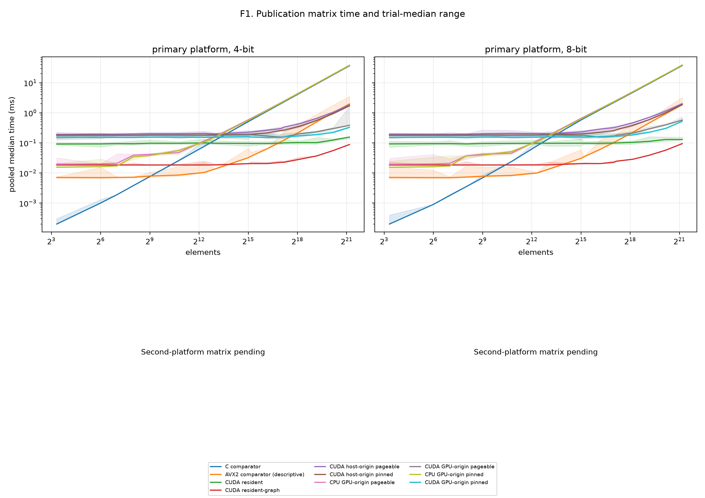
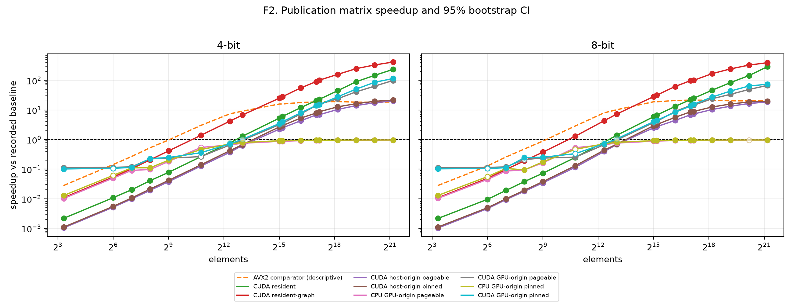
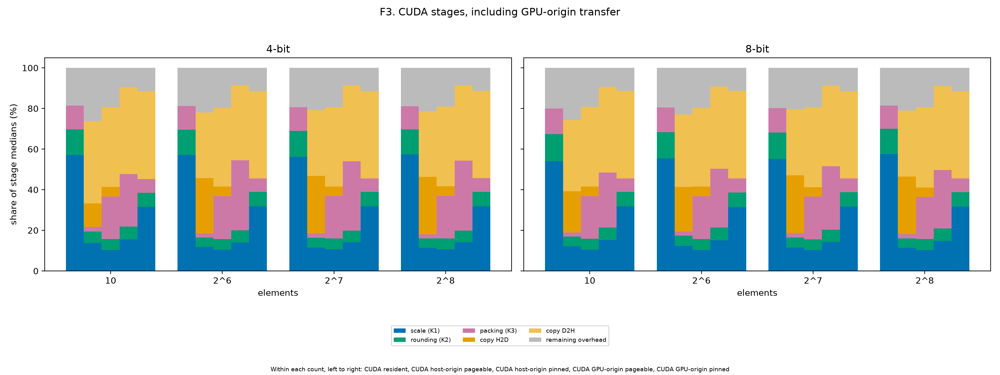
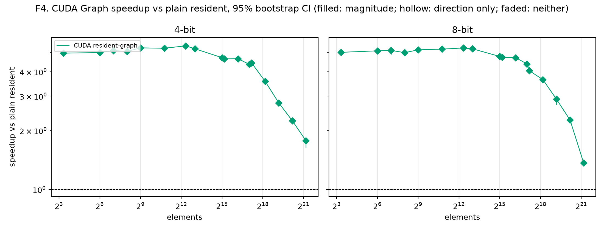
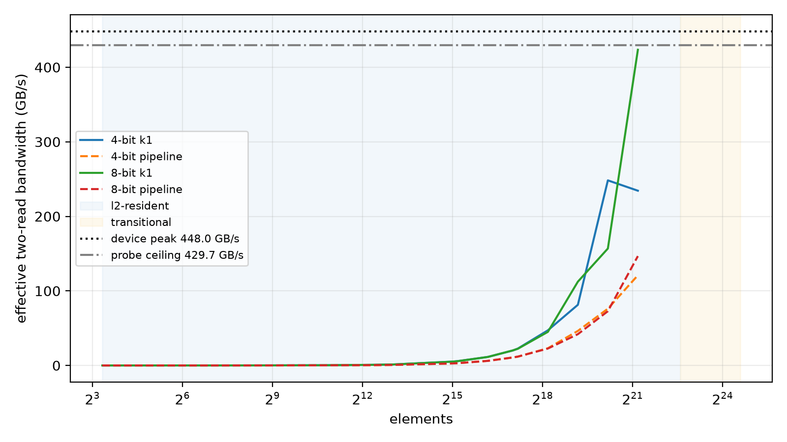

# Publication matrix report (model)

Revision `46c1294`; 340 cases; all passed: True.

## Input family

| Family | Inputs | Cells | Distinct counts |
|---|---:|---:|---:|
| model | 17 | 340 | 17 |

### Input provenance

| Input | Elements | Source detail |
|---|---:|---|
| model_bn1.weight | 64 | bn1.weight; shape [64]; bn |
| model_conv1.weight | 1728 | conv1.weight; shape [64, 3, 3, 3]; conv |
| model_layer1.0.conv1.weight | 36864 | layer1.0.conv1.weight; shape [64, 64, 3, 3]; conv |
| model_layer2.0.bn1.weight | 128 | layer2.0.bn1.weight; shape [128]; bn |
| model_layer2.0.conv1.weight | 73728 | layer2.0.conv1.weight; shape [128, 64, 3, 3]; conv |
| model_layer2.0.conv2.weight | 147456 | layer2.0.conv2.weight; shape [128, 128, 3, 3]; conv |
| model_layer2.0.shortcut.0.weight | 8192 | layer2.0.shortcut.0.weight; shape [128, 64, 1, 1]; conv |
| model_layer3.0.bn1.weight | 256 | layer3.0.bn1.weight; shape [256]; bn |
| model_layer3.0.conv1.weight | 294912 | layer3.0.conv1.weight; shape [256, 128, 3, 3]; conv |
| model_layer3.0.conv2.weight | 589824 | layer3.0.conv2.weight; shape [256, 256, 3, 3]; conv |
| model_layer3.0.shortcut.0.weight | 32768 | layer3.0.shortcut.0.weight; shape [256, 128, 1, 1]; conv |
| model_layer4.0.bn1.weight | 512 | layer4.0.bn1.weight; shape [512]; bn |
| model_layer4.0.conv1.weight | 1179648 | layer4.0.conv1.weight; shape [512, 256, 3, 3]; conv |
| model_layer4.0.conv2.weight | 2359296 | layer4.0.conv2.weight; shape [512, 512, 3, 3]; conv |
| model_layer4.0.shortcut.0.weight | 131072 | layer4.0.shortcut.0.weight; shape [512, 256, 1, 1]; conv |
| model_linear.bias | 10 | linear.bias; shape [10]; bias |
| model_linear.weight | 5120 | linear.weight; shape [10, 512]; linear |

## Path comparisons

GPU-origin CUDA uses the policy-matched CPU GPU-origin baseline. Other CUDA paths use the scalar C comparator. AVX2 and cross-boundary GPU-origin comparisons are descriptive.

| Input | Elements | Bits | Path | Policy | Baseline | Median ms | Speedup and CI | Inversion |
|---|---:|---:|---|---|---|---:|---|---|
| model_bn1.weight | 64 | 4 | cpu-avx2-optimized | none | cpu-comparator | 0.007 | 0.143× [0.142, 0.145]; slower; direction=False; magnitude=False | False |
| model_bn1.weight | 64 | 4 | cpu-comparator | none | — | 0.001 | 1× [1, 1]; comparator; direction=False; magnitude=False | False |
| model_bn1.weight | 64 | 4 | cpu-gpu-origin | pageable | cpu-comparator | 0.0201 | 0.0498× [0.0498, 0.05]; slower; direction=True; magnitude=True | False |
| model_bn1.weight | 64 | 4 | cpu-gpu-origin-pinned | pinned | cpu-comparator | 0.0162 | 0.0617× [0.0611, 0.0618]; slower; direction=True; magnitude=False | False |
| model_bn1.weight | 64 | 4 | cuda-gpu-origin | pageable | cpu-gpu-origin | 0.175 | 0.115× [0.114, 0.115]; slower; direction=True; magnitude=True | False |
| model_bn1.weight | 64 | 4 | cuda-gpu-origin-pinned | pinned | cpu-gpu-origin-pinned | 0.1514 | 0.107× [0.105, 0.109]; slower; direction=True; magnitude=False | False |
| model_bn1.weight | 64 | 4 | cuda-host-origin | pageable | cpu-comparator | 0.1935 | 0.00517× [0.00507, 0.0053]; slower; direction=True; magnitude=True | False |
| model_bn1.weight | 64 | 4 | cuda-host-origin-pinned | pinned | cpu-comparator | 0.1815 | 0.00551× [0.00542, 0.00565]; slower; direction=True; magnitude=True | False |
| model_bn1.weight | 64 | 4 | cuda-resident | none | cpu-comparator | 0.09215 | 0.0109× [0.0105, 0.011]; slower; direction=True; magnitude=True | False |
| model_bn1.weight | 64 | 4 | cuda-resident-graph | none | cpu-comparator | 0.0184 | 0.0543× [0.0543, 0.0543]; slower; direction=True; magnitude=True | False |
| model_bn1.weight | 64 | 8 | cpu-avx2-optimized | none | cpu-comparator | 0.007 | 0.129× [0.127, 0.13]; slower; direction=False; magnitude=False | False |
| model_bn1.weight | 64 | 8 | cpu-comparator | none | — | 0.0009 | 1× [1, 1]; comparator; direction=False; magnitude=False | False |
| model_bn1.weight | 64 | 8 | cpu-gpu-origin | pageable | cpu-comparator | 0.02 | 0.045× [0.0448, 0.0452]; slower; direction=True; magnitude=True | False |
| model_bn1.weight | 64 | 8 | cpu-gpu-origin-pinned | pinned | cpu-comparator | 0.0161 | 0.0559× [0.0557, 0.0561]; slower; direction=True; magnitude=False | False |
| model_bn1.weight | 64 | 8 | cuda-gpu-origin | pageable | cpu-gpu-origin | 0.1749 | 0.114× [0.114, 0.115]; slower; direction=True; magnitude=True | False |
| model_bn1.weight | 64 | 8 | cuda-gpu-origin-pinned | pinned | cpu-gpu-origin-pinned | 0.1532 | 0.105× [0.104, 0.106]; slower; direction=True; magnitude=False | False |
| model_bn1.weight | 64 | 8 | cuda-host-origin | pageable | cpu-comparator | 0.1943 | 0.00463× [0.00457, 0.00471]; slower; direction=True; magnitude=True | False |
| model_bn1.weight | 64 | 8 | cuda-host-origin-pinned | pinned | cpu-comparator | 0.1815 | 0.00496× [0.00489, 0.005]; slower; direction=True; magnitude=True | False |
| model_bn1.weight | 64 | 8 | cuda-resident | none | cpu-comparator | 0.09405 | 0.00957× [0.00927, 0.00996]; slower; direction=True; magnitude=True | False |
| model_bn1.weight | 64 | 8 | cuda-resident-graph | none | cpu-comparator | 0.0184 | 0.0489× [0.0489, 0.0489]; slower; direction=True; magnitude=True | False |
| model_conv1.weight | 1728 | 4 | cpu-avx2-optimized | none | cpu-comparator | 0.0085 | 3.01× [3.01, 3.05]; faster; direction=False; magnitude=False | False |
| model_conv1.weight | 1728 | 4 | cpu-comparator | none | — | 0.0256 | 1× [1, 1]; comparator; direction=False; magnitude=False | False |
| model_conv1.weight | 1728 | 4 | cpu-gpu-origin | pageable | cpu-comparator | 0.0473 | 0.541× [0.477, 0.543]; slower; direction=True; magnitude=False | False |
| model_conv1.weight | 1728 | 4 | cpu-gpu-origin-pinned | pinned | cpu-comparator | 0.0556 | 0.46× [0.457, 0.462]; slower; direction=True; magnitude=True | False |
| model_conv1.weight | 1728 | 4 | cuda-gpu-origin | pageable | cpu-gpu-origin | 0.1786 | 0.265× [0.257, 0.302]; slower; direction=True; magnitude=False | False |
| model_conv1.weight | 1728 | 4 | cuda-gpu-origin-pinned | pinned | cpu-gpu-origin-pinned | 0.1546 | 0.36× [0.353, 0.365]; slower; direction=True; magnitude=True | False |
| model_conv1.weight | 1728 | 4 | cuda-host-origin | pageable | cpu-comparator | 0.2019 | 0.127× [0.125, 0.131]; slower; direction=True; magnitude=True | False |
| model_conv1.weight | 1728 | 4 | cuda-host-origin-pinned | pinned | cpu-comparator | 0.1835 | 0.14× [0.138, 0.141]; slower; direction=True; magnitude=True | False |
| model_conv1.weight | 1728 | 4 | cuda-resident | none | cpu-comparator | 0.09695 | 0.264× [0.258, 0.271]; slower; direction=True; magnitude=True | False |
| model_conv1.weight | 1728 | 4 | cuda-resident-graph | none | cpu-comparator | 0.0184 | 1.39× [1.39, 1.39]; faster; direction=True; magnitude=True | False |
| model_conv1.weight | 1728 | 8 | cpu-avx2-optimized | none | cpu-comparator | 0.0083 | 2.87× [2.83, 2.89]; faster; direction=False; magnitude=False | False |
| model_conv1.weight | 1728 | 8 | cpu-comparator | none | — | 0.0238 | 1× [1, 1]; comparator; direction=False; magnitude=False | False |
| model_conv1.weight | 1728 | 8 | cpu-gpu-origin | pageable | cpu-comparator | 0.045 | 0.529× [0.528, 0.53]; slower; direction=True; magnitude=True | False |
| model_conv1.weight | 1728 | 8 | cpu-gpu-origin-pinned | pinned | cpu-comparator | 0.0511 | 0.466× [0.435, 0.589]; slower; direction=True; magnitude=False | False |
| model_conv1.weight | 1728 | 8 | cuda-gpu-origin | pageable | cpu-gpu-origin | 0.1779 | 0.253× [0.252, 0.254]; slower; direction=True; magnitude=True | False |
| model_conv1.weight | 1728 | 8 | cuda-gpu-origin-pinned | pinned | cpu-gpu-origin-pinned | 0.1533 | 0.333× [0.261, 0.358]; slower; direction=True; magnitude=False | False |
| model_conv1.weight | 1728 | 8 | cuda-host-origin | pageable | cpu-comparator | 0.2066 | 0.115× [0.114, 0.118]; slower; direction=True; magnitude=True | False |
| model_conv1.weight | 1728 | 8 | cuda-host-origin-pinned | pinned | cpu-comparator | 0.1829 | 0.13× [0.129, 0.131]; slower; direction=True; magnitude=True | False |
| model_conv1.weight | 1728 | 8 | cuda-resident | none | cpu-comparator | 0.09595 | 0.248× [0.239, 0.25]; slower; direction=True; magnitude=True | False |
| model_conv1.weight | 1728 | 8 | cuda-resident-graph | none | cpu-comparator | 0.0184 | 1.29× [1.29, 1.29]; faster; direction=True; magnitude=True | False |
| model_layer1.0.conv1.weight | 36864 | 4 | cpu-avx2-optimized | none | cpu-comparator | 0.036 | 15.9× [15.8, 15.9]; faster; direction=False; magnitude=False | False |
| model_layer1.0.conv1.weight | 36864 | 4 | cpu-comparator | none | — | 0.5723 | 1× [1, 1]; comparator; direction=False; magnitude=False | False |
| model_layer1.0.conv1.weight | 36864 | 4 | cpu-gpu-origin | pageable | cpu-comparator | 0.6535 | 0.876× [0.875, 0.876]; slower; direction=True; magnitude=True | False |
| model_layer1.0.conv1.weight | 36864 | 4 | cpu-gpu-origin-pinned | pinned | cpu-comparator | 0.6241 | 0.917× [0.917, 0.917]; slower; direction=True; magnitude=True | False |
| model_layer1.0.conv1.weight | 36864 | 4 | cuda-gpu-origin | pageable | cpu-gpu-origin | 0.186 | 3.51× [3.47, 3.54]; faster; direction=True; magnitude=True | False |
| model_layer1.0.conv1.weight | 36864 | 4 | cuda-gpu-origin-pinned | pinned | cpu-gpu-origin-pinned | 0.1559 | 4× [3.96, 4.07]; faster; direction=True; magnitude=True | False |
| model_layer1.0.conv1.weight | 36864 | 4 | cuda-host-origin | pageable | cpu-comparator | 0.2304 | 2.48× [2.43, 2.48]; faster; direction=True; magnitude=True | False |
| model_layer1.0.conv1.weight | 36864 | 4 | cuda-host-origin-pinned | pinned | cpu-comparator | 0.1934 | 2.96× [2.83, 3]; faster; direction=True; magnitude=True | False |
| model_layer1.0.conv1.weight | 36864 | 4 | cuda-resident | none | cpu-comparator | 0.09535 | 6× [5.87, 6.12]; faster; direction=True; magnitude=True | False |
| model_layer1.0.conv1.weight | 36864 | 4 | cuda-resident-graph | none | cpu-comparator | 0.0205 | 27.9× [27.9, 28.1]; faster; direction=True; magnitude=True | False |
| model_layer1.0.conv1.weight | 36864 | 8 | cpu-avx2-optimized | none | cpu-comparator | 0.0344 | 18.8× [18.8, 19]; faster; direction=False; magnitude=False | False |
| model_layer1.0.conv1.weight | 36864 | 8 | cpu-comparator | none | — | 0.6478 | 1× [1, 1]; comparator; direction=False; magnitude=False | False |
| model_layer1.0.conv1.weight | 36864 | 8 | cpu-gpu-origin | pageable | cpu-comparator | 0.7289 | 0.889× [0.888, 0.889]; slower; direction=True; magnitude=True | False |
| model_layer1.0.conv1.weight | 36864 | 8 | cpu-gpu-origin-pinned | pinned | cpu-comparator | 0.6994 | 0.926× [0.926, 0.926]; slower; direction=True; magnitude=True | False |
| model_layer1.0.conv1.weight | 36864 | 8 | cuda-gpu-origin | pageable | cpu-gpu-origin | 0.1776 | 4.1× [3.86, 4.25]; faster; direction=True; magnitude=False | False |
| model_layer1.0.conv1.weight | 36864 | 8 | cuda-gpu-origin-pinned | pinned | cpu-gpu-origin-pinned | 0.1563 | 4.47× [4.31, 4.62]; faster; direction=True; magnitude=True | False |
| model_layer1.0.conv1.weight | 36864 | 8 | cuda-host-origin | pageable | cpu-comparator | 0.2382 | 2.72× [2.69, 2.75]; faster; direction=True; magnitude=True | False |
| model_layer1.0.conv1.weight | 36864 | 8 | cuda-host-origin-pinned | pinned | cpu-comparator | 0.2012 | 3.22× [3.13, 3.31]; faster; direction=True; magnitude=True | False |
| model_layer1.0.conv1.weight | 36864 | 8 | cuda-resident | none | cpu-comparator | 0.09705 | 6.67× [6.45, 6.85]; faster; direction=True; magnitude=True | False |
| model_layer1.0.conv1.weight | 36864 | 8 | cuda-resident-graph | none | cpu-comparator | 0.0205 | 31.6× [31.6, 31.8]; faster; direction=True; magnitude=True | False |
| model_layer2.0.bn1.weight | 128 | 4 | cpu-avx2-optimized | none | cpu-comparator | 0.0071 | 0.268× [0.264, 0.27]; slower; direction=False; magnitude=False | False |
| model_layer2.0.bn1.weight | 128 | 4 | cpu-comparator | none | — | 0.0019 | 1× [1, 1]; comparator; direction=False; magnitude=False | False |
| model_layer2.0.bn1.weight | 128 | 4 | cpu-gpu-origin | pageable | cpu-comparator | 0.021 | 0.0905× [0.0905, 0.0905]; slower; direction=True; magnitude=True | False |
| model_layer2.0.bn1.weight | 128 | 4 | cpu-gpu-origin-pinned | pinned | cpu-comparator | 0.0172 | 0.11× [0.11, 0.11]; slower; direction=True; magnitude=True | False |
| model_layer2.0.bn1.weight | 128 | 4 | cuda-gpu-origin | pageable | cpu-gpu-origin | 0.1754 | 0.12× [0.12, 0.12]; slower; direction=True; magnitude=True | False |
| model_layer2.0.bn1.weight | 128 | 4 | cuda-gpu-origin-pinned | pinned | cpu-gpu-origin-pinned | 0.1512 | 0.114× [0.112, 0.115]; slower; direction=True; magnitude=True | False |
| model_layer2.0.bn1.weight | 128 | 4 | cuda-host-origin | pageable | cpu-comparator | 0.1933 | 0.00983× [0.00962, 0.0101]; slower; direction=True; magnitude=True | False |
| model_layer2.0.bn1.weight | 128 | 4 | cuda-host-origin-pinned | pinned | cpu-comparator | 0.1791 | 0.0106× [0.0105, 0.0108]; slower; direction=True; magnitude=True | False |
| model_layer2.0.bn1.weight | 128 | 4 | cuda-resident | none | cpu-comparator | 0.09435 | 0.0201× [0.0196, 0.0206]; slower; direction=True; magnitude=True | False |
| model_layer2.0.bn1.weight | 128 | 4 | cuda-resident-graph | none | cpu-comparator | 0.0184 | 0.103× [0.103, 0.103]; slower; direction=True; magnitude=True | False |
| model_layer2.0.bn1.weight | 128 | 8 | cpu-avx2-optimized | none | cpu-comparator | 0.007 | 0.257× [0.253, 0.261]; slower; direction=False; magnitude=False | False |
| model_layer2.0.bn1.weight | 128 | 8 | cpu-comparator | none | — | 0.0018 | 1× [1, 1]; comparator; direction=False; magnitude=False | False |
| model_layer2.0.bn1.weight | 128 | 8 | cpu-gpu-origin | pageable | cpu-comparator | 0.0209 | 0.0861× [0.0859, 0.0865]; slower; direction=True; magnitude=True | False |
| model_layer2.0.bn1.weight | 128 | 8 | cpu-gpu-origin-pinned | pinned | cpu-comparator | 0.0171 | 0.105× [0.104, 0.106]; slower; direction=True; magnitude=True | False |
| model_layer2.0.bn1.weight | 128 | 8 | cuda-gpu-origin | pageable | cpu-gpu-origin | 0.1754 | 0.119× [0.118, 0.12]; slower; direction=True; magnitude=True | False |
| model_layer2.0.bn1.weight | 128 | 8 | cuda-gpu-origin-pinned | pinned | cpu-gpu-origin-pinned | 0.153 | 0.112× [0.111, 0.115]; slower; direction=True; magnitude=True | False |
| model_layer2.0.bn1.weight | 128 | 8 | cuda-host-origin | pageable | cpu-comparator | 0.1933 | 0.00931× [0.00907, 0.00951]; slower; direction=True; magnitude=True | False |
| model_layer2.0.bn1.weight | 128 | 8 | cuda-host-origin-pinned | pinned | cpu-comparator | 0.1815 | 0.00992× [0.00973, 0.0101]; slower; direction=True; magnitude=True | False |
| model_layer2.0.bn1.weight | 128 | 8 | cuda-resident | none | cpu-comparator | 0.0945 | 0.019× [0.0185, 0.02]; slower; direction=True; magnitude=True | False |
| model_layer2.0.bn1.weight | 128 | 8 | cuda-resident-graph | none | cpu-comparator | 0.0184 | 0.0978× [0.0978, 0.0978]; slower; direction=True; magnitude=True | False |
| model_layer2.0.conv1.weight | 73728 | 4 | cpu-avx2-optimized | none | cpu-comparator | 0.0643 | 17.8× [17.8, 17.9]; faster; direction=False; magnitude=False | False |
| model_layer2.0.conv1.weight | 73728 | 4 | cpu-comparator | none | — | 1.146 | 1× [1, 1]; comparator; direction=False; magnitude=False | False |
| model_layer2.0.conv1.weight | 73728 | 4 | cpu-gpu-origin | pageable | cpu-comparator | 1.251 | 0.916× [0.915, 0.916]; slower; direction=True; magnitude=True | False |
| model_layer2.0.conv1.weight | 73728 | 4 | cpu-gpu-origin-pinned | pinned | cpu-comparator | 1.217 | 0.941× [0.941, 0.941]; slower; direction=True; magnitude=True | False |
| model_layer2.0.conv1.weight | 73728 | 4 | cuda-gpu-origin | pageable | cpu-gpu-origin | 0.1693 | 7.39× [7.05, 8.35]; faster; direction=True; magnitude=False | False |
| model_layer2.0.conv1.weight | 73728 | 4 | cuda-gpu-origin-pinned | pinned | cpu-gpu-origin-pinned | 0.1517 | 8.02× [7.89, 8.21]; faster; direction=True; magnitude=True | False |
| model_layer2.0.conv1.weight | 73728 | 4 | cuda-host-origin | pageable | cpu-comparator | 0.2652 | 4.32× [4.25, 4.37]; faster; direction=True; magnitude=True | False |
| model_layer2.0.conv1.weight | 73728 | 4 | cuda-host-origin-pinned | pinned | cpu-comparator | 0.2156 | 5.31× [5.09, 5.32]; faster; direction=True; magnitude=True | False |
| model_layer2.0.conv1.weight | 73728 | 4 | cuda-resident | none | cpu-comparator | 0.09545 | 12× [11.7, 12.2]; faster; direction=True; magnitude=True | False |
| model_layer2.0.conv1.weight | 73728 | 4 | cuda-resident-graph | none | cpu-comparator | 0.0205 | 55.9× [55.9, 55.9]; faster; direction=True; magnitude=True | False |
| model_layer2.0.conv1.weight | 73728 | 8 | cpu-avx2-optimized | none | cpu-comparator | 0.0608 | 20.9× [20.9, 20.9]; faster; direction=False; magnitude=False | False |
| model_layer2.0.conv1.weight | 73728 | 8 | cpu-comparator | none | — | 1.27 | 1× [1, 1]; comparator; direction=False; magnitude=False | False |
| model_layer2.0.conv1.weight | 73728 | 8 | cpu-gpu-origin | pageable | cpu-comparator | 1.376 | 0.923× [0.923, 0.923]; slower; direction=True; magnitude=True | False |
| model_layer2.0.conv1.weight | 73728 | 8 | cpu-gpu-origin-pinned | pinned | cpu-comparator | 1.342 | 0.946× [0.946, 0.947]; slower; direction=True; magnitude=True | False |
| model_layer2.0.conv1.weight | 73728 | 8 | cuda-gpu-origin | pageable | cpu-gpu-origin | 0.1553 | 8.86× [8.62, 9.23]; faster; direction=True; magnitude=False | False |
| model_layer2.0.conv1.weight | 73728 | 8 | cuda-gpu-origin-pinned | pinned | cpu-gpu-origin-pinned | 0.1612 | 8.33× [8.08, 8.45]; faster; direction=True; magnitude=True | False |
| model_layer2.0.conv1.weight | 73728 | 8 | cuda-host-origin | pageable | cpu-comparator | 0.2868 | 4.43× [4.32, 4.57]; faster; direction=True; magnitude=True | False |
| model_layer2.0.conv1.weight | 73728 | 8 | cuda-host-origin-pinned | pinned | cpu-comparator | 0.2253 | 5.64× [5.28, 5.69]; faster; direction=True; magnitude=True | False |
| model_layer2.0.conv1.weight | 73728 | 8 | cuda-resident | none | cpu-comparator | 0.0967 | 13.1× [13, 13.5]; faster; direction=True; magnitude=True | False |
| model_layer2.0.conv1.weight | 73728 | 8 | cuda-resident-graph | none | cpu-comparator | 0.0205 | 62× [61.9, 62]; faster; direction=True; magnitude=True | False |
| model_layer2.0.conv2.weight | 147456 | 4 | cpu-avx2-optimized | none | cpu-comparator | 0.122 | 18.8× [18.7, 18.8]; faster; direction=False; magnitude=False | False |
| model_layer2.0.conv2.weight | 147456 | 4 | cpu-comparator | none | — | 2.289 | 1× [1, 1]; comparator; direction=False; magnitude=False | False |
| model_layer2.0.conv2.weight | 147456 | 4 | cpu-gpu-origin | pageable | cpu-comparator | 2.452 | 0.934× [0.933, 0.934]; slower; direction=True; magnitude=True | False |
| model_layer2.0.conv2.weight | 147456 | 4 | cpu-gpu-origin-pinned | pinned | cpu-comparator | 2.405 | 0.952× [0.951, 0.953]; slower; direction=True; magnitude=True | False |
| model_layer2.0.conv2.weight | 147456 | 4 | cuda-gpu-origin | pageable | cpu-gpu-origin | 0.1573 | 15.6× [14.9, 16.2]; faster; direction=True; magnitude=False | False |
| model_layer2.0.conv2.weight | 147456 | 4 | cuda-gpu-origin-pinned | pinned | cpu-gpu-origin-pinned | 0.1585 | 15.2× [14.8, 15.6]; faster; direction=True; magnitude=True | False |
| model_layer2.0.conv2.weight | 147456 | 4 | cuda-host-origin | pageable | cpu-comparator | 0.3318 | 6.9× [6.74, 6.96]; faster; direction=True; magnitude=True | False |
| model_layer2.0.conv2.weight | 147456 | 4 | cuda-host-origin-pinned | pinned | cpu-comparator | 0.263 | 8.7× [8.36, 8.76]; faster; direction=True; magnitude=True | False |
| model_layer2.0.conv2.weight | 147456 | 4 | cuda-resident | none | cpu-comparator | 0.1002 | 22.8× [22.4, 23.2]; faster; direction=True; magnitude=True | False |
| model_layer2.0.conv2.weight | 147456 | 4 | cuda-resident-graph | none | cpu-comparator | 0.0226 | 101× [100, 102]; faster; direction=True; magnitude=True | False |
| model_layer2.0.conv2.weight | 147456 | 8 | cpu-avx2-optimized | none | cpu-comparator | 0.1152 | 21.4× [21.3, 21.4]; faster; direction=False; magnitude=False | False |
| model_layer2.0.conv2.weight | 147456 | 8 | cpu-comparator | none | — | 2.462 | 1× [1, 1]; comparator; direction=False; magnitude=False | False |
| model_layer2.0.conv2.weight | 147456 | 8 | cpu-gpu-origin | pageable | cpu-comparator | 2.621 | 0.94× [0.938, 0.942]; slower; direction=True; magnitude=True | False |
| model_layer2.0.conv2.weight | 147456 | 8 | cpu-gpu-origin-pinned | pinned | cpu-comparator | 2.575 | 0.956× [0.955, 0.959]; slower; direction=True; magnitude=True | False |
| model_layer2.0.conv2.weight | 147456 | 8 | cuda-gpu-origin | pageable | cpu-gpu-origin | 0.1821 | 14.4× [13.4, 14.9]; faster; direction=True; magnitude=True | False |
| model_layer2.0.conv2.weight | 147456 | 8 | cuda-gpu-origin-pinned | pinned | cpu-gpu-origin-pinned | 0.1651 | 15.6× [15.1, 15.7]; faster; direction=True; magnitude=True | False |
| model_layer2.0.conv2.weight | 147456 | 8 | cuda-host-origin | pageable | cpu-comparator | 0.3385 | 7.27× [7.2, 7.41]; faster; direction=True; magnitude=True | False |
| model_layer2.0.conv2.weight | 147456 | 8 | cuda-host-origin-pinned | pinned | cpu-comparator | 0.2771 | 8.89× [8.74, 8.93]; faster; direction=True; magnitude=True | False |
| model_layer2.0.conv2.weight | 147456 | 8 | cuda-resident | none | cpu-comparator | 0.09955 | 24.7× [24, 25]; faster; direction=True; magnitude=True | False |
| model_layer2.0.conv2.weight | 147456 | 8 | cuda-resident-graph | none | cpu-comparator | 0.0246 | 100× [100, 100]; faster; direction=True; magnitude=True | False |
| model_layer2.0.shortcut.0.weight | 8192 | 4 | cpu-avx2-optimized | none | cpu-comparator | 0.0137 | 9.1× [9.07, 9.17]; faster; direction=False; magnitude=False | False |
| model_layer2.0.shortcut.0.weight | 8192 | 4 | cpu-comparator | none | — | 0.1247 | 1× [1, 1]; comparator; direction=False; magnitude=False | False |
| model_layer2.0.shortcut.0.weight | 8192 | 4 | cpu-gpu-origin | pageable | cpu-comparator | 0.1667 | 0.748× [0.747, 0.748]; slower; direction=True; magnitude=True | False |
| model_layer2.0.shortcut.0.weight | 8192 | 4 | cpu-gpu-origin-pinned | pinned | cpu-comparator | 0.158 | 0.789× [0.789, 0.79]; slower; direction=True; magnitude=True | False |
| model_layer2.0.shortcut.0.weight | 8192 | 4 | cuda-gpu-origin | pageable | cpu-gpu-origin | 0.1771 | 0.941× [0.936, 0.943]; inconclusive; direction=False; magnitude=False | False |
| model_layer2.0.shortcut.0.weight | 8192 | 4 | cuda-gpu-origin-pinned | pinned | cpu-gpu-origin-pinned | 0.1555 | 1.02× [0.999, 1.05]; inconclusive; direction=False; magnitude=False | False |
| model_layer2.0.shortcut.0.weight | 8192 | 4 | cuda-host-origin | pageable | cpu-comparator | 0.1983 | 0.629× [0.623, 0.634]; slower; direction=True; magnitude=True | False |
| model_layer2.0.shortcut.0.weight | 8192 | 4 | cuda-host-origin-pinned | pinned | cpu-comparator | 0.1862 | 0.67× [0.659, 0.676]; slower; direction=True; magnitude=True | False |
| model_layer2.0.shortcut.0.weight | 8192 | 4 | cuda-resident | none | cpu-comparator | 0.09685 | 1.29× [1.28, 1.33]; faster; direction=True; magnitude=True | False |
| model_layer2.0.shortcut.0.weight | 8192 | 4 | cuda-resident-graph | none | cpu-comparator | 0.0185 | 6.74× [6.74, 6.78]; faster; direction=True; magnitude=True | False |
| model_layer2.0.shortcut.0.weight | 8192 | 8 | cpu-avx2-optimized | none | cpu-comparator | 0.0132 | 10.1× [10.1, 10.2]; faster; direction=False; magnitude=False | False |
| model_layer2.0.shortcut.0.weight | 8192 | 8 | cpu-comparator | none | — | 0.1339 | 1× [1, 1]; comparator; direction=False; magnitude=False | False |
| model_layer2.0.shortcut.0.weight | 8192 | 8 | cpu-gpu-origin | pageable | cpu-comparator | 0.1759 | 0.761× [0.761, 0.762]; slower; direction=True; magnitude=True | False |
| model_layer2.0.shortcut.0.weight | 8192 | 8 | cpu-gpu-origin-pinned | pinned | cpu-comparator | 0.1671 | 0.802× [0.801, 0.802]; slower; direction=True; magnitude=True | False |
| model_layer2.0.shortcut.0.weight | 8192 | 8 | cuda-gpu-origin | pageable | cpu-gpu-origin | 0.183 | 0.961× [0.956, 0.981]; inconclusive; direction=False; magnitude=False | False |
| model_layer2.0.shortcut.0.weight | 8192 | 8 | cuda-gpu-origin-pinned | pinned | cpu-gpu-origin-pinned | 0.1586 | 1.05× [1.03, 1.08]; inconclusive; direction=False; magnitude=False | False |
| model_layer2.0.shortcut.0.weight | 8192 | 8 | cuda-host-origin | pageable | cpu-comparator | 0.1989 | 0.673× [0.645, 0.678]; inconclusive; direction=False; magnitude=False | False |
| model_layer2.0.shortcut.0.weight | 8192 | 8 | cuda-host-origin-pinned | pinned | cpu-comparator | 0.1921 | 0.697× [0.687, 0.704]; slower; direction=True; magnitude=True | False |
| model_layer2.0.shortcut.0.weight | 8192 | 8 | cuda-resident | none | cpu-comparator | 0.0968 | 1.38× [1.32, 1.4]; faster; direction=True; magnitude=True | False |
| model_layer2.0.shortcut.0.weight | 8192 | 8 | cuda-resident-graph | none | cpu-comparator | 0.0185 | 7.24× [7.21, 7.26]; faster; direction=True; magnitude=True | False |
| model_layer3.0.bn1.weight | 256 | 4 | cpu-avx2-optimized | none | cpu-comparator | 0.0072 | 0.528× [0.528, 0.535]; slower; direction=False; magnitude=False | False |
| model_layer3.0.bn1.weight | 256 | 4 | cpu-comparator | none | — | 0.0038 | 1× [1, 1]; comparator; direction=False; magnitude=False | False |
| model_layer3.0.bn1.weight | 256 | 4 | cpu-gpu-origin | pageable | cpu-comparator | 0.039 | 0.0974× [0.0955, 0.0979]; slower; direction=True; magnitude=True | False |
| model_layer3.0.bn1.weight | 256 | 4 | cpu-gpu-origin-pinned | pinned | cpu-comparator | 0.03425 | 0.111× [0.106, 0.116]; slower; direction=True; magnitude=True | False |
| model_layer3.0.bn1.weight | 256 | 4 | cuda-gpu-origin | pageable | cpu-gpu-origin | 0.1752 | 0.223× [0.221, 0.228]; slower; direction=True; magnitude=True | False |
| model_layer3.0.bn1.weight | 256 | 4 | cuda-gpu-origin-pinned | pinned | cpu-gpu-origin-pinned | 0.151 | 0.227× [0.213, 0.238]; slower; direction=True; magnitude=True | False |
| model_layer3.0.bn1.weight | 256 | 4 | cuda-host-origin | pageable | cpu-comparator | 0.1978 | 0.0192× [0.019, 0.0197]; slower; direction=True; magnitude=True | False |
| model_layer3.0.bn1.weight | 256 | 4 | cuda-host-origin-pinned | pinned | cpu-comparator | 0.1792 | 0.0212× [0.021, 0.0224]; slower; direction=True; magnitude=True | False |
| model_layer3.0.bn1.weight | 256 | 4 | cuda-resident | none | cpu-comparator | 0.0934 | 0.0407× [0.0393, 0.0416]; slower; direction=True; magnitude=True | False |
| model_layer3.0.bn1.weight | 256 | 4 | cuda-resident-graph | none | cpu-comparator | 0.0184 | 0.207× [0.207, 0.207]; slower; direction=True; magnitude=True | False |
| model_layer3.0.bn1.weight | 256 | 8 | cpu-avx2-optimized | none | cpu-comparator | 0.0073 | 0.479× [0.476, 0.486]; slower; direction=False; magnitude=False | False |
| model_layer3.0.bn1.weight | 256 | 8 | cpu-comparator | none | — | 0.0035 | 1× [1, 1]; comparator; direction=False; magnitude=False | False |
| model_layer3.0.bn1.weight | 256 | 8 | cpu-gpu-origin | pageable | cpu-comparator | 0.037 | 0.0946× [0.0917, 0.101]; slower; direction=True; magnitude=False | False |
| model_layer3.0.bn1.weight | 256 | 8 | cpu-gpu-origin-pinned | pinned | cpu-comparator | 0.0371 | 0.0943× [0.0943, 0.0946]; slower; direction=True; magnitude=True | False |
| model_layer3.0.bn1.weight | 256 | 8 | cuda-gpu-origin | pageable | cpu-gpu-origin | 0.1749 | 0.212× [0.199, 0.218]; slower; direction=True; magnitude=False | False |
| model_layer3.0.bn1.weight | 256 | 8 | cuda-gpu-origin-pinned | pinned | cpu-gpu-origin-pinned | 0.1509 | 0.246× [0.243, 0.249]; slower; direction=True; magnitude=True | False |
| model_layer3.0.bn1.weight | 256 | 8 | cuda-host-origin | pageable | cpu-comparator | 0.1961 | 0.0178× [0.0176, 0.0182]; slower; direction=True; magnitude=True | False |
| model_layer3.0.bn1.weight | 256 | 8 | cuda-host-origin-pinned | pinned | cpu-comparator | 0.1811 | 0.0193× [0.0192, 0.0195]; slower; direction=True; magnitude=True | False |
| model_layer3.0.bn1.weight | 256 | 8 | cuda-resident | none | cpu-comparator | 0.09205 | 0.038× [0.037, 0.0384]; slower; direction=True; magnitude=True | False |
| model_layer3.0.bn1.weight | 256 | 8 | cuda-resident-graph | none | cpu-comparator | 0.0184 | 0.19× [0.19, 0.19]; slower; direction=True; magnitude=True | False |
| model_layer3.0.conv1.weight | 294912 | 4 | cpu-avx2-optimized | none | cpu-comparator | 0.2388 | 19.2× [19.1, 19.2]; faster; direction=False; magnitude=False | False |
| model_layer3.0.conv1.weight | 294912 | 4 | cpu-comparator | none | — | 4.579 | 1× [1, 1]; comparator; direction=False; magnitude=False | False |
| model_layer3.0.conv1.weight | 294912 | 4 | cpu-gpu-origin | pageable | cpu-comparator | 4.845 | 0.945× [0.944, 0.946]; slower; direction=True; magnitude=True | False |
| model_layer3.0.conv1.weight | 294912 | 4 | cpu-gpu-origin-pinned | pinned | cpu-comparator | 4.778 | 0.958× [0.958, 0.958]; slower; direction=True; magnitude=True | False |
| model_layer3.0.conv1.weight | 294912 | 4 | cuda-gpu-origin | pageable | cpu-gpu-origin | 0.2022 | 24× [23.7, 25]; faster; direction=True; magnitude=True | False |
| model_layer3.0.conv1.weight | 294912 | 4 | cuda-gpu-origin-pinned | pinned | cpu-gpu-origin-pinned | 0.1716 | 27.8× [27.2, 28.6]; faster; direction=True; magnitude=True | False |
| model_layer3.0.conv1.weight | 294912 | 4 | cuda-host-origin | pageable | cpu-comparator | 0.44 | 10.4× [10.2, 10.6]; faster; direction=True; magnitude=True | False |
| model_layer3.0.conv1.weight | 294912 | 4 | cuda-host-origin-pinned | pinned | cpu-comparator | 0.3593 | 12.7× [12.4, 12.7]; faster; direction=True; magnitude=True | False |
| model_layer3.0.conv1.weight | 294912 | 4 | cuda-resident | none | cpu-comparator | 0.1024 | 44.7× [43.5, 45.4]; faster; direction=True; magnitude=True | False |
| model_layer3.0.conv1.weight | 294912 | 4 | cuda-resident-graph | none | cpu-comparator | 0.0287 | 160× [159, 160]; faster; direction=True; magnitude=True | False |
| model_layer3.0.conv1.weight | 294912 | 8 | cpu-avx2-optimized | none | cpu-comparator | 0.2259 | 21.3× [21.2, 21.4]; faster; direction=False; magnitude=False | False |
| model_layer3.0.conv1.weight | 294912 | 8 | cpu-comparator | none | — | 4.811 | 1× [1, 1]; comparator; direction=False; magnitude=False | False |
| model_layer3.0.conv1.weight | 294912 | 8 | cpu-gpu-origin | pageable | cpu-comparator | 5.076 | 0.948× [0.947, 0.948]; slower; direction=True; magnitude=True | False |
| model_layer3.0.conv1.weight | 294912 | 8 | cpu-gpu-origin-pinned | pinned | cpu-comparator | 5.008 | 0.961× [0.96, 0.961]; slower; direction=True; magnitude=True | False |
| model_layer3.0.conv1.weight | 294912 | 8 | cuda-gpu-origin | pageable | cpu-gpu-origin | 0.2123 | 23.9× [22.2, 24.9]; faster; direction=True; magnitude=True | False |
| model_layer3.0.conv1.weight | 294912 | 8 | cuda-gpu-origin-pinned | pinned | cpu-gpu-origin-pinned | 0.1847 | 27.1× [26.9, 27.4]; faster; direction=True; magnitude=True | False |
| model_layer3.0.conv1.weight | 294912 | 8 | cuda-host-origin | pageable | cpu-comparator | 0.4665 | 10.3× [10.2, 10.5]; faster; direction=True; magnitude=True | False |
| model_layer3.0.conv1.weight | 294912 | 8 | cuda-host-origin-pinned | pinned | cpu-comparator | 0.383 | 12.6× [12.4, 12.9]; faster; direction=True; magnitude=True | False |
| model_layer3.0.conv1.weight | 294912 | 8 | cuda-resident | none | cpu-comparator | 0.1041 | 46.2× [45.9, 47.6]; faster; direction=True; magnitude=True | False |
| model_layer3.0.conv1.weight | 294912 | 8 | cuda-resident-graph | none | cpu-comparator | 0.0286 | 168× [168, 168]; faster; direction=True; magnitude=True | False |
| model_layer3.0.conv2.weight | 589824 | 4 | cpu-avx2-optimized | none | cpu-comparator | 0.4991 | 18.3× [18.3, 18.4]; faster; direction=False; magnitude=False | False |
| model_layer3.0.conv2.weight | 589824 | 4 | cpu-comparator | none | — | 9.153 | 1× [1, 1]; comparator; direction=False; magnitude=False | False |
| model_layer3.0.conv2.weight | 589824 | 4 | cpu-gpu-origin | pageable | cpu-comparator | 9.577 | 0.956× [0.955, 0.956]; slower; direction=True; magnitude=True | False |
| model_layer3.0.conv2.weight | 589824 | 4 | cpu-gpu-origin-pinned | pinned | cpu-comparator | 9.52 | 0.961× [0.961, 0.962]; slower; direction=True; magnitude=True | False |
| model_layer3.0.conv2.weight | 589824 | 4 | cuda-gpu-origin | pageable | cpu-gpu-origin | 0.2339 | 40.9× [40.6, 41.2]; faster; direction=True; magnitude=True | False |
| model_layer3.0.conv2.weight | 589824 | 4 | cuda-gpu-origin-pinned | pinned | cpu-gpu-origin-pinned | 0.1881 | 50.6× [49.9, 51.4]; faster; direction=True; magnitude=True | False |
| model_layer3.0.conv2.weight | 589824 | 4 | cuda-host-origin | pageable | cpu-comparator | 0.6514 | 14.1× [13.9, 14.2]; faster; direction=True; magnitude=True | False |
| model_layer3.0.conv2.weight | 589824 | 4 | cuda-host-origin-pinned | pinned | cpu-comparator | 0.5611 | 16.3× [16.1, 16.5]; faster; direction=True; magnitude=True | False |
| model_layer3.0.conv2.weight | 589824 | 4 | cuda-resident | none | cpu-comparator | 0.1019 | 89.8× [89.4, 90.4]; faster; direction=True; magnitude=True | False |
| model_layer3.0.conv2.weight | 589824 | 4 | cuda-resident-graph | none | cpu-comparator | 0.0368 | 249× [249, 249]; faster; direction=True; magnitude=True | False |
| model_layer3.0.conv2.weight | 589824 | 8 | cpu-avx2-optimized | none | cpu-comparator | 0.4649 | 20.4× [20.4, 20.4]; faster; direction=False; magnitude=False | False |
| model_layer3.0.conv2.weight | 589824 | 8 | cpu-comparator | none | — | 9.483 | 1× [1, 1]; comparator; direction=False; magnitude=False | False |
| model_layer3.0.conv2.weight | 589824 | 8 | cpu-gpu-origin | pageable | cpu-comparator | 9.904 | 0.957× [0.957, 0.958]; slower; direction=True; magnitude=True | False |
| model_layer3.0.conv2.weight | 589824 | 8 | cpu-gpu-origin-pinned | pinned | cpu-comparator | 9.847 | 0.963× [0.963, 0.963]; slower; direction=True; magnitude=True | False |
| model_layer3.0.conv2.weight | 589824 | 8 | cuda-gpu-origin | pageable | cpu-gpu-origin | 0.2939 | 33.7× [33.5, 34]; faster; direction=True; magnitude=True | False |
| model_layer3.0.conv2.weight | 589824 | 8 | cuda-gpu-origin-pinned | pinned | cpu-gpu-origin-pinned | 0.2262 | 43.5× [43.3, 43.8]; faster; direction=True; magnitude=True | False |
| model_layer3.0.conv2.weight | 589824 | 8 | cuda-host-origin | pageable | cpu-comparator | 0.7071 | 13.4× [13.3, 13.5]; faster; direction=True; magnitude=True | False |
| model_layer3.0.conv2.weight | 589824 | 8 | cuda-host-origin-pinned | pinned | cpu-comparator | 0.5986 | 15.8× [15.6, 16.1]; faster; direction=True; magnitude=True | False |
| model_layer3.0.conv2.weight | 589824 | 8 | cuda-resident | none | cpu-comparator | 0.1126 | 84.3× [85, 90]; faster; direction=True; magnitude=True | False |
| model_layer3.0.conv2.weight | 589824 | 8 | cuda-resident-graph | none | cpu-comparator | 0.0389 | 244× [244, 244]; faster; direction=True; magnitude=True | False |
| model_layer3.0.shortcut.0.weight | 32768 | 4 | cpu-avx2-optimized | none | cpu-comparator | 0.0321 | 15.8× [15.8, 15.9]; faster; direction=False; magnitude=False | False |
| model_layer3.0.shortcut.0.weight | 32768 | 4 | cpu-comparator | none | — | 0.508 | 1× [1, 1]; comparator; direction=False; magnitude=False | False |
| model_layer3.0.shortcut.0.weight | 32768 | 4 | cpu-gpu-origin | pageable | cpu-comparator | 0.5852 | 0.868× [0.868, 0.868]; slower; direction=True; magnitude=True | False |
| model_layer3.0.shortcut.0.weight | 32768 | 4 | cpu-gpu-origin-pinned | pinned | cpu-comparator | 0.557 | 0.912× [0.912, 0.912]; slower; direction=True; magnitude=True | False |
| model_layer3.0.shortcut.0.weight | 32768 | 4 | cuda-gpu-origin | pageable | cpu-gpu-origin | 0.1843 | 3.18× [3.17, 3.21]; faster; direction=True; magnitude=True | False |
| model_layer3.0.shortcut.0.weight | 32768 | 4 | cuda-gpu-origin-pinned | pinned | cpu-gpu-origin-pinned | 0.161 | 3.46× [3.38, 3.54]; faster; direction=True; magnitude=True | False |
| model_layer3.0.shortcut.0.weight | 32768 | 4 | cuda-host-origin | pageable | cpu-comparator | 0.2268 | 2.24× [2.18, 2.27]; faster; direction=True; magnitude=True | False |
| model_layer3.0.shortcut.0.weight | 32768 | 4 | cuda-host-origin-pinned | pinned | cpu-comparator | 0.1913 | 2.66× [2.59, 2.68]; faster; direction=True; magnitude=True | False |
| model_layer3.0.shortcut.0.weight | 32768 | 4 | cuda-resident | none | cpu-comparator | 0.0962 | 5.28× [5.13, 5.4]; faster; direction=True; magnitude=True | False |
| model_layer3.0.shortcut.0.weight | 32768 | 4 | cuda-resident-graph | none | cpu-comparator | 0.0204 | 24.9× [24.9, 24.9]; faster; direction=True; magnitude=True | False |
| model_layer3.0.shortcut.0.weight | 32768 | 8 | cpu-avx2-optimized | none | cpu-comparator | 0.0305 | 18.9× [18.8, 18.9]; faster; direction=False; magnitude=False | False |
| model_layer3.0.shortcut.0.weight | 32768 | 8 | cpu-comparator | none | — | 0.5758 | 1× [1, 1]; comparator; direction=False; magnitude=False | False |
| model_layer3.0.shortcut.0.weight | 32768 | 8 | cpu-gpu-origin | pageable | cpu-comparator | 0.6544 | 0.88× [0.879, 0.88]; slower; direction=True; magnitude=True | False |
| model_layer3.0.shortcut.0.weight | 32768 | 8 | cpu-gpu-origin-pinned | pinned | cpu-comparator | 0.6252 | 0.921× [0.921, 0.921]; slower; direction=True; magnitude=True | False |
| model_layer3.0.shortcut.0.weight | 32768 | 8 | cuda-gpu-origin | pageable | cpu-gpu-origin | 0.1754 | 3.73× [3.52, 4.28]; faster; direction=True; magnitude=False | False |
| model_layer3.0.shortcut.0.weight | 32768 | 8 | cuda-gpu-origin-pinned | pinned | cpu-gpu-origin-pinned | 0.1565 | 3.99× [3.86, 4.12]; faster; direction=True; magnitude=True | False |
| model_layer3.0.shortcut.0.weight | 32768 | 8 | cuda-host-origin | pageable | cpu-comparator | 0.2303 | 2.5× [2.44, 2.52]; faster; direction=True; magnitude=True | False |
| model_layer3.0.shortcut.0.weight | 32768 | 8 | cuda-host-origin-pinned | pinned | cpu-comparator | 0.1967 | 2.93× [2.86, 2.98]; faster; direction=True; magnitude=True | False |
| model_layer3.0.shortcut.0.weight | 32768 | 8 | cuda-resident | none | cpu-comparator | 0.09755 | 5.9× [5.82, 6.06]; faster; direction=True; magnitude=True | False |
| model_layer3.0.shortcut.0.weight | 32768 | 8 | cuda-resident-graph | none | cpu-comparator | 0.0204 | 28.2× [28.1, 28.2]; faster; direction=True; magnitude=True | False |
| model_layer4.0.bn1.weight | 512 | 4 | cpu-avx2-optimized | none | cpu-comparator | 0.0079 | 0.962× [0.962, 0.974]; inconclusive; direction=False; magnitude=False | False |
| model_layer4.0.bn1.weight | 512 | 4 | cpu-comparator | none | — | 0.0076 | 1× [1, 1]; comparator; direction=False; magnitude=False | False |
| model_layer4.0.bn1.weight | 512 | 4 | cpu-gpu-origin | pageable | cpu-comparator | 0.0418 | 0.182× [0.181, 0.182]; slower; direction=True; magnitude=True | False |
| model_layer4.0.bn1.weight | 512 | 4 | cpu-gpu-origin-pinned | pinned | cpu-comparator | 0.038 | 0.2× [0.189, 0.2]; slower; direction=True; magnitude=True | False |
| model_layer4.0.bn1.weight | 512 | 4 | cuda-gpu-origin | pageable | cpu-gpu-origin | 0.1787 | 0.234× [0.225, 0.235]; slower; direction=True; magnitude=True | False |
| model_layer4.0.bn1.weight | 512 | 4 | cuda-gpu-origin-pinned | pinned | cpu-gpu-origin-pinned | 0.1544 | 0.246× [0.245, 0.261]; slower; direction=True; magnitude=True | False |
| model_layer4.0.bn1.weight | 512 | 4 | cuda-host-origin | pageable | cpu-comparator | 0.2017 | 0.0377× [0.0374, 0.0388]; slower; direction=True; magnitude=True | False |
| model_layer4.0.bn1.weight | 512 | 4 | cuda-host-origin-pinned | pinned | cpu-comparator | 0.1827 | 0.0416× [0.0414, 0.0418]; slower; direction=True; magnitude=True | False |
| model_layer4.0.bn1.weight | 512 | 4 | cuda-resident | none | cpu-comparator | 0.0974 | 0.078× [0.0765, 0.0802]; slower; direction=True; magnitude=True | False |
| model_layer4.0.bn1.weight | 512 | 4 | cuda-resident-graph | none | cpu-comparator | 0.0184 | 0.413× [0.413, 0.413]; slower; direction=True; magnitude=True | False |
| model_layer4.0.bn1.weight | 512 | 8 | cpu-avx2-optimized | none | cpu-comparator | 0.0078 | 0.885× [0.868, 0.896]; inconclusive; direction=False; magnitude=False | False |
| model_layer4.0.bn1.weight | 512 | 8 | cpu-comparator | none | — | 0.0069 | 1× [1, 1]; comparator; direction=False; magnitude=False | False |
| model_layer4.0.bn1.weight | 512 | 8 | cpu-gpu-origin | pageable | cpu-comparator | 0.0422 | 0.164× [0.163, 0.165]; slower; direction=True; magnitude=True | False |
| model_layer4.0.bn1.weight | 512 | 8 | cpu-gpu-origin-pinned | pinned | cpu-comparator | 0.0393 | 0.176× [0.167, 0.183]; slower; direction=True; magnitude=True | False |
| model_layer4.0.bn1.weight | 512 | 8 | cuda-gpu-origin | pageable | cpu-gpu-origin | 0.1781 | 0.237× [0.235, 0.238]; slower; direction=True; magnitude=True | False |
| model_layer4.0.bn1.weight | 512 | 8 | cuda-gpu-origin-pinned | pinned | cpu-gpu-origin-pinned | 0.156 | 0.252× [0.242, 0.267]; slower; direction=True; magnitude=True | False |
| model_layer4.0.bn1.weight | 512 | 8 | cuda-host-origin | pageable | cpu-comparator | 0.2007 | 0.0344× [0.0341, 0.035]; slower; direction=True; magnitude=True | False |
| model_layer4.0.bn1.weight | 512 | 8 | cuda-host-origin-pinned | pinned | cpu-comparator | 0.1825 | 0.0378× [0.0375, 0.0381]; slower; direction=True; magnitude=True | False |
| model_layer4.0.bn1.weight | 512 | 8 | cuda-resident | none | cpu-comparator | 0.09515 | 0.0725× [0.0698, 0.0733]; slower; direction=True; magnitude=True | False |
| model_layer4.0.bn1.weight | 512 | 8 | cuda-resident-graph | none | cpu-comparator | 0.0184 | 0.375× [0.375, 0.375]; slower; direction=True; magnitude=True | False |
| model_layer4.0.conv1.weight | 1179648 | 4 | cpu-avx2-optimized | none | cpu-comparator | 1.001 | 18.3× [18.2, 18.3]; faster; direction=False; magnitude=False | False |
| model_layer4.0.conv1.weight | 1179648 | 4 | cpu-comparator | none | — | 18.3 | 1× [1, 1]; comparator; direction=False; magnitude=False | False |
| model_layer4.0.conv1.weight | 1179648 | 4 | cpu-gpu-origin | pageable | cpu-comparator | 19.05 | 0.961× [0.96, 0.961]; slower; direction=True; magnitude=True | False |
| model_layer4.0.conv1.weight | 1179648 | 4 | cpu-gpu-origin-pinned | pinned | cpu-comparator | 19 | 0.963× [0.963, 0.963]; slower; direction=True; magnitude=True | False |
| model_layer4.0.conv1.weight | 1179648 | 4 | cuda-gpu-origin | pageable | cpu-gpu-origin | 0.2988 | 63.7× [63.4, 64.2]; faster; direction=True; magnitude=True | False |
| model_layer4.0.conv1.weight | 1179648 | 4 | cuda-gpu-origin-pinned | pinned | cpu-gpu-origin-pinned | 0.2209 | 86× [85.2, 86.9]; faster; direction=True; magnitude=True | False |
| model_layer4.0.conv1.weight | 1179648 | 4 | cuda-host-origin | pageable | cpu-comparator | 1.042 | 17.6× [17.2, 17.7]; faster; direction=True; magnitude=True | False |
| model_layer4.0.conv1.weight | 1179648 | 4 | cuda-host-origin-pinned | pinned | cpu-comparator | 0.9363 | 19.5× [19.1, 19.8]; faster; direction=True; magnitude=True | False |
| model_layer4.0.conv1.weight | 1179648 | 4 | cuda-resident | none | cpu-comparator | 0.124 | 148× [146, 150]; faster; direction=True; magnitude=True | False |
| model_layer4.0.conv1.weight | 1179648 | 4 | cuda-resident-graph | none | cpu-comparator | 0.0553 | 331× [331, 331]; faster; direction=True; magnitude=True | False |
| model_layer4.0.conv1.weight | 1179648 | 8 | cpu-avx2-optimized | none | cpu-comparator | 0.9262 | 20.3× [20.2, 20.3]; faster; direction=False; magnitude=False | False |
| model_layer4.0.conv1.weight | 1179648 | 8 | cpu-comparator | none | — | 18.76 | 1× [1, 1]; comparator; direction=False; magnitude=False | False |
| model_layer4.0.conv1.weight | 1179648 | 8 | cpu-gpu-origin | pageable | cpu-comparator | 19.5 | 0.962× [0.962, 0.962]; inconclusive; direction=False; magnitude=False | False |
| model_layer4.0.conv1.weight | 1179648 | 8 | cpu-gpu-origin-pinned | pinned | cpu-comparator | 19.46 | 0.964× [0.964, 0.964]; inconclusive; direction=False; magnitude=False | False |
| model_layer4.0.conv1.weight | 1179648 | 8 | cuda-gpu-origin | pageable | cpu-gpu-origin | 0.397 | 49.1× [48.2, 49.3]; faster; direction=True; magnitude=True | False |
| model_layer4.0.conv1.weight | 1179648 | 8 | cuda-gpu-origin-pinned | pinned | cpu-gpu-origin-pinned | 0.3026 | 64.3× [63.9, 64.5]; faster; direction=True; magnitude=True | False |
| model_layer4.0.conv1.weight | 1179648 | 8 | cuda-host-origin | pageable | cpu-comparator | 1.139 | 16.5× [16.2, 16.6]; faster; direction=True; magnitude=True | False |
| model_layer4.0.conv1.weight | 1179648 | 8 | cuda-host-origin-pinned | pinned | cpu-comparator | 1.007 | 18.6× [18.5, 18.8]; faster; direction=True; magnitude=True | False |
| model_layer4.0.conv1.weight | 1179648 | 8 | cuda-resident | none | cpu-comparator | 0.1297 | 145× [140, 150]; faster; direction=True; magnitude=True | False |
| model_layer4.0.conv1.weight | 1179648 | 8 | cuda-resident-graph | none | cpu-comparator | 0.0573 | 327× [327, 327]; faster; direction=True; magnitude=True | False |
| model_layer4.0.conv2.weight | 2359296 | 4 | cpu-avx2-optimized | none | cpu-comparator | 1.971 | 18.6× [18.5, 18.7]; faster; direction=False; magnitude=False | False |
| model_layer4.0.conv2.weight | 2359296 | 4 | cpu-comparator | none | — | 36.6 | 1× [1, 1]; comparator; direction=False; magnitude=False | False |
| model_layer4.0.conv2.weight | 2359296 | 4 | cpu-gpu-origin | pageable | cpu-comparator | 38.03 | 0.962× [0.962, 0.963]; slower; direction=True; magnitude=True | False |
| model_layer4.0.conv2.weight | 2359296 | 4 | cpu-gpu-origin-pinned | pinned | cpu-comparator | 37.95 | 0.964× [0.964, 0.965]; slower; direction=True; magnitude=True | False |
| model_layer4.0.conv2.weight | 2359296 | 4 | cuda-gpu-origin | pageable | cpu-gpu-origin | 0.3844 | 98.9× [98.6, 99.4]; faster; direction=True; magnitude=True | False |
| model_layer4.0.conv2.weight | 2359296 | 4 | cuda-gpu-origin-pinned | pinned | cpu-gpu-origin-pinned | 0.3298 | 115× [113, 116]; faster; direction=True; magnitude=True | False |
| model_layer4.0.conv2.weight | 2359296 | 4 | cuda-host-origin | pageable | cpu-comparator | 1.829 | 20× [20, 20.1]; faster; direction=True; magnitude=True | False |
| model_layer4.0.conv2.weight | 2359296 | 4 | cuda-host-origin-pinned | pinned | cpu-comparator | 1.701 | 21.5× [21.4, 21.7]; faster; direction=True; magnitude=True | False |
| model_layer4.0.conv2.weight | 2359296 | 4 | cuda-resident | none | cpu-comparator | 0.1561 | 234× [232, 254]; faster; direction=True; magnitude=True | False |
| model_layer4.0.conv2.weight | 2359296 | 4 | cuda-resident-graph | none | cpu-comparator | 0.088 | 416× [416, 416]; faster; direction=True; magnitude=True | False |
| model_layer4.0.conv2.weight | 2359296 | 8 | cpu-avx2-optimized | none | cpu-comparator | 1.848 | 20.2× [20.1, 20.2]; faster; direction=False; magnitude=False | False |
| model_layer4.0.conv2.weight | 2359296 | 8 | cpu-comparator | none | — | 37.25 | 1× [1, 1]; comparator; direction=False; magnitude=False | False |
| model_layer4.0.conv2.weight | 2359296 | 8 | cpu-gpu-origin | pageable | cpu-comparator | 38.69 | 0.963× [0.962, 0.963]; slower; direction=True; magnitude=True | False |
| model_layer4.0.conv2.weight | 2359296 | 8 | cpu-gpu-origin-pinned | pinned | cpu-comparator | 38.61 | 0.965× [0.964, 0.965]; slower; direction=True; magnitude=True | False |
| model_layer4.0.conv2.weight | 2359296 | 8 | cuda-gpu-origin | pageable | cpu-gpu-origin | 0.5733 | 67.5× [67.4, 67.9]; faster; direction=True; magnitude=True | False |
| model_layer4.0.conv2.weight | 2359296 | 8 | cuda-gpu-origin-pinned | pinned | cpu-gpu-origin-pinned | 0.5228 | 73.9× [73.3, 75.4]; faster; direction=True; magnitude=True | False |
| model_layer4.0.conv2.weight | 2359296 | 8 | cuda-host-origin | pageable | cpu-comparator | 2 | 18.6× [18.6, 18.6]; faster; direction=True; magnitude=True | False |
| model_layer4.0.conv2.weight | 2359296 | 8 | cuda-host-origin-pinned | pinned | cpu-comparator | 1.88 | 19.8× [19.8, 19.8]; faster; direction=True; magnitude=True | False |
| model_layer4.0.conv2.weight | 2359296 | 8 | cuda-resident | none | cpu-comparator | 0.1287 | 289× [284, 292]; faster; direction=True; magnitude=True | False |
| model_layer4.0.conv2.weight | 2359296 | 8 | cuda-resident-graph | none | cpu-comparator | 0.0942 | 395× [395, 395]; faster; direction=True; magnitude=True | False |
| model_layer4.0.shortcut.0.weight | 131072 | 4 | cpu-avx2-optimized | none | cpu-comparator | 0.1087 | 18.7× [18.7, 18.8]; faster; direction=False; magnitude=False | False |
| model_layer4.0.shortcut.0.weight | 131072 | 4 | cpu-comparator | none | — | 2.035 | 1× [1, 1]; comparator; direction=False; magnitude=False | False |
| model_layer4.0.shortcut.0.weight | 131072 | 4 | cpu-gpu-origin | pageable | cpu-comparator | 2.184 | 0.932× [0.931, 0.932]; slower; direction=True; magnitude=True | False |
| model_layer4.0.shortcut.0.weight | 131072 | 4 | cpu-gpu-origin-pinned | pinned | cpu-comparator | 2.14 | 0.951× [0.951, 0.951]; slower; direction=True; magnitude=True | False |
| model_layer4.0.shortcut.0.weight | 131072 | 4 | cuda-gpu-origin | pageable | cpu-gpu-origin | 0.1555 | 14× [13.4, 14.7]; faster; direction=True; magnitude=True | False |
| model_layer4.0.shortcut.0.weight | 131072 | 4 | cuda-gpu-origin-pinned | pinned | cpu-gpu-origin-pinned | 0.1518 | 14.1× [13.8, 14.2]; faster; direction=True; magnitude=True | False |
| model_layer4.0.shortcut.0.weight | 131072 | 4 | cuda-host-origin | pageable | cpu-comparator | 0.3005 | 6.77× [6.61, 6.83]; faster; direction=True; magnitude=True | False |
| model_layer4.0.shortcut.0.weight | 131072 | 4 | cuda-host-origin-pinned | pinned | cpu-comparator | 0.2589 | 7.86× [7.77, 7.93]; faster; direction=True; magnitude=True | False |
| model_layer4.0.shortcut.0.weight | 131072 | 4 | cuda-resident | none | cpu-comparator | 0.0981 | 20.7× [20.4, 21.2]; faster; direction=True; magnitude=True | False |
| model_layer4.0.shortcut.0.weight | 131072 | 4 | cuda-resident-graph | none | cpu-comparator | 0.0225 | 90.4× [90.4, 90.4]; faster; direction=True; magnitude=True | False |
| model_layer4.0.shortcut.0.weight | 131072 | 8 | cpu-avx2-optimized | none | cpu-comparator | 0.1024 | 21.5× [21.4, 21.5]; faster; direction=False; magnitude=False | False |
| model_layer4.0.shortcut.0.weight | 131072 | 8 | cpu-comparator | none | — | 2.198 | 1× [1, 1]; comparator; direction=False; magnitude=False | False |
| model_layer4.0.shortcut.0.weight | 131072 | 8 | cpu-gpu-origin | pageable | cpu-comparator | 2.346 | 0.937× [0.936, 0.937]; slower; direction=True; magnitude=True | False |
| model_layer4.0.shortcut.0.weight | 131072 | 8 | cpu-gpu-origin-pinned | pinned | cpu-comparator | 2.303 | 0.954× [0.954, 0.955]; slower; direction=True; magnitude=True | False |
| model_layer4.0.shortcut.0.weight | 131072 | 8 | cuda-gpu-origin | pageable | cpu-gpu-origin | 0.1651 | 14.2× [13.6, 14.6]; faster; direction=True; magnitude=True | False |
| model_layer4.0.shortcut.0.weight | 131072 | 8 | cuda-gpu-origin-pinned | pinned | cpu-gpu-origin-pinned | 0.1701 | 13.5× [13.1, 13.6]; faster; direction=True; magnitude=True | False |
| model_layer4.0.shortcut.0.weight | 131072 | 8 | cuda-host-origin | pageable | cpu-comparator | 0.3211 | 6.84× [6.63, 6.95]; faster; direction=True; magnitude=True | False |
| model_layer4.0.shortcut.0.weight | 131072 | 8 | cuda-host-origin-pinned | pinned | cpu-comparator | 0.2552 | 8.61× [8.29, 8.7]; faster; direction=True; magnitude=True | False |
| model_layer4.0.shortcut.0.weight | 131072 | 8 | cuda-resident | none | cpu-comparator | 0.09855 | 22.3× [21.8, 22.8]; faster; direction=True; magnitude=True | False |
| model_layer4.0.shortcut.0.weight | 131072 | 8 | cuda-resident-graph | none | cpu-comparator | 0.0225 | 97.7× [97.7, 97.7]; faster; direction=True; magnitude=True | False |
| model_linear.bias | 10 | 4 | cpu-avx2-optimized | none | cpu-comparator | 0.0071 | 0.0282× [0.0277, 0.0286]; slower; direction=False; magnitude=False | False |
| model_linear.bias | 10 | 4 | cpu-comparator | none | — | 0.0002 | 1× [1, 1]; comparator; direction=False; magnitude=False | False |
| model_linear.bias | 10 | 4 | cpu-gpu-origin | pageable | cpu-comparator | 0.0195 | 0.0103× [0.0101, 0.0103]; slower; direction=True; magnitude=True | False |
| model_linear.bias | 10 | 4 | cpu-gpu-origin-pinned | pinned | cpu-comparator | 0.0155 | 0.0129× [0.0128, 0.0129]; slower; direction=True; magnitude=True | False |
| model_linear.bias | 10 | 4 | cuda-gpu-origin | pageable | cpu-gpu-origin | 0.1742 | 0.112× [0.111, 0.114]; slower; direction=True; magnitude=True | False |
| model_linear.bias | 10 | 4 | cuda-gpu-origin-pinned | pinned | cpu-gpu-origin-pinned | 0.1527 | 0.102× [0.101, 0.103]; slower; direction=True; magnitude=True | False |
| model_linear.bias | 10 | 4 | cuda-host-origin | pageable | cpu-comparator | 0.1923 | 0.00104× [0.00101, 0.00106]; slower; direction=True; magnitude=True | False |
| model_linear.bias | 10 | 4 | cuda-host-origin-pinned | pinned | cpu-comparator | 0.1815 | 0.0011× [0.00109, 0.00112]; slower; direction=True; magnitude=True | False |
| model_linear.bias | 10 | 4 | cuda-resident | none | cpu-comparator | 0.0915 | 0.00219× [0.00214, 0.00224]; slower; direction=True; magnitude=True | False |
| model_linear.bias | 10 | 4 | cuda-resident-graph | none | cpu-comparator | 0.0184 | 0.0109× [0.0109, 0.0109]; slower; direction=True; magnitude=True | False |
| model_linear.bias | 10 | 8 | cpu-avx2-optimized | none | cpu-comparator | 0.0071 | 0.0282× [0.0278, 0.0284]; slower; direction=False; magnitude=False | False |
| model_linear.bias | 10 | 8 | cpu-comparator | none | — | 0.0002 | 1× [1, 1]; comparator; direction=False; magnitude=False | False |
| model_linear.bias | 10 | 8 | cpu-gpu-origin | pageable | cpu-comparator | 0.0194 | 0.0103× [0.0102, 0.0104]; slower; direction=True; magnitude=True | False |
| model_linear.bias | 10 | 8 | cpu-gpu-origin-pinned | pinned | cpu-comparator | 0.0154 | 0.013× [0.0129, 0.013]; slower; direction=True; magnitude=True | False |
| model_linear.bias | 10 | 8 | cuda-gpu-origin | pageable | cpu-gpu-origin | 0.1745 | 0.111× [0.111, 0.113]; slower; direction=True; magnitude=True | False |
| model_linear.bias | 10 | 8 | cuda-gpu-origin-pinned | pinned | cpu-gpu-origin-pinned | 0.1501 | 0.103× [0.101, 0.104]; slower; direction=True; magnitude=True | False |
| model_linear.bias | 10 | 8 | cuda-host-origin | pageable | cpu-comparator | 0.1946 | 0.00103× [0.00102, 0.00104]; slower; direction=True; magnitude=True | False |
| model_linear.bias | 10 | 8 | cuda-host-origin-pinned | pinned | cpu-comparator | 0.18 | 0.00111× [0.0011, 0.00113]; slower; direction=True; magnitude=True | False |
| model_linear.bias | 10 | 8 | cuda-resident | none | cpu-comparator | 0.0924 | 0.00216× [0.00209, 0.00224]; slower; direction=True; magnitude=True | False |
| model_linear.bias | 10 | 8 | cuda-resident-graph | none | cpu-comparator | 0.0184 | 0.0109× [0.0109, 0.0109]; slower; direction=True; magnitude=True | False |
| model_linear.weight | 5120 | 4 | cpu-avx2-optimized | none | cpu-comparator | 0.0104 | 7.38× [7.4, 7.49]; faster; direction=False; magnitude=False | False |
| model_linear.weight | 5120 | 4 | cpu-comparator | none | — | 0.0768 | 1× [1, 1]; comparator; direction=False; magnitude=False | False |
| model_linear.weight | 5120 | 4 | cpu-gpu-origin | pageable | cpu-comparator | 0.1166 | 0.659× [0.658, 0.659]; inconclusive; direction=False; magnitude=False | False |
| model_linear.weight | 5120 | 4 | cpu-gpu-origin-pinned | pinned | cpu-comparator | 0.1082 | 0.71× [0.709, 0.71]; inconclusive; direction=False; magnitude=False | False |
| model_linear.weight | 5120 | 4 | cuda-gpu-origin | pageable | cpu-gpu-origin | 0.1779 | 0.655× [0.654, 0.659]; slower; direction=True; magnitude=True | False |
| model_linear.weight | 5120 | 4 | cuda-gpu-origin-pinned | pinned | cpu-gpu-origin-pinned | 0.1521 | 0.711× [0.702, 0.723]; slower; direction=True; magnitude=True | False |
| model_linear.weight | 5120 | 4 | cuda-host-origin | pageable | cpu-comparator | 0.2076 | 0.37× [0.36, 0.378]; slower; direction=True; magnitude=True | False |
| model_linear.weight | 5120 | 4 | cuda-host-origin-pinned | pinned | cpu-comparator | 0.1829 | 0.42× [0.418, 0.423]; slower; direction=True; magnitude=True | False |
| model_linear.weight | 5120 | 4 | cuda-resident | none | cpu-comparator | 0.0997 | 0.77× [0.759, 0.79]; inconclusive; direction=False; magnitude=False | False |
| model_linear.weight | 5120 | 4 | cuda-resident-graph | none | cpu-comparator | 0.0184 | 4.17× [4.15, 4.17]; faster; direction=True; magnitude=True | False |
| model_linear.weight | 5120 | 8 | cpu-avx2-optimized | none | cpu-comparator | 0.01 | 8× [7.99, 8.03]; faster; direction=False; magnitude=False | False |
| model_linear.weight | 5120 | 8 | cpu-comparator | none | — | 0.08 | 1× [1, 1]; comparator; direction=False; magnitude=False | False |
| model_linear.weight | 5120 | 8 | cpu-gpu-origin | pageable | cpu-comparator | 0.1197 | 0.668× [0.667, 0.668]; inconclusive; direction=False; magnitude=False | False |
| model_linear.weight | 5120 | 8 | cpu-gpu-origin-pinned | pinned | cpu-comparator | 0.1114 | 0.718× [0.717, 0.718]; inconclusive; direction=False; magnitude=False | False |
| model_linear.weight | 5120 | 8 | cuda-gpu-origin | pageable | cpu-gpu-origin | 0.1784 | 0.671× [0.663, 0.677]; slower; direction=True; magnitude=True | False |
| model_linear.weight | 5120 | 8 | cuda-gpu-origin-pinned | pinned | cpu-gpu-origin-pinned | 0.155 | 0.719× [0.71, 0.721]; slower; direction=True; magnitude=True | False |
| model_linear.weight | 5120 | 8 | cuda-host-origin | pageable | cpu-comparator | 0.2035 | 0.393× [0.382, 0.392]; slower; direction=True; magnitude=True | False |
| model_linear.weight | 5120 | 8 | cuda-host-origin-pinned | pinned | cpu-comparator | 0.183 | 0.437× [0.435, 0.441]; slower; direction=True; magnitude=True | False |
| model_linear.weight | 5120 | 8 | cuda-resident | none | cpu-comparator | 0.0978 | 0.818× [0.806, 0.837]; inconclusive; direction=False; magnitude=False | False |
| model_linear.weight | 5120 | 8 | cuda-resident-graph | none | cpu-comparator | 0.0185 | 4.32× [4.31, 4.34]; faster; direction=True; magnitude=True | False |

## Transfer policy

Pinned is compared with its pageable twin under the recorded claim rule.

| Input | Bits | Path | Pinned vs pageable |
|---|---:|---|---|
| model_bn1.weight | 4 | cuda-host-origin-pinned | 1.07× [1.03, 1.1]; inconclusive; direction=False; magnitude=False |
| model_bn1.weight | 4 | cpu-gpu-origin-pinned | 1.24× [1.22, 1.24]; inconclusive; direction=False; magnitude=False |
| model_bn1.weight | 4 | cuda-gpu-origin-pinned | 1.16× [1.13, 1.18]; inconclusive; direction=False; magnitude=False |
| model_bn1.weight | 8 | cuda-host-origin-pinned | 1.07× [1.05, 1.09]; inconclusive; direction=False; magnitude=False |
| model_bn1.weight | 8 | cpu-gpu-origin-pinned | 1.24× [1.24, 1.25]; inconclusive; direction=False; magnitude=False |
| model_bn1.weight | 8 | cuda-gpu-origin-pinned | 1.14× [1.13, 1.15]; faster; direction=True; magnitude=True |
| model_conv1.weight | 4 | cuda-host-origin-pinned | 1.1× [1.06, 1.12]; inconclusive; direction=False; magnitude=False |
| model_conv1.weight | 4 | cpu-gpu-origin-pinned | 0.851× [0.847, 0.969]; inconclusive; direction=False; magnitude=False |
| model_conv1.weight | 4 | cuda-gpu-origin-pinned | 1.16× [1.13, 1.2]; inconclusive; direction=False; magnitude=False |
| model_conv1.weight | 8 | cuda-host-origin-pinned | 1.13× [1.1, 1.15]; inconclusive; direction=False; magnitude=False |
| model_conv1.weight | 8 | cpu-gpu-origin-pinned | 0.881× [0.823, 1.11]; inconclusive; direction=False; magnitude=False |
| model_conv1.weight | 8 | cuda-gpu-origin-pinned | 1.16× [1.14, 1.18]; inconclusive; direction=False; magnitude=False |
| model_layer1.0.conv1.weight | 4 | cuda-host-origin-pinned | 1.19× [1.15, 1.22]; faster; direction=True; magnitude=True |
| model_layer1.0.conv1.weight | 4 | cpu-gpu-origin-pinned | 1.05× [1.05, 1.05]; faster; direction=True; magnitude=True |
| model_layer1.0.conv1.weight | 4 | cuda-gpu-origin-pinned | 1.19× [1.18, 1.23]; inconclusive; direction=False; magnitude=False |
| model_layer1.0.conv1.weight | 8 | cuda-host-origin-pinned | 1.18× [1.15, 1.22]; faster; direction=True; magnitude=True |
| model_layer1.0.conv1.weight | 8 | cpu-gpu-origin-pinned | 1.04× [1.04, 1.04]; inconclusive; direction=False; magnitude=False |
| model_layer1.0.conv1.weight | 8 | cuda-gpu-origin-pinned | 1.14× [1.07, 1.23]; inconclusive; direction=False; magnitude=False |
| model_layer2.0.bn1.weight | 4 | cuda-host-origin-pinned | 1.08× [1.05, 1.11]; inconclusive; direction=False; magnitude=False |
| model_layer2.0.bn1.weight | 4 | cpu-gpu-origin-pinned | 1.22× [1.22, 1.22]; faster; direction=True; magnitude=True |
| model_layer2.0.bn1.weight | 4 | cuda-gpu-origin-pinned | 1.16× [1.14, 1.17]; faster; direction=True; magnitude=True |
| model_layer2.0.bn1.weight | 8 | cuda-host-origin-pinned | 1.07× [1.04, 1.1]; inconclusive; direction=False; magnitude=False |
| model_layer2.0.bn1.weight | 8 | cpu-gpu-origin-pinned | 1.22× [1.21, 1.23]; inconclusive; direction=False; magnitude=False |
| model_layer2.0.bn1.weight | 8 | cuda-gpu-origin-pinned | 1.15× [1.13, 1.17]; faster; direction=True; magnitude=True |
| model_layer2.0.conv1.weight | 4 | cuda-host-origin-pinned | 1.23× [1.18, 1.25]; inconclusive; direction=False; magnitude=False |
| model_layer2.0.conv1.weight | 4 | cpu-gpu-origin-pinned | 1.03× [1.03, 1.03]; faster; direction=True; magnitude=True |
| model_layer2.0.conv1.weight | 4 | cuda-gpu-origin-pinned | 1.12× [0.993, 1.19]; inconclusive; direction=False; magnitude=False |
| model_layer2.0.conv1.weight | 8 | cuda-host-origin-pinned | 1.27× [1.18, 1.29]; inconclusive; direction=False; magnitude=False |
| model_layer2.0.conv1.weight | 8 | cpu-gpu-origin-pinned | 1.03× [1.02, 1.03]; faster; direction=True; magnitude=True |
| model_layer2.0.conv1.weight | 8 | cuda-gpu-origin-pinned | 0.964× [0.905, 0.992]; inconclusive; direction=False; magnitude=False |
| model_layer2.0.conv2.weight | 4 | cuda-host-origin-pinned | 1.26× [1.21, 1.29]; inconclusive; direction=False; magnitude=False |
| model_layer2.0.conv2.weight | 4 | cpu-gpu-origin-pinned | 1.02× [1.02, 1.02]; faster; direction=True; magnitude=True |
| model_layer2.0.conv2.weight | 4 | cuda-gpu-origin-pinned | 0.992× [0.944, 1.05]; inconclusive; direction=False; magnitude=False |
| model_layer2.0.conv2.weight | 8 | cuda-host-origin-pinned | 1.22× [1.19, 1.23]; faster; direction=True; magnitude=True |
| model_layer2.0.conv2.weight | 8 | cpu-gpu-origin-pinned | 1.02× [1.02, 1.02]; faster; direction=True; magnitude=True |
| model_layer2.0.conv2.weight | 8 | cuda-gpu-origin-pinned | 1.1× [1.05, 1.18]; inconclusive; direction=False; magnitude=False |
| model_layer2.0.shortcut.0.weight | 4 | cuda-host-origin-pinned | 1.06× [1.04, 1.08]; inconclusive; direction=False; magnitude=False |
| model_layer2.0.shortcut.0.weight | 4 | cpu-gpu-origin-pinned | 1.06× [1.06, 1.06]; faster; direction=True; magnitude=True |
| model_layer2.0.shortcut.0.weight | 4 | cuda-gpu-origin-pinned | 1.14× [1.12, 1.18]; inconclusive; direction=False; magnitude=False |
| model_layer2.0.shortcut.0.weight | 8 | cuda-host-origin-pinned | 1.04× [1.02, 1.08]; inconclusive; direction=False; magnitude=False |
| model_layer2.0.shortcut.0.weight | 8 | cpu-gpu-origin-pinned | 1.05× [1.05, 1.05]; inconclusive; direction=False; magnitude=False |
| model_layer2.0.shortcut.0.weight | 8 | cuda-gpu-origin-pinned | 1.15× [1.11, 1.18]; inconclusive; direction=False; magnitude=False |
| model_layer3.0.bn1.weight | 4 | cuda-host-origin-pinned | 1.1× [1.08, 1.17]; inconclusive; direction=False; magnitude=False |
| model_layer3.0.bn1.weight | 4 | cpu-gpu-origin-pinned | 1.14× [1.09, 1.21]; faster; direction=True; magnitude=True |
| model_layer3.0.bn1.weight | 4 | cuda-gpu-origin-pinned | 1.16× [1.13, 1.18]; faster; direction=True; magnitude=True |
| model_layer3.0.bn1.weight | 8 | cuda-host-origin-pinned | 1.08× [1.06, 1.1]; inconclusive; direction=False; magnitude=False |
| model_layer3.0.bn1.weight | 8 | cpu-gpu-origin-pinned | 0.997× [0.937, 1.03]; inconclusive; direction=False; magnitude=False |
| model_layer3.0.bn1.weight | 8 | cuda-gpu-origin-pinned | 1.16× [1.14, 1.17]; faster; direction=True; magnitude=True |
| model_layer3.0.conv1.weight | 4 | cuda-host-origin-pinned | 1.22× [1.17, 1.23]; inconclusive; direction=False; magnitude=False |
| model_layer3.0.conv1.weight | 4 | cpu-gpu-origin-pinned | 1.01× [1.01, 1.02]; faster; direction=True; magnitude=True |
| model_layer3.0.conv1.weight | 4 | cuda-gpu-origin-pinned | 1.18× [1.11, 1.2]; inconclusive; direction=False; magnitude=False |
| model_layer3.0.conv1.weight | 8 | cuda-host-origin-pinned | 1.22× [1.19, 1.25]; faster; direction=True; magnitude=True |
| model_layer3.0.conv1.weight | 8 | cpu-gpu-origin-pinned | 1.01× [1.01, 1.01]; faster; direction=True; magnitude=True |
| model_layer3.0.conv1.weight | 8 | cuda-gpu-origin-pinned | 1.15× [1.11, 1.25]; inconclusive; direction=False; magnitude=False |
| model_layer3.0.conv2.weight | 4 | cuda-host-origin-pinned | 1.16× [1.14, 1.18]; faster; direction=True; magnitude=True |
| model_layer3.0.conv2.weight | 4 | cpu-gpu-origin-pinned | 1.01× [1.01, 1.01]; inconclusive; direction=False; magnitude=False |
| model_layer3.0.conv2.weight | 4 | cuda-gpu-origin-pinned | 1.24× [1.23, 1.27]; inconclusive; direction=False; magnitude=False |
| model_layer3.0.conv2.weight | 8 | cuda-host-origin-pinned | 1.18× [1.16, 1.2]; faster; direction=True; magnitude=True |
| model_layer3.0.conv2.weight | 8 | cpu-gpu-origin-pinned | 1.01× [1.01, 1.01]; inconclusive; direction=False; magnitude=False |
| model_layer3.0.conv2.weight | 8 | cuda-gpu-origin-pinned | 1.3× [1.29, 1.31]; faster; direction=True; magnitude=True |
| model_layer3.0.shortcut.0.weight | 4 | cuda-host-origin-pinned | 1.19× [1.15, 1.22]; inconclusive; direction=False; magnitude=False |
| model_layer3.0.shortcut.0.weight | 4 | cpu-gpu-origin-pinned | 1.05× [1.05, 1.05]; faster; direction=True; magnitude=True |
| model_layer3.0.shortcut.0.weight | 4 | cuda-gpu-origin-pinned | 1.14× [1.12, 1.17]; inconclusive; direction=False; magnitude=False |
| model_layer3.0.shortcut.0.weight | 8 | cuda-host-origin-pinned | 1.17× [1.14, 1.21]; inconclusive; direction=False; magnitude=False |
| model_layer3.0.shortcut.0.weight | 8 | cpu-gpu-origin-pinned | 1.05× [1.05, 1.05]; inconclusive; direction=False; magnitude=False |
| model_layer3.0.shortcut.0.weight | 8 | cuda-gpu-origin-pinned | 1.12× [0.965, 1.21]; inconclusive; direction=False; magnitude=False |
| model_layer4.0.bn1.weight | 4 | cuda-host-origin-pinned | 1.1× [1.07, 1.11]; inconclusive; direction=False; magnitude=False |
| model_layer4.0.bn1.weight | 4 | cpu-gpu-origin-pinned | 1.1× [1.04, 1.1]; inconclusive; direction=False; magnitude=False |
| model_layer4.0.bn1.weight | 4 | cuda-gpu-origin-pinned | 1.16× [1.15, 1.2]; inconclusive; direction=False; magnitude=False |
| model_layer4.0.bn1.weight | 8 | cuda-host-origin-pinned | 1.1× [1.07, 1.11]; inconclusive; direction=False; magnitude=False |
| model_layer4.0.bn1.weight | 8 | cpu-gpu-origin-pinned | 1.07× [1.02, 1.12]; inconclusive; direction=False; magnitude=False |
| model_layer4.0.bn1.weight | 8 | cuda-gpu-origin-pinned | 1.14× [1.12, 1.15]; inconclusive; direction=False; magnitude=False |
| model_layer4.0.conv1.weight | 4 | cuda-host-origin-pinned | 1.11× [1.09, 1.15]; faster; direction=True; magnitude=True |
| model_layer4.0.conv1.weight | 4 | cpu-gpu-origin-pinned | 1× [1, 1]; inconclusive; direction=False; magnitude=False |
| model_layer4.0.conv1.weight | 4 | cuda-gpu-origin-pinned | 1.35× [1.33, 1.37]; faster; direction=True; magnitude=True |
| model_layer4.0.conv1.weight | 8 | cuda-host-origin-pinned | 1.13× [1.12, 1.15]; faster; direction=True; magnitude=True |
| model_layer4.0.conv1.weight | 8 | cpu-gpu-origin-pinned | 1× [1, 1]; inconclusive; direction=False; magnitude=False |
| model_layer4.0.conv1.weight | 8 | cuda-gpu-origin-pinned | 1.31× [1.3, 1.34]; faster; direction=True; magnitude=True |
| model_layer4.0.conv2.weight | 4 | cuda-host-origin-pinned | 1.08× [1.07, 1.08]; faster; direction=True; magnitude=True |
| model_layer4.0.conv2.weight | 4 | cpu-gpu-origin-pinned | 1× [1, 1]; inconclusive; direction=False; magnitude=False |
| model_layer4.0.conv2.weight | 4 | cuda-gpu-origin-pinned | 1.17× [1.14, 1.18]; faster; direction=True; magnitude=True |
| model_layer4.0.conv2.weight | 8 | cuda-host-origin-pinned | 1.06× [1.06, 1.07]; faster; direction=True; magnitude=True |
| model_layer4.0.conv2.weight | 8 | cpu-gpu-origin-pinned | 1× [1, 1]; inconclusive; direction=False; magnitude=False |
| model_layer4.0.conv2.weight | 8 | cuda-gpu-origin-pinned | 1.1× [1.08, 1.12]; faster; direction=True; magnitude=True |
| model_layer4.0.shortcut.0.weight | 4 | cuda-host-origin-pinned | 1.16× [1.14, 1.19]; faster; direction=True; magnitude=True |
| model_layer4.0.shortcut.0.weight | 4 | cpu-gpu-origin-pinned | 1.02× [1.02, 1.02]; faster; direction=True; magnitude=True |
| model_layer4.0.shortcut.0.weight | 4 | cuda-gpu-origin-pinned | 1.02× [0.974, 1.08]; inconclusive; direction=False; magnitude=False |
| model_layer4.0.shortcut.0.weight | 8 | cuda-host-origin-pinned | 1.26× [1.22, 1.31]; faster; direction=True; magnitude=True |
| model_layer4.0.shortcut.0.weight | 8 | cpu-gpu-origin-pinned | 1.02× [1.02, 1.02]; faster; direction=True; magnitude=True |
| model_layer4.0.shortcut.0.weight | 8 | cuda-gpu-origin-pinned | 0.971× [0.92, 1.01]; inconclusive; direction=False; magnitude=False |
| model_linear.bias | 4 | cuda-host-origin-pinned | 1.06× [1.04, 1.11]; inconclusive; direction=False; magnitude=False |
| model_linear.bias | 4 | cpu-gpu-origin-pinned | 1.26× [1.25, 1.28]; inconclusive; direction=False; magnitude=False |
| model_linear.bias | 4 | cuda-gpu-origin-pinned | 1.14× [1.13, 1.16]; inconclusive; direction=False; magnitude=False |
| model_linear.bias | 8 | cuda-host-origin-pinned | 1.08× [1.06, 1.1]; inconclusive; direction=False; magnitude=False |
| model_linear.bias | 8 | cpu-gpu-origin-pinned | 1.26× [1.25, 1.27]; inconclusive; direction=False; magnitude=False |
| model_linear.bias | 8 | cuda-gpu-origin-pinned | 1.16× [1.14, 1.17]; inconclusive; direction=False; magnitude=False |
| model_linear.weight | 4 | cuda-host-origin-pinned | 1.14× [1.11, 1.17]; inconclusive; direction=False; magnitude=False |
| model_linear.weight | 4 | cpu-gpu-origin-pinned | 1.08× [1.08, 1.08]; faster; direction=True; magnitude=True |
| model_linear.weight | 4 | cuda-gpu-origin-pinned | 1.17× [1.15, 1.19]; faster; direction=True; magnitude=True |
| model_linear.weight | 8 | cuda-host-origin-pinned | 1.11× [1.11, 1.15]; inconclusive; direction=False; magnitude=False |
| model_linear.weight | 8 | cpu-gpu-origin-pinned | 1.07× [1.07, 1.08]; faster; direction=True; magnitude=True |
| model_linear.weight | 8 | cuda-gpu-origin-pinned | 1.15× [1.14, 1.17]; inconclusive; direction=False; magnitude=False |

## Boundary inversions

None recorded.

## Figures

- 
- 
- 
- 
- 
