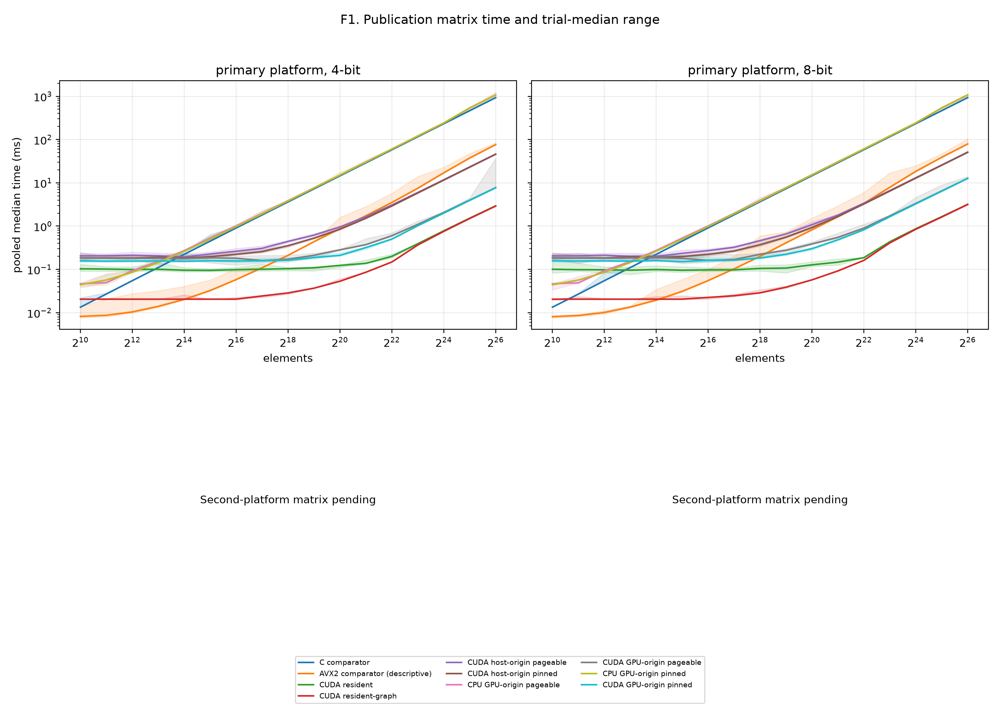
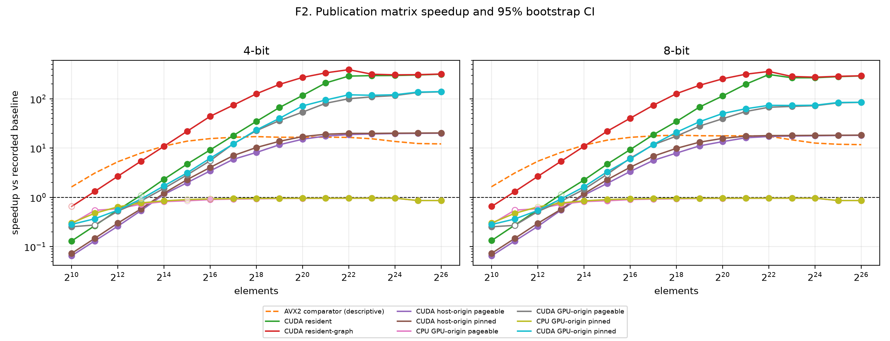
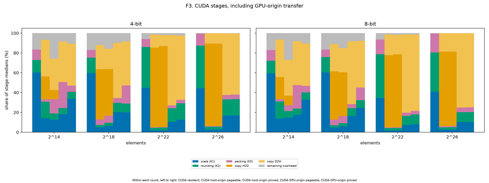
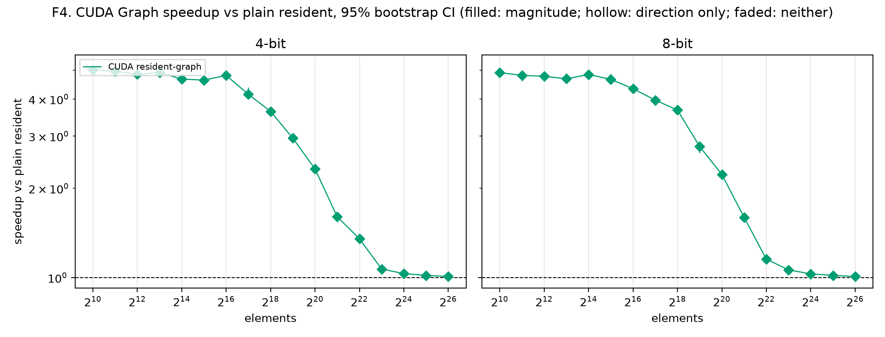
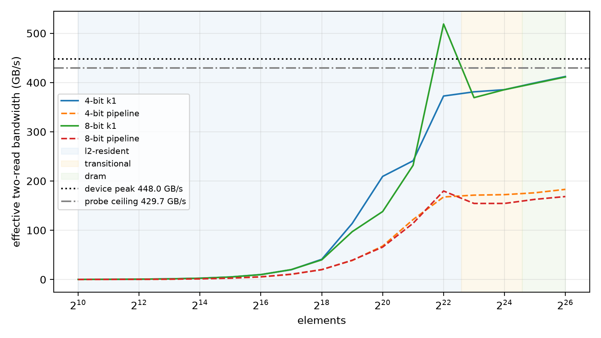

# Publication matrix report (sparse)

Revision `46c1294`; 340 cases; all passed: True.

## Input family

| Family | Inputs | Cells | Distinct counts |
|---|---:|---:|---:|
| sparse | 17 | 340 | 17 |

### Input provenance

| Input | Elements | Source detail |
|---|---:|---|
| sparse_n1024 | 1024 | zero target 0.9; realised 0.90234375 |
| sparse_n1048576 | 1048576 | zero target 0.9; realised 0.8996858596801758 |
| sparse_n131072 | 131072 | zero target 0.9; realised 0.8989639282226562 |
| sparse_n16384 | 16384 | zero target 0.9; realised 0.90057373046875 |
| sparse_n16777216 | 16777216 | zero target 0.9; realised 0.899998128414154 |
| sparse_n2048 | 2048 | zero target 0.9; realised 0.89697265625 |
| sparse_n2097152 | 2097152 | zero target 0.9; realised 0.8999919891357422 |
| sparse_n262144 | 262144 | zero target 0.9; realised 0.8994369506835938 |
| sparse_n32768 | 32768 | zero target 0.9; realised 0.89886474609375 |
| sparse_n33554432 | 33554432 | zero target 0.9; realised 0.9000427722930908 |
| sparse_n4096 | 4096 | zero target 0.9; realised 0.8994140625 |
| sparse_n4194304 | 4194304 | zero target 0.9; realised 0.8999440670013428 |
| sparse_n524288 | 524288 | zero target 0.9; realised 0.8998355865478516 |
| sparse_n65536 | 65536 | zero target 0.9; realised 0.898193359375 |
| sparse_n67108864 | 67108864 | zero target 0.9; realised 0.9000426977872849 |
| sparse_n8192 | 8192 | zero target 0.9; realised 0.9029541015625 |
| sparse_n8388608 | 8388608 | zero target 0.9; realised 0.9000654220581055 |

## Path comparisons

GPU-origin CUDA uses the policy-matched CPU GPU-origin baseline. Other CUDA paths use the scalar C comparator. AVX2 and cross-boundary GPU-origin comparisons are descriptive.

| Input | Elements | Bits | Path | Policy | Baseline | Median ms | Speedup and CI | Inversion |
|---|---:|---:|---|---|---|---:|---|---|
| sparse_n1024 | 1024 | 4 | cpu-avx2-optimized | none | cpu-comparator | 0.0082 | 1.63× [1.6, 1.64]; inconclusive; direction=False; magnitude=False | False |
| sparse_n1024 | 1024 | 4 | cpu-comparator | none | — | 0.0134 | 1× [1, 1]; comparator; direction=False; magnitude=False | False |
| sparse_n1024 | 1024 | 4 | cpu-gpu-origin | pageable | cpu-comparator | 0.0463 | 0.289× [0.287, 0.311]; slower; direction=True; magnitude=True | False |
| sparse_n1024 | 1024 | 4 | cpu-gpu-origin-pinned | pinned | cpu-comparator | 0.0444 | 0.302× [0.3, 0.302]; slower; direction=True; magnitude=True | False |
| sparse_n1024 | 1024 | 4 | cuda-gpu-origin | pageable | cpu-gpu-origin | 0.1829 | 0.253× [0.233, 0.258]; slower; direction=True; magnitude=True | False |
| sparse_n1024 | 1024 | 4 | cuda-gpu-origin-pinned | pinned | cpu-gpu-origin-pinned | 0.1573 | 0.282× [0.278, 0.288]; slower; direction=True; magnitude=True | False |
| sparse_n1024 | 1024 | 4 | cuda-host-origin | pageable | cpu-comparator | 0.2057 | 0.0651× [0.0645, 0.0656]; slower; direction=True; magnitude=True | False |
| sparse_n1024 | 1024 | 4 | cuda-host-origin-pinned | pinned | cpu-comparator | 0.1839 | 0.0729× [0.0724, 0.0735]; slower; direction=True; magnitude=True | False |
| sparse_n1024 | 1024 | 4 | cuda-resident | none | cpu-comparator | 0.1029 | 0.13× [0.126, 0.132]; slower; direction=True; magnitude=True | False |
| sparse_n1024 | 1024 | 4 | cuda-resident-graph | none | cpu-comparator | 0.0205 | 0.654× [0.654, 0.655]; inconclusive; direction=False; magnitude=False | False |
| sparse_n1024 | 1024 | 8 | cpu-avx2-optimized | none | cpu-comparator | 0.0081 | 1.65× [1.61, 1.65]; faster; direction=False; magnitude=False | False |
| sparse_n1024 | 1024 | 8 | cpu-comparator | none | — | 0.0134 | 1× [1, 1]; comparator; direction=False; magnitude=False | False |
| sparse_n1024 | 1024 | 8 | cpu-gpu-origin | pageable | cpu-comparator | 0.0464 | 0.289× [0.287, 0.299]; slower; direction=True; magnitude=True | False |
| sparse_n1024 | 1024 | 8 | cpu-gpu-origin-pinned | pinned | cpu-comparator | 0.0444 | 0.302× [0.3, 0.302]; slower; direction=True; magnitude=True | False |
| sparse_n1024 | 1024 | 8 | cuda-gpu-origin | pageable | cpu-gpu-origin | 0.1835 | 0.253× [0.24, 0.259]; slower; direction=True; magnitude=True | False |
| sparse_n1024 | 1024 | 8 | cuda-gpu-origin-pinned | pinned | cpu-gpu-origin-pinned | 0.158 | 0.281× [0.276, 0.288]; slower; direction=True; magnitude=True | False |
| sparse_n1024 | 1024 | 8 | cuda-host-origin | pageable | cpu-comparator | 0.2051 | 0.0653× [0.0647, 0.0657]; slower; direction=True; magnitude=True | False |
| sparse_n1024 | 1024 | 8 | cuda-host-origin-pinned | pinned | cpu-comparator | 0.183 | 0.0732× [0.0727, 0.0734]; slower; direction=True; magnitude=True | False |
| sparse_n1024 | 1024 | 8 | cuda-resident | none | cpu-comparator | 0.1006 | 0.133× [0.13, 0.138]; slower; direction=True; magnitude=True | False |
| sparse_n1024 | 1024 | 8 | cuda-resident-graph | none | cpu-comparator | 0.0205 | 0.654× [0.654, 0.654]; slower; direction=True; magnitude=True | False |
| sparse_n1048576 | 1048576 | 4 | cpu-avx2-optimized | none | cpu-comparator | 0.8721 | 16.6× [16.6, 16.7]; faster; direction=False; magnitude=False | False |
| sparse_n1048576 | 1048576 | 4 | cpu-comparator | none | — | 14.49 | 1× [1, 1]; comparator; direction=False; magnitude=False | False |
| sparse_n1048576 | 1048576 | 4 | cpu-gpu-origin | pageable | cpu-comparator | 15.19 | 0.954× [0.954, 0.954]; slower; direction=True; magnitude=True | False |
| sparse_n1048576 | 1048576 | 4 | cpu-gpu-origin-pinned | pinned | cpu-comparator | 15.12 | 0.958× [0.958, 0.959]; slower; direction=True; magnitude=True | False |
| sparse_n1048576 | 1048576 | 4 | cuda-gpu-origin | pageable | cpu-gpu-origin | 0.2827 | 53.8× [53.5, 53.9]; faster; direction=True; magnitude=True | False |
| sparse_n1048576 | 1048576 | 4 | cuda-gpu-origin-pinned | pinned | cpu-gpu-origin-pinned | 0.2104 | 71.8× [71.2, 72.4]; faster; direction=True; magnitude=True | False |
| sparse_n1048576 | 1048576 | 4 | cuda-host-origin | pageable | cpu-comparator | 0.9562 | 15.2× [14.8, 15.3]; faster; direction=True; magnitude=True | False |
| sparse_n1048576 | 1048576 | 4 | cuda-host-origin-pinned | pinned | cpu-comparator | 0.8458 | 17.1× [16.8, 17.4]; faster; direction=True; magnitude=True | False |
| sparse_n1048576 | 1048576 | 4 | cuda-resident | none | cpu-comparator | 0.1236 | 117× [116, 117]; faster; direction=True; magnitude=True | False |
| sparse_n1048576 | 1048576 | 4 | cuda-resident-graph | none | cpu-comparator | 0.0532 | 272× [272, 272]; faster; direction=True; magnitude=True | False |
| sparse_n1048576 | 1048576 | 8 | cpu-avx2-optimized | none | cpu-comparator | 0.8233 | 17.7× [17.7, 17.8]; faster; direction=False; magnitude=False | False |
| sparse_n1048576 | 1048576 | 8 | cpu-comparator | none | — | 14.61 | 1× [1, 1]; comparator; direction=False; magnitude=False | False |
| sparse_n1048576 | 1048576 | 8 | cpu-gpu-origin | pageable | cpu-comparator | 15.3 | 0.954× [0.954, 0.955]; slower; direction=True; magnitude=True | False |
| sparse_n1048576 | 1048576 | 8 | cpu-gpu-origin-pinned | pinned | cpu-comparator | 15.23 | 0.959× [0.959, 0.959]; slower; direction=True; magnitude=True | False |
| sparse_n1048576 | 1048576 | 8 | cuda-gpu-origin | pageable | cpu-gpu-origin | 0.3871 | 39.5× [39.4, 39.8]; faster; direction=True; magnitude=True | False |
| sparse_n1048576 | 1048576 | 8 | cuda-gpu-origin-pinned | pinned | cpu-gpu-origin-pinned | 0.3017 | 50.5× [50, 52.2]; faster; direction=True; magnitude=True | False |
| sparse_n1048576 | 1048576 | 8 | cuda-host-origin | pageable | cpu-comparator | 1.08 | 13.5× [13.4, 13.9]; faster; direction=True; magnitude=True | False |
| sparse_n1048576 | 1048576 | 8 | cuda-host-origin-pinned | pinned | cpu-comparator | 0.9277 | 15.7× [15.5, 16]; faster; direction=True; magnitude=True | False |
| sparse_n1048576 | 1048576 | 8 | cuda-resident | none | cpu-comparator | 0.1275 | 115× [113, 118]; faster; direction=True; magnitude=True | False |
| sparse_n1048576 | 1048576 | 8 | cuda-resident-graph | none | cpu-comparator | 0.0573 | 255× [255, 255]; faster; direction=True; magnitude=True | False |
| sparse_n131072 | 131072 | 4 | cpu-avx2-optimized | none | cpu-comparator | 0.1092 | 16.6× [16.6, 16.6]; faster; direction=False; magnitude=False | False |
| sparse_n131072 | 131072 | 4 | cpu-comparator | none | — | 1.811 | 1× [1, 1]; comparator; direction=False; magnitude=False | False |
| sparse_n131072 | 131072 | 4 | cpu-gpu-origin | pageable | cpu-comparator | 1.96 | 0.924× [0.924, 0.925]; slower; direction=True; magnitude=True | False |
| sparse_n131072 | 131072 | 4 | cpu-gpu-origin-pinned | pinned | cpu-comparator | 1.917 | 0.945× [0.945, 0.945]; slower; direction=True; magnitude=True | False |
| sparse_n131072 | 131072 | 4 | cuda-gpu-origin | pageable | cpu-gpu-origin | 0.1599 | 12.3× [11.6, 13.1]; faster; direction=True; magnitude=True | False |
| sparse_n131072 | 131072 | 4 | cuda-gpu-origin-pinned | pinned | cpu-gpu-origin-pinned | 0.1583 | 12.1× [11.8, 12.4]; faster; direction=True; magnitude=True | False |
| sparse_n131072 | 131072 | 4 | cuda-host-origin | pageable | cpu-comparator | 0.3058 | 5.92× [5.73, 6.02]; faster; direction=True; magnitude=True | False |
| sparse_n131072 | 131072 | 4 | cuda-host-origin-pinned | pinned | cpu-comparator | 0.2573 | 7.04× [6.87, 7.23]; faster; direction=True; magnitude=True | False |
| sparse_n131072 | 131072 | 4 | cuda-resident | none | cpu-comparator | 0.1008 | 18× [17.5, 18.9]; faster; direction=True; magnitude=True | False |
| sparse_n131072 | 131072 | 4 | cuda-resident-graph | none | cpu-comparator | 0.0243 | 74.5× [74.3, 77.1]; faster; direction=True; magnitude=True | False |
| sparse_n131072 | 131072 | 8 | cpu-avx2-optimized | none | cpu-comparator | 0.1031 | 17.7× [17.7, 17.8]; faster; direction=False; magnitude=False | False |
| sparse_n131072 | 131072 | 8 | cpu-comparator | none | — | 1.826 | 1× [1, 1]; comparator; direction=False; magnitude=False | False |
| sparse_n131072 | 131072 | 8 | cpu-gpu-origin | pageable | cpu-comparator | 1.976 | 0.924× [0.924, 0.925]; slower; direction=True; magnitude=True | False |
| sparse_n131072 | 131072 | 8 | cpu-gpu-origin-pinned | pinned | cpu-comparator | 1.931 | 0.946× [0.946, 0.946]; slower; direction=True; magnitude=True | False |
| sparse_n131072 | 131072 | 8 | cuda-gpu-origin | pageable | cpu-gpu-origin | 0.1688 | 11.7× [11.5, 12]; faster; direction=True; magnitude=True | False |
| sparse_n131072 | 131072 | 8 | cuda-gpu-origin-pinned | pinned | cpu-gpu-origin-pinned | 0.1632 | 11.8× [11.5, 12]; faster; direction=True; magnitude=True | False |
| sparse_n131072 | 131072 | 8 | cuda-host-origin | pageable | cpu-comparator | 0.3239 | 5.64× [5.52, 5.76]; faster; direction=True; magnitude=True | False |
| sparse_n131072 | 131072 | 8 | cuda-host-origin-pinned | pinned | cpu-comparator | 0.2664 | 6.85× [6.69, 6.94]; faster; direction=True; magnitude=True | False |
| sparse_n131072 | 131072 | 8 | cuda-resident | none | cpu-comparator | 0.0975 | 18.7× [18.2, 19.2]; faster; direction=True; magnitude=True | False |
| sparse_n131072 | 131072 | 8 | cuda-resident-graph | none | cpu-comparator | 0.0246 | 74.2× [74.2, 74.5]; faster; direction=True; magnitude=True | False |
| sparse_n16384 | 16384 | 4 | cpu-avx2-optimized | none | cpu-comparator | 0.0203 | 11× [11, 11.1]; faster; direction=False; magnitude=False | False |
| sparse_n16384 | 16384 | 4 | cpu-comparator | none | — | 0.2232 | 1× [1, 1]; comparator; direction=False; magnitude=False | False |
| sparse_n16384 | 16384 | 4 | cpu-gpu-origin | pageable | cpu-comparator | 0.2722 | 0.82× [0.819, 0.82]; slower; direction=True; magnitude=True | False |
| sparse_n16384 | 16384 | 4 | cpu-gpu-origin-pinned | pinned | cpu-comparator | 0.2625 | 0.85× [0.85, 0.851]; slower; direction=True; magnitude=True | False |
| sparse_n16384 | 16384 | 4 | cuda-gpu-origin | pageable | cpu-gpu-origin | 0.1788 | 1.52× [1.5, 1.53]; faster; direction=True; magnitude=True | False |
| sparse_n16384 | 16384 | 4 | cuda-gpu-origin-pinned | pinned | cpu-gpu-origin-pinned | 0.1534 | 1.71× [1.7, 1.74]; faster; direction=True; magnitude=True | False |
| sparse_n16384 | 16384 | 4 | cuda-host-origin | pageable | cpu-comparator | 0.1941 | 1.15× [1.14, 1.18]; inconclusive; direction=False; magnitude=False | False |
| sparse_n16384 | 16384 | 4 | cuda-host-origin-pinned | pinned | cpu-comparator | 0.1838 | 1.21× [1.19, 1.27]; faster; direction=True; magnitude=True | False |
| sparse_n16384 | 16384 | 4 | cuda-resident | none | cpu-comparator | 0.0957 | 2.33× [2.26, 2.36]; faster; direction=True; magnitude=True | False |
| sparse_n16384 | 16384 | 4 | cuda-resident-graph | none | cpu-comparator | 0.0205 | 10.9× [10.9, 10.9]; faster; direction=True; magnitude=True | False |
| sparse_n16384 | 16384 | 8 | cpu-avx2-optimized | none | cpu-comparator | 0.0195 | 11.5× [11.4, 11.5]; faster; direction=False; magnitude=False | False |
| sparse_n16384 | 16384 | 8 | cpu-comparator | none | — | 0.2235 | 1× [1, 1]; comparator; direction=False; magnitude=False | False |
| sparse_n16384 | 16384 | 8 | cpu-gpu-origin | pageable | cpu-comparator | 0.2723 | 0.821× [0.821, 0.821]; slower; direction=True; magnitude=True | False |
| sparse_n16384 | 16384 | 8 | cpu-gpu-origin-pinned | pinned | cpu-comparator | 0.2628 | 0.85× [0.85, 0.851]; slower; direction=True; magnitude=True | False |
| sparse_n16384 | 16384 | 8 | cuda-gpu-origin | pageable | cpu-gpu-origin | 0.1867 | 1.46× [1.38, 1.47]; faster; direction=True; magnitude=True | False |
| sparse_n16384 | 16384 | 8 | cuda-gpu-origin-pinned | pinned | cpu-gpu-origin-pinned | 0.1603 | 1.64× [1.61, 1.67]; faster; direction=True; magnitude=True | False |
| sparse_n16384 | 16384 | 8 | cuda-host-origin | pageable | cpu-comparator | 0.2005 | 1.11× [1.1, 1.13]; inconclusive; direction=False; magnitude=False | False |
| sparse_n16384 | 16384 | 8 | cuda-host-origin-pinned | pinned | cpu-comparator | 0.1881 | 1.19× [1.17, 1.21]; faster; direction=True; magnitude=True | False |
| sparse_n16384 | 16384 | 8 | cuda-resident | none | cpu-comparator | 0.09915 | 2.25× [2.18, 2.34]; faster; direction=True; magnitude=True | False |
| sparse_n16384 | 16384 | 8 | cuda-resident-graph | none | cpu-comparator | 0.0205 | 10.9× [10.9, 10.9]; faster; direction=True; magnitude=True | False |
| sparse_n16777216 | 16777216 | 4 | cpu-avx2-optimized | none | cpu-comparator | 17.02 | 13.6× [13.6, 13.7]; faster; direction=False; magnitude=False | False |
| sparse_n16777216 | 16777216 | 4 | cpu-comparator | none | — | 232.1 | 1× [1, 1]; comparator; direction=False; magnitude=False | False |
| sparse_n16777216 | 16777216 | 4 | cpu-gpu-origin | pageable | cpu-comparator | 241.7 | 0.96× [0.96, 0.961]; slower; direction=True; magnitude=True | False |
| sparse_n16777216 | 16777216 | 4 | cpu-gpu-origin-pinned | pinned | cpu-comparator | 241.5 | 0.961× [0.96, 0.961]; slower; direction=True; magnitude=True | False |
| sparse_n16777216 | 16777216 | 4 | cuda-gpu-origin | pageable | cpu-gpu-origin | 2.073 | 117× [117, 117]; faster; direction=True; magnitude=True | False |
| sparse_n16777216 | 16777216 | 4 | cuda-gpu-origin-pinned | pinned | cpu-gpu-origin-pinned | 1.994 | 121× [121, 121]; faster; direction=True; magnitude=True | False |
| sparse_n16777216 | 16777216 | 4 | cuda-host-origin | pageable | cpu-comparator | 11.75 | 19.7× [19.7, 19.7]; faster; direction=True; magnitude=True | False |
| sparse_n16777216 | 16777216 | 4 | cuda-host-origin-pinned | pinned | cpu-comparator | 11.56 | 20.1× [20.1, 20.1]; faster; direction=True; magnitude=True | False |
| sparse_n16777216 | 16777216 | 4 | cuda-resident | none | cpu-comparator | 0.7789 | 298× [298, 298]; faster; direction=True; magnitude=True | False |
| sparse_n16777216 | 16777216 | 4 | cuda-resident-graph | none | cpu-comparator | 0.7557 | 307× [307, 307]; faster; direction=True; magnitude=True | False |
| sparse_n16777216 | 16777216 | 8 | cpu-avx2-optimized | none | cpu-comparator | 18.41 | 12.6× [12.6, 12.7]; faster; direction=False; magnitude=False | False |
| sparse_n16777216 | 16777216 | 8 | cpu-comparator | none | — | 232.8 | 1× [1, 1]; comparator; direction=False; magnitude=False | False |
| sparse_n16777216 | 16777216 | 8 | cpu-gpu-origin | pageable | cpu-comparator | 242.4 | 0.96× [0.96, 0.961]; slower; direction=True; magnitude=True | False |
| sparse_n16777216 | 16777216 | 8 | cpu-gpu-origin-pinned | pinned | cpu-comparator | 242.2 | 0.961× [0.961, 0.961]; slower; direction=True; magnitude=True | False |
| sparse_n16777216 | 16777216 | 8 | cuda-gpu-origin | pageable | cpu-gpu-origin | 3.344 | 72.5× [72.4, 72.6]; faster; direction=True; magnitude=True | False |
| sparse_n16777216 | 16777216 | 8 | cuda-gpu-origin-pinned | pinned | cpu-gpu-origin-pinned | 3.266 | 74.2× [74.1, 74.2]; faster; direction=True; magnitude=True | False |
| sparse_n16777216 | 16777216 | 8 | cuda-host-origin | pageable | cpu-comparator | 13.09 | 17.8× [17.8, 17.8]; faster; direction=True; magnitude=True | False |
| sparse_n16777216 | 16777216 | 8 | cuda-host-origin-pinned | pinned | cpu-comparator | 12.83 | 18.1× [18.1, 18.2]; faster; direction=True; magnitude=True | False |
| sparse_n16777216 | 16777216 | 8 | cuda-resident | none | cpu-comparator | 0.869 | 268× [268, 268]; faster; direction=True; magnitude=True | False |
| sparse_n16777216 | 16777216 | 8 | cuda-resident-graph | none | cpu-comparator | 0.8449 | 276× [275, 276]; faster; direction=True; magnitude=True | False |
| sparse_n2048 | 2048 | 4 | cpu-avx2-optimized | none | cpu-comparator | 0.0087 | 3.1× [3.09, 3.13]; faster; direction=False; magnitude=False | False |
| sparse_n2048 | 2048 | 4 | cpu-comparator | none | — | 0.027 | 1× [1, 1]; comparator; direction=False; magnitude=False | False |
| sparse_n2048 | 2048 | 4 | cpu-gpu-origin | pageable | cpu-comparator | 0.0495 | 0.545× [0.426, 0.556]; slower; direction=True; magnitude=False | False |
| sparse_n2048 | 2048 | 4 | cpu-gpu-origin-pinned | pinned | cpu-comparator | 0.0568 | 0.475× [0.475, 0.477]; slower; direction=True; magnitude=True | False |
| sparse_n2048 | 2048 | 4 | cuda-gpu-origin | pageable | cpu-gpu-origin | 0.1804 | 0.274× [0.265, 0.352]; slower; direction=True; magnitude=False | False |
| sparse_n2048 | 2048 | 4 | cuda-gpu-origin-pinned | pinned | cpu-gpu-origin-pinned | 0.1545 | 0.368× [0.367, 0.37]; slower; direction=True; magnitude=True | False |
| sparse_n2048 | 2048 | 4 | cuda-host-origin | pageable | cpu-comparator | 0.2072 | 0.13× [0.128, 0.131]; slower; direction=True; magnitude=True | False |
| sparse_n2048 | 2048 | 4 | cuda-host-origin-pinned | pinned | cpu-comparator | 0.1837 | 0.147× [0.146, 0.148]; slower; direction=True; magnitude=True | False |
| sparse_n2048 | 2048 | 4 | cuda-resident | none | cpu-comparator | 0.1017 | 0.265× [0.265, 0.277]; slower; direction=True; magnitude=True | False |
| sparse_n2048 | 2048 | 4 | cuda-resident-graph | none | cpu-comparator | 0.0205 | 1.32× [1.32, 1.32]; faster; direction=True; magnitude=True | False |
| sparse_n2048 | 2048 | 8 | cpu-avx2-optimized | none | cpu-comparator | 0.0086 | 3.13× [3.11, 3.16]; faster; direction=False; magnitude=False | False |
| sparse_n2048 | 2048 | 8 | cpu-comparator | none | — | 0.0269 | 1× [1, 1]; comparator; direction=False; magnitude=False | False |
| sparse_n2048 | 2048 | 8 | cpu-gpu-origin | pageable | cpu-comparator | 0.0489 | 0.55× [0.434, 0.555]; slower; direction=True; magnitude=False | False |
| sparse_n2048 | 2048 | 8 | cpu-gpu-origin-pinned | pinned | cpu-comparator | 0.0567 | 0.474× [0.474, 0.476]; slower; direction=True; magnitude=True | False |
| sparse_n2048 | 2048 | 8 | cuda-gpu-origin | pageable | cpu-gpu-origin | 0.1812 | 0.27× [0.262, 0.343]; slower; direction=True; magnitude=False | False |
| sparse_n2048 | 2048 | 8 | cuda-gpu-origin-pinned | pinned | cpu-gpu-origin-pinned | 0.1559 | 0.364× [0.351, 0.368]; slower; direction=True; magnitude=True | False |
| sparse_n2048 | 2048 | 8 | cuda-host-origin | pageable | cpu-comparator | 0.2068 | 0.13× [0.129, 0.131]; slower; direction=True; magnitude=True | False |
| sparse_n2048 | 2048 | 8 | cuda-host-origin-pinned | pinned | cpu-comparator | 0.183 | 0.147× [0.146, 0.148]; slower; direction=True; magnitude=True | False |
| sparse_n2048 | 2048 | 8 | cuda-resident | none | cpu-comparator | 0.09845 | 0.273× [0.273, 0.286]; slower; direction=True; magnitude=True | False |
| sparse_n2048 | 2048 | 8 | cuda-resident-graph | none | cpu-comparator | 0.0205 | 1.31× [1.31, 1.32]; faster; direction=True; magnitude=True | False |
| sparse_n2097152 | 2097152 | 4 | cpu-avx2-optimized | none | cpu-comparator | 1.739 | 16.7× [16.6, 16.7]; faster; direction=False; magnitude=False | False |
| sparse_n2097152 | 2097152 | 4 | cpu-comparator | none | — | 28.97 | 1× [1, 1]; comparator; direction=False; magnitude=False | False |
| sparse_n2097152 | 2097152 | 4 | cpu-gpu-origin | pageable | cpu-comparator | 30.26 | 0.957× [0.957, 0.958]; slower; direction=True; magnitude=True | False |
| sparse_n2097152 | 2097152 | 4 | cpu-gpu-origin-pinned | pinned | cpu-comparator | 30.19 | 0.96× [0.96, 0.96]; slower; direction=True; magnitude=True | False |
| sparse_n2097152 | 2097152 | 4 | cuda-gpu-origin | pageable | cpu-gpu-origin | 0.3728 | 81.2× [81, 81.5]; faster; direction=True; magnitude=True | False |
| sparse_n2097152 | 2097152 | 4 | cuda-gpu-origin-pinned | pinned | cpu-gpu-origin-pinned | 0.319 | 94.6× [93.2, 96.5]; faster; direction=True; magnitude=True | False |
| sparse_n2097152 | 2097152 | 4 | cuda-host-origin | pageable | cpu-comparator | 1.652 | 17.5× [17.5, 17.6]; faster; direction=True; magnitude=True | False |
| sparse_n2097152 | 2097152 | 4 | cuda-host-origin-pinned | pinned | cpu-comparator | 1.516 | 19.1× [19.1, 19.1]; faster; direction=True; magnitude=True | False |
| sparse_n2097152 | 2097152 | 4 | cuda-resident | none | cpu-comparator | 0.1378 | 210× [209, 212]; faster; direction=True; magnitude=True | False |
| sparse_n2097152 | 2097152 | 4 | cuda-resident-graph | none | cpu-comparator | 0.086 | 337× [337, 337]; faster; direction=True; magnitude=True | False |
| sparse_n2097152 | 2097152 | 8 | cpu-avx2-optimized | none | cpu-comparator | 1.642 | 17.7× [17.6, 17.9]; faster; direction=False; magnitude=False | False |
| sparse_n2097152 | 2097152 | 8 | cpu-comparator | none | — | 29.14 | 1× [1, 1]; comparator; direction=False; magnitude=False | False |
| sparse_n2097152 | 2097152 | 8 | cpu-gpu-origin | pageable | cpu-comparator | 30.43 | 0.958× [0.958, 0.958]; slower; direction=True; magnitude=True | False |
| sparse_n2097152 | 2097152 | 8 | cpu-gpu-origin-pinned | pinned | cpu-comparator | 30.36 | 0.96× [0.96, 0.96]; slower; direction=True; magnitude=True | False |
| sparse_n2097152 | 2097152 | 8 | cuda-gpu-origin | pageable | cpu-gpu-origin | 0.5501 | 55.3× [55.2, 55.6]; faster; direction=True; magnitude=True | False |
| sparse_n2097152 | 2097152 | 8 | cuda-gpu-origin-pinned | pinned | cpu-gpu-origin-pinned | 0.4825 | 62.9× [62.5, 64.2]; faster; direction=True; magnitude=True | False |
| sparse_n2097152 | 2097152 | 8 | cuda-host-origin | pageable | cpu-comparator | 1.799 | 16.2× [16.2, 16.2]; faster; direction=True; magnitude=True | False |
| sparse_n2097152 | 2097152 | 8 | cuda-host-origin-pinned | pinned | cpu-comparator | 1.666 | 17.5× [17.4, 17.5]; faster; direction=True; magnitude=True | False |
| sparse_n2097152 | 2097152 | 8 | cuda-resident | none | cpu-comparator | 0.1469 | 198× [198, 201]; faster; direction=True; magnitude=True | False |
| sparse_n2097152 | 2097152 | 8 | cuda-resident-graph | none | cpu-comparator | 0.0921 | 316× [316, 316]; faster; direction=True; magnitude=True | False |
| sparse_n262144 | 262144 | 4 | cpu-avx2-optimized | none | cpu-comparator | 0.2116 | 17.1× [17.1, 17.1]; faster; direction=False; magnitude=False | False |
| sparse_n262144 | 262144 | 4 | cpu-comparator | none | — | 3.622 | 1× [1, 1]; comparator; direction=False; magnitude=False | False |
| sparse_n262144 | 262144 | 4 | cpu-gpu-origin | pageable | cpu-comparator | 3.875 | 0.935× [0.934, 0.935]; slower; direction=True; magnitude=True | False |
| sparse_n262144 | 262144 | 4 | cpu-gpu-origin-pinned | pinned | cpu-comparator | 3.804 | 0.952× [0.952, 0.952]; slower; direction=True; magnitude=True | False |
| sparse_n262144 | 262144 | 4 | cuda-gpu-origin | pageable | cpu-gpu-origin | 0.1716 | 22.6× [20.4, 23.6]; faster; direction=True; magnitude=False | False |
| sparse_n262144 | 262144 | 4 | cuda-gpu-origin-pinned | pinned | cpu-gpu-origin-pinned | 0.1628 | 23.4× [22.4, 23.7]; faster; direction=True; magnitude=True | False |
| sparse_n262144 | 262144 | 4 | cuda-host-origin | pageable | cpu-comparator | 0.444 | 8.16× [8.03, 8.21]; faster; direction=True; magnitude=True | False |
| sparse_n262144 | 262144 | 4 | cuda-host-origin-pinned | pinned | cpu-comparator | 0.3524 | 10.3× [10.2, 10.4]; faster; direction=True; magnitude=True | False |
| sparse_n262144 | 262144 | 4 | cuda-resident | none | cpu-comparator | 0.1038 | 34.9× [33.9, 35.7]; faster; direction=True; magnitude=True | False |
| sparse_n262144 | 262144 | 4 | cuda-resident-graph | none | cpu-comparator | 0.0286 | 127× [127, 127]; faster; direction=True; magnitude=True | False |
| sparse_n262144 | 262144 | 8 | cpu-avx2-optimized | none | cpu-comparator | 0.2001 | 18.3× [18.2, 18.3]; faster; direction=False; magnitude=False | False |
| sparse_n262144 | 262144 | 8 | cpu-comparator | none | — | 3.661 | 1× [1, 1]; comparator; direction=False; magnitude=False | False |
| sparse_n262144 | 262144 | 8 | cpu-gpu-origin | pageable | cpu-comparator | 3.914 | 0.935× [0.935, 0.936]; slower; direction=True; magnitude=True | False |
| sparse_n262144 | 262144 | 8 | cpu-gpu-origin-pinned | pinned | cpu-comparator | 3.843 | 0.953× [0.952, 0.953]; slower; direction=True; magnitude=True | False |
| sparse_n262144 | 262144 | 8 | cuda-gpu-origin | pageable | cpu-gpu-origin | 0.2233 | 17.5× [17.2, 18.3]; faster; direction=True; magnitude=True | False |
| sparse_n262144 | 262144 | 8 | cuda-gpu-origin-pinned | pinned | cpu-gpu-origin-pinned | 0.1833 | 21× [20.6, 21.5]; faster; direction=True; magnitude=True | False |
| sparse_n262144 | 262144 | 8 | cuda-host-origin | pageable | cpu-comparator | 0.4618 | 7.93× [7.84, 7.96]; faster; direction=True; magnitude=True | False |
| sparse_n262144 | 262144 | 8 | cuda-host-origin-pinned | pinned | cpu-comparator | 0.37 | 9.89× [9.71, 10]; faster; direction=True; magnitude=True | False |
| sparse_n262144 | 262144 | 8 | cuda-resident | none | cpu-comparator | 0.1053 | 34.8× [34.1, 35.6]; faster; direction=True; magnitude=True | False |
| sparse_n262144 | 262144 | 8 | cuda-resident-graph | none | cpu-comparator | 0.0287 | 128× [128, 128]; faster; direction=True; magnitude=True | False |
| sparse_n32768 | 32768 | 4 | cpu-avx2-optimized | none | cpu-comparator | 0.0325 | 13.8× [13.8, 13.9]; faster; direction=False; magnitude=False | False |
| sparse_n32768 | 32768 | 4 | cpu-comparator | none | — | 0.4498 | 1× [1, 1]; comparator; direction=False; magnitude=False | False |
| sparse_n32768 | 32768 | 4 | cpu-gpu-origin | pageable | cpu-comparator | 0.5274 | 0.853× [0.853, 0.853]; inconclusive; direction=False; magnitude=False | False |
| sparse_n32768 | 32768 | 4 | cpu-gpu-origin-pinned | pinned | cpu-comparator | 0.4989 | 0.902× [0.902, 0.902]; inconclusive; direction=False; magnitude=False | False |
| sparse_n32768 | 32768 | 4 | cuda-gpu-origin | pageable | cpu-gpu-origin | 0.1847 | 2.86× [2.83, 2.86]; faster; direction=True; magnitude=True | False |
| sparse_n32768 | 32768 | 4 | cuda-gpu-origin-pinned | pinned | cpu-gpu-origin-pinned | 0.1589 | 3.14× [3.13, 3.17]; faster; direction=True; magnitude=True | False |
| sparse_n32768 | 32768 | 4 | cuda-host-origin | pageable | cpu-comparator | 0.2267 | 1.98× [1.95, 2.02]; faster; direction=True; magnitude=True | False |
| sparse_n32768 | 32768 | 4 | cuda-host-origin-pinned | pinned | cpu-comparator | 0.1966 | 2.29× [2.26, 2.28]; faster; direction=True; magnitude=True | False |
| sparse_n32768 | 32768 | 4 | cuda-resident | none | cpu-comparator | 0.0949 | 4.74× [4.6, 4.86]; faster; direction=True; magnitude=True | False |
| sparse_n32768 | 32768 | 4 | cuda-resident-graph | none | cpu-comparator | 0.0205 | 21.9× [21.9, 22]; faster; direction=True; magnitude=True | False |
| sparse_n32768 | 32768 | 8 | cpu-avx2-optimized | none | cpu-comparator | 0.0311 | 14.5× [14.4, 14.6]; faster; direction=False; magnitude=False | False |
| sparse_n32768 | 32768 | 8 | cpu-comparator | none | — | 0.4511 | 1× [1, 1]; comparator; direction=False; magnitude=False | False |
| sparse_n32768 | 32768 | 8 | cpu-gpu-origin | pageable | cpu-comparator | 0.5285 | 0.854× [0.853, 0.854]; slower; direction=True; magnitude=True | False |
| sparse_n32768 | 32768 | 8 | cpu-gpu-origin-pinned | pinned | cpu-comparator | 0.5001 | 0.902× [0.902, 0.902]; slower; direction=True; magnitude=True | False |
| sparse_n32768 | 32768 | 8 | cuda-gpu-origin | pageable | cpu-gpu-origin | 0.1794 | 2.95× [2.82, 2.99]; faster; direction=True; magnitude=False | False |
| sparse_n32768 | 32768 | 8 | cuda-gpu-origin-pinned | pinned | cpu-gpu-origin-pinned | 0.1511 | 3.31× [3.17, 3.38]; faster; direction=True; magnitude=True | False |
| sparse_n32768 | 32768 | 8 | cuda-host-origin | pageable | cpu-comparator | 0.2349 | 1.92× [1.89, 1.95]; faster; direction=True; magnitude=True | False |
| sparse_n32768 | 32768 | 8 | cuda-host-origin-pinned | pinned | cpu-comparator | 0.1976 | 2.28× [2.24, 2.3]; faster; direction=True; magnitude=True | False |
| sparse_n32768 | 32768 | 8 | cuda-resident | none | cpu-comparator | 0.09545 | 4.73× [4.53, 4.84]; faster; direction=True; magnitude=True | False |
| sparse_n32768 | 32768 | 8 | cuda-resident-graph | none | cpu-comparator | 0.0205 | 22× [22, 22]; faster; direction=True; magnitude=True | False |
| sparse_n33554432 | 33554432 | 4 | cpu-avx2-optimized | none | cpu-comparator | 37.55 | 12.4× [12.3, 12.4]; faster; direction=False; magnitude=False | False |
| sparse_n33554432 | 33554432 | 4 | cpu-comparator | none | — | 464.7 | 1× [1, 1]; comparator; direction=False; magnitude=False | False |
| sparse_n33554432 | 33554432 | 4 | cpu-gpu-origin | pageable | cpu-comparator | 539.1 | 0.862× [0.861, 0.862]; slower; direction=True; magnitude=True | False |
| sparse_n33554432 | 33554432 | 4 | cpu-gpu-origin-pinned | pinned | cpu-comparator | 538.3 | 0.863× [0.863, 0.864]; slower; direction=True; magnitude=True | False |
| sparse_n33554432 | 33554432 | 4 | cuda-gpu-origin | pageable | cpu-gpu-origin | 4.001 | 135× [135, 135]; faster; direction=True; magnitude=True | False |
| sparse_n33554432 | 33554432 | 4 | cuda-gpu-origin-pinned | pinned | cpu-gpu-origin-pinned | 3.926 | 137× [137, 137]; faster; direction=True; magnitude=True | False |
| sparse_n33554432 | 33554432 | 4 | cuda-host-origin | pageable | cpu-comparator | 23.34 | 19.9× [19.9, 19.9]; faster; direction=True; magnitude=True | False |
| sparse_n33554432 | 33554432 | 4 | cuda-host-origin-pinned | pinned | cpu-comparator | 23.03 | 20.2× [20.2, 20.2]; faster; direction=True; magnitude=True | False |
| sparse_n33554432 | 33554432 | 4 | cuda-resident | none | cpu-comparator | 1.524 | 305× [305, 305]; faster; direction=True; magnitude=True | False |
| sparse_n33554432 | 33554432 | 4 | cuda-resident-graph | none | cpu-comparator | 1.5 | 310× [309, 310]; faster; direction=True; magnitude=True | False |
| sparse_n33554432 | 33554432 | 8 | cpu-avx2-optimized | none | cpu-comparator | 38.91 | 12× [11.9, 12]; faster; direction=False; magnitude=False | False |
| sparse_n33554432 | 33554432 | 8 | cpu-comparator | none | — | 465.4 | 1× [1, 1]; comparator; direction=False; magnitude=False | False |
| sparse_n33554432 | 33554432 | 8 | cpu-gpu-origin | pageable | cpu-comparator | 540 | 0.862× [0.862, 0.862]; slower; direction=True; magnitude=True | False |
| sparse_n33554432 | 33554432 | 8 | cpu-gpu-origin-pinned | pinned | cpu-comparator | 539.4 | 0.863× [0.862, 0.863]; slower; direction=True; magnitude=True | False |
| sparse_n33554432 | 33554432 | 8 | cuda-gpu-origin | pageable | cpu-gpu-origin | 6.509 | 83× [83.1, 83.3]; faster; direction=True; magnitude=True | False |
| sparse_n33554432 | 33554432 | 8 | cuda-gpu-origin-pinned | pinned | cpu-gpu-origin-pinned | 6.4 | 84.3× [84.2, 84.3]; faster; direction=True; magnitude=True | False |
| sparse_n33554432 | 33554432 | 8 | cuda-host-origin | pageable | cpu-comparator | 25.81 | 18× [18, 18]; faster; direction=True; magnitude=True | False |
| sparse_n33554432 | 33554432 | 8 | cuda-host-origin-pinned | pinned | cpu-comparator | 25.52 | 18.2× [18.2, 18.2]; faster; direction=True; magnitude=True | False |
| sparse_n33554432 | 33554432 | 8 | cuda-resident | none | cpu-comparator | 1.649 | 282× [282, 283]; faster; direction=True; magnitude=True | False |
| sparse_n33554432 | 33554432 | 8 | cuda-resident-graph | none | cpu-comparator | 1.623 | 287× [287, 287]; faster; direction=True; magnitude=True | False |
| sparse_n4096 | 4096 | 4 | cpu-avx2-optimized | none | cpu-comparator | 0.0104 | 5.28× [5.25, 5.33]; faster; direction=False; magnitude=False | False |
| sparse_n4096 | 4096 | 4 | cpu-comparator | none | — | 0.05495 | 1× [1, 1]; comparator; direction=False; magnitude=False | False |
| sparse_n4096 | 4096 | 4 | cpu-gpu-origin | pageable | cpu-comparator | 0.0937 | 0.586× [0.586, 0.588]; slower; direction=True; magnitude=True | False |
| sparse_n4096 | 4096 | 4 | cpu-gpu-origin-pinned | pinned | cpu-comparator | 0.0857 | 0.641× [0.64, 0.643]; slower; direction=True; magnitude=True | False |
| sparse_n4096 | 4096 | 4 | cuda-gpu-origin | pageable | cpu-gpu-origin | 0.1789 | 0.524× [0.505, 0.528]; slower; direction=True; magnitude=True | False |
| sparse_n4096 | 4096 | 4 | cuda-gpu-origin-pinned | pinned | cpu-gpu-origin-pinned | 0.156 | 0.55× [0.538, 0.555]; slower; direction=True; magnitude=True | False |
| sparse_n4096 | 4096 | 4 | cuda-host-origin | pageable | cpu-comparator | 0.2118 | 0.259× [0.254, 0.265]; slower; direction=True; magnitude=True | False |
| sparse_n4096 | 4096 | 4 | cuda-host-origin-pinned | pinned | cpu-comparator | 0.1832 | 0.3× [0.299, 0.301]; slower; direction=True; magnitude=True | False |
| sparse_n4096 | 4096 | 4 | cuda-resident | none | cpu-comparator | 0.0992 | 0.554× [0.541, 0.573]; slower; direction=True; magnitude=True | False |
| sparse_n4096 | 4096 | 4 | cuda-resident-graph | none | cpu-comparator | 0.0205 | 2.68× [2.68, 2.69]; faster; direction=True; magnitude=True | False |
| sparse_n4096 | 4096 | 8 | cpu-avx2-optimized | none | cpu-comparator | 0.0101 | 5.43× [5.35, 5.44]; faster; direction=False; magnitude=False | False |
| sparse_n4096 | 4096 | 8 | cpu-comparator | none | — | 0.0548 | 1× [1, 1]; comparator; direction=False; magnitude=False | False |
| sparse_n4096 | 4096 | 8 | cpu-gpu-origin | pageable | cpu-comparator | 0.0934 | 0.587× [0.586, 0.587]; slower; direction=True; magnitude=True | False |
| sparse_n4096 | 4096 | 8 | cpu-gpu-origin-pinned | pinned | cpu-comparator | 0.0856 | 0.64× [0.639, 0.641]; inconclusive; direction=False; magnitude=False | False |
| sparse_n4096 | 4096 | 8 | cuda-gpu-origin | pageable | cpu-gpu-origin | 0.181 | 0.516× [0.497, 0.522]; slower; direction=True; magnitude=True | False |
| sparse_n4096 | 4096 | 8 | cuda-gpu-origin-pinned | pinned | cpu-gpu-origin-pinned | 0.1573 | 0.544× [0.534, 0.555]; slower; direction=True; magnitude=True | False |
| sparse_n4096 | 4096 | 8 | cuda-host-origin | pageable | cpu-comparator | 0.2122 | 0.258× [0.253, 0.263]; slower; direction=True; magnitude=True | False |
| sparse_n4096 | 4096 | 8 | cuda-host-origin-pinned | pinned | cpu-comparator | 0.1838 | 0.298× [0.297, 0.299]; slower; direction=True; magnitude=True | False |
| sparse_n4096 | 4096 | 8 | cuda-resident | none | cpu-comparator | 0.09775 | 0.561× [0.551, 0.577]; slower; direction=True; magnitude=True | False |
| sparse_n4096 | 4096 | 8 | cuda-resident-graph | none | cpu-comparator | 0.0205 | 2.67× [2.67, 2.68]; faster; direction=True; magnitude=True | False |
| sparse_n4194304 | 4194304 | 4 | cpu-avx2-optimized | none | cpu-comparator | 3.514 | 16.5× [16.5, 16.6]; faster; direction=False; magnitude=False | False |
| sparse_n4194304 | 4194304 | 4 | cpu-comparator | none | — | 57.98 | 1× [1, 1]; comparator; direction=False; magnitude=False | False |
| sparse_n4194304 | 4194304 | 4 | cpu-gpu-origin | pageable | cpu-comparator | 60.44 | 0.959× [0.959, 0.96]; slower; direction=True; magnitude=True | False |
| sparse_n4194304 | 4194304 | 4 | cpu-gpu-origin-pinned | pinned | cpu-comparator | 60.36 | 0.961× [0.96, 0.961]; slower; direction=True; magnitude=True | False |
| sparse_n4194304 | 4194304 | 4 | cuda-gpu-origin | pageable | cpu-gpu-origin | 0.601 | 101× [99.8, 105]; faster; direction=True; magnitude=True | False |
| sparse_n4194304 | 4194304 | 4 | cuda-gpu-origin-pinned | pinned | cpu-gpu-origin-pinned | 0.4995 | 121× [117, 121]; faster; direction=True; magnitude=True | False |
| sparse_n4194304 | 4194304 | 4 | cuda-host-origin | pageable | cpu-comparator | 3.078 | 18.8× [18.8, 18.8]; faster; direction=True; magnitude=True | False |
| sparse_n4194304 | 4194304 | 4 | cuda-host-origin-pinned | pinned | cpu-comparator | 2.915 | 19.9× [19.9, 19.9]; faster; direction=True; magnitude=True | False |
| sparse_n4194304 | 4194304 | 4 | cuda-resident | none | cpu-comparator | 0.2002 | 290× [289, 291]; faster; direction=True; magnitude=True | False |
| sparse_n4194304 | 4194304 | 4 | cuda-resident-graph | none | cpu-comparator | 0.1482 | 391× [388, 393]; faster; direction=True; magnitude=True | False |
| sparse_n4194304 | 4194304 | 8 | cpu-avx2-optimized | none | cpu-comparator | 3.344 | 17.4× [17.4, 17.5]; faster; direction=False; magnitude=False | False |
| sparse_n4194304 | 4194304 | 8 | cpu-comparator | none | — | 58.22 | 1× [1, 1]; comparator; direction=False; magnitude=False | False |
| sparse_n4194304 | 4194304 | 8 | cpu-gpu-origin | pageable | cpu-comparator | 60.7 | 0.959× [0.958, 0.96]; slower; direction=True; magnitude=True | False |
| sparse_n4194304 | 4194304 | 8 | cpu-gpu-origin-pinned | pinned | cpu-comparator | 60.61 | 0.961× [0.96, 0.961]; slower; direction=True; magnitude=True | False |
| sparse_n4194304 | 4194304 | 8 | cuda-gpu-origin | pageable | cpu-gpu-origin | 0.8985 | 67.6× [67.4, 67.8]; faster; direction=True; magnitude=True | False |
| sparse_n4194304 | 4194304 | 8 | cuda-gpu-origin-pinned | pinned | cpu-gpu-origin-pinned | 0.8208 | 73.8× [73.6, 74]; faster; direction=True; magnitude=True | False |
| sparse_n4194304 | 4194304 | 8 | cuda-host-origin | pageable | cpu-comparator | 3.386 | 17.2× [17.1, 17.2]; faster; direction=True; magnitude=True | False |
| sparse_n4194304 | 4194304 | 8 | cuda-host-origin-pinned | pinned | cpu-comparator | 3.243 | 18× [17.9, 18]; faster; direction=True; magnitude=True | False |
| sparse_n4194304 | 4194304 | 8 | cuda-resident | none | cpu-comparator | 0.1867 | 312× [312, 313]; faster; direction=True; magnitude=True | False |
| sparse_n4194304 | 4194304 | 8 | cuda-resident-graph | none | cpu-comparator | 0.1618 | 360× [358, 360]; faster; direction=True; magnitude=True | False |
| sparse_n524288 | 524288 | 4 | cpu-avx2-optimized | none | cpu-comparator | 0.4366 | 16.6× [16.6, 16.6]; faster; direction=False; magnitude=False | False |
| sparse_n524288 | 524288 | 4 | cpu-comparator | none | — | 7.243 | 1× [1, 1]; comparator; direction=False; magnitude=False | False |
| sparse_n524288 | 524288 | 4 | cpu-gpu-origin | pageable | cpu-comparator | 7.647 | 0.947× [0.947, 0.947]; slower; direction=True; magnitude=True | False |
| sparse_n524288 | 524288 | 4 | cpu-gpu-origin-pinned | pinned | cpu-comparator | 7.575 | 0.956× [0.956, 0.956]; slower; direction=True; magnitude=True | False |
| sparse_n524288 | 524288 | 4 | cuda-gpu-origin | pageable | cpu-gpu-origin | 0.2114 | 36.2× [35.2, 38.9]; faster; direction=True; magnitude=True | False |
| sparse_n524288 | 524288 | 4 | cuda-gpu-origin-pinned | pinned | cpu-gpu-origin-pinned | 0.1883 | 40.2× [39.2, 40.7]; faster; direction=True; magnitude=True | False |
| sparse_n524288 | 524288 | 4 | cuda-host-origin | pageable | cpu-comparator | 0.619 | 11.7× [11.6, 11.9]; faster; direction=True; magnitude=True | False |
| sparse_n524288 | 524288 | 4 | cuda-host-origin-pinned | pinned | cpu-comparator | 0.5267 | 13.8× [13.7, 14]; faster; direction=True; magnitude=True | False |
| sparse_n524288 | 524288 | 4 | cuda-resident | none | cpu-comparator | 0.1086 | 66.7× [66, 69]; faster; direction=True; magnitude=True | False |
| sparse_n524288 | 524288 | 4 | cuda-resident-graph | none | cpu-comparator | 0.0368 | 197× [197, 197]; faster; direction=True; magnitude=True | False |
| sparse_n524288 | 524288 | 8 | cpu-avx2-optimized | none | cpu-comparator | 0.4108 | 17.8× [17.8, 17.9]; faster; direction=False; magnitude=False | False |
| sparse_n524288 | 524288 | 8 | cpu-comparator | none | — | 7.319 | 1× [1, 1]; comparator; direction=False; magnitude=False | False |
| sparse_n524288 | 524288 | 8 | cpu-gpu-origin | pageable | cpu-comparator | 7.722 | 0.948× [0.947, 0.948]; slower; direction=True; magnitude=True | False |
| sparse_n524288 | 524288 | 8 | cpu-gpu-origin-pinned | pinned | cpu-comparator | 7.647 | 0.957× [0.957, 0.957]; slower; direction=True; magnitude=True | False |
| sparse_n524288 | 524288 | 8 | cuda-gpu-origin | pageable | cpu-gpu-origin | 0.2757 | 28× [27.8, 31.4]; faster; direction=True; magnitude=True | False |
| sparse_n524288 | 524288 | 8 | cuda-gpu-origin-pinned | pinned | cpu-gpu-origin-pinned | 0.2227 | 34.3× [34, 34.9]; faster; direction=True; magnitude=True | False |
| sparse_n524288 | 524288 | 8 | cuda-host-origin | pageable | cpu-comparator | 0.6584 | 11.1× [11, 11.2]; faster; direction=True; magnitude=True | False |
| sparse_n524288 | 524288 | 8 | cuda-host-origin-pinned | pinned | cpu-comparator | 0.5544 | 13.2× [13.1, 13.4]; faster; direction=True; magnitude=True | False |
| sparse_n524288 | 524288 | 8 | cuda-resident | none | cpu-comparator | 0.1072 | 68.2× [66.9, 71.6]; faster; direction=True; magnitude=True | False |
| sparse_n524288 | 524288 | 8 | cuda-resident-graph | none | cpu-comparator | 0.0388 | 189× [189, 193]; faster; direction=True; magnitude=True | False |
| sparse_n65536 | 65536 | 4 | cpu-avx2-optimized | none | cpu-comparator | 0.0581 | 15.6× [15.5, 15.7]; faster; direction=False; magnitude=False | False |
| sparse_n65536 | 65536 | 4 | cpu-comparator | none | — | 0.9056 | 1× [1, 1]; comparator; direction=False; magnitude=False | False |
| sparse_n65536 | 65536 | 4 | cpu-gpu-origin | pageable | cpu-comparator | 1.005 | 0.901× [0.901, 0.902]; slower; direction=True; magnitude=True | False |
| sparse_n65536 | 65536 | 4 | cpu-gpu-origin-pinned | pinned | cpu-comparator | 0.9736 | 0.93× [0.929, 0.93]; inconclusive; direction=False; magnitude=False | False |
| sparse_n65536 | 65536 | 4 | cuda-gpu-origin | pageable | cpu-gpu-origin | 0.1812 | 5.54× [5.34, 5.82]; faster; direction=True; magnitude=False | False |
| sparse_n65536 | 65536 | 4 | cuda-gpu-origin-pinned | pinned | cpu-gpu-origin-pinned | 0.1562 | 6.23× [5.98, 6.43]; faster; direction=True; magnitude=True | False |
| sparse_n65536 | 65536 | 4 | cuda-host-origin | pageable | cpu-comparator | 0.2627 | 3.45× [3.37, 3.51]; faster; direction=True; magnitude=True | False |
| sparse_n65536 | 65536 | 4 | cuda-host-origin-pinned | pinned | cpu-comparator | 0.2233 | 4.06× [3.97, 4.08]; faster; direction=True; magnitude=True | False |
| sparse_n65536 | 65536 | 4 | cuda-resident | none | cpu-comparator | 0.09845 | 9.2× [9.02, 9.38]; faster; direction=True; magnitude=True | False |
| sparse_n65536 | 65536 | 4 | cuda-resident-graph | none | cpu-comparator | 0.0205 | 44.2× [44.1, 44.2]; faster; direction=True; magnitude=True | False |
| sparse_n65536 | 65536 | 8 | cpu-avx2-optimized | none | cpu-comparator | 0.0551 | 16.5× [16.5, 16.6]; faster; direction=False; magnitude=False | False |
| sparse_n65536 | 65536 | 8 | cpu-comparator | none | — | 0.9106 | 1× [1, 1]; comparator; direction=False; magnitude=False | False |
| sparse_n65536 | 65536 | 8 | cpu-gpu-origin | pageable | cpu-comparator | 1.01 | 0.902× [0.901, 0.902]; slower; direction=True; magnitude=True | False |
| sparse_n65536 | 65536 | 8 | cpu-gpu-origin-pinned | pinned | cpu-comparator | 0.9786 | 0.931× [0.93, 0.931]; slower; direction=True; magnitude=True | False |
| sparse_n65536 | 65536 | 8 | cuda-gpu-origin | pageable | cpu-gpu-origin | 0.1618 | 6.24× [5.79, 6.58]; faster; direction=True; magnitude=False | False |
| sparse_n65536 | 65536 | 8 | cuda-gpu-origin-pinned | pinned | cpu-gpu-origin-pinned | 0.1619 | 6.04× [5.9, 6.25]; faster; direction=True; magnitude=True | False |
| sparse_n65536 | 65536 | 8 | cuda-host-origin | pageable | cpu-comparator | 0.2711 | 3.36× [3.27, 3.45]; faster; direction=True; magnitude=True | False |
| sparse_n65536 | 65536 | 8 | cuda-host-origin-pinned | pinned | cpu-comparator | 0.2225 | 4.09× [4.02, 4.14]; faster; direction=True; magnitude=True | False |
| sparse_n65536 | 65536 | 8 | cuda-resident | none | cpu-comparator | 0.0974 | 9.35× [9.17, 9.56]; faster; direction=True; magnitude=True | False |
| sparse_n65536 | 65536 | 8 | cuda-resident-graph | none | cpu-comparator | 0.0225 | 40.5× [40.5, 40.5]; faster; direction=True; magnitude=True | False |
| sparse_n67108864 | 67108864 | 4 | cpu-avx2-optimized | none | cpu-comparator | 76.32 | 12.2× [12.1, 12.2]; faster; direction=False; magnitude=False | False |
| sparse_n67108864 | 67108864 | 4 | cpu-comparator | none | — | 928.3 | 1× [1, 1]; comparator; direction=False; magnitude=False | False |
| sparse_n67108864 | 67108864 | 4 | cpu-gpu-origin | pageable | cpu-comparator | 1077 | 0.862× [0.862, 0.877]; slower; direction=True; magnitude=True | False |
| sparse_n67108864 | 67108864 | 4 | cpu-gpu-origin-pinned | pinned | cpu-comparator | 1076 | 0.863× [0.863, 0.863]; slower; direction=True; magnitude=True | False |
| sparse_n67108864 | 67108864 | 4 | cuda-gpu-origin | pageable | cpu-gpu-origin | 7.755 | 139× [137, 139]; faster; direction=True; magnitude=True | False |
| sparse_n67108864 | 67108864 | 4 | cuda-gpu-origin-pinned | pinned | cpu-gpu-origin-pinned | 7.675 | 140× [140, 140]; faster; direction=True; magnitude=True | False |
| sparse_n67108864 | 67108864 | 4 | cuda-host-origin | pageable | cpu-comparator | 46.18 | 20.1× [20.1, 20.1]; faster; direction=True; magnitude=True | False |
| sparse_n67108864 | 67108864 | 4 | cuda-host-origin-pinned | pinned | cpu-comparator | 45.74 | 20.3× [20.3, 20.3]; faster; direction=True; magnitude=True | False |
| sparse_n67108864 | 67108864 | 4 | cuda-resident | none | cpu-comparator | 2.933 | 317× [316, 317]; faster; direction=True; magnitude=True | False |
| sparse_n67108864 | 67108864 | 4 | cuda-resident-graph | none | cpu-comparator | 2.909 | 319× [319, 319]; faster; direction=True; magnitude=True | False |
| sparse_n67108864 | 67108864 | 8 | cpu-avx2-optimized | none | cpu-comparator | 79.16 | 11.7× [11.7, 11.8]; faster; direction=False; magnitude=False | False |
| sparse_n67108864 | 67108864 | 8 | cpu-comparator | none | — | 929.8 | 1× [1, 1]; comparator; direction=False; magnitude=False | False |
| sparse_n67108864 | 67108864 | 8 | cpu-gpu-origin | pageable | cpu-comparator | 1078 | 0.862× [0.862, 0.871]; slower; direction=True; magnitude=True | False |
| sparse_n67108864 | 67108864 | 8 | cpu-gpu-origin-pinned | pinned | cpu-comparator | 1077 | 0.863× [0.863, 0.863]; slower; direction=True; magnitude=True | False |
| sparse_n67108864 | 67108864 | 8 | cuda-gpu-origin | pageable | cpu-gpu-origin | 12.71 | 84.9× [84.4, 84.9]; faster; direction=True; magnitude=True | False |
| sparse_n67108864 | 67108864 | 8 | cuda-gpu-origin-pinned | pinned | cpu-gpu-origin-pinned | 12.63 | 85.3× [85.3, 85.4]; faster; direction=True; magnitude=True | False |
| sparse_n67108864 | 67108864 | 8 | cuda-host-origin | pageable | cpu-comparator | 51.15 | 18.2× [18.2, 18.2]; faster; direction=True; magnitude=True | False |
| sparse_n67108864 | 67108864 | 8 | cuda-host-origin-pinned | pinned | cpu-comparator | 50.69 | 18.3× [18.3, 18.3]; faster; direction=True; magnitude=True | False |
| sparse_n67108864 | 67108864 | 8 | cuda-resident | none | cpu-comparator | 3.187 | 292× [292, 292]; faster; direction=True; magnitude=True | False |
| sparse_n67108864 | 67108864 | 8 | cuda-resident-graph | none | cpu-comparator | 3.162 | 294× [294, 294]; faster; direction=True; magnitude=True | False |
| sparse_n8192 | 8192 | 4 | cpu-avx2-optimized | none | cpu-comparator | 0.014 | 7.92× [7.83, 7.99]; faster; direction=False; magnitude=False | False |
| sparse_n8192 | 8192 | 4 | cpu-comparator | none | — | 0.1109 | 1× [1, 1]; comparator; direction=False; magnitude=False | False |
| sparse_n8192 | 8192 | 4 | cpu-gpu-origin | pageable | cpu-comparator | 0.1527 | 0.726× [0.725, 0.727]; slower; direction=True; magnitude=True | False |
| sparse_n8192 | 8192 | 4 | cpu-gpu-origin-pinned | pinned | cpu-comparator | 0.1439 | 0.771× [0.769, 0.771]; slower; direction=True; magnitude=True | False |
| sparse_n8192 | 8192 | 4 | cuda-gpu-origin | pageable | cpu-gpu-origin | 0.1813 | 0.842× [0.814, 0.86]; inconclusive; direction=False; magnitude=False | False |
| sparse_n8192 | 8192 | 4 | cuda-gpu-origin-pinned | pinned | cpu-gpu-origin-pinned | 0.1565 | 0.92× [0.909, 0.929]; inconclusive; direction=False; magnitude=False | False |
| sparse_n8192 | 8192 | 4 | cuda-host-origin | pageable | cpu-comparator | 0.2066 | 0.537× [0.518, 0.554]; slower; direction=True; magnitude=True | False |
| sparse_n8192 | 8192 | 4 | cuda-host-origin-pinned | pinned | cpu-comparator | 0.1908 | 0.581× [0.575, 0.587]; slower; direction=True; magnitude=True | False |
| sparse_n8192 | 8192 | 4 | cuda-resident | none | cpu-comparator | 0.1006 | 1.1× [1.09, 1.14]; inconclusive; direction=False; magnitude=False | False |
| sparse_n8192 | 8192 | 4 | cuda-resident-graph | none | cpu-comparator | 0.0205 | 5.41× [5.4, 5.41]; faster; direction=True; magnitude=True | False |
| sparse_n8192 | 8192 | 8 | cpu-avx2-optimized | none | cpu-comparator | 0.0135 | 8.19× [8.07, 8.22]; faster; direction=False; magnitude=False | False |
| sparse_n8192 | 8192 | 8 | cpu-comparator | none | — | 0.1105 | 1× [1, 1]; comparator; direction=False; magnitude=False | False |
| sparse_n8192 | 8192 | 8 | cpu-gpu-origin | pageable | cpu-comparator | 0.1524 | 0.725× [0.725, 0.726]; slower; direction=True; magnitude=True | False |
| sparse_n8192 | 8192 | 8 | cpu-gpu-origin-pinned | pinned | cpu-comparator | 0.1437 | 0.769× [0.769, 0.77]; slower; direction=True; magnitude=True | False |
| sparse_n8192 | 8192 | 8 | cuda-gpu-origin | pageable | cpu-gpu-origin | 0.1835 | 0.831× [0.813, 0.849]; slower; direction=True; magnitude=True | False |
| sparse_n8192 | 8192 | 8 | cuda-gpu-origin-pinned | pinned | cpu-gpu-origin-pinned | 0.1552 | 0.926× [0.913, 0.929]; slower; direction=True; magnitude=True | False |
| sparse_n8192 | 8192 | 8 | cuda-host-origin | pageable | cpu-comparator | 0.2006 | 0.551× [0.511, 0.569]; slower; direction=True; magnitude=False | False |
| sparse_n8192 | 8192 | 8 | cuda-host-origin-pinned | pinned | cpu-comparator | 0.1935 | 0.571× [0.558, 0.577]; slower; direction=True; magnitude=True | False |
| sparse_n8192 | 8192 | 8 | cuda-resident | none | cpu-comparator | 0.0959 | 1.15× [1.11, 1.17]; inconclusive; direction=False; magnitude=False | False |
| sparse_n8192 | 8192 | 8 | cuda-resident-graph | none | cpu-comparator | 0.0205 | 5.39× [5.39, 5.4]; faster; direction=True; magnitude=True | False |
| sparse_n8388608 | 8388608 | 4 | cpu-avx2-optimized | none | cpu-comparator | 7.501 | 15.5× [15.4, 15.5]; faster; direction=False; magnitude=False | False |
| sparse_n8388608 | 8388608 | 4 | cpu-comparator | none | — | 116 | 1× [1, 1]; comparator; direction=False; magnitude=False | False |
| sparse_n8388608 | 8388608 | 4 | cpu-gpu-origin | pageable | cpu-comparator | 120.8 | 0.96× [0.96, 0.96]; slower; direction=True; magnitude=True | False |
| sparse_n8388608 | 8388608 | 4 | cpu-gpu-origin-pinned | pinned | cpu-comparator | 120.7 | 0.961× [0.961, 0.961]; slower; direction=True; magnitude=True | False |
| sparse_n8388608 | 8388608 | 4 | cuda-gpu-origin | pageable | cpu-gpu-origin | 1.099 | 110× [110, 110]; faster; direction=True; magnitude=True | False |
| sparse_n8388608 | 8388608 | 4 | cuda-gpu-origin-pinned | pinned | cpu-gpu-origin-pinned | 1.021 | 118× [118, 118]; faster; direction=True; magnitude=True | False |
| sparse_n8388608 | 8388608 | 4 | cuda-host-origin | pageable | cpu-comparator | 5.986 | 19.4× [19.4, 19.4]; faster; direction=True; magnitude=True | False |
| sparse_n8388608 | 8388608 | 4 | cuda-host-origin-pinned | pinned | cpu-comparator | 5.825 | 19.9× [19.9, 19.9]; faster; direction=True; magnitude=True | False |
| sparse_n8388608 | 8388608 | 4 | cuda-resident | none | cpu-comparator | 0.3917 | 296× [296, 296]; faster; direction=True; magnitude=True | False |
| sparse_n8388608 | 8388608 | 4 | cuda-resident-graph | none | cpu-comparator | 0.3668 | 316× [315, 316]; faster; direction=True; magnitude=True | False |
| sparse_n8388608 | 8388608 | 8 | cpu-avx2-optimized | none | cpu-comparator | 7.909 | 14.7× [14.7, 14.8]; faster; direction=False; magnitude=False | False |
| sparse_n8388608 | 8388608 | 8 | cpu-comparator | none | — | 116.4 | 1× [1, 1]; comparator; direction=False; magnitude=False | False |
| sparse_n8388608 | 8388608 | 8 | cpu-gpu-origin | pageable | cpu-comparator | 121.2 | 0.96× [0.96, 0.961]; slower; direction=True; magnitude=True | False |
| sparse_n8388608 | 8388608 | 8 | cpu-gpu-origin-pinned | pinned | cpu-comparator | 121.1 | 0.961× [0.961, 0.961]; slower; direction=True; magnitude=True | False |
| sparse_n8388608 | 8388608 | 8 | cuda-gpu-origin | pageable | cpu-gpu-origin | 1.727 | 70.2× [70.1, 70.2]; faster; direction=True; magnitude=True | False |
| sparse_n8388608 | 8388608 | 8 | cuda-gpu-origin-pinned | pinned | cpu-gpu-origin-pinned | 1.649 | 73.4× [73.4, 73.5]; faster; direction=True; magnitude=True | False |
| sparse_n8388608 | 8388608 | 8 | cuda-host-origin | pageable | cpu-comparator | 6.613 | 17.6× [17.6, 17.6]; faster; direction=True; magnitude=True | False |
| sparse_n8388608 | 8388608 | 8 | cuda-host-origin-pinned | pinned | cpu-comparator | 6.451 | 18× [18, 18]; faster; direction=True; magnitude=True | False |
| sparse_n8388608 | 8388608 | 8 | cuda-resident | none | cpu-comparator | 0.4345 | 268× [268, 268]; faster; direction=True; magnitude=True | False |
| sparse_n8388608 | 8388608 | 8 | cuda-resident-graph | none | cpu-comparator | 0.4096 | 284× [284, 284]; faster; direction=True; magnitude=True | False |

## Transfer policy

Pinned is compared with its pageable twin under the recorded claim rule.

| Input | Bits | Path | Pinned vs pageable |
|---|---:|---|---|
| sparse_n1024 | 4 | cuda-host-origin-pinned | 1.12× [1.11, 1.13]; inconclusive; direction=False; magnitude=False |
| sparse_n1024 | 4 | cpu-gpu-origin-pinned | 1.04× [0.967, 1.05]; inconclusive; direction=False; magnitude=False |
| sparse_n1024 | 4 | cuda-gpu-origin-pinned | 1.16× [1.14, 1.22]; inconclusive; direction=False; magnitude=False |
| sparse_n1024 | 8 | cuda-host-origin-pinned | 1.12× [1.11, 1.13]; inconclusive; direction=False; magnitude=False |
| sparse_n1024 | 8 | cpu-gpu-origin-pinned | 1.05× [1.01, 1.05]; inconclusive; direction=False; magnitude=False |
| sparse_n1024 | 8 | cuda-gpu-origin-pinned | 1.16× [1.14, 1.22]; inconclusive; direction=False; magnitude=False |
| sparse_n1048576 | 4 | cuda-host-origin-pinned | 1.13× [1.11, 1.16]; faster; direction=True; magnitude=True |
| sparse_n1048576 | 4 | cpu-gpu-origin-pinned | 1× [1, 1.01]; inconclusive; direction=False; magnitude=False |
| sparse_n1048576 | 4 | cuda-gpu-origin-pinned | 1.34× [1.33, 1.35]; faster; direction=True; magnitude=True |
| sparse_n1048576 | 8 | cuda-host-origin-pinned | 1.16× [1.13, 1.19]; faster; direction=True; magnitude=True |
| sparse_n1048576 | 8 | cpu-gpu-origin-pinned | 1× [1, 1]; inconclusive; direction=False; magnitude=False |
| sparse_n1048576 | 8 | cuda-gpu-origin-pinned | 1.28× [1.27, 1.32]; faster; direction=True; magnitude=True |
| sparse_n131072 | 4 | cuda-host-origin-pinned | 1.19× [1.15, 1.25]; inconclusive; direction=False; magnitude=False |
| sparse_n131072 | 4 | cpu-gpu-origin-pinned | 1.02× [1.02, 1.02]; inconclusive; direction=False; magnitude=False |
| sparse_n131072 | 4 | cuda-gpu-origin-pinned | 1.01× [0.946, 1.08]; inconclusive; direction=False; magnitude=False |
| sparse_n131072 | 8 | cuda-host-origin-pinned | 1.22× [1.18, 1.25]; faster; direction=True; magnitude=True |
| sparse_n131072 | 8 | cpu-gpu-origin-pinned | 1.02× [1.02, 1.02]; inconclusive; direction=False; magnitude=False |
| sparse_n131072 | 8 | cuda-gpu-origin-pinned | 1.03× [0.992, 1.07]; inconclusive; direction=False; magnitude=False |
| sparse_n16384 | 4 | cuda-host-origin-pinned | 1.06× [1.03, 1.1]; inconclusive; direction=False; magnitude=False |
| sparse_n16384 | 4 | cpu-gpu-origin-pinned | 1.04× [1.04, 1.04]; faster; direction=True; magnitude=True |
| sparse_n16384 | 4 | cuda-gpu-origin-pinned | 1.17× [1.16, 1.19]; inconclusive; direction=False; magnitude=False |
| sparse_n16384 | 8 | cuda-host-origin-pinned | 1.07× [1.04, 1.08]; inconclusive; direction=False; magnitude=False |
| sparse_n16384 | 8 | cpu-gpu-origin-pinned | 1.04× [1.04, 1.04]; faster; direction=True; magnitude=True |
| sparse_n16384 | 8 | cuda-gpu-origin-pinned | 1.16× [1.15, 1.24]; inconclusive; direction=False; magnitude=False |
| sparse_n16777216 | 4 | cuda-host-origin-pinned | 1.02× [1.02, 1.02]; faster; direction=True; magnitude=True |
| sparse_n16777216 | 4 | cpu-gpu-origin-pinned | 1× [1, 1]; inconclusive; direction=False; magnitude=False |
| sparse_n16777216 | 4 | cuda-gpu-origin-pinned | 1.04× [1.04, 1.04]; faster; direction=True; magnitude=True |
| sparse_n16777216 | 8 | cuda-host-origin-pinned | 1.02× [1.02, 1.02]; faster; direction=True; magnitude=True |
| sparse_n16777216 | 8 | cpu-gpu-origin-pinned | 1× [1, 1]; inconclusive; direction=False; magnitude=False |
| sparse_n16777216 | 8 | cuda-gpu-origin-pinned | 1.02× [1.02, 1.02]; faster; direction=True; magnitude=True |
| sparse_n2048 | 4 | cuda-host-origin-pinned | 1.13× [1.11, 1.15]; inconclusive; direction=False; magnitude=False |
| sparse_n2048 | 4 | cpu-gpu-origin-pinned | 0.871× [0.854, 1.12]; inconclusive; direction=False; magnitude=False |
| sparse_n2048 | 4 | cuda-gpu-origin-pinned | 1.17× [1.15, 1.19]; inconclusive; direction=False; magnitude=False |
| sparse_n2048 | 8 | cuda-host-origin-pinned | 1.13× [1.12, 1.14]; inconclusive; direction=False; magnitude=False |
| sparse_n2048 | 8 | cpu-gpu-origin-pinned | 0.862× [0.855, 1.09]; inconclusive; direction=False; magnitude=False |
| sparse_n2048 | 8 | cuda-gpu-origin-pinned | 1.16× [1.12, 1.2]; inconclusive; direction=False; magnitude=False |
| sparse_n2097152 | 4 | cuda-host-origin-pinned | 1.09× [1.09, 1.09]; faster; direction=True; magnitude=True |
| sparse_n2097152 | 4 | cpu-gpu-origin-pinned | 1× [1, 1]; inconclusive; direction=False; magnitude=False |
| sparse_n2097152 | 4 | cuda-gpu-origin-pinned | 1.17× [1.15, 1.19]; faster; direction=True; magnitude=True |
| sparse_n2097152 | 8 | cuda-host-origin-pinned | 1.08× [1.08, 1.08]; faster; direction=True; magnitude=True |
| sparse_n2097152 | 8 | cpu-gpu-origin-pinned | 1× [1, 1]; inconclusive; direction=False; magnitude=False |
| sparse_n2097152 | 8 | cuda-gpu-origin-pinned | 1.14× [1.13, 1.16]; faster; direction=True; magnitude=True |
| sparse_n262144 | 4 | cuda-host-origin-pinned | 1.26× [1.24, 1.29]; faster; direction=True; magnitude=True |
| sparse_n262144 | 4 | cpu-gpu-origin-pinned | 1.02× [1.02, 1.02]; faster; direction=True; magnitude=True |
| sparse_n262144 | 4 | cuda-gpu-origin-pinned | 1.05× [0.984, 1.17]; inconclusive; direction=False; magnitude=False |
| sparse_n262144 | 8 | cuda-host-origin-pinned | 1.25× [1.23, 1.27]; faster; direction=True; magnitude=True |
| sparse_n262144 | 8 | cpu-gpu-origin-pinned | 1.02× [1.02, 1.02]; inconclusive; direction=False; magnitude=False |
| sparse_n262144 | 8 | cuda-gpu-origin-pinned | 1.22× [1.16, 1.25]; inconclusive; direction=False; magnitude=False |
| sparse_n32768 | 4 | cuda-host-origin-pinned | 1.15× [1.12, 1.17]; inconclusive; direction=False; magnitude=False |
| sparse_n32768 | 4 | cpu-gpu-origin-pinned | 1.06× [1.06, 1.06]; inconclusive; direction=False; magnitude=False |
| sparse_n32768 | 4 | cuda-gpu-origin-pinned | 1.16× [1.16, 1.18]; inconclusive; direction=False; magnitude=False |
| sparse_n32768 | 8 | cuda-host-origin-pinned | 1.19× [1.16, 1.21]; faster; direction=True; magnitude=True |
| sparse_n32768 | 8 | cpu-gpu-origin-pinned | 1.06× [1.06, 1.06]; faster; direction=True; magnitude=True |
| sparse_n32768 | 8 | cuda-gpu-origin-pinned | 1.19× [1.15, 1.25]; inconclusive; direction=False; magnitude=False |
| sparse_n33554432 | 4 | cuda-host-origin-pinned | 1.01× [1.01, 1.02]; faster; direction=True; magnitude=True |
| sparse_n33554432 | 4 | cpu-gpu-origin-pinned | 1× [1, 1]; inconclusive; direction=False; magnitude=False |
| sparse_n33554432 | 4 | cuda-gpu-origin-pinned | 1.02× [1.02, 1.02]; faster; direction=True; magnitude=True |
| sparse_n33554432 | 8 | cuda-host-origin-pinned | 1.01× [1.01, 1.01]; faster; direction=True; magnitude=True |
| sparse_n33554432 | 8 | cpu-gpu-origin-pinned | 1× [1, 1]; inconclusive; direction=False; magnitude=False |
| sparse_n33554432 | 8 | cuda-gpu-origin-pinned | 1.02× [1.01, 1.02]; faster; direction=True; magnitude=True |
| sparse_n4096 | 4 | cuda-host-origin-pinned | 1.16× [1.13, 1.18]; inconclusive; direction=False; magnitude=False |
| sparse_n4096 | 4 | cpu-gpu-origin-pinned | 1.09× [1.09, 1.09]; inconclusive; direction=False; magnitude=False |
| sparse_n4096 | 4 | cuda-gpu-origin-pinned | 1.15× [1.12, 1.19]; inconclusive; direction=False; magnitude=False |
| sparse_n4096 | 8 | cuda-host-origin-pinned | 1.15× [1.13, 1.18]; faster; direction=True; magnitude=True |
| sparse_n4096 | 8 | cpu-gpu-origin-pinned | 1.09× [1.09, 1.09]; faster; direction=True; magnitude=True |
| sparse_n4096 | 8 | cuda-gpu-origin-pinned | 1.15× [1.13, 1.2]; inconclusive; direction=False; magnitude=False |
| sparse_n4194304 | 4 | cuda-host-origin-pinned | 1.06× [1.06, 1.06]; faster; direction=True; magnitude=True |
| sparse_n4194304 | 4 | cpu-gpu-origin-pinned | 1× [1, 1]; inconclusive; direction=False; magnitude=False |
| sparse_n4194304 | 4 | cuda-gpu-origin-pinned | 1.2× [1.14, 1.22]; faster; direction=True; magnitude=True |
| sparse_n4194304 | 8 | cuda-host-origin-pinned | 1.04× [1.04, 1.05]; faster; direction=True; magnitude=True |
| sparse_n4194304 | 8 | cpu-gpu-origin-pinned | 1× [1, 1]; inconclusive; direction=False; magnitude=False |
| sparse_n4194304 | 8 | cuda-gpu-origin-pinned | 1.09× [1.09, 1.1]; faster; direction=True; magnitude=True |
| sparse_n524288 | 4 | cuda-host-origin-pinned | 1.18× [1.16, 1.2]; faster; direction=True; magnitude=True |
| sparse_n524288 | 4 | cpu-gpu-origin-pinned | 1.01× [1.01, 1.01]; inconclusive; direction=False; magnitude=False |
| sparse_n524288 | 4 | cuda-gpu-origin-pinned | 1.12× [1.04, 1.16]; inconclusive; direction=False; magnitude=False |
| sparse_n524288 | 8 | cuda-host-origin-pinned | 1.19× [1.17, 1.21]; faster; direction=True; magnitude=True |
| sparse_n524288 | 8 | cpu-gpu-origin-pinned | 1.01× [1.01, 1.01]; inconclusive; direction=False; magnitude=False |
| sparse_n524288 | 8 | cuda-gpu-origin-pinned | 1.24× [1.11, 1.26]; inconclusive; direction=False; magnitude=False |
| sparse_n65536 | 4 | cuda-host-origin-pinned | 1.18× [1.15, 1.2]; inconclusive; direction=False; magnitude=False |
| sparse_n65536 | 4 | cpu-gpu-origin-pinned | 1.03× [1.03, 1.03]; inconclusive; direction=False; magnitude=False |
| sparse_n65536 | 4 | cuda-gpu-origin-pinned | 1.16× [1.09, 1.23]; inconclusive; direction=False; magnitude=False |
| sparse_n65536 | 8 | cuda-host-origin-pinned | 1.22× [1.19, 1.26]; faster; direction=True; magnitude=True |
| sparse_n65536 | 8 | cpu-gpu-origin-pinned | 1.03× [1.03, 1.03]; inconclusive; direction=False; magnitude=False |
| sparse_n65536 | 8 | cuda-gpu-origin-pinned | 0.999× [0.94, 1.1]; inconclusive; direction=False; magnitude=False |
| sparse_n67108864 | 4 | cuda-host-origin-pinned | 1.01× [1.01, 1.01]; faster; direction=True; magnitude=True |
| sparse_n67108864 | 4 | cpu-gpu-origin-pinned | 1× [0.984, 1]; inconclusive; direction=False; magnitude=False |
| sparse_n67108864 | 4 | cuda-gpu-origin-pinned | 1.01× [1.01, 1.01]; faster; direction=True; magnitude=True |
| sparse_n67108864 | 8 | cuda-host-origin-pinned | 1.01× [1.01, 1.01]; faster; direction=True; magnitude=True |
| sparse_n67108864 | 8 | cpu-gpu-origin-pinned | 1× [0.996, 1]; inconclusive; direction=False; magnitude=False |
| sparse_n67108864 | 8 | cuda-gpu-origin-pinned | 1.01× [1.01, 1.01]; faster; direction=True; magnitude=True |
| sparse_n8192 | 4 | cuda-host-origin-pinned | 1.08× [1.05, 1.13]; inconclusive; direction=False; magnitude=False |
| sparse_n8192 | 4 | cpu-gpu-origin-pinned | 1.06× [1.06, 1.06]; inconclusive; direction=False; magnitude=False |
| sparse_n8192 | 4 | cuda-gpu-origin-pinned | 1.16× [1.14, 1.21]; inconclusive; direction=False; magnitude=False |
| sparse_n8192 | 8 | cuda-host-origin-pinned | 1.04× [0.995, 1.12]; inconclusive; direction=False; magnitude=False |
| sparse_n8192 | 8 | cpu-gpu-origin-pinned | 1.06× [1.06, 1.06]; inconclusive; direction=False; magnitude=False |
| sparse_n8192 | 8 | cuda-gpu-origin-pinned | 1.18× [1.15, 1.21]; faster; direction=True; magnitude=True |
| sparse_n8388608 | 4 | cuda-host-origin-pinned | 1.03× [1.03, 1.03]; faster; direction=True; magnitude=True |
| sparse_n8388608 | 4 | cpu-gpu-origin-pinned | 1× [1, 1]; inconclusive; direction=False; magnitude=False |
| sparse_n8388608 | 4 | cuda-gpu-origin-pinned | 1.08× [1.07, 1.08]; faster; direction=True; magnitude=True |
| sparse_n8388608 | 8 | cuda-host-origin-pinned | 1.03× [1.02, 1.03]; faster; direction=True; magnitude=True |
| sparse_n8388608 | 8 | cpu-gpu-origin-pinned | 1× [1, 1]; inconclusive; direction=False; magnitude=False |
| sparse_n8388608 | 8 | cuda-gpu-origin-pinned | 1.05× [1.05, 1.05]; faster; direction=True; magnitude=True |

## Boundary inversions

None recorded.

## Direction-based crossovers

- cuda-resident, 4-bit: not resolved.
- cuda-host-origin, 4-bit: not resolved.
- cuda-host-origin-pinned, 4-bit: 2^13 to 2^14.
- cuda-gpu-origin, 4-bit: not resolved.
- cuda-gpu-origin-pinned, 4-bit: not resolved.
- cuda-resident, 8-bit: not resolved.
- cuda-host-origin, 8-bit: not resolved.
- cuda-host-origin-pinned, 8-bit: 2^13 to 2^14.
- cuda-gpu-origin, 8-bit: 2^13 to 2^14.
- cuda-gpu-origin-pinned, 8-bit: 2^13 to 2^14.

## Figures

- 
- 
- 
- 
- 
